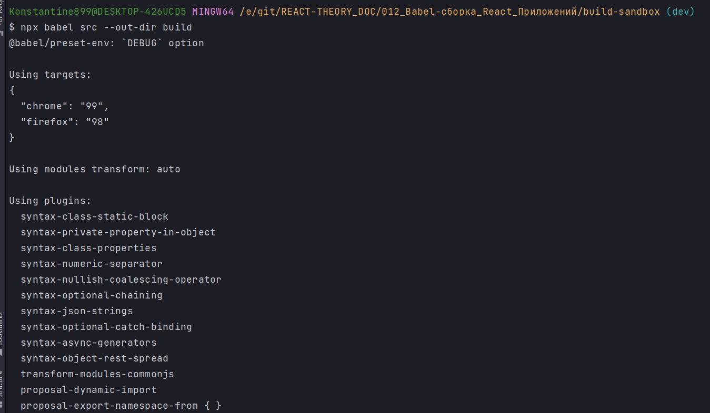
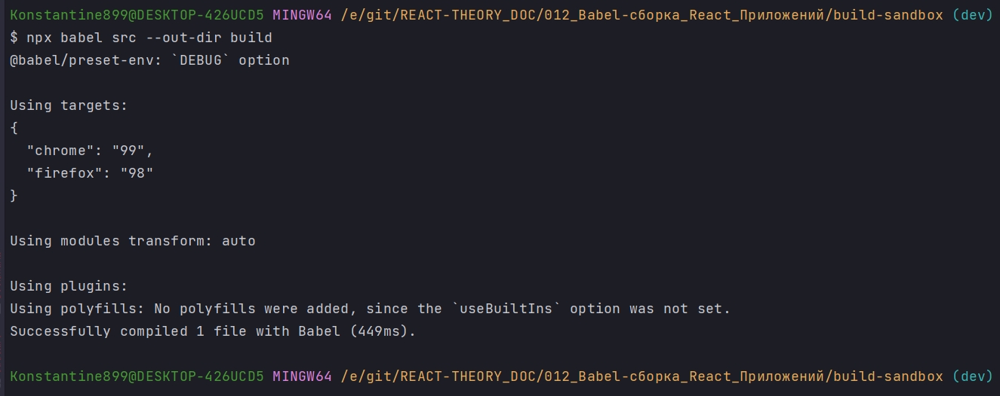
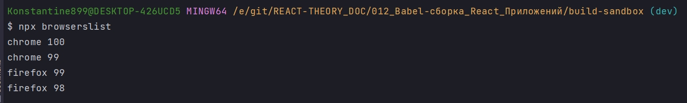
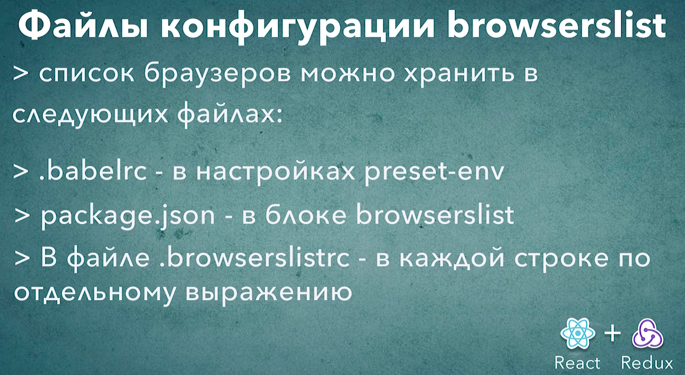

# 008_Файлы_конфигурации_browserslist

Из .babelrc удаляю поддержку браузеров

```json
{
  "presets": [
    [
      "@babel/env",
      {
        "debug": true
      }
    ]
  ],
  "plugins": [
    "@babel/proposal-class-properties"
  ]
}
```

И посмотрим еще куда можно добавить эти параметры конфигурации.

Первое место это package.json. package.json традиционно описывает свойства и требования для конкретного проекта. Этот файл зародился в среде Node.js. И одним из атрибутов стандартной конфигурации был атрибут engines - это список движков Node.js и npm с которыми совместим данный конкретный проект.

По сути список браузеров это такой же атрибут проекта. Он описывает список платформ на которых будет работать это приложение.

Только благодаря browserslist этот список может быть немного более динамичным. 

Перенесу список браузеров в package.json. Этот блок будет называтся browserslist

```json
{
  "name": "build-sandbox",
  "version": "1.0.0",
  "description": "Sandbox to play with React build tools",
  "main": "index.js",
  "scripts": {
    "test": "echo \"Error: no test specified\" && exit 1"
  },
  "author": "Konstantin Atroshchenko <kostay375298918971@gmail.com>",
  "license": "ISC",
  "browserslist": [
    "last 2 chrome versions",
    "last 2 firefox versions"
  ],
  "devDependencies": {
    "@babel/cli": "^7.17.6",
    "@babel/core": "^7.17.9",
    "@babel/plugin-proposal-class-properties": "^7.16.7",
    "@babel/plugin-transform-block-scoping": "^7.16.7",
    "@babel/plugin-transform-classes": "^7.16.7",
    "@babel/plugin-transform-template-literals": "^7.16.7",
    "@babel/preset-env": "^7.16.11"
  }
}

```

И теперь если я перезапущу сборку, то благодаря строке "debug": true в .babelrc я увижу детали в консоли.

```json
{
  "presets": [
    [
      "@babel/env",
      {
        "debug": true
      }
    ]
  ],
  "plugins": [
    "@babel/proposal-class-properties"
  ]
}
```

```shell
npx babel src --out-dir build
```



По моему собственному опыту удобнее держать список браузеров в package.json чем держать их в .babelrc.

Но если вам не нравится модифицировать package.json. Есть еще один способ указать этиже параметры. 

Мы можем создать еще один файл .browserslistrc и в нем по одному выражению на строку мы указываем какой список броузеров мы хотим поддержать

.browserslistrc

```.browserslistrc
last 2 chrome versions
last 2 firefox versions
```

package.json

```json
{
  "name": "build-sandbox",
  "version": "1.0.0",
  "description": "Sandbox to play with React build tools",
  "main": "index.js",
  "scripts": {
    "test": "echo \"Error: no test specified\" && exit 1"
  },
  "author": "Konstantin Atroshchenko <kostay375298918971@gmail.com>",
  "license": "ISC",
  "devDependencies": {
    "@babel/cli": "^7.17.6",
    "@babel/core": "^7.17.9",
    "@babel/plugin-proposal-class-properties": "^7.16.7",
    "@babel/plugin-transform-block-scoping": "^7.16.7",
    "@babel/plugin-transform-classes": "^7.16.7",
    "@babel/plugin-transform-template-literals": "^7.16.7",
    "@babel/preset-env": "^7.16.11"
  }
}

```

.babelrc

```json
{
  "presets": [
    [
      "@babel/env",
      {
        "debug": true
      }
    ]
  ],
  "plugins": [
    "@babel/proposal-class-properties"
  ]
}
```


```shell
npx babel src --out-dir build
```



В качестве дополнительного бонуса. Если мы указали список браузеров в package.json или в .babelrc мы можем запустить в самом проекте команду browserslist и эта команда выведет список браузеров которые будут поддерживаться этим билдом.


```shell
npx browserslist
```





