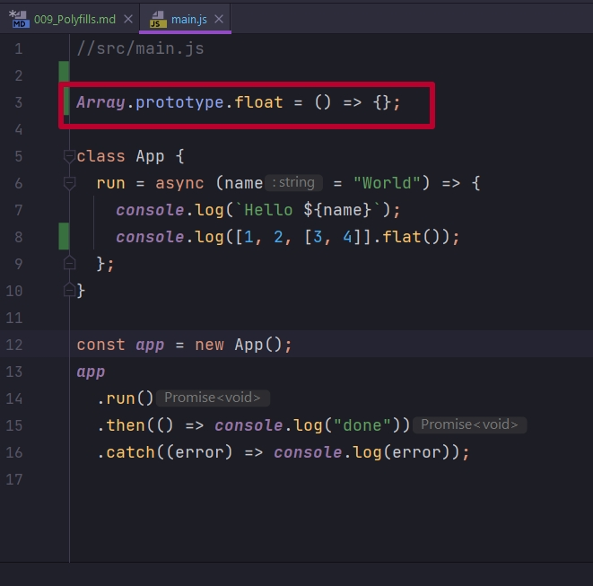

# 009_Polyfills

Еще один аспект работы babel который нам с вами нужно обсудить это работа с полифилами.

Когда обновляется стандарт ECMAScript то многие нововведения языка это новые стандартные функции а не новый синтаксис. Пример такой функции [Array.prototype.flat()](https://developer.mozilla.org/en-US/docs/Web/JavaScript/Reference/Global_Objects/Array/flat). Эта функция позволяет уменьшить размерность массива. Сделать его немножко белее плоским. Кароче двумерный массив можно сделать одномерным.

Суть в том что это нововведение языка, это новая часть стандарта, она не добавляет ни какого нового синтаксиса. Единственное что появляется это новая функция которая определена на объекте Array.prototype.

Соответственно что бы мы могли использовать эту функцию в коде

```js
//src/main.js

class App {
  run = async (name = "World") => {
    console.log(`Hello ${name}`);
    console.log([1, 2, [3, 4]].flat());
  };
}

const app = new App();
app
  .run()
  .then(() => console.log("done"))
  .catch((error) => console.log(error));

```

Нам не нужно преображать этот синтаксис console.log([1, 2, [3, 4]].flat()); в какой-нибудь другой. Потому что с точки зрения синтаксиса здесь все ок. Мы создаем новый двумерный массив и вызываем на нем функцию.

Только вот проблема!!! Эта функция доступна не во всех браузерах. И решить эту проблему довольно просто. Поскольку JS это динамический язык. Мы можем изменять совершенно любые стандартные фукции, ну и добавлять свои собственные станартные функции.

Для того что бы добавить это поведение мы могли бы самостоятельно определить фунцию Array.prototype.flat = и здесь что нибудь полезное сделать () =>{}. Т.е. написать свою собственную реализацию функции на тот случай если в браузере нет стандартной реализации.

```js
//src/main.js

Array.prototype.flat = () =>{}

class App {
  run = async (name = "World") => {
    console.log(`Hello ${name}`);
    console.log([1, 2, [3, 4]].flat());
  };
}

const app = new App();
app
  .run()
  .then(() => console.log("done"))
  .catch((error) => console.log(error));

```

Конечно если бы это был настоящий код мы бы сначало проверили бы что функции flat действительно нет на объекте Array.prototype. Ну а затем только добавляли бы ее к прототипу массива.

Вот этот код 



который добавляет новую стандартную функцию, новую глобальную функцию, и называется polyfill. Точно так же как и с остальными стандартными аспектами языка мы не хотим работать вручную с полифилами.

Уже есть отличная библиотека, которую использует babel, эта библиотека называется core.js которая как раз содержит необходимые полифилы. Если ваш код использует не только новый синтаксис языка, но и вот такие новые функции


эта библиотека сделает так что бы эти функции были доступны.

Устанавливаю core.js

```shell
npm install core-js
```

Возвращаюсь в .babelrc и добавляю вот таку конфигурацию в наш @babel/preset-env.

1. Первый параметр это corejs и укажем здесь 3. это версия библиотеки которую мы будем использовать. На момент видео самая свежая библиотека. 
2. Второй параметр userBuildIns  и значение usage.

```json
{
  "presets": [
    [
      "@babel/env",
      {
        "corejs": 3,
        "useBuiltIns": "usage",
        "debug": true
      }
    ]
  ],
  "plugins": [
    "@babel/proposal-class-properties"
  ]
}
```

Как будет работать @babel/preset-env когда он получит эту конфигурацию?

Самая интересная строка это "userBuildIns": "usage". Это означает что babel попытается найти те места в коде которые используют новые функции языка, и подключить только те полифилы которые действительно нужны для того что бы этот код работал.

К примеру прямо сейчас в нашем файле .browserslistrc мы поддерживаем две последние версии chrome и firefox. Эти браузеры поддерфивают функцию flat. Соответственно при сборке ни какие полифилы добавлены не будут.

```shell
npx babel src --out-dir build

```


Babel сообщает что наш режим работы с полифилами это usage-global. Про другие режимы чуть позже.

Но если я добавлю к примеру edge 18 в .browserslistrc и пересоберу проект.


```js
"use strict";

require("core-js/modules/es.promise.js");

require("core-js/modules/es.array.flat.js");

require("core-js/modules/es.array.unscopables.flat.js");

function _defineProperty(obj, key, value) { if (key in obj) { Object.defineProperty(obj, key, { value: value, enumerable: true, configurable: true, writable: true }); } else { obj[key] = value; } return obj; }

//src/main.js
Array.prototype.float = () => {};

class App {
  constructor() {
    _defineProperty(this, "run", async (name = "World") => {
      console.log(`Hello ${name}`);
      console.log([1, 2, [3, 4]].flat());
    });
  }

}

const app = new App();
app.run().then(() => console.log("done")).catch(error => console.log(error));
```

И если мы посмотрим у нас появилось три импорта require("core-js/modules/es.promise.js"); Т.е. здесь мы импортируем одну конкретную функцию flat. Ну и точно так же подключаем еще две функции. 

Это и есть реализация полифилов, дополнительных функций которых пока что  нет в нашем браузере. Нужно заметить что Babel использовал функцию require для того что бы подключить эти модули. Это метод который используется в node.js и немного реже в браузерах.

В нашем коде не нужно использовать ключевое слово require потому что мы совсем скоро подключим webpack который будет заниматься обработкой модулей. А Webpack отлично работает со стандартным синтаксисом import.

Это довольно просто исправить. Мы можем сказать что выражение import не нужно трансформировать. Для этого достаточно добавить еще один переметр в конфигурацию. И скажем modules:false. Это инструкция для  @babel/preset-env что если у нас встречается необходимость импортировать какой-нибудь файл, то мы будем использовать стандартный синтаксис.

```js
{
  "presets": [
    [
      "@babel/env",
      {
        "corejs": 3,
        "useBuiltIns": "usage",
        "debug": true,
        "modules": false
      }
    ]
  ],
  "plugins": [
    "@babel/proposal-class-properties"
  ]
}
```

```js
import "core-js/modules/es.promise.js";
import "core-js/modules/es.array.flat.js";
import "core-js/modules/es.array.unscopables.flat.js";

function _defineProperty(obj, key, value) { if (key in obj) { Object.defineProperty(obj, key, { value: value, enumerable: true, configurable: true, writable: true }); } else { obj[key] = value; } return obj; }

//src/main.js
Array.prototype.float = () => {};

class App {
  constructor() {
    _defineProperty(this, "run", async (name = "World") => {
      console.log(`Hello ${name}`);
      console.log([1, 2, [3, 4]].flat());
    });
  }

}

const app = new App();
app.run().then(() => console.log("done")).catch(error => console.log(error));
```


Второе значение для useBuiltIns это entry. С такой настройкой @babel/preset-env не будет пытаться проанализировать какие именно полифилы вы используете в своем коде. Вместо этого в главном файле вашего проекта  @babel/preset-env добавит абсолютно все полифилы, которые нужны тем браузерам которые мы собираемся поддерживать.

```json 
{
  "presets": [
    [
      "@babel/env",
      {
        "corejs": 3,
        "useBuiltIns": "entry",
        "debug": true,
        "modules": false
      }
    ]
  ],
  "plugins": [
    "@babel/proposal-class-properties"
  ]
}

```

Теперь посмотрим как это будет работать.

Для начало нам нужно добавить волшебную строку в main.js что бы @babel/preset-env знал куда же именно нужно добавлять полифилы. Волшебная строка import "core-js"

```js
//src/main.js
import "core-js"

Array.prototype.float = () => {};

class App {
  run = async (name = "World") => {
    console.log(`Hello ${name}`);
    console.log([1, 2, [3, 4]].flat());
  };
}

const app = new App();
app
  .run()
  .then(() => console.log("done"))
  .catch((error) => console.log(error));

```

Когда мы запустим сборку babel заменит вот эту строку import "core-js" на список полифилов которые нужны для наших браузеров.

```shell
 npx babel src --out-dir build
```

```js
function _defineProperty(obj, key, value) { if (key in obj) { Object.defineProperty(obj, key, { value: value, enumerable: true, configurable: true, writable: true }); } else { obj[key] = value; } return obj; }

import "core-js/modules/es.symbol.description.js";
import "core-js/modules/es.symbol.async-iterator.js";
import "core-js/modules/es.symbol.match.js";
import "core-js/modules/es.symbol.replace.js";
import "core-js/modules/es.symbol.search.js";
import "core-js/modules/es.symbol.split.js";
import "core-js/modules/es.array.flat.js";
import "core-js/modules/es.array.flat-map.js";
import "core-js/modules/es.array.sort.js";
import "core-js/modules/es.array.unscopables.flat.js";
import "core-js/modules/es.array.unscopables.flat-map.js";
import "core-js/modules/es.number.parse-float.js";
import "core-js/modules/es.number.parse-int.js";
import "core-js/modules/es.number.to-fixed.js";
import "core-js/modules/es.object.assign.js";
import "core-js/modules/es.object.from-entries.js";
import "core-js/modules/es.parse-float.js";
import "core-js/modules/es.parse-int.js";
import "core-js/modules/es.promise.js";
import "core-js/modules/es.promise.finally.js";
import "core-js/modules/es.reflect.set.js";
import "core-js/modules/es.regexp.constructor.js";
import "core-js/modules/es.regexp.exec.js";
import "core-js/modules/es.regexp.flags.js";
import "core-js/modules/es.regexp.to-string.js";
import "core-js/modules/es.string.ends-with.js";
import "core-js/modules/es.string.includes.js";
import "core-js/modules/es.string.match.js";
import "core-js/modules/es.string.replace.js";
import "core-js/modules/es.string.search.js";
import "core-js/modules/es.string.split.js";
import "core-js/modules/es.string.starts-with.js";
import "core-js/modules/es.string.trim-end.js";
import "core-js/modules/es.string.trim-start.js";
import "core-js/modules/es.typed-array.set.js";
import "core-js/modules/es.typed-array.sort.js";
import "core-js/modules/es.typed-array.to-locale-string.js";
import "core-js/modules/esnext.aggregate-error.js";
import "core-js/modules/esnext.array.last-index.js";
import "core-js/modules/esnext.array.last-item.js";
import "core-js/modules/esnext.composite-key.js";
import "core-js/modules/esnext.composite-symbol.js";
import "core-js/modules/esnext.global-this.js";
import "core-js/modules/esnext.map.delete-all.js";
import "core-js/modules/esnext.map.every.js";
import "core-js/modules/esnext.map.filter.js";
import "core-js/modules/esnext.map.find.js";
import "core-js/modules/esnext.map.find-key.js";
import "core-js/modules/esnext.map.from.js";
import "core-js/modules/esnext.map.group-by.js";
import "core-js/modules/esnext.map.includes.js";
import "core-js/modules/esnext.map.key-by.js";
import "core-js/modules/esnext.map.key-of.js";
import "core-js/modules/esnext.map.map-keys.js";
import "core-js/modules/esnext.map.map-values.js";
import "core-js/modules/esnext.map.merge.js";
import "core-js/modules/esnext.map.of.js";
import "core-js/modules/esnext.map.reduce.js";
import "core-js/modules/esnext.map.some.js";
import "core-js/modules/esnext.map.update.js";
import "core-js/modules/esnext.math.clamp.js";
import "core-js/modules/esnext.math.deg-per-rad.js";
import "core-js/modules/esnext.math.degrees.js";
import "core-js/modules/esnext.math.fscale.js";
import "core-js/modules/esnext.math.iaddh.js";
import "core-js/modules/esnext.math.imulh.js";
import "core-js/modules/esnext.math.isubh.js";
import "core-js/modules/esnext.math.rad-per-deg.js";
import "core-js/modules/esnext.math.radians.js";
import "core-js/modules/esnext.math.scale.js";
import "core-js/modules/esnext.math.seeded-prng.js";
import "core-js/modules/esnext.math.signbit.js";
import "core-js/modules/esnext.math.umulh.js";
import "core-js/modules/esnext.number.from-string.js";
import "core-js/modules/esnext.observable.js";
import "core-js/modules/esnext.promise.all-settled.js";
import "core-js/modules/esnext.promise.any.js";
import "core-js/modules/esnext.promise.try.js";
import "core-js/modules/esnext.reflect.define-metadata.js";
import "core-js/modules/esnext.reflect.delete-metadata.js";
import "core-js/modules/esnext.reflect.get-metadata.js";
import "core-js/modules/esnext.reflect.get-metadata-keys.js";
import "core-js/modules/esnext.reflect.get-own-metadata.js";
import "core-js/modules/esnext.reflect.get-own-metadata-keys.js";
import "core-js/modules/esnext.reflect.has-metadata.js";
import "core-js/modules/esnext.reflect.has-own-metadata.js";
import "core-js/modules/esnext.reflect.metadata.js";
import "core-js/modules/esnext.set.add-all.js";
import "core-js/modules/esnext.set.delete-all.js";
import "core-js/modules/esnext.set.difference.js";
import "core-js/modules/esnext.set.every.js";
import "core-js/modules/esnext.set.filter.js";
import "core-js/modules/esnext.set.find.js";
import "core-js/modules/esnext.set.from.js";
import "core-js/modules/esnext.set.intersection.js";
import "core-js/modules/esnext.set.is-disjoint-from.js";
import "core-js/modules/esnext.set.is-subset-of.js";
import "core-js/modules/esnext.set.is-superset-of.js";
import "core-js/modules/esnext.set.join.js";
import "core-js/modules/esnext.set.map.js";
import "core-js/modules/esnext.set.of.js";
import "core-js/modules/esnext.set.reduce.js";
import "core-js/modules/esnext.set.some.js";
import "core-js/modules/esnext.set.symmetric-difference.js";
import "core-js/modules/esnext.set.union.js";
import "core-js/modules/esnext.string.at.js";
import "core-js/modules/esnext.string.code-points.js";
import "core-js/modules/esnext.string.match-all.js";
import "core-js/modules/esnext.string.replace-all.js";
import "core-js/modules/esnext.symbol.dispose.js";
import "core-js/modules/esnext.symbol.observable.js";
import "core-js/modules/esnext.symbol.pattern-match.js";
import "core-js/modules/esnext.weak-map.delete-all.js";
import "core-js/modules/esnext.weak-map.from.js";
import "core-js/modules/esnext.weak-map.of.js";
import "core-js/modules/esnext.weak-set.add-all.js";
import "core-js/modules/esnext.weak-set.delete-all.js";
import "core-js/modules/esnext.weak-set.from.js";
import "core-js/modules/esnext.weak-set.of.js";
import "core-js/modules/web.dom-collections.iterator.js";
import "core-js/modules/web.immediate.js";
import "core-js/modules/web.queue-microtask.js";
import "core-js/modules/web.url.js";
import "core-js/modules/web.url.to-json.js";
import "core-js/modules/web.url-search-params.js";

Array.prototype.float = () => {};

class App {
  constructor() {
    _defineProperty(this, "run", async (name = "World") => {
      console.log(`Hello ${name}`);
      console.log([1, 2, [3, 4]].flat());
    });
  }

}

const app = new App();
app.run().then(() => console.log("done")).catch(error => console.log(error));
```

Это возможные полифилы которые понадобятся нашим браузерам.

Как не трудно догадаться рекомендуемый способ это usage

```json
{
  "presets": [
    [
      "@babel/env",
      {
        "corejs": 3,
        "useBuiltIns": "usage",
        "debug": true,
        "modules": false
      }
    ]
  ],
  "plugins": [
    "@babel/proposal-class-properties"
  ]
}
```

Потому что он добавляет только нужные полифилы.

Теперь я могу убрать волшебную строку и пересобрать проект.

То что я написал 

```js
//src/main.js

Array.prototype.float = () => {};

class App {
  run = async (name = "World") => {
    console.log(`Hello ${name}`);
    console.log([1, 2, [3, 4]].flat());
  };
}

const app = new App();
app
  .run()
  .then(() => console.log("done"))
  .catch((error) => console.log(error));

```

Трансилированный файл

```js
import "core-js/modules/es.promise.js";
import "core-js/modules/es.array.flat.js";
import "core-js/modules/es.array.unscopables.flat.js";

function _defineProperty(obj, key, value) { if (key in obj) { Object.defineProperty(obj, key, { value: value, enumerable: true, configurable: true, writable: true }); } else { obj[key] = value; } return obj; }

//src/main.js
Array.prototype.float = () => {};

class App {
  constructor() {
    _defineProperty(this, "run", async (name = "World") => {
      console.log(`Hello ${name}`);
      console.log([1, 2, [3, 4]].flat());
    });
  }

}

const app = new App();
app.run().then(() => console.log("done")).catch(error => console.log(error));
```

Когда вы получите этот код не спешите бежать и пробовать его исполнить. Для того что бы он заработал. Нужно сделать так что бы заработали выражения import.А для этого нам понадобится Webpack.


