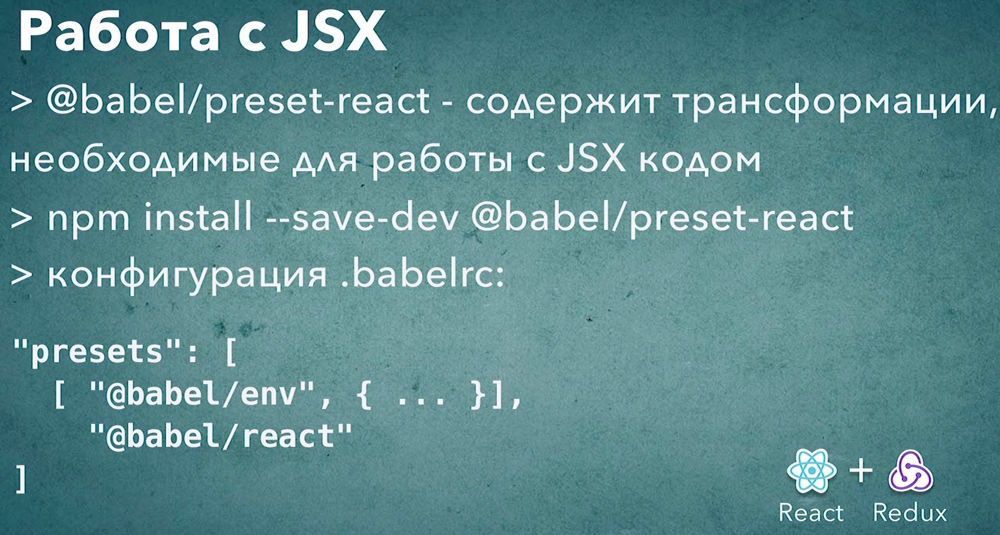

# 010_JSX

```jsx
//src/main.js
import React from "react";
import ReactDOM from "react-dom";

const App = () => {
  return <p>Hello</p>;
};

ReactDOM.render(<App />, document.getElementById("root"));

```

Если мы попобуем запустить этот код в браузере, то у нас ничего не получиться, потому что это не стандартный синтаксис JS, это синтаксис JSX. И стандартный JS движок с этим синтаксисом не справится. 

Для того что бы это приложение можно было бы запустить в браузере мы преобразуем этот синтаксис в стандартный синтаксис JS. Ведь у react есть стандартный JS API который можно использовать вместо JSX. 

И так установим React и react-dom.

```shell
npm install react react-dom
```

```json
{
  "name": "build-sandbox",
  "version": "1.0.0",
  "description": "Sandbox to play with React build tools",
  "main": "index.js",
  "scripts": {
    "test": "echo \"Error: no test specified\" && exit 1"
  },
  "author": "Konstantin Atroshchenko <kostay375298918971@gmail.com>",
  "license": "ISC",
  "devDependencies": {
    "@babel/cli": "^7.17.6",
    "@babel/core": "^7.17.9",
    "@babel/plugin-proposal-class-properties": "^7.16.7",
    "@babel/plugin-transform-block-scoping": "^7.16.7",
    "@babel/plugin-transform-classes": "^7.16.7",
    "@babel/plugin-transform-template-literals": "^7.16.7",
    "@babel/preset-env": "^7.16.11"
  },
  "dependencies": {
    "core-js": "^3.22.2",
    "react": "^18.0.0",
    "react-dom": "^18.0.0"
  }
}

```

```jsx
//src/main.js
import React from "react";
import ReactDOM from "react-dom/client";

const App = () => {
  return <p>Hello</p>;
};

const root = ReactDOM.createRoot(document.getElementById("root"));

root.render(<App />);

```

Для того что бы трансформировать этот код в React нам понадобится еще один пресет @babel/preset-react

```shell
npm install --save-dev @babel/preset-react
```

Этот пресет содержит несколько плагинов которые позволяют babel обрабатывать JSX код. Все что нам нужно сделать это добавить этот пресет к списку в .babelrc

```json
{
  "presets": [
    [
      "@babel/env",
      {
        "corejs": 3,
        "useBuiltIns": "usage",
        "debug": true,
        "modules": false
      }
    ],
    "@babel/preset-react"
  ],
  "plugins": [
    "@babel/proposal-class-properties"
  ]
}
```

Пересобираю проект

```shell
npx babel src --out-dir build
```

```js
//src/main.js
import React from "react";
import ReactDOM from "react-dom/client";

const App = () => {
  return /*#__PURE__*/React.createElement("p", null, "Hello");
};

const root = ReactDOM.createRoot(document.getElementById("root"));
root.render( /*#__PURE__*/React.createElement(App, null));
```

Как видите теперь у меня нет JSX кода. JSX заменился на React.createElement. 

Напомню что пока что этот код не заработает в браузере потому что нам нужно добавить поддержку ключевого слова import.




