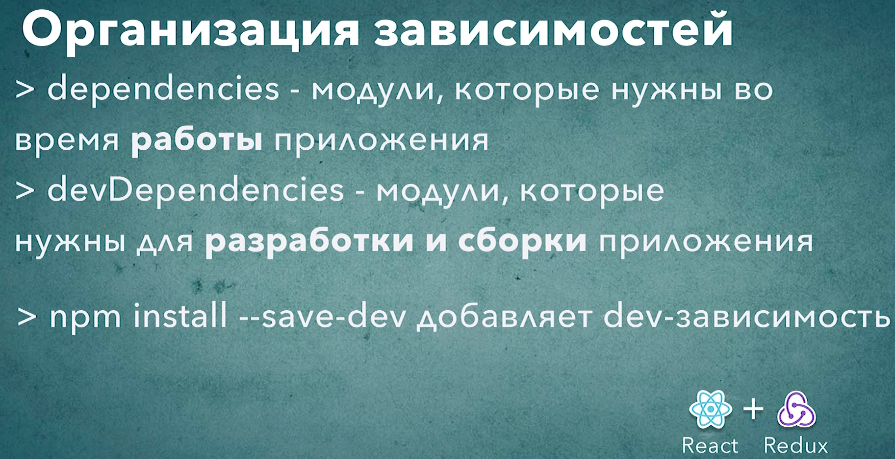

# 011_Организация_зависимостей

В уроках этого блока мы установили довольно много зависимостей. Но пока мы это делали мы не обратили внимание на одну очень важную вещь. 

Как мы уже говорили что зависимости в package.json разделяются на два вида. Это зависимости которые run time зависимости, блок dependencies. 

И второе это зависимости для разработки devDependencies инструменты которые нужны для сборки или тестирования проекта, но не для самого запуска проекта. Это разделение имеет немножко больший смысл в Node.js. Но и в обычных UI проектах, React проектах есть такая хорошая практика разделять разный вид зависимостей.

В dependencies должны идти зависимости которые действительно пойдут в браузер нашим клиентам т.е. это тот код который будет присутствовать в результирующем приложении.

Но все остальные зависимости которые используются для сборки и оптимизации идит в devDependencies.

Установка обычных зависимостей происходит без указания флага --save-dev. Ну а если этот пакет нужен исключительно на этапе разработки, тестирования и сборки, то мы указываем флаг --save-dev

У меня в этом плане все норм 

```json
{
  "name": "build-sandbox",
  "version": "1.0.0",
  "description": "Sandbox to play with React build tools",
  "main": "index.js",
  "scripts": {
    "test": "echo \"Error: no test specified\" && exit 1"
  },
  "author": "Konstantin Atroshchenko <kostay375298918971@gmail.com>",
  "license": "ISC",
  "devDependencies": {
    "@babel/cli": "^7.17.6",
    "@babel/core": "^7.17.9",
    "@babel/plugin-proposal-class-properties": "^7.16.7",
    "@babel/plugin-transform-block-scoping": "^7.16.7",
    "@babel/plugin-transform-classes": "^7.16.7",
    "@babel/plugin-transform-template-literals": "^7.16.7",
    "@babel/preset-env": "^7.16.11",
    "@babel/preset-react": "^7.16.7"
  },
  "dependencies": {
    "core-js": "^3.22.2",
    "react": "^18.0.0",
    "react-dom": "^18.0.0"
  }
}

```

Если что можно вручную поправить зависимости. Вырезать из блока и вставить в другой блок кода.



