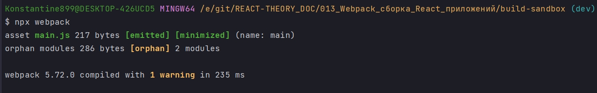
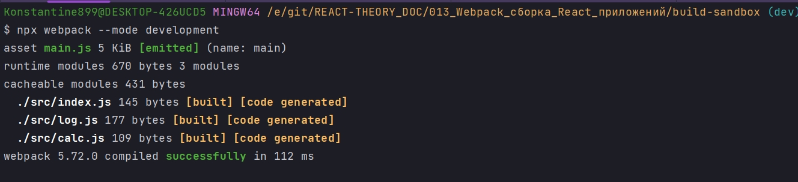
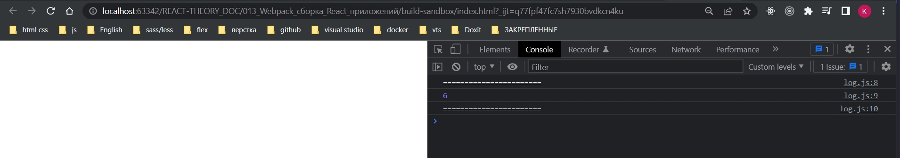

# 001_Установка_Webpack

Прежде чем установить Webpack создадим небольшое приложение в котором будет несколько модулей. Начну с того что удалю те файлы которые мы использовали для тестирования babel.

И я начну писать приложение, точно так же как мы писали приложение в create-react-app. 

В src - создаю файл index.js. Он является точкой входа в наше приложение.

и создам еще пару модулей. calc - он будет калькулятьром. А второй модуль будет log.

```js
//src/calc.js
export default class Calc {
  add(...args) {
    return args.reduce((a, b) => a + b, 0);
  }
}

```

Наша функция будет принимать сколько угодно аргументов а затем возвращать их сумму.

```js
//src/log.js
export default class Log {
  log(message) {
    console.log("=======================");
    console.log(message);
    console.log("=======================");
  }
}

```

```js
//src/index.js
import Log from "./log";
import Calc from "./calc";

const calc = new Calc();
const log = new Log();

log.log(calc.add(1, 2, 3));

```

Если сейчас мы попытаемся запустить этот код в браузере, то у нас ничего не получиться поскольку поддержка ключевого слова import в браузерах пока что весьма ограничена и браузеры не умеют загружать нужне модули. Именно по этому нам понадобится Webpack.

Давайте установим Webpack и проверим что мы можем из этих трех файлов собрать один файл который будет уже работать в браузерах.

```shell
npm install --save-dev webpack webpack-cli
```

webpack - это само ядро приложения

webpack-cli - это небольшая обертка которая позволяет вызывать webpack из командной строки.

После установки Webpack можно запустить. Нам даже не понадобится ни какой конфигурации ведь в нашем проекте стандартная структура дирректорий. У нас есть дирректория src и в ней есть файл index.js. И именно этот файл Webpack будет использовать вкачестве точки входа.

```shell
npx webpack
```



У него более подробно описано. Однако результат такой же. Webpack создал директорию dist с файлом main.js. Это результат работы Webpack. Файл main.js содержит все три модуля которые мы создали в папке src. И файл main.js готов к тому что бы его добавили на web страничку и передать в браузер для исполнения. В этом файле больше нет импортов. Вместо них подставлен код необъодимых модулей. Если мы откроем main.js то увидим что там уже минифицированный JS.

```js
(()=>{"use strict";const o=new class{add(...o){return o.reduce(((o,l)=>o+l),0)}};(new class{log(o){console.log("======================="),console.log(o),console.log("=======================")}}).log(o.add(1,2,3))})();
```

У меня предупреждение не показывается у него есть. И так, в этом предупреждении Webpack хочет знать в каком режиме мы будем работать. В режиме production или в режиме development. Поскольку мы ничего не передали, то webpack взял значение production. Именно по этому наш main.js минифицирован. Про режимы чуть позже.

В production режиме webpack пытается оптимизировать результирующий файл. production сборка занимает больше времени и ресурсов. Но в результате мы получим более компактную версию приложения.

Но во время разработки нам не нужно тратить эти лишние ресурсы и лишнее время на сборку, поскольку размер приложения собственно не имеет значения.

Передалим webpack явно значение development

```shell
npx webpack --mode development
```



Как только мы передали дополнительную опцию webpack запустился без предупреждений.

Сгенерированный файл main.js

```js
/*
 * ATTENTION: The "eval" devtool has been used (maybe by default in mode: "development").
 * This devtool is neither made for production nor for readable output files.
 * It uses "eval()" calls to create a separate source file in the browser devtools.
 * If you are trying to read the output file, select a different devtool (https://webpack.js.org/configuration/devtool/)
 * or disable the default devtool with "devtool: false".
 * If you are looking for production-ready output files, see mode: "production" (https://webpack.js.org/configuration/mode/).
 */
/******/ (() => { // webpackBootstrap
/******/ 	"use strict";
/******/ 	var __webpack_modules__ = ({

/***/ "./src/calc.js":
/*!*********************!*\
  !*** ./src/calc.js ***!
  \*********************/
/***/ ((__unused_webpack_module, __webpack_exports__, __webpack_require__) => {

eval("__webpack_require__.r(__webpack_exports__);\n/* harmony export */ __webpack_require__.d(__webpack_exports__, {\n/* harmony export */   \"default\": () => (/* binding */ Calc)\n/* harmony export */ });\n//src/calc.js\nclass Calc {\n  add(...args) {\n    return args.reduce((a, b) => a + b, 0);\n  }\n}\n\n\n//# sourceURL=webpack://build-sandbox/./src/calc.js?");

/***/ }),

/***/ "./src/index.js":
/*!**********************!*\
  !*** ./src/index.js ***!
  \**********************/
/***/ ((__unused_webpack_module, __webpack_exports__, __webpack_require__) => {

eval("__webpack_require__.r(__webpack_exports__);\n/* harmony import */ var _log__WEBPACK_IMPORTED_MODULE_0__ = __webpack_require__(/*! ./log */ \"./src/log.js\");\n/* harmony import */ var _calc__WEBPACK_IMPORTED_MODULE_1__ = __webpack_require__(/*! ./calc */ \"./src/calc.js\");\n//src/index.js\n\n\n\nconst calc = new _calc__WEBPACK_IMPORTED_MODULE_1__[\"default\"]();\nconst log = new _log__WEBPACK_IMPORTED_MODULE_0__[\"default\"]();\n\nlog.log(calc.add(1, 2, 3));\n\n\n//# sourceURL=webpack://build-sandbox/./src/index.js?");

/***/ }),

/***/ "./src/log.js":
/*!********************!*\
  !*** ./src/log.js ***!
  \********************/
/***/ ((__unused_webpack_module, __webpack_exports__, __webpack_require__) => {

eval("__webpack_require__.r(__webpack_exports__);\n/* harmony export */ __webpack_require__.d(__webpack_exports__, {\n/* harmony export */   \"default\": () => (/* binding */ Log)\n/* harmony export */ });\n//src/log.js\nclass Log {\n  log(message) {\n    console.log(\"=======================\");\n    console.log(message);\n    console.log(\"=======================\");\n  }\n}\n\n\n//# sourceURL=webpack://build-sandbox/./src/log.js?");

/***/ })

/******/ 	});
/************************************************************************/
/******/ 	// The module cache
/******/ 	var __webpack_module_cache__ = {};
/******/ 	
/******/ 	// The require function
/******/ 	function __webpack_require__(moduleId) {
/******/ 		// Check if module is in cache
/******/ 		var cachedModule = __webpack_module_cache__[moduleId];
/******/ 		if (cachedModule !== undefined) {
/******/ 			return cachedModule.exports;
/******/ 		}
/******/ 		// Create a new module (and put it into the cache)
/******/ 		var module = __webpack_module_cache__[moduleId] = {
/******/ 			// no module.id needed
/******/ 			// no module.loaded needed
/******/ 			exports: {}
/******/ 		};
/******/ 	
/******/ 		// Execute the module function
/******/ 		__webpack_modules__[moduleId](module, module.exports, __webpack_require__);
/******/ 	
/******/ 		// Return the exports of the module
/******/ 		return module.exports;
/******/ 	}
/******/ 	
/************************************************************************/
/******/ 	/* webpack/runtime/define property getters */
/******/ 	(() => {
/******/ 		// define getter functions for harmony exports
/******/ 		__webpack_require__.d = (exports, definition) => {
/******/ 			for(var key in definition) {
/******/ 				if(__webpack_require__.o(definition, key) && !__webpack_require__.o(exports, key)) {
/******/ 					Object.defineProperty(exports, key, { enumerable: true, get: definition[key] });
/******/ 				}
/******/ 			}
/******/ 		};
/******/ 	})();
/******/ 	
/******/ 	/* webpack/runtime/hasOwnProperty shorthand */
/******/ 	(() => {
/******/ 		__webpack_require__.o = (obj, prop) => (Object.prototype.hasOwnProperty.call(obj, prop))
/******/ 	})();
/******/ 	
/******/ 	/* webpack/runtime/make namespace object */
/******/ 	(() => {
/******/ 		// define __esModule on exports
/******/ 		__webpack_require__.r = (exports) => {
/******/ 			if(typeof Symbol !== 'undefined' && Symbol.toStringTag) {
/******/ 				Object.defineProperty(exports, Symbol.toStringTag, { value: 'Module' });
/******/ 			}
/******/ 			Object.defineProperty(exports, '__esModule', { value: true });
/******/ 		};
/******/ 	})();
/******/ 	
/************************************************************************/
/******/ 	
/******/ 	// startup
/******/ 	// Load entry module and return exports
/******/ 	// This entry module can't be inlined because the eval devtool is used.
/******/ 	var __webpack_exports__ = __webpack_require__("./src/index.js");
/******/ 	
/******/ })()
;
```

И так проверка файла. В index.html указываю путь к сгенерированному webpack-ом файлу.

```html
<!DOCTYPE html>
<html lang="en">
  <head>
    <meta charset="UTF-8" />
    <meta
      name="viewport"
      content="width=device-width, user-scalable=no, initial-scale=1.0, maximum-scale=1.0, minimum-scale=1.0"
    />
    <meta http-equiv="X-UA-Compatible" content="ie=edge" />
    <title>Document</title>
  </head>
  <body>
    <div id="root"></div>
    <script src="dist/main.js"></script>
  </body>
</html>

```




