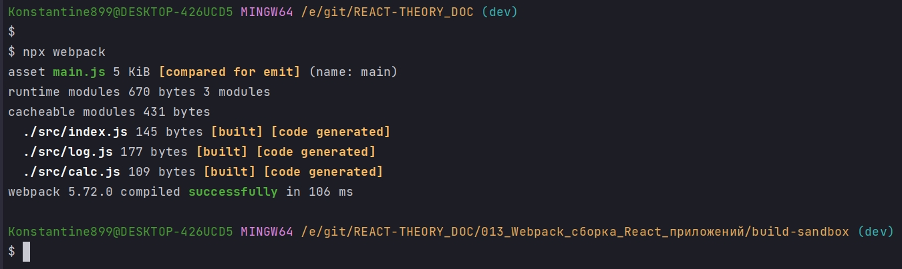
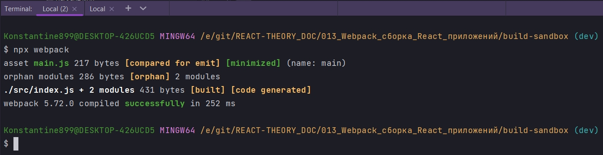
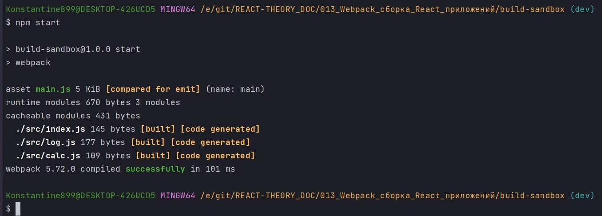
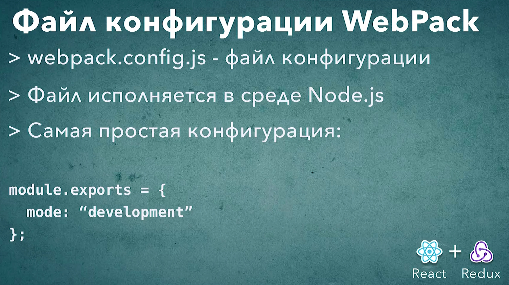

# 002_Webpack_файл_конфигурации

Webpack это относительно сложный инструмент с относительно сложной конфигурацией. По этому работать и дальше с командной строкой будет весьма не удобно.

Гораздо удобнее работать с отдельным конфигурационным файлом. Для webpack этот файл называется webpack.config.js. Его можно назвать как угодно и зтем передавать имя файла в качестве параметра в командной строке.

Заметьте, это именно js файл в отличие от .babelec который был обычным json файлом.

В чем же отличие?

1. отличие в том что в файле webpack.config.js вы можете исполнить совершено любой js код который реализует совершенно любую дополнительную логику.
2. Второй важный факт который нужно помнить webpack работает не в браузере, а в среде node.js. И по этому этот файл webpack.config.js тоже исполняется в среде node.js.

Соответственно когда вы пишите код в этом файле, вы можете использовать совершенно любые функции библиотеки доступные в node.js.

Из файла webpack.config.js нам нужно экспортировать объект с конфигурацией. Но поскольку этот файл исполняется в node.js мы будем использовать не стандартный привыный синтаксис export default. В метсто этого мы будем использовать синтаксис экспорта node.js.

```js
module.exports = {};

```

В module.exports мы передали, присвоили объект,с пустой конфигурацией.

Передадим тот параметр который webpack просил нас передавать, и этот параметр mode.

```js
module.exports = {
  mode: "development",
};

```

Теперь мы можем перезапустить webpack командой 

```shell
npx webpack
```

я не буду передавать параметр mode поскольку он уже описан в конфигурации. И поскольку у нашего файла стандартное имя webpack.config.js. Webpack автоматически найдет этот файл и будет использовать эту конфигурацию при запуске.



Эксперемент. Прямо сейчас размер файла 5 килобайт.

```js
module.exports = {
  mode: "production",
};

```

```shell
npx webpack
```



А теперь как видим 217 байт.

Перед тем как закрыть этот урок давайте вспомним как запускался build в create-react-app. Что бы запустить приложение мы запускали npm start. Считается хорошей практикой добавлять команду npm start в свой проект. Что будет делать эта команда во многом зависит от самого проекта. К примеру в node.js приложениях эта команда как правило запускает само приложение. Ну а во front-end приложениях эта команда к примеру может собирать проект и запускать web-server для разработки.

Сделаем так что бы npm start запускал сборку нашего проекта.

Заходим в package.json и находим блок script. Добавляю ключ start а значение webpack.

```json
{
  "name": "build-sandbox",
  "version": "1.0.0",
  "description": "Sandbox to play with React build tools",
  "main": "index.js",
  "scripts": {
    "start": "webpack",
    "test": "echo \"Error: no test specified\" && exit 1"
  },
  "author": "Konstantin Atroshchenko <kostay375298918971@gmail.com>",
  "license": "ISC",
  "devDependencies": {
    "@babel/cli": "^7.17.6",
    "@babel/core": "^7.17.9",
    "@babel/plugin-proposal-class-properties": "^7.16.7",
    "@babel/plugin-transform-block-scoping": "^7.16.7",
    "@babel/plugin-transform-classes": "^7.16.7",
    "@babel/plugin-transform-template-literals": "^7.16.7",
    "@babel/preset-env": "^7.16.11",
    "@babel/preset-react": "^7.16.7",
    "webpack": "^5.72.0",
    "webpack-cli": "^4.9.2"
  },
  "dependencies": {
    "core-js": "^3.22.2",
    "react": "^18.0.0",
    "react-dom": "^18.0.0"
  }
}

```






