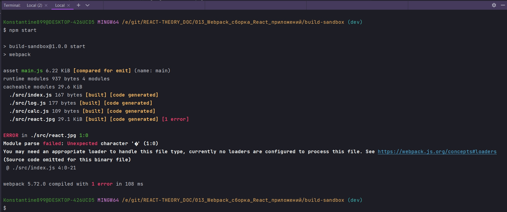
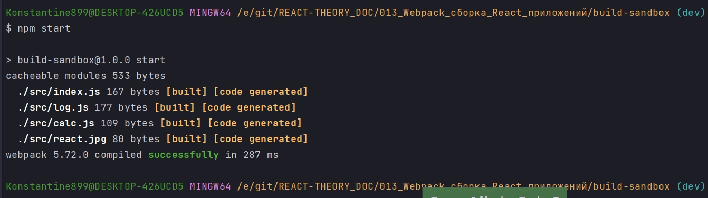
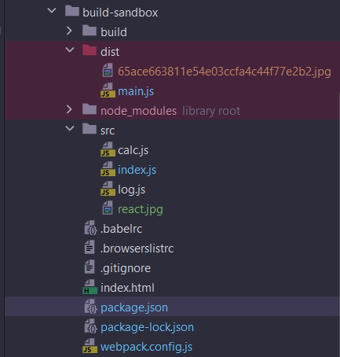
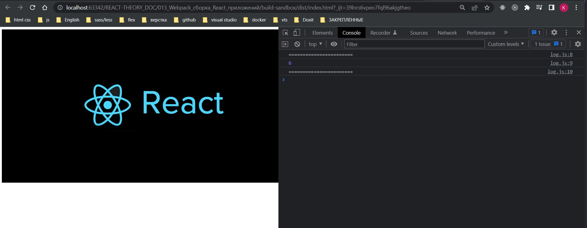
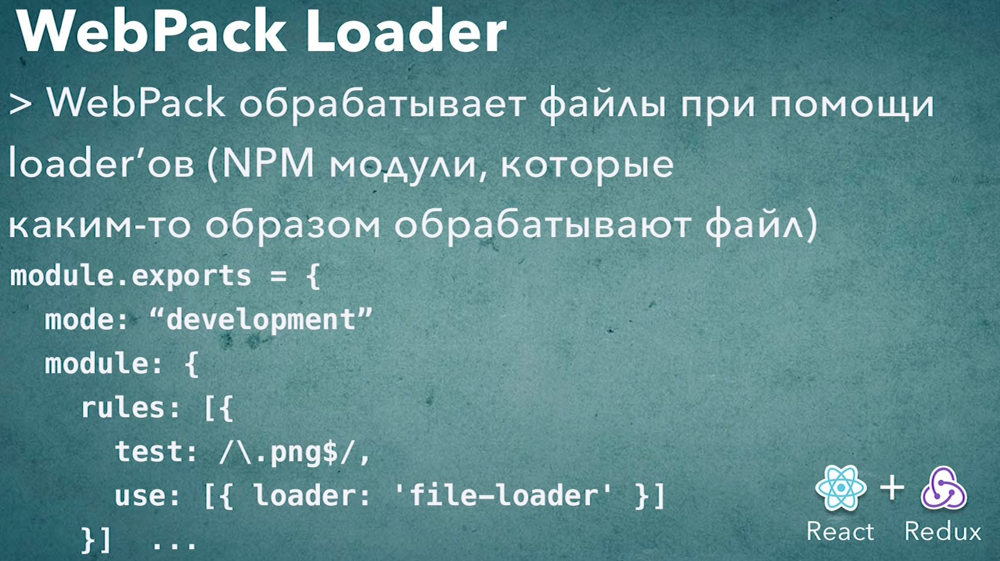

# 003_Webpack_Loader

Webpack отличается от большинства инструментов которые работают с модульным кодом. Основное отличие в том что большинство систем разделяют понятие ресурсов и модулей и обрабатывают их по разному.

Ресурсы - это файлы с которыми почти ничего делать не нужно. Вроде html файлов или css файлов, ну или картинок или шрифтов.

Ну а модули - это динамические файлы вроде js которые могут загружить другие модули и подгружать ресурсы.

Но Webpack работает иначе. Для webpack любой файл это модуль. Это значит что совершенно любой файл может участвовать в сборке. С точки зрения webpack нет ни какой разницы между js файлом, css файлом, ну или к примеру шрифтом. Вы помните что в качестве модуля можно было подключить css или изображение.

Но возможности webpack куда более широки. Можно подключасть scss или lass файлы и преобразовывать их в обычный css для браузера.

Таким образом язык на котором написан файл, т.е. его внутрення структура, его внутренний формат, не имеют для webpack ни какого значения. Если есть способ как то загрузить этот файл и как то использовать его в проекте, webpack с ним справится.

Как webpack достигает такой гибкости?

Из коробки webpack умеет работать только с js кодом. А поддержка любых других форматов это задача так называемых Loader-ов. Если говорить упрощенно, то Loader - это функция которая знает что делать с файлами определенного типа и как их загружать, как их обрабатывать. 

К примеру в вашем проекте может быть отдельный Loader для картинок, отдельный Loader для css и т.д.

Самый простой это file-loader который загружает файл без преобразований и без обработки внутренней структуры файла. Этот loader часто используется для загрузки шрифтов и изображений. По сути он только копирует файл в папку dist и возвращает в приложении путь к этому файлу.

Добавляю картинку к проекту в папку src и импортирую ее в index.js.

```js
//src/index.js
import Log from "./log";
import Calc from "./calc";
import "./react.jpg";

const calc = new Calc();
const log = new Log();

log.log(calc.add(1, 2, 3));

```

Мы должны увидеть ошибку поскольку webpack не будет знать как именно обработать этот файл.



Webpack сообщает нам что возможно у нас нет loader для того что бы обработать этот файл. И кроме того webpack дает нам ссылку на доументацию как сконфигурировать loader.

Для того что бы обработать файл нам понадобится loader который называется file-loader. И loader в webpack это обычный npm модуль.

```shell
npm install --save-dev file-loader
```

В webpack.config.js конфигурировать loader-ы мы будем в блоке module. И в нутри блока module мы добавим еще один блок который назовем rules. module это объект, а rules это массив правил как обрабатывать модули.

```js
module.exports = {
  mode: "development",
  module: {
    rules: [],
  },
};

```

И так написать правило совсем не сложно. Правило это обычный объект. Свойство test: это регулярное выражение которое позволяет выбрать только те файлы которые нужно обработать этим loader. Наше регулярное выражение будет выглядеть так. Все файлы которые заканчиваются на ...

Для того что бы указать какой loader мы будем использовать мы используем свойство use: Свойство use это массив, каждый элемент которого описывает loader и его конфигурацию. Часто бывает так что один файл обрабатывается несколькими loader-ами. 

Все что нам нужно сделать это в массив use добавить еще один объект с свойством loader:"file-loader"

```js
module.exports = {
  mode: "development",
  module: {
    rules: [{ test: /\.(png|jpg)$/, use: [{ loader: "file-loader" }] }],
  },
};

```





Как видим этот файл получил другое название. Именно так работает file-loader, он работате именно так для того что бы файлы с одинаковым именем, которые находятся в разных папках, и имеют разное содержимое, что бы они не конфликтовали между собой.

Теперь когда в нашем проекте мы импортируем изображение, то мы получим путь к этому изображению по отношении к дирректории dist.

Давайте пока что без React отобразим картинку.

```js
//src/index.js
import Log from "./log";
import Calc from "./calc";
import img from "./react.jpg";

const calc = new Calc();
const log = new Log();

log.log(calc.add(1, 2, 3));

const el = document.createElement("img");
el.src = img;
document.body.appendChild(el);

```

И дале для того что бы все работало пока что вручную скопирую index.html в dist  и поправлю путь

```html
<!DOCTYPE html>
<html lang="en">
  <head>
    <meta charset="UTF-8" />
    <meta
      name="viewport"
      content="width=device-width, user-scalable=no, initial-scale=1.0, maximum-scale=1.0, minimum-scale=1.0"
    />
    <meta http-equiv="X-UA-Compatible" content="ie=edge" />
    <title>Document</title>
  </head>
  <body>
    <div id="root"></div>
    <script src="main.js"></script>
  </body>
</html>

```






