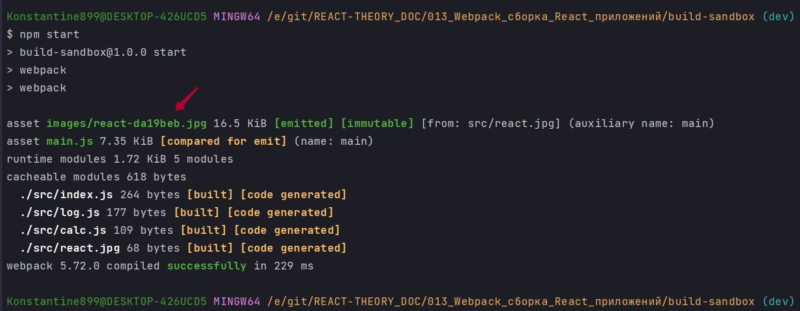
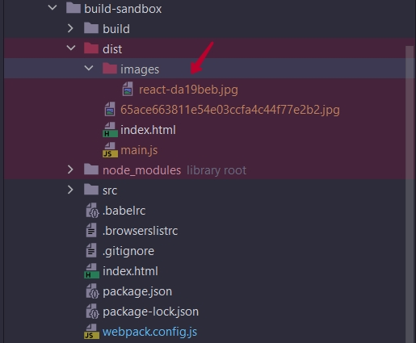
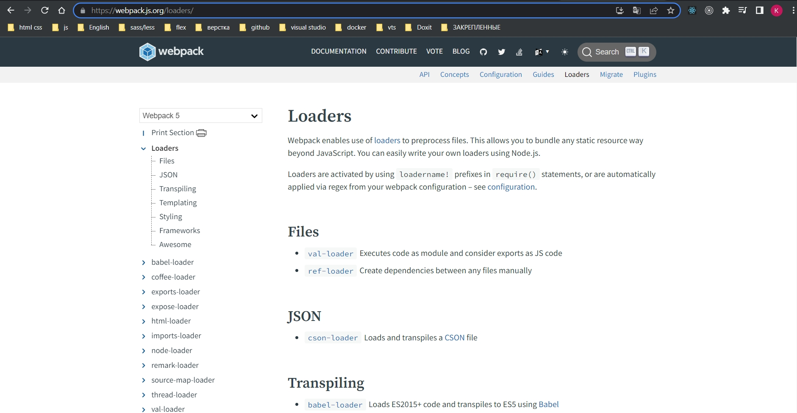
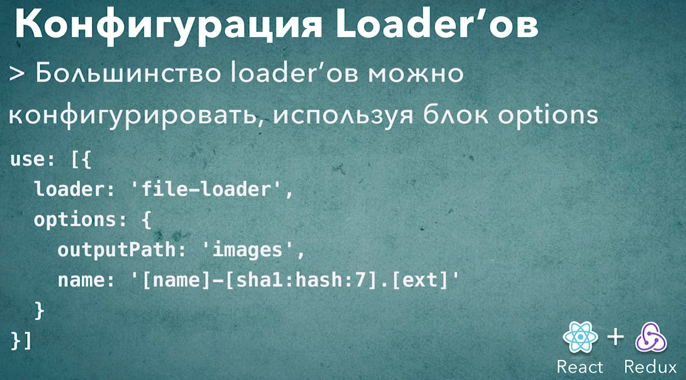

# 004_Конфигурация_loader-ов

Кроме подключения, webpack loader-ы, можно еще и конфигурировать, указывать как именно они будут работать. 

Посмотрим как это работате на примере file-loader. Но а для всех остальных loader-ов конфигурация работает точно так же. Прямо сейчас file-loader заменяет имя файла. У нас был файл который назывался react.png. И после копирования этого файла у нас в папке dist появился файл с хэшом вмето имени. File-loader делает это для того что бы файлы с одинаковыми именами не конфликтовали между собой. 

К примеру если бы у нас был проект по больше и в одной из под дирректорий был бы другой файл react.png с другим контентом, то оба файла смогли бы одновременно быть в папке dist  с разными именами.

Кроме того поскольку сгенерированное имя это хеш содержимого, то когда файл изменится то его имя тоже изменится. Это будет довольно хорошо работать с хешами в браузере.

Но мы с вами можем конфигурировать это поведение и сделать название файлов немножечко более читабельным. Ну и кроме того давайте сделаем так что бы все файлы хранились в папке img внутри папки dist. Для этого мы установим несколько дополнительных опций в наш file-loader.

Для того что бы это сделать в объекте, который мы передали в use, рядом с file-loader мы передаем options. И options это обычный объект. Ключом пишу outputPath, а значением указываю имя папки которая будет сгенерирована images.

```js
module.exports = {
  mode: "development",
  module: {
    rules: [
      {
        test: /\.(png|jpg)$/,
        use: [{ loader: "file-loader", options: { outputPath: "images" } }],
      },
    ],
  },
};

```

Таким образом file-loader будет знать что все изображния ноужно положить в папку images. Если эта папки не существует в dist, эта папка создасться автоматически.

Вторую опцию которую мы передадим это будет name. И здесь в качестве имени мы передадим паттерн который будет динамически интерпретирован webpack. И этот паттерн будет состоять из нескольких блоков. 

1. Первый блок это '[name]' - это оригинальное имя без рассширения.
2. Затем мы поставим дефис'[name]-' и скажем что мы хотим '[name]-[sha1:hash:7].[ext]'. Вот это выражение sha1:hash:7 возмет сгенерирует hash и возмет только первых 7 самволов из хеша. А ext это само расширение.

```js
module.exports = {
  mode: "development",
  module: {
    rules: [
      {
        test: /\.(png|jpg)$/,
        use: [
          {
            loader: "file-loader",
            options: {
              outputPath: "images",
              name: "[name]-[sha1:hash:7].[ext]",
            },
          },
        ],
      },
    ],
  },
};

```





Таким образом мы сконфигурировали немного другое поведение для этого лоадера.

Совершенно очевидно что те настройки которые имеют смысл для одного лоадера не имеют смысла для другого лоадера. По этому настройки не универсальные. У каждого лоадера они свои. И запоминать каждую настройка куждого лоадера конечно нет ни какого смысла. Для этого у нас есть документация.

Захожу в DOCUMENTATION и выбираю блок LOADERS.

<https://webpack.js.org/loaders/>



В левом меню у меня список популярных лоудеров. И так у меня webpack 5.72.0. Когда я ищу информацию о file-loader на странице с webpack 5, то меня перебрасывает сюда где версия webpack 4.

<https://v4.webpack.js.org/loaders/file-loader/>


И вот здесь мы видим для file-loader возможные настройки и как их правлиьно использовать. Когда вы будете работать со своими собственными проектами изучите сначало настройки и поймите что именно умеет делать тот или иной loader. Почти у всех лоадеров будут дефолтные настройки которые будут иметь смысл для большинства проектов. Тем не менее вы сможете более гибко настроить их работу если почитаете дкументацию и увидите что именно в loader можно сконфигурировать.




