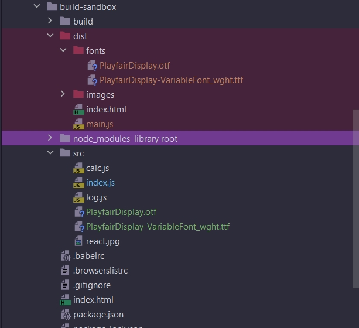
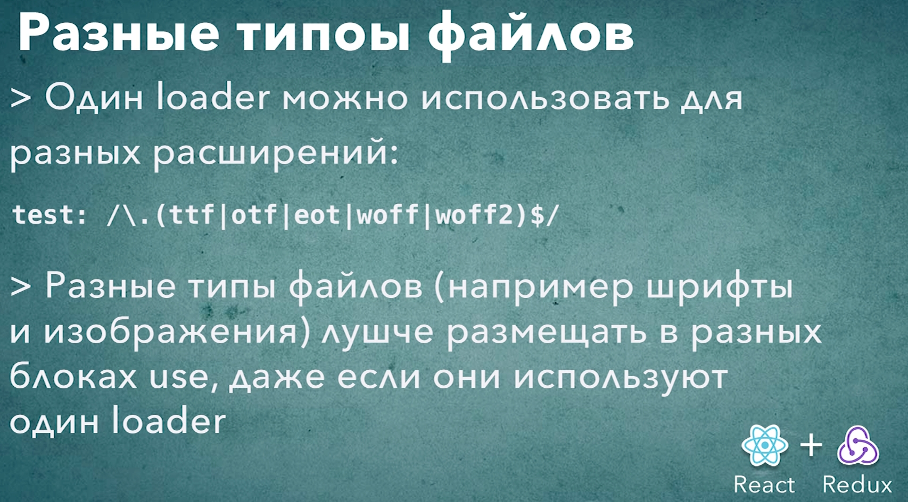

# 005_Loader-ы_для_разных_типов_файлов

Совершенно понятно что кртинки могут быть разных форматов. И тем не менее они должны обрабатываться абсолютно тем же лоудером с абсолютно теми же нстройками.

Если мы хотим что бы file-loader обрабатывал и другие типы картинок достаточно обновить регулярное выражение.

```js
module.exports = {
  mode: "development",
  module: {
    rules: [
      {
        test: /\.(png|jpg|jpeg|gif|ico)$/,
        use: [
          {
            loader: "file-loader",
            options: {
              outputPath: "images",
              name: "[name]-[sha1:hash:7].[ext]",
            },
          },
        ],
      },
    ],
  },
};

```

Кроме этого мы можем использовать file-loader и для других типов файлов. К примеру таким же обрахом можно обрабатывать и шрифты. Но в этот раз вместо того что бы добавлять расширение к регулярному выражению. 

Скопирую весь блок из rules и вставлю. Зачем я это делаю? Ну тут все очень просто. 

Во-первых я бы хотел шрифты положить в папку fonts.

Во-вторых я точно знаю что шрифты не будут изменяться по этому мне не нужен хэш.

Ну а в третьих конфигурация в которой разные типы файлов разбиты по разным блокам намного легче читать ну и в последствии легче поддерживать.

```js
module.exports = {
  mode: "development",
  module: {
    rules: [
      // Загрузка картинок
      {
        test: /\.(png|jpg|jpeg|gif|ico)$/,
        use: [
          {
            loader: "file-loader",
            options: {
              outputPath: "images",
              name: "[name]-[sha1:hash:7].[ext]",
            },
          },
        ],
      },
      // Загрузка шрифтов
      {
        test: /\.(ttf|otf|eot|woof|woof2)$/,
        use: [
          {
            loader: "file-loader",
            options: {
              outputPath: "fonts",
              name: "[name].[ext]",
            },
          },
        ],
      },
    ],
  },
};

```

Если бы мне нужно было бы добавить еще один тип файлов. К примеру со звуками mp3 и т.д. Я бы снова создал отдельное правило в блоке rules и не смешивал бы эту конфигурацию с файлами других видов.

И так для того что бы преобразование происходило подключаю шрифты

```js
//src/index.js
import Log from "./log";
import Calc from "./calc";
import img from "./react.jpg";
import PlayfairDisplay from "./PlayfairDisplay.otf";
import PlayfairDisplayVariableFont from "./PlayfairDisplay-VariableFont_wght.ttf";

const calc = new Calc();
const log = new Log();

log.log(calc.add(1, 2, 3));

const el = document.createElement("img");
el.src = img;
document.body.appendChild(el);

```






