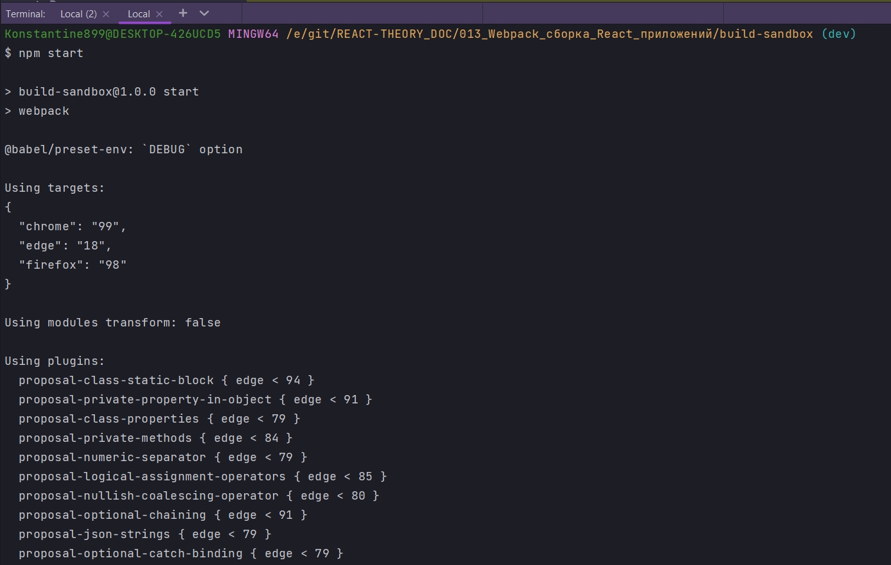

# 006_React_и_Babel_Loader

Лоудеры преображают код, они траспилируют, переводят из одного языка в другой, преобразуют форматы, анализируют, сжимают и делаю еще много чего интересного. Ну а file-loader который мы использовали это не совсем типичный лоудер. Он очень полезен. Сложно представить хоть один webpack build который не использует file-louder. Но тем не менее это не типичный лоудер поскольку он ничего не делает с файлами.

Давайте все же посмотрим на пример лоудера который все же преобразует фалы.

Сейчас посмотрим как сделать так что бы babel и webpack работали вместе. Достаточно установить лоудер и указать какие файлы нужно обрабатывать. Ну а все детали конфигурации babel автоматически загрузит с .babelrc.

```shell
npm install --save-dev babel-loader
```

После установки перехожу в webpack.config.js и добавим еще одно правило. Я добавлю его первым поскольку как JS это самая главная часть приложения. По этому блок с конфигурацией js должен быть первым блоком.

```js
module.exports = {
  mode: "development",
  module: {
    rules: [
      // Обработка JS
      {
        test: /\.(js)$/,
        use: [{ loader: "babel-loader" }],
      },
      // Загрузка картинок
      {
        test: /\.(png|jpg|jpeg|gif|ico)$/,
        use: [
          {
            loader: "file-loader",
            options: {
              outputPath: "images",
              name: "[name]-[sha1:hash:7].[ext]",
            },
          },
        ],
      },
      // Загрузка шрифтов
      {
        test: /\.(ttf|otf|eot|woof|woof2)$/,
        use: [
          {
            loader: "file-loader",
            options: {
              outputPath: "fonts",
              name: "[name].[ext]",
            },
          },
        ],
      },
    ],
  },
};

```

Теперь абсолютно все js файлы, которых коснется webpack будут проходить через babel-loader.

ЗДЕСЬ ЕСТЬ ОДИН МАЛЕНЬКИЙ НО ОЧЕНЬ ВАЖНЫЙ НЮАНС!!! В случае с js файлами нам нужно преобразовывать файлы только самого проекта, но ни как не файлы библиотек. Это те файлы которые мы загружаем из папки node_modules.

По этому мы должны добавить исключение. Для этого под test, т.е. еще до начала обработки js файлов, добавим параметр exclude и здесь мы тоже передаем регулярное выражение к котором скажем что все что называется node_modules не будет проходить через babel.

```js
module.exports = {
  mode: "development",
  module: {
    rules: [
      // Обработка JS
      {
        test: /\.(js)$/,
        //до обработки js файлов указываю исключение в поле exclude то что не нежно обрабатывать
        exclude: /node_modules/,
        use: [{ loader: "babel-loader" }],
      },
      // Загрузка картинок
      {
        test: /\.(png|jpg|jpeg|gif|ico)$/,
        use: [
          {
            loader: "file-loader",
            options: {
              outputPath: "images",
              name: "[name]-[sha1:hash:7].[ext]",
            },
          },
        ],
      },
      // Загрузка шрифтов
      {
        test: /\.(ttf|otf|eot|woof|woof2)$/,
        use: [
          {
            loader: "file-loader",
            options: {
              outputPath: "fonts",
              name: "[name].[ext]",
            },
          },
        ],
      },
    ],
  },
};

```

Ну и поскольку мы с вами уже сконфигурировали babel для работы с jsx мы можем начинать писать этот код.

Удаляю все кроме index.js

```jsx
//src/index.js
import React from "react";
import ReactDOM from "react-dom/client";

const App = () => {
    return <h1>Hello world</h1>;
};

const root = ReactDOM.createRoot(document.getElementById("root"));
root.render(<App />);

```



Как видим babel отработал. 

Файл который сгенерировал babel в dist/main.js добавлять не буду так как он занимает 200 строк кода. Вот такое вот реобразование React кода.


Теперь у меня есть минимальная webpack конфигурация которая уже умеет собирать React проект.

Конечно еще есть масса аспектов которые можно добавить к нашей конфигурации.


