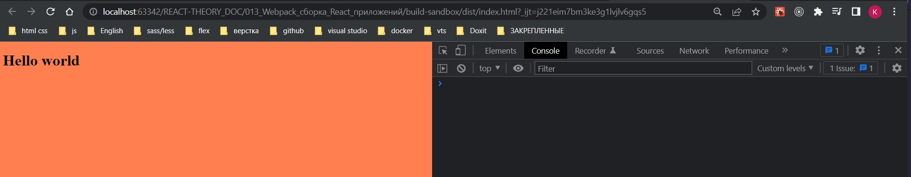

# 007_Композиция_Loader-ов

По своей идеалогии лоудеры в Webpack похожи на утилиты командной строки в Linux. Вместо того что бы пытаться покрыть все возможные сценарии одной супер мощьной утилиты разработчики создают несколько небольших утилит, а затем собирают из них сложные команды, передавая данные  от одной утилиты в другую.

Авторы loader-ов в webpack следуют такому же принципу. Намного проще писать и поддерживать лоудеры которые специализируются на одной не большой задаче, чем писать огромный лоудер который умеет делать вообще все.

Webpack предоствляет иструменты что бы комбинировать лоудеры и создавать из них довольно мощные цепочки.

Рассмотрим на примере css лоудера. 

Способы примернения css

```html
<!DOCTYPE html>
<html lang="en">
  <head>
    <meta charset="UTF-8" />
    <meta
      name="viewport"
      content="width=device-width, user-scalable=no, initial-scale=1.0, maximum-scale=1.0, minimum-scale=1.0"
    />
    <meta http-equiv="X-UA-Compatible" content="ie=edge" />
    <title>Document</title>
  </head>
  <body>
    <div id="root"></div>
    <script src="dist/main.js"></script>
  <stile>
<!--    здесь пишем css код-->
  </stile>
  </body>
</html>

```

С помощью подключения файла css

```html
<!DOCTYPE html>
<html lang="en">
  <head>
    <meta charset="UTF-8" />
    <meta
      name="viewport"
      content="width=device-width, user-scalable=no, initial-scale=1.0, maximum-scale=1.0, minimum-scale=1.0"
    />
    <meta http-equiv="X-UA-Compatible" content="ie=edge" />
    <title>Document</title>
    <link rel="stylesheet" href="./style.css" />
  </head>
  <body>
    <div id="root"></div>
    <script src="dist/main.js"></script>
  </body>
</html>

```

Но в некоторых случаях разработчикам нужно получить доступ к коду css прямо из js. Это например имеет смысл если вы например работаете с Angular.

Так вот сам по себе css-loader он не реализует ни одну из этих стратегий. Он занимается исключительно парсингом css. А добавлением css в контекст нашего приложения занимаются отдельные лоудеры которые реализуют одну из этих стратегий.

```css
body {
  background-color: coral;
}

```

```js
//src/index.js
import React from "react";
import ReactDOM from "react-dom/client";
import "./main.css";

const App = () => {
  return <h1>Hello world</h1>;
};

const root = ReactDOM.createRoot(document.getElementById("root"));
root.render(<App />);

```

И конечно если я сейчас запущу сборку, то все свалится т.к. webpack будет интерпретировать css файл как js файл.

Устанавливаю лоудер

```shell
npm install --save-dev css-loader
```

и добавляю правило для css в webpack.config.js

```js
module.exports = {
  mode: "development",
  module: {
    rules: [
      // Обработка JS
      {
        test: /\.(js)$/,
        //до обработки js файлов указываю исключение в поле exclude то что не нежно обрабатывать
        exclude: /node_modules/,
        use: [{ loader: "babel-loader" }],
      },
      // Загрузка картинок
      {
        test: /\.(png|jpg|jpeg|gif|ico)$/,
        use: [
          {
            loader: "file-loader",
            options: {
              outputPath: "images",
              name: "[name]-[sha1:hash:7].[ext]",
            },
          },
        ],
      },
      // Загрузка шрифтов
      {
        test: /\.(ttf|otf|eot|woof|woof2)$/,
        use: [
          {
            loader: "file-loader",
            options: {
              outputPath: "fonts",
              name: "[name].[ext]",
            },
          },
        ],
      },
      // Загрузка css
      { test: /\.css$/, use: [{ loader: "css-loader" }] },
    ],
  },
};

```

Теперь как минимкм наша сборка сработает. webpack будет значть что делать с css файлами, но css файлы не появятся на странице.

Посмотрим что вернет в объекте css  css-loader.

```js
//src/index.js
import React from "react";
import ReactDOM from "react-dom/client";
import css from "./main.css";

console.log(css.toString());

const App = () => {
  return <h1>Hello world</h1>;
};

const root = ReactDOM.createRoot(document.getElementById("root"));
root.render(<App />);

```


Для того что бы стили начали отображаться необходимо подключить еще один loader это style-loader.style-loader делает так что бы текст который мы получили из css добавлялся в виде  style блоков на страничку.

```shell
npm install --save-dev style-loader
```

Обратите внимание что блок use в наших правилах это массив. А это значит что в него можно передавать несколько лоудеров.

```js
module.exports = {
  mode: "development",
  module: {
    rules: [
      // Обработка JS
      {
        test: /\.(js)$/,
        //до обработки js файлов указываю исключение в поле exclude то что не нежно обрабатывать
        exclude: /node_modules/,
        use: [{ loader: "babel-loader" }],
      },
      // Загрузка картинок
      {
        test: /\.(png|jpg|jpeg|gif|ico)$/,
        use: [
          {
            loader: "file-loader",
            options: {
              outputPath: "images",
              name: "[name]-[sha1:hash:7].[ext]",
            },
          },
        ],
      },
      // Загрузка шрифтов
      {
        test: /\.(ttf|otf|eot|woof|woof2)$/,
        use: [
          {
            loader: "file-loader",
            options: {
              outputPath: "fonts",
              name: "[name].[ext]",
            },
          },
        ],
      },
      // Загрузка css
      {
        test: /\.css$/,
        use: [{ loader: "style-loader" }, { loader: "css-loader" }],
      },
    ],
  },
};

```

Теперь в загрузке css файлов будут участвовать не один, а два лоудера. Сначало сss файл пройдет через css-loader, азетем результат работы этого css-loader мы передадим в style-loader.

```js
//src/index.js
import React from "react";
import ReactDOM from "react-dom/client";
import "./main.css";

const App = () => {
  return <h1>Hello world</h1>;
};

const root = ReactDOM.createRoot(document.getElementById("root"));
root.render(<App />);

```

И пересобираю проект.



Обратите внимание что порядок лоудеров имеет значение. Он точно такой же как в функции compose в Redux. Т.е. сначало срабатывает самый последний лоудер, затем он передает результат предпоследнему и т.д.


