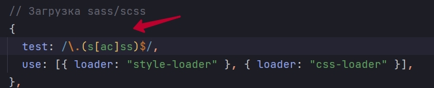
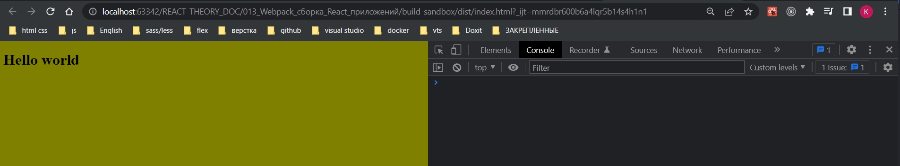
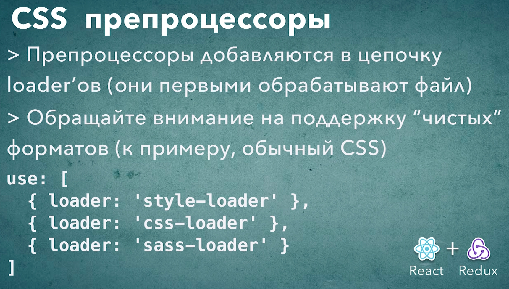

# 008_CSS_препроцессоры_SASS

Посмотрим как мы можем использовать препроцессов в нашем проекте и заодно вспомним как работают цепочки loader-ов  в webpack. 

Переименовываю расширение файла. И после этого то регулярное выражение которое мы прописали ранее, оно подходит для css файлов, но не подходит для scss.

```js
//src/index.js
import React from "react";
import ReactDOM from "react-dom/client";
import "./main.scss";

const App = () => {
  return <h1>Hello world</h1>;
};

const root = ReactDOM.createRoot(document.getElementById("root"));
root.render(<App />);

```

А в файле scss добавлю переменную.

```scss
$body-color: olive;

body {
  background-color: $body-color;
}

```

В случае с sass и scss нам не будет достаточно только sass-loader. Нам понадобиться еще один модуль который называется node-sass

```shell
npm install --save-dev node-sass sass-loader
```

sass-loader зависит от node-sass. node-sass - это собственно сам движок который производит эти преобразования из scss в css.

Часто бывает так что кроме вашего собственного кода вы используете сторонние библиотеки которые могут подключать свой css. По этому копирую блок правил и создаю отдельный блок правил для scss.

Если вы хотите поддержать оба диалекта то пишем вот такое выражение.



И как вы помните порядок лоудеров имеет значение.

```js
module.exports = {
  mode: "development",
  module: {
    rules: [
      // Обработка JS
      {
        test: /\.(js)$/,
        //до обработки js файлов указываю исключение в поле exclude то что не нежно обрабатывать
        exclude: /node_modules/,
        use: [{ loader: "babel-loader" }],
      },
      // Загрузка картинок
      {
        test: /\.(png|jpg|jpeg|gif|ico)$/,
        use: [
          {
            loader: "file-loader",
            options: {
              outputPath: "images",
              name: "[name]-[sha1:hash:7].[ext]",
            },
          },
        ],
      },
      // Загрузка шрифтов
      {
        test: /\.(ttf|otf|eot|woof|woof2)$/,
        use: [
          {
            loader: "file-loader",
            options: {
              outputPath: "fonts",
              name: "[name].[ext]",
            },
          },
        ],
      },
      // Загрузка css
      {
        test: /\.css$/,
        use: [{ loader: "style-loader" }, { loader: "css-loader" }],
      },
      // Загрузка sass/scss
      {
        test: /\.(s[ac]ss)$/,
        use: [
          { loader: "style-loader" },
          { loader: "css-loader" },
          { loader: "sass-loader" },
        ],
      },
    ],
  },
};

```

sass-loader обработает scss код и преобразует его в css, результат передаст в css-loader который преобразует стили в строки, а уже  style-loader добавляет css код на страницу.






