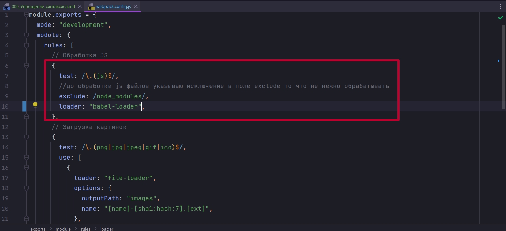
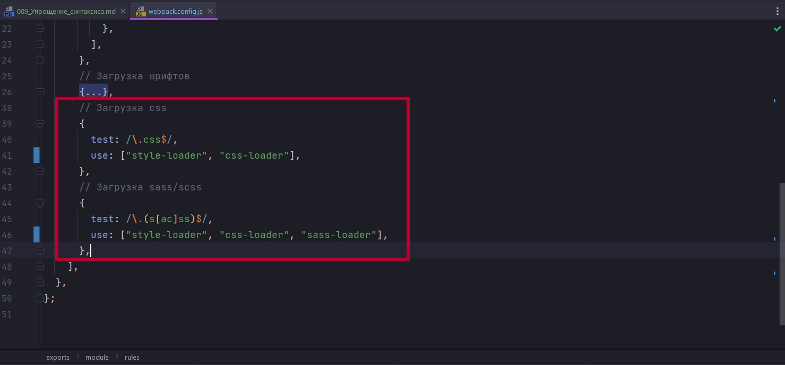
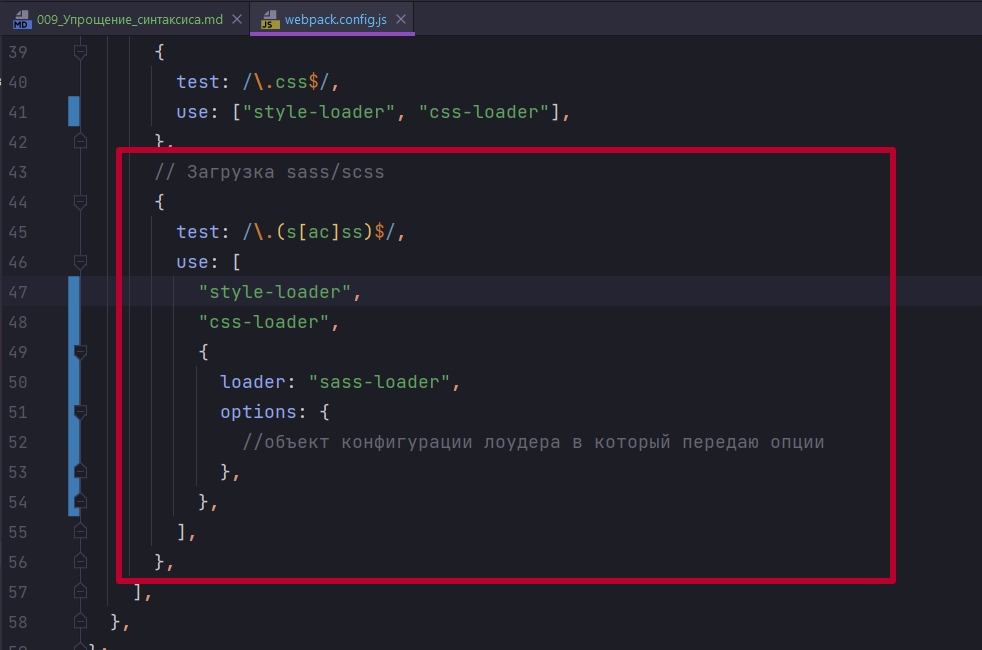
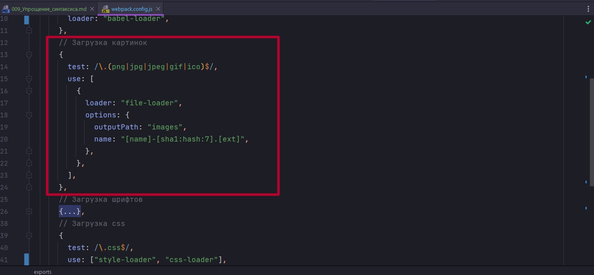
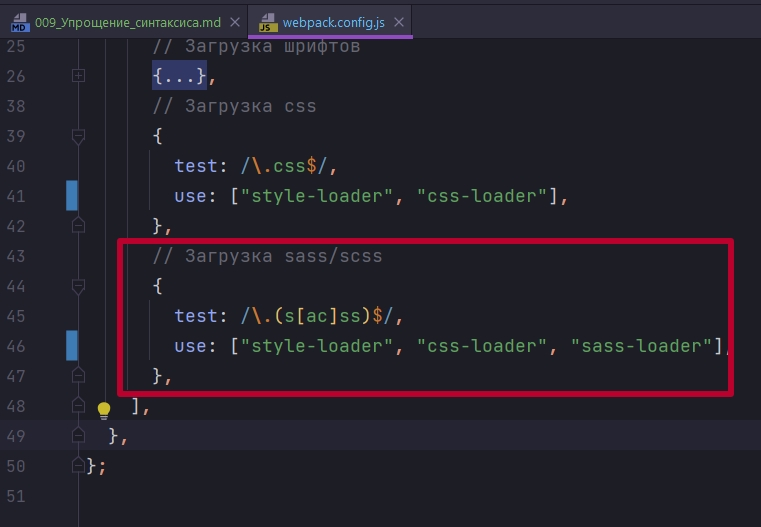
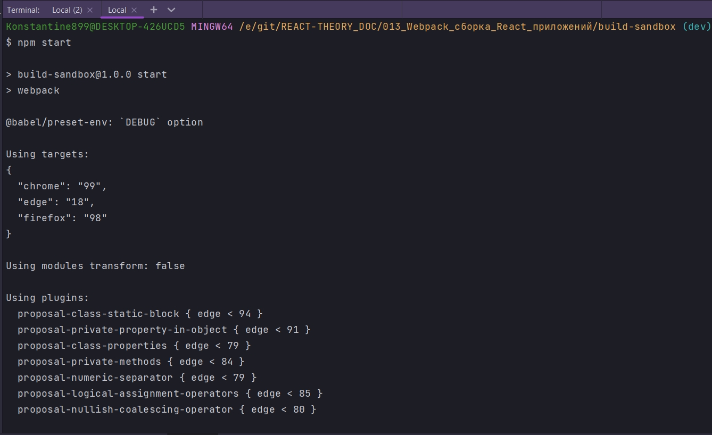
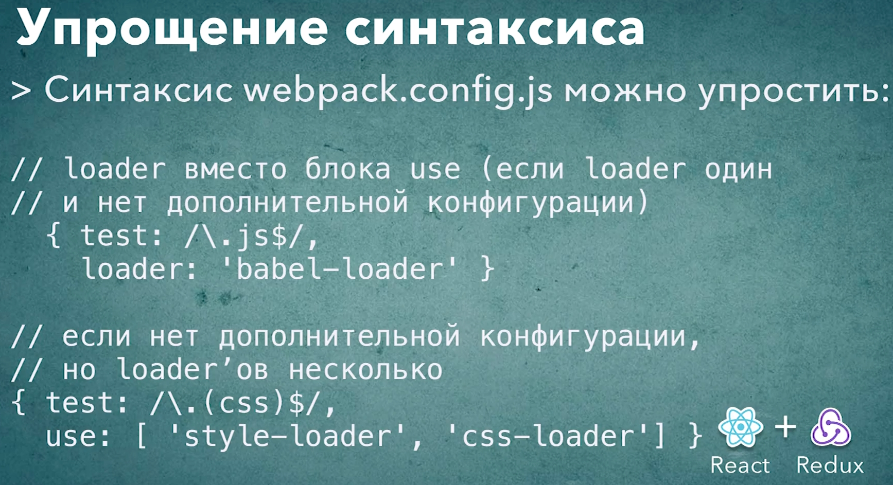

# 009_Упрощение_синтаксиса

В этом видео мы посмотрим как немножко можно упростить и сократить конфигурацию. Все дело в то м что в прошлом видео мы использовали самую полную форму блока use. Т.е. use мы передавали отдельно объект в котором указывали loader и options.

Но мы можем сократить этот синтаксис и сделать его намного компактнее. К примеру как в случае с js настройками, мы используем один loader, и у этого лоудера нет дополнительных опций, дополнительной конфигурации, мы можем не использовать блок use вообще. А вместо этого сразу поставить название лоадера.



Теперь смотрим на блоки где мы загружаем css и scss. В этом случае мы тоже можем передавать просто строки, если у лоадера нет дополнительных опций.



Обратите внимание. Если позже нам понадобиться передать дополнительне опции к примеру в sass-loader, то мы можем для sass-loader сделать объект и здесь добавить options только для этого лоадера. При этом другие лоудеры оставить в виде обычныз строк.



```js
module.exports = {
  mode: "development",
  module: {
    rules: [
      // Обработка JS
      {
        test: /\.(js)$/,
        //до обработки js файлов указываю исключение в поле exclude то что не нежно обрабатывать
        exclude: /node_modules/,
        loader: "babel-loader",
      },
      // Загрузка картинок
      {
        test: /\.(png|jpg|jpeg|gif|ico)$/,
        use: [
          {
            loader: "file-loader",
            options: {
              outputPath: "images",
              name: "[name]-[sha1:hash:7].[ext]",
            },
          },
        ],
      },
      // Загрузка шрифтов
      {
        test: /\.(ttf|otf|eot|woof|woof2)$/,
        use: [
          {
            loader: "file-loader",
            options: {
              outputPath: "fonts",
              name: "[name].[ext]",
            },
          },
        ],
      },
      // Загрузка css
      {
        test: /\.css$/,
        use: ["style-loader", "css-loader"],
      },
      // Загрузка sass/scss
      {
        test: /\.(s[ac]ss)$/,
        use: ["style-loader", "css-loader", "sass-loader"],
      },
    ],
  },
};

```

ИТОГ: Когда вы работаете с webpack.config.js у вас есть несколько способов как вы можете указать цепочку лоудеров, или один лоудер который будет обрабатывать определенный тип файла. 

Самая длинная сапись которую мы можем себе предствить это блок use и в этом блоке будет массив объектов или строк. Если это маассив объектов, то в этом объекте должен было loader и возможные options этого лоудера.



Но если у нас нет опций, мы можем в use просто передать массив со строками





Хоть тут и видно только что сработал babel, но и webpack норм сработал.




