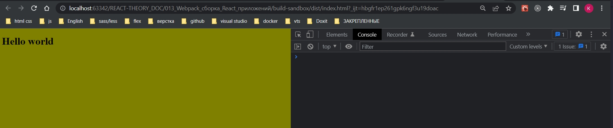
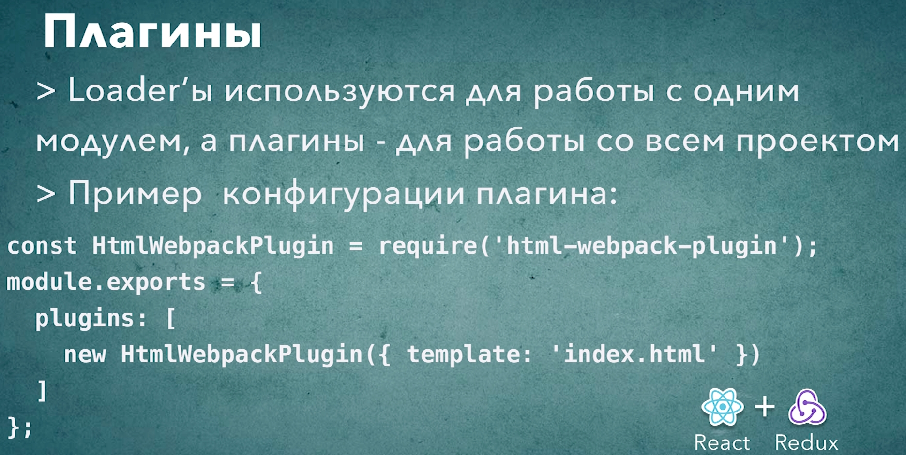

# 010_Плагины

Лоудеры в webpack отвечают за трансфармацию и загрузку модулей.

Ну а плагины позволяют выполнять действия которые касаются не одного конкретного модуля, а всего проекта. 

Например можно собрать все маленькие изображения из проекта и объеденить их в один sprite, что бы загружать один файл вместо десятка файлов.

Можно собрать все фрагменты css из всего проекта и сохранить их в один оптимизированный css файл.

Бывают и другие плагины которые не изменяют результирующие файлы, но позволяют проанализировать упакованное приложение.

Вот один из полезных плагинов <https://www.npmjs.com/package/webpack-bundle-analyzer> который позволяет понять почему ваш build стал весить пять мигабайт.


Вопрос чем же отличаются плагины от лоудеров в webpack? это довольно частый вопрос.

Лоудеры работают с конкретным файлом с конкретным модулем.

Плагины работают со всем приложением.

Для того что бы начать знакомство с плагинами, автоматизируем еще один шаг. Это копирование index.html.

Плагины как и лоудеры это обычные npm пакеты.

```shell
npm install --save-dev html-webpack-plugin
```

Для того что бы создать плагины нам нужно создать отдельный блок. Этот блок идет после блока module в котором мы описываем роботу с лоудерами. И называется этот блок plugins.

Плагинов в одном проекте обычно много, по этому это массив, в который мы передадим объекты с плагинами.

ОБРАТИТЬЕ ВНИМАНИЕ!!! Плагины конфигурируются не так же как и лоудеры. Для лоудера мы просто указываем их название. В случае с плагином нам нужно проимпортировать плагин в наш билд. При импорте использую require так как я работаю в среде Node.js.

В результате я получаю класс плагина htmlWebpackPlugin. И нам нужно передать новый объект этого класса для того что бы webpack начал работать с этим плагином.

```js
//Импортирую плагины
const HtmlWebpackPlugin = require("html-webpack-plugin");

module.exports = {
  mode: "development",

  // Лоудеры
  module: {
    rules: [
      // Обработка JS
      {
        test: /\.(js)$/,
        //до обработки js файлов указываю исключение в поле exclude то что не нежно обрабатывать
        exclude: /node_modules/,
        loader: "babel-loader",
      },
      // Загрузка картинок
      {
        test: /\.(png|jpg|jpeg|gif|ico)$/,
        use: [
          {
            loader: "file-loader",
            options: {
              outputPath: "images",
              name: "[name]-[sha1:hash:7].[ext]",
            },
          },
        ],
      },
      // Загрузка шрифтов
      {
        test: /\.(ttf|otf|eot|woof|woof2)$/,
        use: [
          {
            loader: "file-loader",
            options: {
              outputPath: "fonts",
              name: "[name].[ext]",
            },
          },
        ],
      },
      // Загрузка css
      {
        test: /\.css$/,
        use: ["style-loader", "css-loader"],
      },
      // Загрузка sass/scss
      {
        test: /\.(s[ac]ss)$/,
        use: ["style-loader", "css-loader", "sass-loader"],
      },
    ],
  },
  //Плагины
  plugins: [new HtmlWebpackPlugin()],
};

```

Удаляю дирректорию dist и проверяю.

И вот сгененрированный html.

```html
<!DOCTYPE html>
<html>
  <head>
    <meta charset="utf-8">
    <title>Webpack App</title>
  <meta name="viewport" content="width=device-width, initial-scale=1"><script defer src="main.js"></script></head>
  <body>
  </body>
</html>
```

Первый интересный момент - это не тот html который был в нашей корневой дирректории. Вот он.

```html
<!DOCTYPE html>
<html lang="en">
  <head>
    <meta charset="UTF-8" />
    <meta
      name="viewport"
      content="width=device-width, user-scalable=no, initial-scale=1.0, maximum-scale=1.0, minimum-scale=1.0"
    />
    <meta http-equiv="X-UA-Compatible" content="ie=edge" />
    <title>Document</title>
  </head>
  <body>
    <div id="root"></div>
    <script src="dist/main.js"></script>
  </body>
</html>

```

Отличается title, у нас был div с id='root' - этот div нужен для того что бы работало наше react приложение. Ну и в новом index.html этого div нет и по этому наше приложение не заработает.


Все очень просто. По умолчанию htmlWebpackPlugin не будет копировать index.html из корневой дирректории. Вместо этого он будет создавать новый файл в котором он будет генерировать теги script которые будут ссылаться на наш build т.е. main.js

Для того что бы использовать наш файл index.html в плагин нужно будет передать не большой объект с конфигурацией.

И в случае с плагинами конфигурация работает намножко иначе чем с лоудерами. 

Для того что бы передать конфигурацию нам нужно передать объект в конструктор класса. В объекте первым полем указываю тот шаблон который нужно преобразовать. В поле template передаю название файла.

```js
//Импортирую плагины
const HtmlWebpackPlugin = require("html-webpack-plugin");

module.exports = {
  mode: "development",

  // Лоудеры
  module: {
    rules: [
      // Обработка JS
      {
        test: /\.(js)$/,
        //до обработки js файлов указываю исключение в поле exclude то что не нежно обрабатывать
        exclude: /node_modules/,
        loader: "babel-loader",
      },
      // Загрузка картинок
      {
        test: /\.(png|jpg|jpeg|gif|ico)$/,
        use: [
          {
            loader: "file-loader",
            options: {
              outputPath: "images",
              name: "[name]-[sha1:hash:7].[ext]",
            },
          },
        ],
      },
      // Загрузка шрифтов
      {
        test: /\.(ttf|otf|eot|woof|woof2)$/,
        use: [
          {
            loader: "file-loader",
            options: {
              outputPath: "fonts",
              name: "[name].[ext]",
            },
          },
        ],
      },
      // Загрузка css
      {
        test: /\.css$/,
        use: ["style-loader", "css-loader"],
      },
      // Загрузка sass/scss
      {
        test: /\.(s[ac]ss)$/,
        use: ["style-loader", "css-loader", "sass-loader"],
      },
    ],
  },
  //Плагины
  plugins: [
    new HtmlWebpackPlugin({
      template: "index.html",
    }),
  ],
};

```

Можно пойти еще на шаг дальше и сделать наше приложение таким же как в create-react-app. В create-react-app создается папка public и в этой папке храниться index.html. После чего в конструкторе класса плагина в поле template нужно обновить путь.

```js
//Импортирую плагины
const HtmlWebpackPlugin = require("html-webpack-plugin");

module.exports = {
  mode: "development",

  // Лоудеры
  module: {
    rules: [
      // Обработка JS
      {
        test: /\.(js)$/,
        //до обработки js файлов указываю исключение в поле exclude то что не нежно обрабатывать
        exclude: /node_modules/,
        loader: "babel-loader",
      },
      // Загрузка картинок
      {
        test: /\.(png|jpg|jpeg|gif|ico)$/,
        use: [
          {
            loader: "file-loader",
            options: {
              outputPath: "images",
              name: "[name]-[sha1:hash:7].[ext]",
            },
          },
        ],
      },
      // Загрузка шрифтов
      {
        test: /\.(ttf|otf|eot|woof|woof2)$/,
        use: [
          {
            loader: "file-loader",
            options: {
              outputPath: "fonts",
              name: "[name].[ext]",
            },
          },
        ],
      },
      // Загрузка css
      {
        test: /\.css$/,
        use: ["style-loader", "css-loader"],
      },
      // Загрузка sass/scss
      {
        test: /\.(s[ac]ss)$/,
        use: ["style-loader", "css-loader", "sass-loader"],
      },
    ],
  },
  //Плагины
  plugins: [
    new HtmlWebpackPlugin({
      template: "public/index.html",
    }),
  ],
};

```

htmlWebpackPlugin достаточно умный для того что бы самостоятельно установить тег script. По этому я в исходящем файле public/index.html удалю этот script.

```html
<!DOCTYPE html>
<html lang="en">
  <head>
    <meta charset="UTF-8" />
    <meta
      name="viewport"
      content="width=device-width, user-scalable=no, initial-scale=1.0, maximum-scale=1.0, minimum-scale=1.0"
    />
    <meta http-equiv="X-UA-Compatible" content="ie=edge" />
    <title>Document</title>
  </head>
  <body>
    <div id="root"></div>
  </body>
</html>

```

Пересобираю проект.

Иду в дирректорию dist/index.html. И да это теперь наш файл.

```html
<!DOCTYPE html>
<html lang="en">
  <head>
    <meta charset="UTF-8" />
    <meta
      name="viewport"
      content="width=device-width, user-scalable=no, initial-scale=1.0, maximum-scale=1.0, minimum-scale=1.0"
    />
    <meta http-equiv="X-UA-Compatible" content="ie=edge" />
    <title>Document</title>
  <script defer src="main.js"></script></head>
  <body>
    <div id="root"></div>
  </body>
</html>

```






