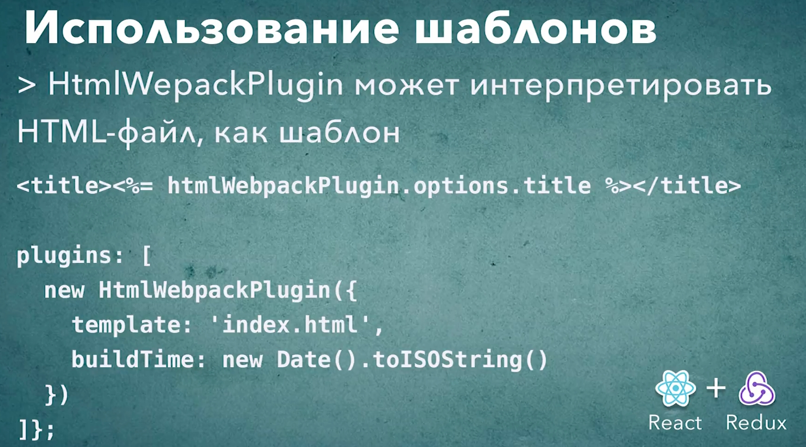

# 011_HtmlWebpackPlugin_использование_шаблонов

А теперь еще один очень важный и интересный аспект. Класс HtmlWebpackPlugin который мы передаем в блок plugins, он работает не как статический html файл, а как шаблон. Т.е. HtmlWebpackPlugin сможет динамически его интерпретировать и заменять определеныые блоки этого файла на какие-нибудт выражения или значения каких-нибудь переменных.

Самый простой пример прямо из документации это title. Мы можем динамически устанавливать title для нашего приложения.

```js
//Импортирую плагины
const HtmlWebpackPlugin = require("html-webpack-plugin");

module.exports = {
  mode: "development",

  // Лоудеры
  module: {
    rules: [
      // Обработка JS
      {
        test: /\.(js)$/,
        //до обработки js файлов указываю исключение в поле exclude то что не нежно обрабатывать
        exclude: /node_modules/,
        loader: "babel-loader",
      },
      // Загрузка картинок
      {
        test: /\.(png|jpg|jpeg|gif|ico)$/,
        use: [
          {
            loader: "file-loader",
            options: {
              outputPath: "images",
              name: "[name]-[sha1:hash:7].[ext]",
            },
          },
        ],
      },
      // Загрузка шрифтов
      {
        test: /\.(ttf|otf|eot|woof|woof2)$/,
        use: [
          {
            loader: "file-loader",
            options: {
              outputPath: "fonts",
              name: "[name].[ext]",
            },
          },
        ],
      },
      // Загрузка css
      {
        test: /\.css$/,
        use: ["style-loader", "css-loader"],
      },
      // Загрузка sass/scss
      {
        test: /\.(s[ac]ss)$/,
        use: ["style-loader", "css-loader", "sass-loader"],
      },
    ],
  },
  //Плагины
  plugins: [
    new HtmlWebpackPlugin({
      title: "Hello World",
      template: "public/index.html",
    }),
  ],
};

```

Перехожу в public/index.html. И вот такой вот синтаксис шаблонов. 

```html
<!DOCTYPE html>
<html lang="en">
  <head>
    <meta charset="UTF-8" />
    <meta
      name="viewport"
      content="width=device-width, user-scalable=no, initial-scale=1.0, maximum-scale=1.0, minimum-scale=1.0"
    />
    <meta http-equiv="X-UA-Compatible" content="ie=edge" />
    <title><%= htmlWebpackPlugin.options.title%></title>
  </head>
  <body>
    <div id="root"></div>
  </body>
</html>

```

Через htmlWebpackPlugin получаю доступ к объекту options из которого вытаскиваю нужное мне поле title.

Пересобираю проект. И вот в dist/index.html

```html
<!DOCTYPE html>
<html lang="en">
  <head>
    <meta charset="UTF-8" />
    <meta
      name="viewport"
      content="width=device-width, user-scalable=no, initial-scale=1.0, maximum-scale=1.0, minimum-scale=1.0"
    />
    <meta http-equiv="X-UA-Compatible" content="ie=edge" />
    <title>Hello World</title>
  <script defer src="main.js"></script></head>
  <body>
    <div id="root"></div>
  </body>
</html>

```

Может возникнуть вопрос. Зачем это нужно если title можно и так указать в html документе? Мы собственно ничего не получили, только усложнили конфигурацию.

Все дело в том что вмомент исполнения конфигурации мы находимся в Node.js и затем мы можем использовать совершено любые переменные которые доступны в окружении, которые доступны в момент сборки.

Например используюя это удобное свойство мы можем указать информацию о том когда именно был создана эта сборка.

```js
//Импортирую плагины
const HtmlWebpackPlugin = require("html-webpack-plugin");

module.exports = {
  mode: "development",

  // Лоудеры
  module: {
    rules: [
      // Обработка JS
      {
        test: /\.(js)$/,
        //до обработки js файлов указываю исключение в поле exclude то что не нежно обрабатывать
        exclude: /node_modules/,
        loader: "babel-loader",
      },
      // Загрузка картинок
      {
        test: /\.(png|jpg|jpeg|gif|ico)$/,
        use: [
          {
            loader: "file-loader",
            options: {
              outputPath: "images",
              name: "[name]-[sha1:hash:7].[ext]",
            },
          },
        ],
      },
      // Загрузка шрифтов
      {
        test: /\.(ttf|otf|eot|woof|woof2)$/,
        use: [
          {
            loader: "file-loader",
            options: {
              outputPath: "fonts",
              name: "[name].[ext]",
            },
          },
        ],
      },
      // Загрузка css
      {
        test: /\.css$/,
        use: ["style-loader", "css-loader"],
      },
      // Загрузка sass/scss
      {
        test: /\.(s[ac]ss)$/,
        use: ["style-loader", "css-loader", "sass-loader"],
      },
    ],
  },
  //Плагины
  plugins: [
    new HtmlWebpackPlugin({
      title: "Hello World",
      buildTime: new Date().toString(),
      template: "public/index.html",
    }),
  ],
};

```

```html
<!DOCTYPE html>
<html lang="en">
  <head>
    <meta charset="UTF-8" />
    <meta
      name="viewport"
      content="width=device-width, user-scalable=no, initial-scale=1.0, maximum-scale=1.0, minimum-scale=1.0"
    />
    <meta http-equiv="X-UA-Compatible" content="ie=edge" />
    <title><%= htmlWebpackPlugin.options.title%></title>
  </head>
  <body>
    <div id="root"></div>
    <div><%= htmlWebpackPlugin.options.buildTime%></div>
  </body>
</html>

```

И вот сгенерированный файл dist/index.html

```html
<!DOCTYPE html>
<html lang="en">
  <head>
    <meta charset="UTF-8" />
    <meta
      name="viewport"
      content="width=device-width, user-scalable=no, initial-scale=1.0, maximum-scale=1.0, minimum-scale=1.0"
    />
    <meta http-equiv="X-UA-Compatible" content="ie=edge" />
    <title>Hello World</title>
  <script defer src="main.js"></script></head>
  <body>
    <div id="root"></div>
    <div>Tue Apr 26 2022 14:35:31 GMT+0300 (Москва, стандартное время)</div>
  </body>
</html>

```

Конечно в идеальном варианте можно было бы добавить немножко более подробной информации и хэш коммита в гит из которого эта сборка собственно произошла.




