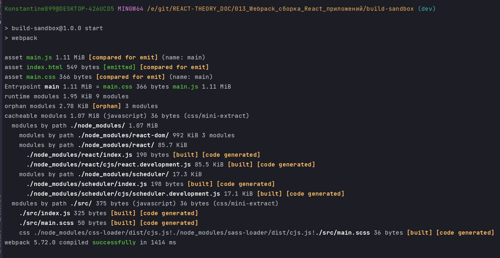
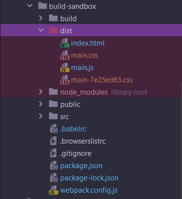
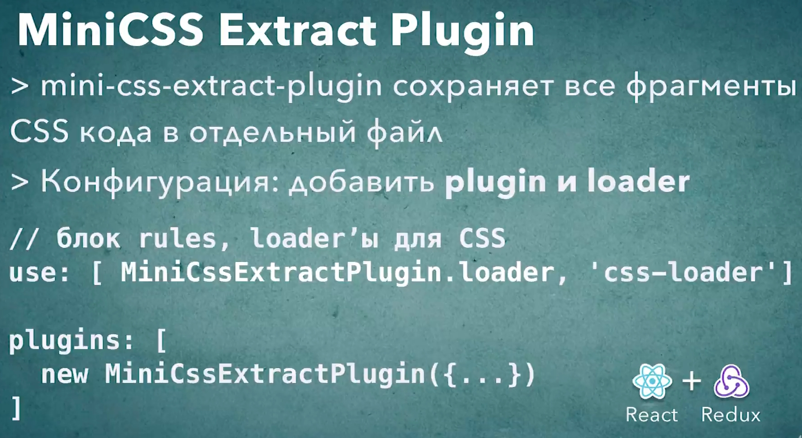

# 012_Mini_CSS_Extract_Plugin

В прошлых уроках мы уже научились как конфигурировать загрузку css. Но в наших цепочках css лоудеров стоит style-loader. Он сохраняет css код в js файле а затем, во время исполнения, добавляет блоки style на страницу. Эта стратегия отлично подходит для разработки. Но для production сборки это не годится.

В реальных проектах css код нужно вынести в отдельный файл и загрузить его при момощи тега link.

Поможет нам в этом деле mini-css-extract-plugin <https://www.npmjs.com/package/mini-css-extract-plugin>.

Этот плагин делает то что нам нужно. Он извлекает css код в отдельные файлы, а затем добавляет ссылки на эти файлы в html документ.

```shell
npm install --save-dev mini-css-extract-plugin
```

Импортирую плагин в файл конфигурации. И сохраняю созданный объект в массиве plugins т.е. инициализирую класс в нем.

В отличие от лоудеров, порядок определения плагинов значения не имеет.

Кроме добавления самого плагина нам нужно обновить список лоудеров. Нам больше не понадобится style-loader который мы использовали до этого. Вместо него мы подставим loader который идет в комплекте с плагином MiniCssExtractPlugin

```js
//Импортирую плагины
const HtmlWebpackPlugin = require("html-webpack-plugin");
const MiniCssExtractPlugin = require("mini-css-extract-plugin");

module.exports = {
  mode: "development",

  // Лоудеры
  module: {
    rules: [
      // Обработка JS
      {
        test: /\.(js)$/,
        //до обработки js файлов указываю исключение в поле exclude то что не нежно обрабатывать
        exclude: /node_modules/,
        loader: "babel-loader",
      },
      // Загрузка картинок
      {
        test: /\.(png|jpg|jpeg|gif|ico)$/,
        use: [
          {
            loader: "file-loader",
            options: {
              outputPath: "images",
              name: "[name]-[sha1:hash:7].[ext]",
            },
          },
        ],
      },
      // Загрузка шрифтов
      {
        test: /\.(ttf|otf|eot|woof|woof2)$/,
        use: [
          {
            loader: "file-loader",
            options: {
              outputPath: "fonts",
              name: "[name].[ext]",
            },
          },
        ],
      },
      // Загрузка css
      {
        test: /\.css$/,
        use: [MiniCssExtractPlugin.loader, "css-loader"],
      },
      // Загрузка sass/scss
      {
        test: /\.(s[ac]ss)$/,
        use: [MiniCssExtractPlugin.loader, "css-loader", "sass-loader"],
      },
    ],
  },
  //Плагины
  plugins: [
    new HtmlWebpackPlugin({
      title: "Hello World",
      buildTime: new Date().toString(),
      template: "public/index.html",
    }),
    new MiniCssExtractPlugin(),
  ],
};

```

Проверяю



Смотрю dist/main.css

```css
/*!********************************************************************************************************!*\
  !*** css ./node_modules/css-loader/dist/cjs.js!./node_modules/sass-loader/dist/cjs.js!./src/main.scss ***!
  \********************************************************************************************************/
body {
  background-color: olive; }


```

MiniCssExtractPlugin так же можно конфигурировать и передать options в конструктор. Например в этой конфигурации можно указать каким будет имя файла который мы сохраним. Имя main.css будет очень агресивно кешироваться браузерами. Если мы захотим обновить наш css и он будет тоже называться main.css, то браузеры наших клиентов будут считать что файл не поменялся и не будут пытаться перезагрузить его с сервера. Соответственно обновить файл для наших клиентов будет настоящей проблемой. Но если мы добавим к имени hash. То имя будет изменятся при каждой сборке приложения.

```js
//Импортирую плагины
const HtmlWebpackPlugin = require("html-webpack-plugin");
const MiniCssExtractPlugin = require("mini-css-extract-plugin");

module.exports = {
  mode: "development",

  // Лоудеры
  module: {
    rules: [
      // Обработка JS
      {
        test: /\.(js)$/,
        //до обработки js файлов указываю исключение в поле exclude то что не нежно обрабатывать
        exclude: /node_modules/,
        loader: "babel-loader",
      },
      // Загрузка картинок
      {
        test: /\.(png|jpg|jpeg|gif|ico)$/,
        use: [
          {
            loader: "file-loader",
            options: {
              outputPath: "images",
              name: "[name]-[sha1:hash:7].[ext]",
            },
          },
        ],
      },
      // Загрузка шрифтов
      {
        test: /\.(ttf|otf|eot|woof|woof2)$/,
        use: [
          {
            loader: "file-loader",
            options: {
              outputPath: "fonts",
              name: "[name].[ext]",
            },
          },
        ],
      },
      // Загрузка css
      {
        test: /\.css$/,
        use: [MiniCssExtractPlugin.loader, "css-loader"],
      },
      // Загрузка sass/scss
      {
        test: /\.(s[ac]ss)$/,
        use: [MiniCssExtractPlugin.loader, "css-loader", "sass-loader"],
      },
    ],
  },
  //Плагины
  plugins: [
    new HtmlWebpackPlugin({
      title: "Hello World",
      buildTime: new Date().toString(),
      template: "public/index.html",
    }),
    new MiniCssExtractPlugin({
      filename: "main-[hash:8].css",
    }),
  ],
};

```

Пересобираю проект.



```html
<!DOCTYPE html>
<html lang="en">
  <head>
    <meta charset="UTF-8" />
    <meta
      name="viewport"
      content="width=device-width, user-scalable=no, initial-scale=1.0, maximum-scale=1.0, minimum-scale=1.0"
    />
    <meta http-equiv="X-UA-Compatible" content="ie=edge" />
    <title>Hello World</title>
  <script defer src="main.js"></script><link href="main-7e25ed65.css" rel="stylesheet"></head>
  <body>
    <div id="root"></div>
    <div>Tue Apr 26 2022 15:18:22 GMT+0300 (Москва, стандартное время)</div>
  </body>
</html>

```

Если я изменю стили и пересоберу проект у меня сгенерируется новый файл стилей который будет содержать изменненные стили и новый хэш в имени. Так же в index.html сгенерируется ссылка на новый файл стилей. Но старый при этом файл стилей не удаляется.

MiniCssExtractPlugin удобно использовать в production сборке. Если вы собираете для разработки то обычный style-loader который мы использовали до этого будет отлично работать.




