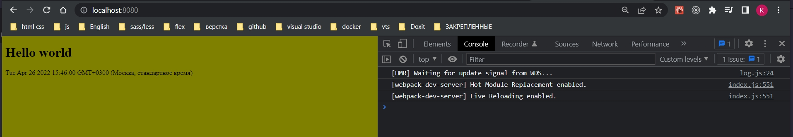

# 013_Webpack_Dev_Server

Сейчас если нам нужно увидить изменения которые мы внесли мы должны пересобирать проект.

За такое удобное поведение которое мы используем в create-react-app, которое сохраняет бесчисленное количество времени во время разработки. Отвечает не большая, но очень полезная утилита <https://github.com/webpack/webpack-dev-server>.

webpack-dev-server - это не плагин и не лоудер. Это отдельная утилита которая самостоятельно запускает webpack сборку. Т.е. webpack-dev-server главнее webpack. webpack-dev-server запускает webpack, мониторит изменения в файловой системе и знает когда этот build нужно перезагрузить.

```shell
npm install webpack-dev-server --save-dev
```

Для того что бы его запустить возвращаюсь в package.json и изменяю скрипт запуска.

```json
{
  "name": "build-sandbox",
  "version": "1.0.0",
  "description": "Sandbox to play with React build tools",
  "main": "index.js",
  "scripts": {
    "start": "webpack-dev-server",
    "test": "echo \"Error: no test specified\" && exit 1"
  },
  "author": "Konstantin Atroshchenko <kostay375298918971@gmail.com>",
  "license": "ISC",
  "devDependencies": {
    "@babel/cli": "^7.17.6",
    "@babel/core": "^7.17.9",
    "@babel/plugin-proposal-class-properties": "^7.16.7",
    "@babel/plugin-transform-block-scoping": "^7.16.7",
    "@babel/plugin-transform-classes": "^7.16.7",
    "@babel/plugin-transform-template-literals": "^7.16.7",
    "@babel/preset-env": "^7.16.11",
    "@babel/preset-react": "^7.16.7",
    "babel-loader": "^8.2.5",
    "css-loader": "^6.7.1",
    "file-loader": "^6.2.0",
    "html-webpack-plugin": "^5.5.0",
    "mini-css-extract-plugin": "^2.6.0",
    "node-sass": "^7.0.1",
    "sass-loader": "^12.6.0",
    "style-loader": "^3.3.1",
    "webpack": "^5.72.0",
    "webpack-cli": "^4.9.2",
    "webpack-dev-server": "^4.8.1"
  },
  "dependencies": {
    "core-js": "^3.22.2",
    "react": "^18.0.0",
    "react-dom": "^18.0.0"
  }
}

```


Как видим webpack-dev-server мониторит файловую систему.

Для того что бы увидить наше приложение сначало нужно узнать на каком порту запустилось приложение. И это я смотрю в самом начале логов




Изменю файлы.

```js
//src/index.js
import React from "react";
import ReactDOM from "react-dom/client";
import "./main.scss";

const App = () => {
  return <h1>This is Webpack React App</h1>;
};

const root = ReactDOM.createRoot(document.getElementById("root"));
root.render(<App />);

```

```scss
$body-color: coral;

body {
  background-color: $body-color;
}
```


Теперь еще один интересный факт. Останавливаю webpack-dev-server и удаляю папку dist. Перезапускаю webpack-dev-server и папка dist не появляется в проекте сколько бы я не вносил изменений.

Но как проект работает?

Все очень просто webpack-dev-server собирает проект и хранит его в пямяти компьютера, он не сохраняет проект физически на жесткий диск. Это удобно сразу по двум причинам. 

Во-первых такая стратегия работает куда быстрее поскоьку оперативная память существенне быстрее чем жесткий диск.

Ну а во-вторых мы н создаем огромное количество файлов с очень коротким жизненным циклом. Поскольку кода мы активно разрабатываем приложение мы меняем файлы очень часто. Билды перезапускаются каждые пару секунд. И создавать каждый раз новые файлы это не практично.

Возвращаюсь в package.json.

Я бы всетаки не хотел бы терять наш предыдущий билд поскольку иногда мне может захотеться все таки собрать мое прилоение так что бы эти файлы можно было переслат куда-нибудь на сервер и запустить их с моего хостинга.

Создаю еще один скрипт build и здесь просто запущу webpack.

```json
{
  "name": "build-sandbox",
  "version": "1.0.0",
  "description": "Sandbox to play with React build tools",
  "main": "index.js",
  "scripts": {
    "start": "webpack-dev-server",
    "build": "webpack",
    "test": "echo \"Error: no test specified\" && exit 1"
  },
  "author": "Konstantin Atroshchenko <kostay375298918971@gmail.com>",
  "license": "ISC",
  "devDependencies": {
    "@babel/cli": "^7.17.6",
    "@babel/core": "^7.17.9",
    "@babel/plugin-proposal-class-properties": "^7.16.7",
    "@babel/plugin-transform-block-scoping": "^7.16.7",
    "@babel/plugin-transform-classes": "^7.16.7",
    "@babel/plugin-transform-template-literals": "^7.16.7",
    "@babel/preset-env": "^7.16.11",
    "@babel/preset-react": "^7.16.7",
    "babel-loader": "^8.2.5",
    "css-loader": "^6.7.1",
    "file-loader": "^6.2.0",
    "html-webpack-plugin": "^5.5.0",
    "mini-css-extract-plugin": "^2.6.0",
    "node-sass": "^7.0.1",
    "sass-loader": "^12.6.0",
    "style-loader": "^3.3.1",
    "webpack": "^5.72.0",
    "webpack-cli": "^4.9.2",
    "webpack-dev-server": "^4.8.1"
  },
  "dependencies": {
    "core-js": "^3.22.2",
    "react": "^18.0.0",
    "react-dom": "^18.0.0"
  }
}

```

теперь если я наберу  npm start то запуститься webpack-dev-server и я буду как бы работать в режиме разработчика.

Но если я запущу команду npm run build, то запуститься обычный webpack который запустит приложение и сохранит файлы в папку dist.

При запуске run обязательно!!!! Простой запуск npm  build у меня ни к чему не привел.

Дело в том что npm build это другая команда которая делает совершенно другие вещи.


Не смотря на то что webpack-dev-server это не плагин и не лоудер, его все равно можно конфигурировать.

Если посмотреть на официальную документацию <https://webpack.js.org/configuration/dev-server/> это один из самых огромных блоков конфигурации в документации webpack.

Первый параметр open -это автоматически открывать браузер когда мы делаем сборку.

```js
//Импортирую плагины
const HtmlWebpackPlugin = require("html-webpack-plugin");
const MiniCssExtractPlugin = require("mini-css-extract-plugin");

module.exports = {
  mode: "development",

  // Лоудеры
  module: {
    rules: [
      // Обработка JS
      {
        test: /\.(js)$/,
        //до обработки js файлов указываю исключение в поле exclude то что не нежно обрабатывать
        exclude: /node_modules/,
        loader: "babel-loader",
      },
      // Загрузка картинок
      {
        test: /\.(png|jpg|jpeg|gif|ico)$/,
        use: [
          {
            loader: "file-loader",
            options: {
              outputPath: "images",
              name: "[name]-[sha1:hash:7].[ext]",
            },
          },
        ],
      },
      // Загрузка шрифтов
      {
        test: /\.(ttf|otf|eot|woof|woof2)$/,
        use: [
          {
            loader: "file-loader",
            options: {
              outputPath: "fonts",
              name: "[name].[ext]",
            },
          },
        ],
      },
      // Загрузка css
      {
        test: /\.css$/,
        use: [MiniCssExtractPlugin.loader, "css-loader"],
      },
      // Загрузка sass/scss
      {
        test: /\.(s[ac]ss)$/,
        use: [MiniCssExtractPlugin.loader, "css-loader", "sass-loader"],
      },
    ],
  },
  //Плагины
  plugins: [
    new HtmlWebpackPlugin({
      title: "Hello World",
      buildTime: new Date().toString(),
      template: "public/index.html",
    }),
    new MiniCssExtractPlugin({
      filename: "main-[hash:8].css",
    }),
  ],
  //Конфигурация webpack-dev-server
  devServer: {
    open: true,
    port: 3000,
  },
};

```


