# 014_Конфигурация_для_production

И так нам становится важным конфигурировать development и production билды.

Production сборка это одна из самых запутанных тем в webpack. Но в 
том видео мы с вами разберемся с основными аспектами production билдов.

Начнем с того, зачем нам разделять production и development билды?

Ну тут все очень просто. Development билд оптимизирован для разработки. Например нам абсолютно не важен результирующий размер файла, потому что мы все равно будем загружать приложение из локальной папки или даже из памяти если мы используем webpack-dev-server.

Зато нам важны source-map что бы мы могли отлаживать приложение. Нам важна скорость сборки, что бы при изменении пары строк кода нам не нужно было ждать обновления несколько секунд.


В Production билдах, с другой стороны, мы упаковываем приложение для того что бы опубликовать его на настоящем сервере и дать к нему доступ реальным пользователям. Следовательно, нам важны совсем другие качества. Нам не важно сколько времени будет работать билд, даже если он удет занимать минуту или две. Это не большая проблема. Мы не так часто публикуем новые версии приложения.

Но зато нам важно что бы билд был оптимизирован, сжат, и возможно разбит на несколько файлов что бы оптимизировать загрузку приложения.


Совершенно очевидно что для development и production билдов лоудеры, плагины, их настройки будут отличаться. Другими словами нам нужна разная конфигурация для development и production билда.

Возникает вопрос как это сделать?

Самый простой способ это сделать перевести значение в поле mode c development в production или наоборот.

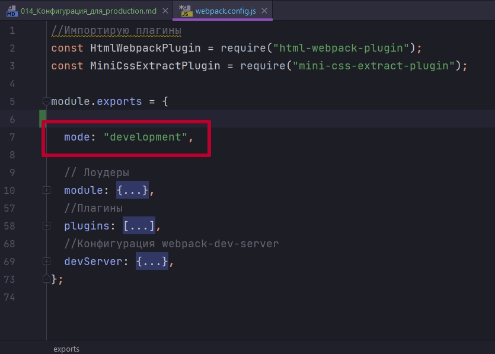

Однако этого не достаточно!!! Ведь в конфигурациях в module в rules в loader-ах, настройках loader-ов и плагинов нам нужно использовать разные значения, в зависимости от того собираем мы для development или собираем для production режима.

По сути нам нужны две разные конфигурации либо одна конфигурация которая знает в каком режиме она работает. 

Как решить эту задачу?

Самый простой способ это просто разделить конфигурацию на несколько файлов webpack.prod.config.js и webpack.dev.config.js. И после перйти в package.json и в скрипте сборки проекта build, который собирает проект для прода, указать какой файл должен использовать webpack при сборке. Для указания файла конфигурации указываю флан --config после которого указываю название конфигурационного файла.

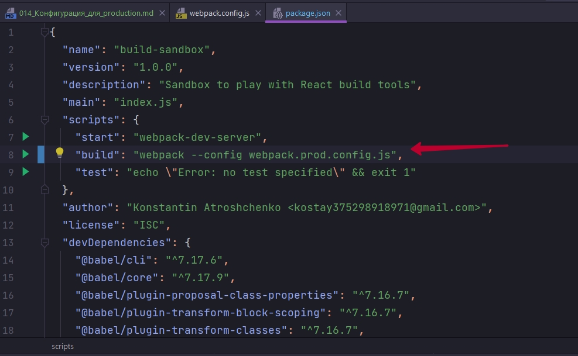

```json
{
  "name": "build-sandbox",
  "version": "1.0.0",
  "description": "Sandbox to play with React build tools",
  "main": "index.js",
  "scripts": {
    "start": "webpack-dev-server",
    "build": "webpack --config webpack.prod.config.js",
    "test": "echo \"Error: no test specified\" && exit 1"
  },
  "author": "Konstantin Atroshchenko <kostay375298918971@gmail.com>",
  "license": "ISC",
  "devDependencies": {
    "@babel/cli": "^7.17.6",
    "@babel/core": "^7.17.9",
    "@babel/plugin-proposal-class-properties": "^7.16.7",
    "@babel/plugin-transform-block-scoping": "^7.16.7",
    "@babel/plugin-transform-classes": "^7.16.7",
    "@babel/plugin-transform-template-literals": "^7.16.7",
    "@babel/preset-env": "^7.16.11",
    "@babel/preset-react": "^7.16.7",
    "babel-loader": "^8.2.5",
    "css-loader": "^6.7.1",
    "file-loader": "^6.2.0",
    "html-webpack-plugin": "^5.5.0",
    "mini-css-extract-plugin": "^2.6.0",
    "node-sass": "^7.0.1",
    "sass-loader": "^12.6.0",
    "style-loader": "^3.3.1",
    "webpack": "^5.72.0",
    "webpack-cli": "^4.9.2",
    "webpack-dev-server": "^4.8.1"
  },
  "dependencies": {
    "core-js": "^3.22.2",
    "react": "^18.0.0",
    "react-dom": "^18.0.0"
  }
}

```

Т.е. мы можем в явном виде передать тот конфиг с которым нам придется работать.

Вот такая модель работы была популярна в последнее время

```md

webpack.prod.config.js - конфигурация для production
webpack.dev.config.js - конфигурация для development
webpack.common.config.js - общие блоки конфигурации и для dev и для prod

```

Файлы организовывались приблизительно таким образом. У нас был файл для каждого режима. Плюс этого способа заключается в его простоте. Очень просто начать использовать три файла вместо одного.

Минус этого способа заключается в том что теперь ваша конфигурация будет разбита на три разных файла и читая только один из них к примеру webpack.prod.config.js, будет довольно сложно понять что же все таки происходит во всем билде в целом.

Второй способ это передать из командной строки каким-то способом в наш webpack.config.js какой-нибудь флаг, который скажет в каком режиме мы хотим собрать наше приложение

И тогда где-нибудь в файле мы могли бы создать переменную isProd или isDev

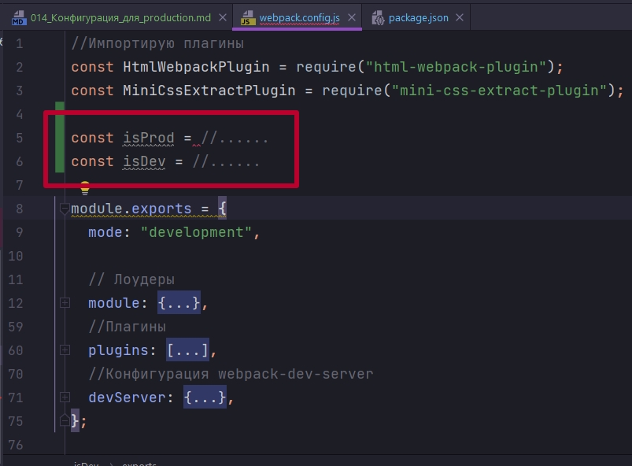

А затем использовать эти константы в нашем module.exports. И в зависимости от того какая константа установлена в true выбирать нужные режимы.


Совершенно не сложно будет написать условную логику, если мы находимся в development режиме не использовать 

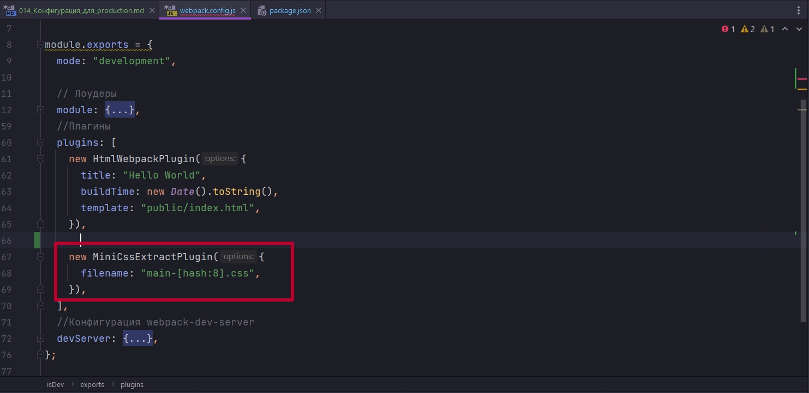

А если мы в production режиме, то будем использовать MiniCssExtractPlugin.


Основной вопрос как получить значение переменных isProd и isDev, и как ими управлять?

Плюс этого подхода это то что мы сохраним один целостный конфигурационный файл. 

А минус это то что в нашем коде появятся условия.

Какой из этих двух способов выбрать:

1. на уровне файлов
2. Или на уровне кода

Это дело каждой конкретной команды или каждого конкретного разработчика. 


В этом курсе я покажу только второй способ, как разделить конфигурацию на уровне кода. Этот способ куда интереснее, ну и create-rect-app использует именно этот подход.

И так как нам передать в webpack.config.js какое-нибудь значение из командной строки? 

Очень просто. В webpack есть специальные параметры командной строки которые начинаются на --env

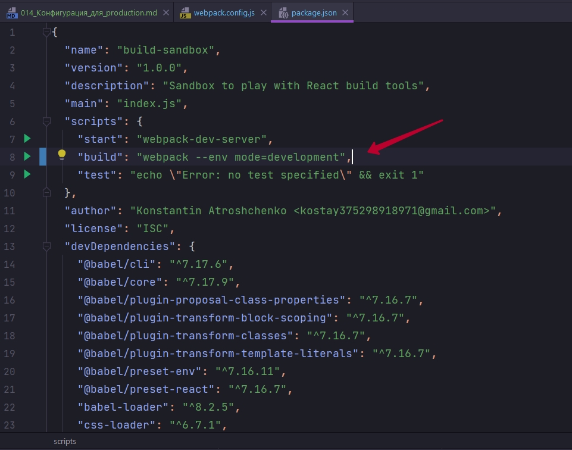

И ТАК ДАННЫЙ СИНТАКСИС ИСПОЛЬЗОВАЛСЯ В WEBPACK 4. ПЕРАМЕТР --env КАК ВИДИМ БЫЛ ОБЪЕКТОМ.  В WEBPACK 5 ЭТО ПРОСТО ФЛАГ. ПО ВОЗМОЖНОСТИ ВЕЗДЕ ИСПРАВЛЮ

```json
{
  "name": "build-sandbox",
  "version": "1.0.0",
  "description": "Sandbox to play with React build tools",
  "main": "index.js",
  "scripts": {
    "start": "webpack-dev-server",
    "build": "webpack --env mode=production",
    "test": "echo \"Error: no test specified\" && exit 1"
  },
  "author": "Konstantin Atroshchenko <kostay375298918971@gmail.com>",
  "license": "ISC",
  "devDependencies": {
    "@babel/cli": "^7.17.6",
    "@babel/core": "^7.17.9",
    "@babel/plugin-proposal-class-properties": "^7.16.7",
    "@babel/plugin-transform-block-scoping": "^7.16.7",
    "@babel/plugin-transform-classes": "^7.16.7",
    "@babel/plugin-transform-template-literals": "^7.16.7",
    "@babel/preset-env": "^7.16.11",
    "@babel/preset-react": "^7.16.7",
    "babel-loader": "^8.2.5",
    "css-loader": "^6.7.1",
    "file-loader": "^6.2.0",
    "html-webpack-plugin": "^5.5.0",
    "mini-css-extract-plugin": "^2.6.0",
    "node-sass": "^7.0.1",
    "sass-loader": "^12.6.0",
    "style-loader": "^3.3.1",
    "webpack": "^5.72.0",
    "webpack-cli": "^4.9.2",
    "webpack-dev-server": "^4.8.1"
  },
  "dependencies": {
    "core-js": "^3.22.2",
    "react": "^18.0.0",
    "react-dom": "^18.0.0"
  }
}

```

Все значения которые мы передадим вот таким способом,--env mode=production, из командной строки, будут доступны в файле конфигурации. Кстати можно использовать не только --env mode, можно передавать таким способом совершенно любые значения. Если вам нужно сконфигурировать еще какие-нибудт аспекты вашего билд скрипта, --env - это класный способ это сделать. Наприметр можно передать env theme=dark


А следующий вопрос это как получить эти значения в webpack.config.js.


Тоже весьма просто.

1. Первый шаг это сделать так что бы файл конфигурации экспортировал не объект конфигурации, а функцию которая возвращает объект с конфигурацией. Когда webpack увидит что объект конфигурации это функция, то он достаточно умный, и вызовет эту функцию. И затем тот объект который вернет функция будет использован в качестве конфигурации. Точно так же как тот объект который мы вызывали напрямую.
2. А теперь самое интересное. В эту функцию, в качестве первого аргумента webpack передаст объект с со всеми теми значениями, которые мы сконфигурировали в командной строке. 

И так называею этот объект env поскольку туда перейдут все значения которые начинаются с флага --env  командной строке. Префикс --env он ключевой. По этому префиксу webpack скажет что нужно передать в функцию конфигурации.

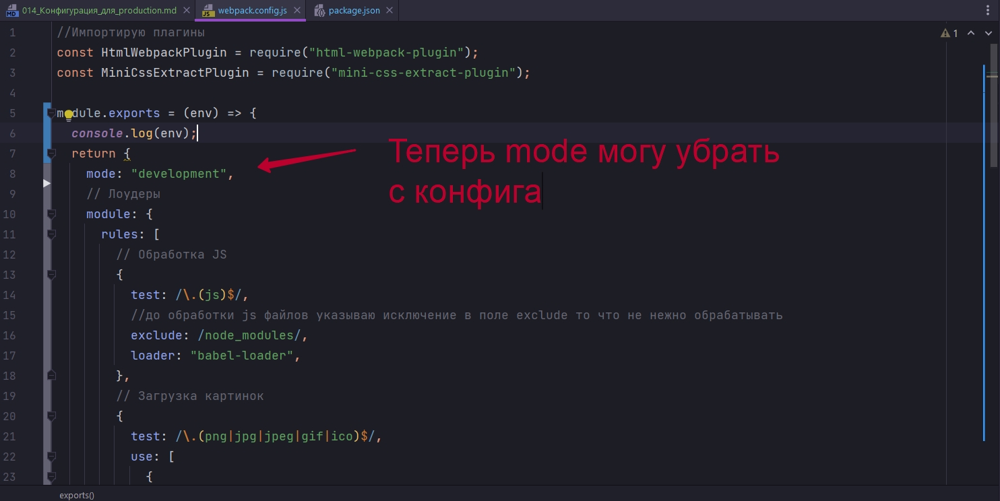


```js
//Импортирую плагины
const HtmlWebpackPlugin = require("html-webpack-plugin");
const MiniCssExtractPlugin = require("mini-css-extract-plugin");

module.exports = (env) => {
  console.log(env);
  return {
    

    // Лоудеры
    module: {
      rules: [
        // Обработка JS
        {
          test: /\.(js)$/,
          //до обработки js файлов указываю исключение в поле exclude то что не нежно обрабатывать
          exclude: /node_modules/,
          loader: "babel-loader",
        },
        // Загрузка картинок
        {
          test: /\.(png|jpg|jpeg|gif|ico)$/,
          use: [
            {
              loader: "file-loader",
              options: {
                outputPath: "images",
                name: "[name]-[sha1:hash:7].[ext]",
              },
            },
          ],
        },
        // Загрузка шрифтов
        {
          test: /\.(ttf|otf|eot|woof|woof2)$/,
          use: [
            {
              loader: "file-loader",
              options: {
                outputPath: "fonts",
                name: "[name].[ext]",
              },
            },
          ],
        },
        // Загрузка css
        {
          test: /\.css$/,
          use: [MiniCssExtractPlugin.loader, "css-loader"],
        },
        // Загрузка sass/scss
        {
          test: /\.(s[ac]ss)$/,
          use: [MiniCssExtractPlugin.loader, "css-loader", "sass-loader"],
        },
      ],
    },
    //Плагины
    plugins: [
      new HtmlWebpackPlugin({
        title: "Hello World",
        buildTime: new Date().toString(),
        template: "public/index.html",
      }),

      new MiniCssExtractPlugin({
        filename: "main-[hash:8].css",
      }),
    ],
    //Конфигурация webpack-dev-server
    devServer: {
      open: true,
      port: 3000,
    },
  };
};

```

И пока просто выведу в консоль что же я получаю.


```shell
npm run build

```

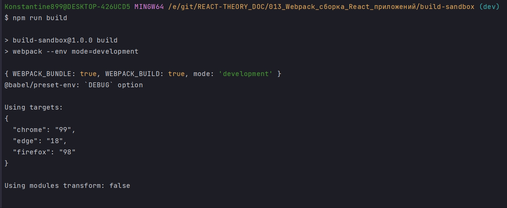

Таким образом мы узнали как из консоли можно передать в webpack билд, в webpack конфигурацию значение, и этим значением может быть режим в котором мы хотим прямо сейчас исполнить наш билд.

Ну а теперь определить в каком режиме мы хотим собрать на ше приложение очень просто.

Теперь я могу создать константы isProd и isDev и записать в них значения. При запуске в том или ином режиме, одна из них будет становиться true.

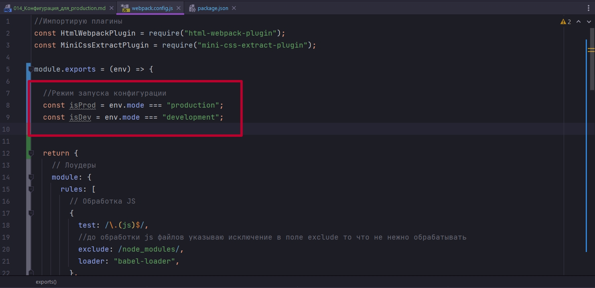

Если у нас будет еще один режим к примеру testing мы можем создать еще одну константу isTesting и точно так же вычислить ее значениее.


А теперь давайте сделаем так что бы наш webpack билд работал по разному в зависимости от того режима в котором мы сейчас запускаем билд!!!!


Для начало значение mode в нашей конфигурации - это значение скажет webpack следует ли включать какие-то дополнительные оптимизации.

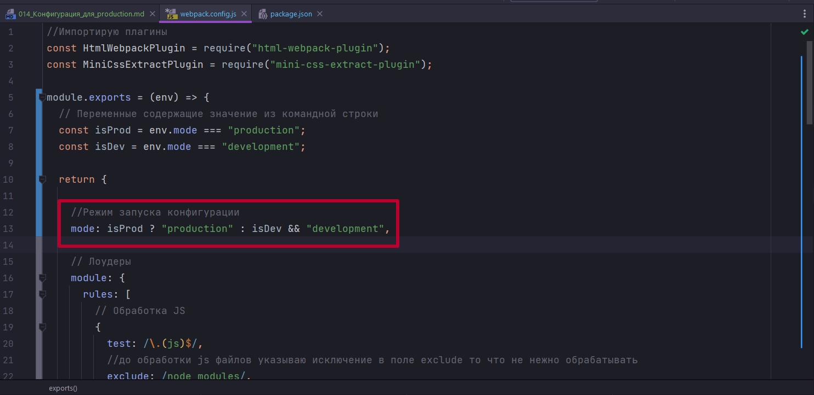

Если у нас будет какой-нибудь третий режим, то тогда mode будет false и webpack не будет включать ни каких оптимизаций, не для production не для development.


В этом есте нужно сделать одно небольшое замечание. Я немного копирую структуру билд скрипта из create-react-app. Вам как проффесиональному разработчику наверняка захочется в какой-то момент заглянуть под капот create-react-app и узнать как работают инструменты faceBook и читать тот код, код create-react-app будет намного проще если мы попробуем следовать тому же стилю.

Но если вам такой стиль не нравится. К примеру вы считаете что одной константы хватит isProd. Не нужно отдельно усложнаять isDev-ом. И достаточно одной констаты. Вы можете писать свой собственный билд так как вы считаете нужным.


Что бы наш билд ни при каких обстоятельствах не валился устанваливаю env значение по умолчанию ввиде пустого объекта. Потому что прямо сейчас нам обязательно передать env.mode, иначе мы сломаемся.

И кроме того скажем что mode по умолчанию это development. Мы сможем запускать наш скрипт без параметров.

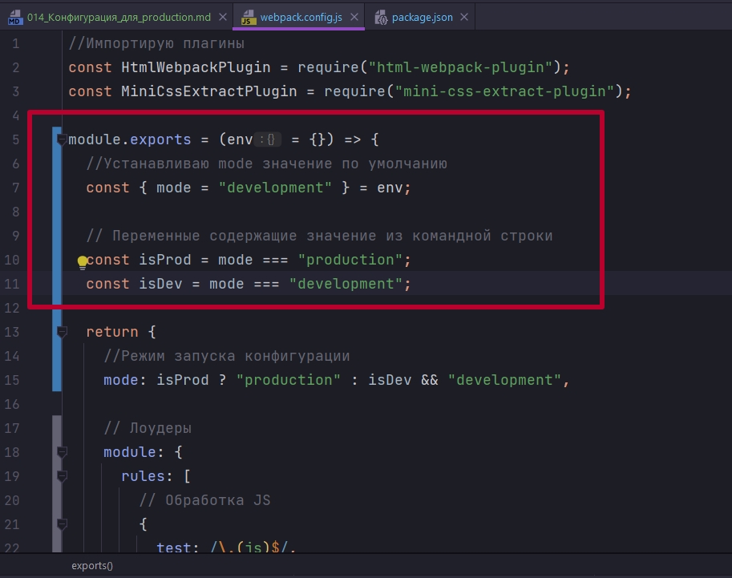

Перед тем как продолжать и начинать писать конфигурацию отталкиваясь от этих значений

Проверка запуска.

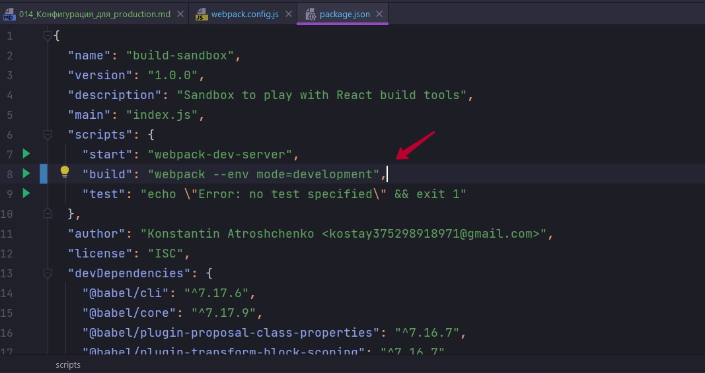

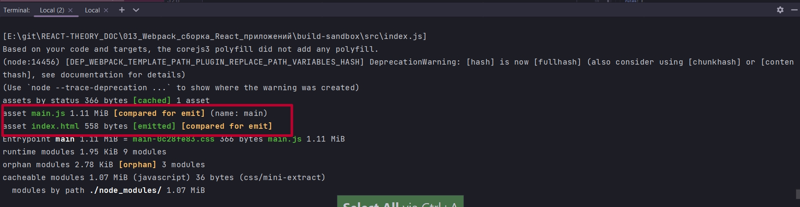


А если в production

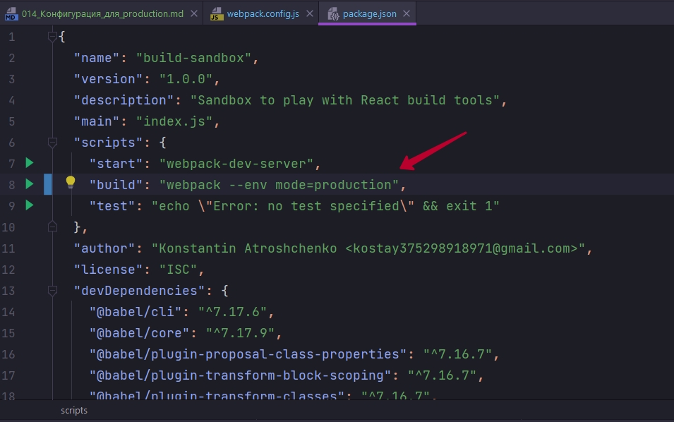

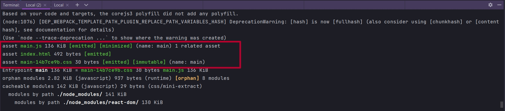


И так, начнем писать наш конфиг в зависимости от режима. Один из подходящих примеров это загрузка css. В development режиме мы хотим использовать style-loader, а в production режиме мы хотим использовать MiniCssExtractPlugin.loader.

Самый простой способ это сделать отдельную функцию которую назову getStyleLoaders и в этой функции мы вернем массив style лоудеров содержимое которого будет отличаться для development и для production режимов.

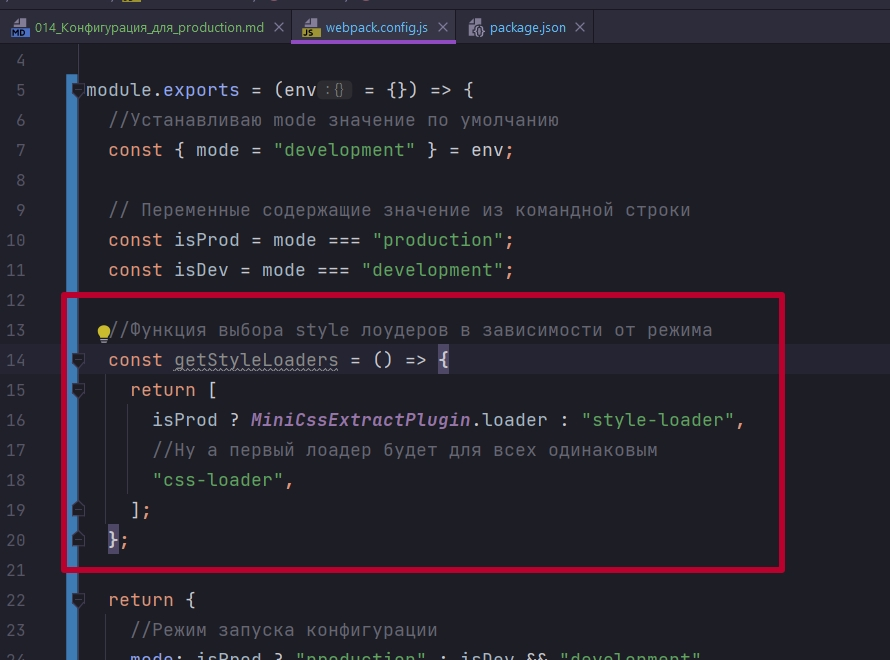

Теперь в файл конфигурации загрузки css в параметр use просто передаю вызов функции getStyleLoaders.

А в блок загрузки SCSS первым значение в массив так же передаю вызов функции getStyleLoaders, но только полученный результат вызова этой функции, а это будет массив, мне его нужно деструктурировать.

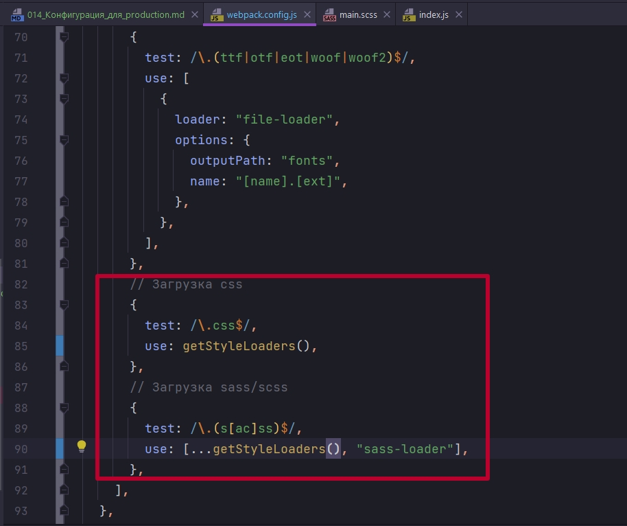

Точно так же поступим и с плагинами. MiniCssExtractPlugin нужен нам только в том случае если мы запускаемся в режиме production. Для этого так же напишу функцию getPlugins. В теле функции создаю массив plugins. И далее пишу условие что если решим сборки isProd, тогда я добавляю в конец массива инстанс класса MiniCssExtractPlugin.

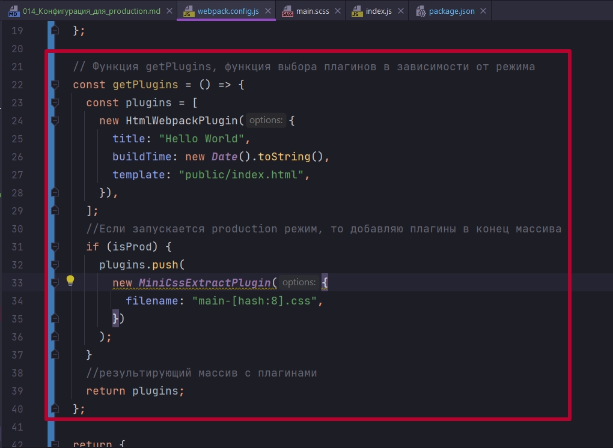

```js
//Импортирую плагины
const HtmlWebpackPlugin = require("html-webpack-plugin");
const MiniCssExtractPlugin = require("mini-css-extract-plugin");

module.exports = (env = {}) => {
  //Устанавливаю mode значение по умолчанию
  const { mode = "development" } = env;

  // Переменные содержащие значение из командной строки
  const isProd = mode === "production";
  const isDev = mode === "development";

  //Функция выбора style лоудеров в зависимости от режима
  const getStyleLoaders = () => {
    return [
      isProd ? MiniCssExtractPlugin.loader : "style-loader",
      "css-loader",
    ];
  };

  // Функция getPlugins, функция выбора плагинов в зависимости от режима
  const getPlugins = () => {
    const plugins = [
      new HtmlWebpackPlugin({
        title: "Hello World",
        buildTime: new Date().toString(),
        template: "public/index.html",
      }),
    ];
    //Если запускается production режим, то добавляю плагины в конец массива
    if (isProd) {
      plugins.push(
        new MiniCssExtractPlugin({
          filename: "main-[hash:8].css",
        })
      );
    }
    //результирующий массив с плагинами
    return plugins;
  };

  return {
    //Режим запуска конфигурации
    mode: isProd ? "production" : isDev && "development",

    // Лоудеры
    module: {
      rules: [
        // Обработка JS
        {
          test: /\.(js)$/,
          //до обработки js файлов указываю исключение в поле exclude то что не нежно обрабатывать
          exclude: /node_modules/,
          loader: "babel-loader",
        },
        // Загрузка картинок
        {
          test: /\.(png|jpg|jpeg|gif|ico)$/,
          use: [
            {
              loader: "file-loader",
              options: {
                outputPath: "images",
                name: "[name]-[sha1:hash:7].[ext]",
              },
            },
          ],
        },
        // Загрузка шрифтов
        {
          test: /\.(ttf|otf|eot|woof|woof2)$/,
          use: [
            {
              loader: "file-loader",
              options: {
                outputPath: "fonts",
                name: "[name].[ext]",
              },
            },
          ],
        },
        // Загрузка css
        {
          test: /\.css$/,
          use: getStyleLoaders(),
        },
        // Загрузка sass/scss
        {
          test: /\.(s[ac]ss)$/,
          use: [...getStyleLoaders(), "sass-loader"],
        },
      ],
    },
    //Плагины
    plugins: getPlugins(),
    //Конфигурация webpack-dev-server
    devServer: {
      open: true,
      port: 3000,
    },
  };
};

```

Что бы много не скринить я проверил что все работает)))


Что еще можно сконфигурировать? 

Можно сконфигурировать название js файла.

Для этого добавляю блок output и в этом блоке укажем какой у на с будет filename.

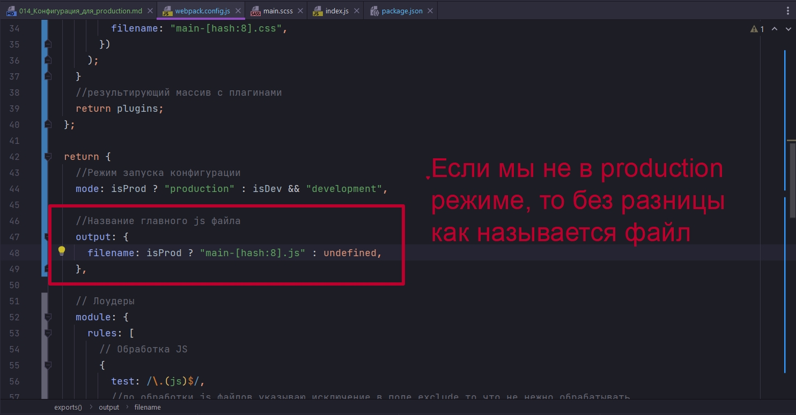

```js
//Импортирую плагины
const HtmlWebpackPlugin = require("html-webpack-plugin");
const MiniCssExtractPlugin = require("mini-css-extract-plugin");

module.exports = (env = {}) => {
  //Устанавливаю mode значение по умолчанию
  const { mode = "development" } = env;

  // Переменные содержащие значение из командной строки
  const isProd = mode === "production";
  const isDev = mode === "development";

  //Функция выбора style лоудеров в зависимости от режима
  const getStyleLoaders = () => {
    return [
      isProd ? MiniCssExtractPlugin.loader : "style-loader",
      "css-loader",
    ];
  };

  // Функция getPlugins, функция выбора плагинов в зависимости от режима
  const getPlugins = () => {
    const plugins = [
      new HtmlWebpackPlugin({
        title: "Hello World",
        buildTime: new Date().toString(),
        template: "public/index.html",
      }),
    ];
    //Если запускается production режим, то добавляю плагины в конец массива
    if (isProd) {
      plugins.push(
        new MiniCssExtractPlugin({
          filename: "main-[hash:8].css",
        })
      );
    }
    //результирующий массив с плагинами
    return plugins;
  };

  return {
    //Режим запуска конфигурации
    mode: isProd ? "production" : isDev && "development",

    //Название главного js файла
    output: {
      filename: isProd ? "main-[hash:8].js" : undefined,
    },

    // Лоудеры
    module: {
      rules: [
        // Обработка JS
        {
          test: /\.(js)$/,
          //до обработки js файлов указываю исключение в поле exclude то что не нежно обрабатывать
          exclude: /node_modules/,
          loader: "babel-loader",
        },
        // Загрузка картинок
        {
          test: /\.(png|jpg|jpeg|gif|ico)$/,
          use: [
            {
              loader: "file-loader",
              options: {
                outputPath: "images",
                name: "[name]-[sha1:hash:7].[ext]",
              },
            },
          ],
        },
        // Загрузка шрифтов
        {
          test: /\.(ttf|otf|eot|woof|woof2)$/,
          use: [
            {
              loader: "file-loader",
              options: {
                outputPath: "fonts",
                name: "[name].[ext]",
              },
            },
          ],
        },
        // Загрузка css
        {
          test: /\.css$/,
          use: getStyleLoaders(),
        },
        // Загрузка sass/scss
        {
          test: /\.(s[ac]ss)$/,
          use: [...getStyleLoaders(), "sass-loader"],
        },
      ],
    },
    //Плагины
    plugins: getPlugins(),
    //Конфигурация webpack-dev-server
    devServer: {
      open: true,
      port: 3000,
    },
  };
};

```

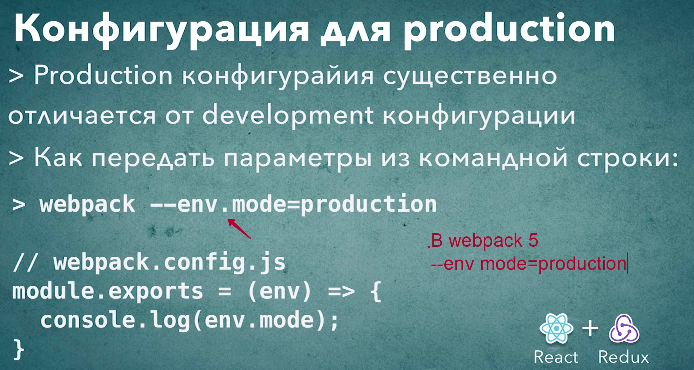


