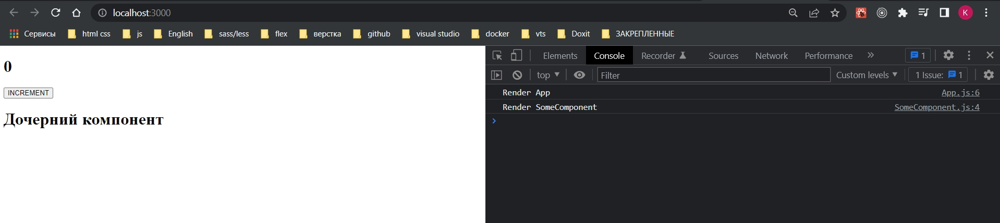
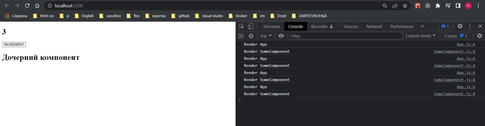
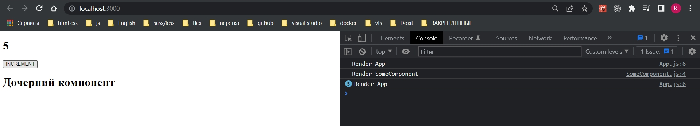
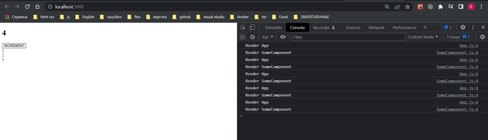
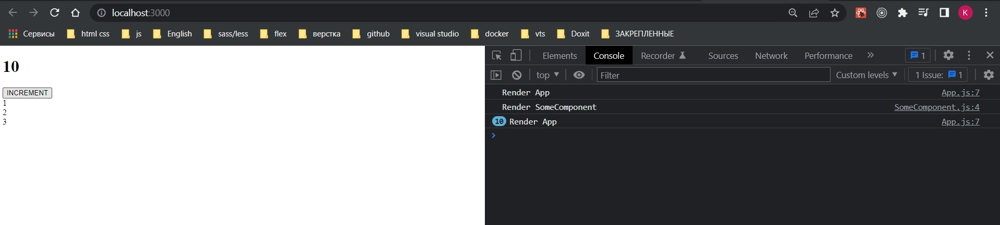
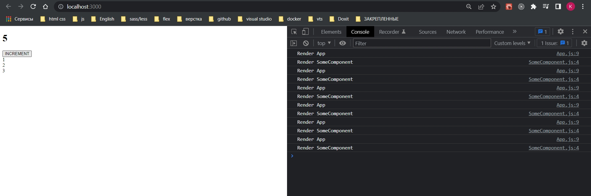
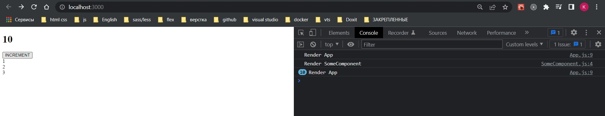
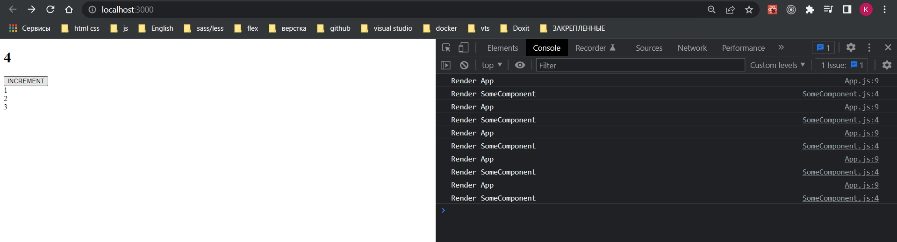
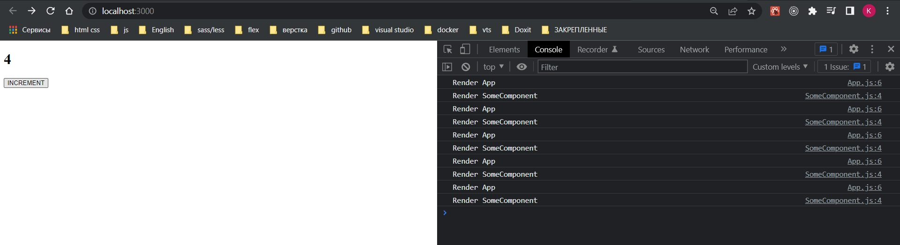

# 001_rerendering

Перерерисовки. Лишний рендеринг наших компонентов который влияет на производительность.

Рассмотрим такой пример.

```js
import React, { useState } from "react";
import SomeComponent from "./components/SomeComponent";

function App() {
  const [count, setCount] = useState(0);
  console.log(`Render App`);
  const increment = () => setCount(count + 1);

  return (
    <div>
      <h1>{count}</h1>
      <button onClick={increment}>INCREMENT</button>
      <SomeComponent />
    </div>
  );
}

export default App;

```

```js
import React from "react";

const SomeComponent = (props) => {
  console.log(`Render SomeComponent`);
  return <h1>Дочерний компонент</h1>;
};

export default SomeComponent;

```

Есть простой компонент с локальным состоянием. Кнопка увеличивающая это состояние т.е. обычный счетчик. 

Есть какой-то дочерний компонент в котором мы просто выводим заголовок. Так же добавляем логи когда у нас перерисовался родительский компонент и перерисовался дочерний.



Первый рендеринг.



И как мы видим на каждое нажатие в месте с родительским компонентом происходит перерисовка дочернего компонента. Хотя по сути в дочернем компоненте не изменилось состояние и не изменились какие либо внешние пропсы.

Для того что бы избежать этих перерисовок для функциональных компонентов мы используем React.memo.

Для классовых React.PureComponent.

```js
import React from "react";

const SomeComponent = React.memo((props) => {
  console.log(`Render SomeComponent`);
  return <h1>Дочерний компонент</h1>;
});

export default SomeComponent;

```



Как видите теперь у нас перерисовывается только родительский компонент.

Перерисовка компонента обернутого в React.memo будет только в том случае если изменился хотябы один из пропсов и либо если в самом компоненте изменился state.

Но не забывайте что сравнения в JS у примитивов идет по значению. А у объектов по ссылке.

```

{value: 5} != {value: 5}

```

Эти объекты не равны так как они находяться в разных областях памяти. И на эти области памяти ссылки разные.

Пример. Теперь дочерний компонент принимает один пропс. Это массив, мы по нему итерируемся

```js
import React from "react";

const SomeComponent = React.memo(({ list }) => {
  console.log(`Render SomeComponent`);
  return (
    <div>
      {list.map((item) => (
        <div key={item}>{item}</div>
      ))}
    </div>
  );
});

export default SomeComponent;

```

```js
import React, { useState } from "react";
import SomeComponent from "./components/SomeComponent";

function App() {
  const [count, setCount] = useState(0);
  console.log(`Render App`);
  const increment = () => setCount(count + 1);

  return (
    <div>
      <h1>{count}</h1>
      <button onClick={increment}>INCREMENT</button>
      <SomeComponent list={[1, 2, 3]} />
    </div>
  );
}

export default App;

```



Как видим пропсы не изменились. Но дочерний компонент перерисовывается.

Теперь это массив поместим в состояние. И передадим это состояние в качестве props.

```js
import React, { useState } from "react";
import SomeComponent from "./components/SomeComponent";

function App() {
  const [count, setCount] = useState(0);
  const [list, setList] = useState([1, 2, 3]);
  console.log(`Render App`);
  const increment = () => setCount(count + 1);

  return (
    <div>
      <h1>{count}</h1>
      <button onClick={increment}>INCREMENT</button>
      <SomeComponent list={list} />
    </div>
  );
}

export default App;

```



Видим что дочерний компонент у нас уже не перерисовывается. Т.е. useState гарантирует что на каждый рендеринг компонента унас массив сохраняется таким как был, т.е. ссылка у него не изменяется.

Создать новый массив мы можем только использовав функцию изменения состояния setList.

Но что если мы хотим получать этот массив из какой то внешней функции, которая нам его возвращает? Например она производит какие-то вычисления и потом нам его возвращает. Стандартная ситуация. 

```js
import React, { useState } from "react";
import SomeComponent from "./components/SomeComponent";

//Какая то внешняя функция
const getList = () => [1, 2, 3];

function App() {
  const [count, setCount] = useState(0);
  console.log(`Render App`);
  const increment = () => setCount(count + 1);

  const list = getList();

  return (
    <div>
      <h1>{count}</h1>
      <button onClick={increment}>INCREMENT</button>
      <SomeComponent list={list} />
    </div>
  );
}

export default App;

```



<br/>
<br/>
<br/>

## Кэширование (Мемоизация)

В таком случае нам на помощь приходит кеширование или по другому мемоизация.

Пример: у нас есть какая то функция которая подсчитывает допустим интеграл. И компонент который значение этого интеграла отрисовывает. Так вот зачем нам на каждый рендер компонента заново интеграл пересчитывать. Мы можем посчитать его один раз, созранить результат. И этот результат на каждый рендер отдавать.

Но если вдруг у нас поменяется какое-то условие, формула, то мы заново посчитаем этот интеграл, опять его закешируем и будем доставать каждый раз из кеша. 

Разработчики подумали и придумали два хука. useMemo и useCallback.

Начнем с useMemo.

1. Первым аргументом он принимает callback который должен вернуть какие-то данные, в нашем случае это массив который возвращает функция getList.
2. А вторым аргументом передаем массив зависимостей. По аналогии с useEffect. Как только одна из зависимостей в этом массиве поменяет значение, мы результат будем доставать уже не из кеша, а заново выполним callback и вернем какой-то результат.

```js
import React, { useMemo, useState } from "react";
import SomeComponent from "./components/SomeComponent";

//Какая то внешняя функция
const getList = () => [1, 2, 3];

function App() {
  const [count, setCount] = useState(0);
  console.log(`Render App`);
  const increment = () => setCount(count + 1);

  const list = useMemo(() => getList(), []);

  return (
    <div>
      <h1>{count}</h1>
      <button onClick={increment}>INCREMENT</button>
      <SomeComponent list={list} />
    </div>
  );
}

export default App;

```



Но если мы хотим реагировать на измения count, мы добавляем его в массив зависимостей и как видите дочерний компонент перерисовывается.

```js
import React, { useMemo, useState } from "react";
import SomeComponent from "./components/SomeComponent";

//Какая то внешняя функция
const getList = () => [1, 2, 3];

function App() {
  const [count, setCount] = useState(0);
  console.log(`Render App`);
  const increment = () => setCount(count + 1);

  const list = useMemo(() => getList(), [count]);

  return (
    <div>
      <h1>{count}</h1>
      <button onClick={increment}>INCREMENT</button>
      <SomeComponent list={list} />
    </div>
  );
}

export default App;

```



useMemo стоит использовать практически во всех случаях когда вы работаете с массивами, объектами, какими то вычислениями.

Но что делать с функциями? По факту функция это такой же объект и от каждого рендера у функции меняется ссылка. А если мы функцию передаем как props в дочерний компонент? То соответственно у нас будет лишняя перерисовка?

Немного поменяем композицию наших элементов. Все тот же счетчик, но теперь кнопка вынесена в отдельный компонент.

```js
import React, { useState } from "react";
import SomeComponent from "./components/SomeComponent";

function App() {
    const [count, setCount] = useState(0);
    console.log(`Render App`);
    const increment = () => setCount((prev) => prev + 1);

    return (
        <div>
            <h1>{count}</h1>
            <SomeComponent increment={increment} />
        </div>
    );
}

export default App;

```

```js
import React from "react";

const SomeComponent = React.memo(({ increment }) => {
  console.log(`Render SomeComponent`);
  return (
    <div>
      <button onClick={increment}>INCREMENT</button>
    </div>
  );
});

export default SomeComponent;

```



Опять та же картина. Дочерний компонент перерисовывается. Хотя в него прилетает одна и таже функция. 

И тут на помощь приходит useCallback. Он очень похож на useMemo, но отличие в том что возвращается мемоизированная функция, мемоизированный callback, а useMemo возвращает уже какое-то значение. Точно так же первым аргументом передаем callback, а вторым массив зависимостей.

```js
import React, { useCallback, useState } from "react";
import SomeComponent from "./components/SomeComponent";

function App() {
  const [count, setCount] = useState(0);
  console.log(`Render App`);
  const increment = useCallback(() => setCount((prev) => prev + 1), []);

  return (
    <div>
      <h1>{count}</h1>
      <SomeComponent increment={increment} />
    </div>
  );
}

export default App;

```


useCallback стоит использовать во всех случаях когда мы передаем какую то функцию в дочерний компонент.


