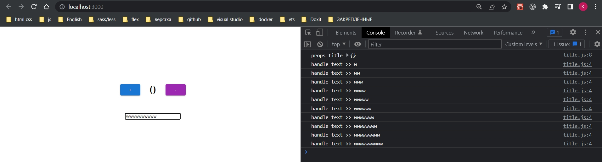
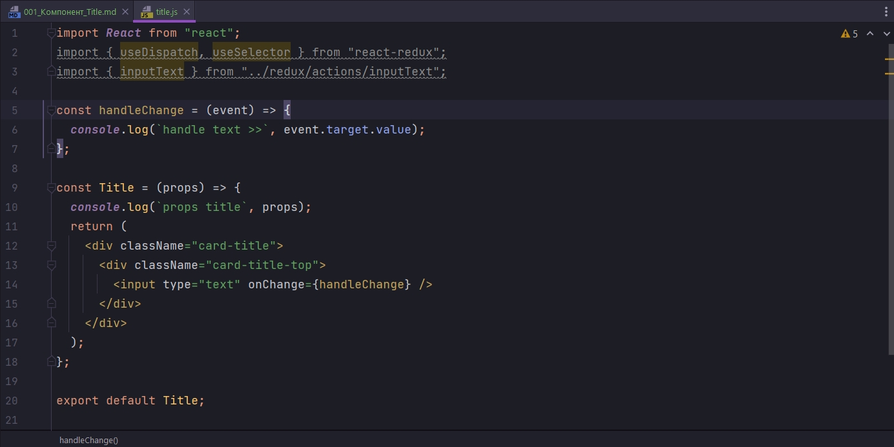
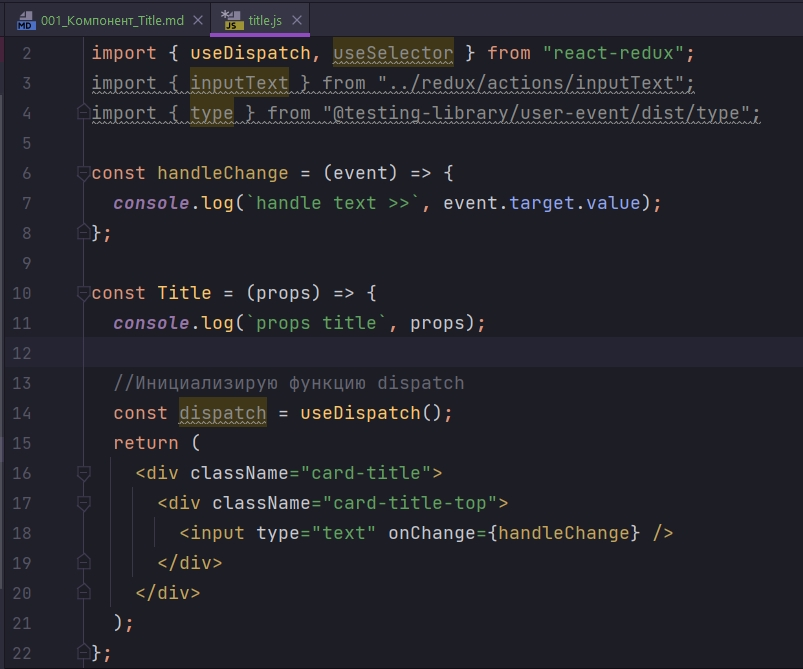
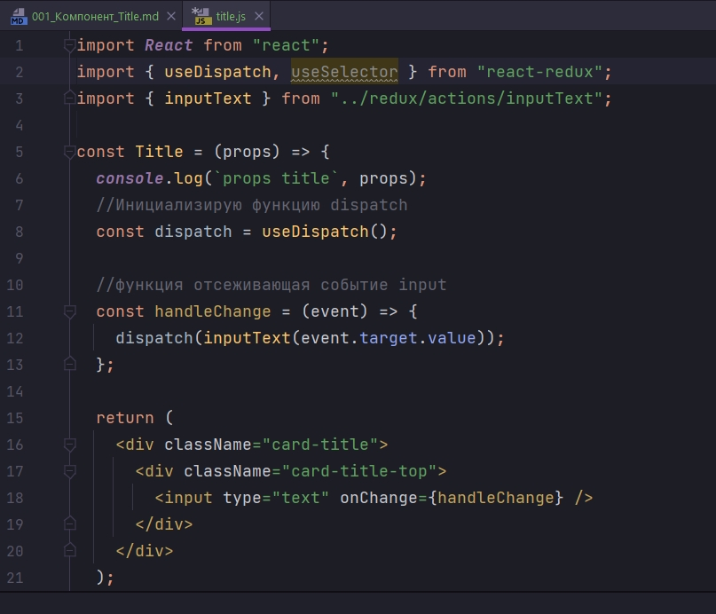
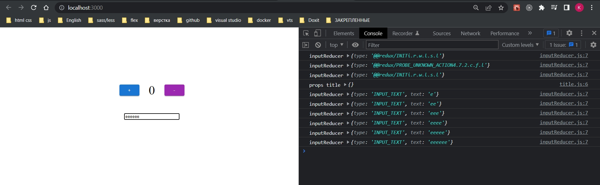
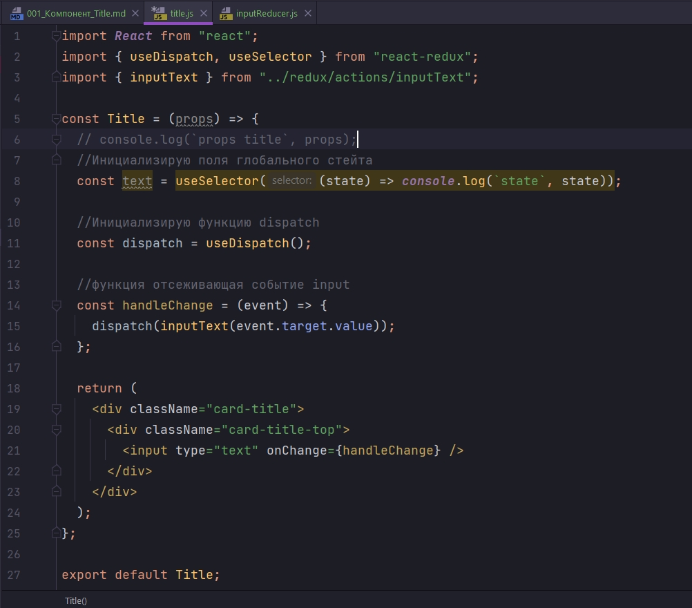
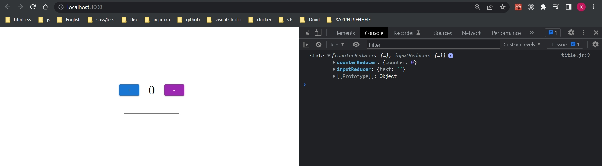
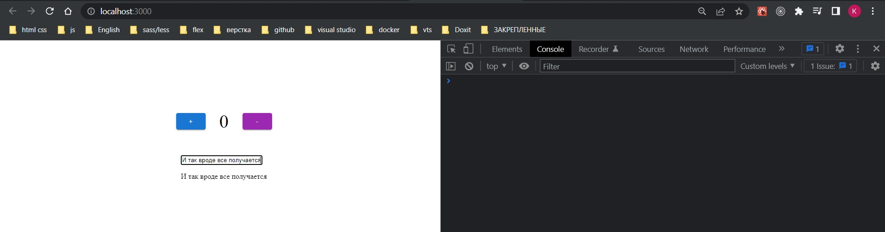

# 001_Компонент_Title

И так структурирование не сильно понятное. Ну да ладно походу дела будем импровизировать. Первый раз разбираюсь с хуками Redux.

Создаю компонент Title.

```js
import React from "react";

const handleChange = (event) => {
  console.log(`handle text >>`, event.target.value);
};

const Title = (props) => {
  console.log(`props title`, props);
  return (
    <div className="card-title">
      <div className="card-title-top">
        <input type="text" onChange={handleChange} />
      </div>
    </div>
  );
};

export default Title;

```

```js
import React from "react";
import Counter from "./counter/counter";
import Title from "./title/title";

const App = () => {
    return (
        <>
            <Counter />
            <Title />
        </>
    );
};

export default App;

```



Теперь наша задача что бы при каждом нажатии клавиши поле input полученное строчное выражение попадало в Redux и уже из Redux приходило обратно в компонент и отображалось внутри компонента.

Т.е. в этот раз нам нужны еще и данные. Их еще наывают payload передать в reducer. И тип данных который мы будем передавать в reducer это простая строка.

В папке redux/types/types.js создаю еще один тип INPUT_TEXT

```js
export const INCREMENT = "INCREMENT";
export const DECREMENT = "DECREMENT";

export const INPUT_TEXT = "INPUT_TEXT";

```

Далее перехожу в redux/actions и создаю нужный action

```js
import { INPUT_TEXT } from "../types/types";
export const inputText = (text) => {
  return {
    type: INPUT_TEXT,
    text,
  };
};

```

Функция inputText принимает тот текст который мы написали в input, Мое предположение что все таки это объект, позже пороверю , и передаю этот объект text в reducer который сейчас создам.

Создаю inputReducer

```js
import { INPUT_TEXT } from "../types/types";
const initialState = {
  text: "",
};

const inputReducer = (state = initialState, action) => {
  console.log(`inputReducer`, action);
  switch (action.type) {
    case INPUT_TEXT:
      return {
        ...state,
        // text: state.text
      };
    default:
      return state;
  }
};

export default inputReducer;

```

Пока что из inputReducer я ничего не буду возвращать. Посмотрим что нам прилетает в action.

И добавляю его в rootReducer

```js
import { combineReducers } from "redux";
import { counterReducer } from "./counterReducer";
import inputReducer from "./inputReducer";

export const rootReducer = combineReducers({
  counterReducer,
  inputReducer,
});
```


Переходим в компонент Title. И так помимо action нам нужно в компонент импортировать два хука, useDispatch, мы будем его использовать вместо функции mapDispatchToProps.

И второй хук useSelector, который мы будем использовать вмсто mapStateToProps. И все это импортируем из пакета react-redux.

После чего импортирую наш inputText из redux/actions/inputText.js



Далее инициализирую функцию dispatch с помощью хука useDispatch.



И так, переношу handleChange в саму функцию. В handleChange вызываю функцию dispatch в которую передаю action creator inputText, а в inputText передаю отслеживаемое событие которое следит за значением input т.е. event.target.value.





И теперь что бы занести наше вводимое значение в глобальный стейт, в  case INPUT_TEXT возвращаю объект, в котором первым значением копирую старое значение стейт, и для того что бы обновить скопированное сначение стейта в новом объете, вторым параметром в этот объект передаю значение из объекта action.text.

```js
import { INPUT_TEXT } from "../types/types";
const initialState = {
  text: "",
};

const inputReducer = (state = initialState, action) => {
  console.log(`inputReducer action`, action);
  console.log(`inputReducer state`, state);
  switch (action.type) {
    case INPUT_TEXT:
      return {
        ...state,
        text: action.text,
      };
    default:
      return state;
  }
};

export default inputReducer;

```

Теперь в компоненте Title нам нужно отображать состояние.

Для этого инициализирую поле title из глобального стейта, с помощью функциии useSelector. Функция useSelector принимает callback который в свою очередь принимает текущий state. И посмотрим что возвращает state.





Как видим useSelector возвращает нам все reducer-ы которые есть в приложении.

```js
import React from "react";
import { useDispatch, useSelector } from "react-redux";
import { inputText } from "../redux/actions/inputText";

const Title = (props) => {
  // console.log(`props title`, props);
  //Инициализирую поля глобального стейта
  const { text } = useSelector((state) => state.inputReducer);

  //Инициализирую функцию dispatch
  const dispatch = useDispatch();

  //функция отсеживающая событие input
  const handleChange = (event) => {
    dispatch(inputText(event.target.value));
  };

  return (
    <div className="card-title">
      <div className="card-title-top">
        <input type="text" onChange={handleChange} />
        <p>{text}</p>
      </div>
    </div>
  );
};

export default Title;

```



Таким образом мы использовали два хука что бы интегрировать наш компонент с хранилищем redux. И выглядит такой подход удобнее. Здесь не надо оборачивать компонент в функции connect. 

И мы так же передали в reducer обновленные данные.


