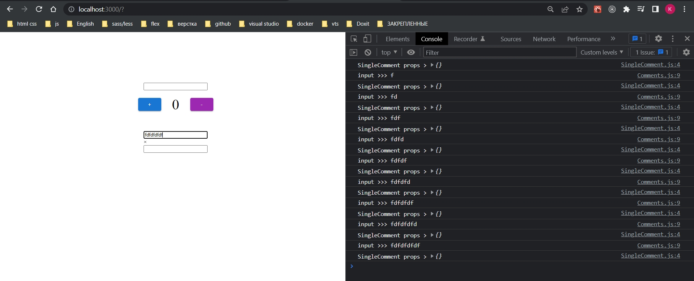
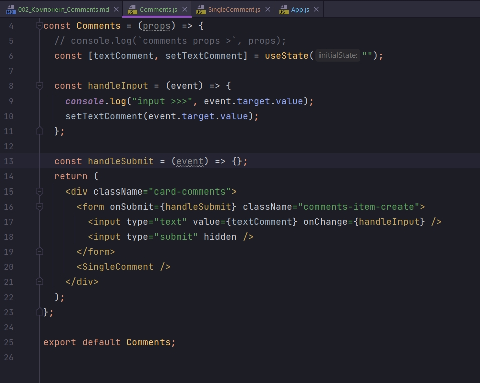
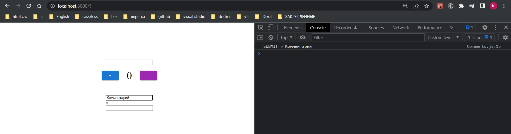

# 002_Компонент_Comments

В компоненте Comments мы будем отображать комментарии.

И так создаю компоненте Comments

```js
import React from "react";
import SingleComment from "./SingleComment./SingleComment";

const Comments = (props) => {
  console.log(`comments props >`, props);
  return (
    <div className="card-comments">
      <form className="comments-item-create">
        <input type="text" />
        <input type="submit" hidden />
      </form>
      <SingleComment />
    </div>
  );
};

export default Comments;

```

Как видим данный компонент содержит форму, два input, одни из них скрыт. Отправка комментария будет совершаься путем нажатия Enter.

Компонент SingleComment будет отображать каждый комментарий.

```js
import React from "react";

const SingleComment = (props) => {
  console.log(`SingleComment props >`, props);
  return (
    <form className="comment-item">
      <div className="comment-item-delete">&times;</div>
      <input type="text" />
      <input type="submit" hidden />
    </form>
  );
};

export default SingleComment;

```

```js
import React from "react";
import Counter from "./Counter/Counter";
import Title from "./Title/Title";
import Comments from "./Comments/Comments";

const App = () => {
  return (
    <>
      <Title />
      <Counter />
      <Comments />
    </>
  );
};

export default App;

```

И теперь займемся получением данных из нашего поля input, из нашей формы. В компоненте Comments импортирую хук useState для дефолтного состояния нашего поля input. И так же напишу обработчик события для input.

```js
import React, { useState } from "react";
import SingleComment from "./SingleComment/SingleComment";

const Comments = (props) => {
    // console.log(`comments props >`, props);
    const [textComment, setTextComment] = useState("");

    const handleInput = (event) => {
        console.log("input >>>", event.target.value);
        setTextComment(event.target.value);
    };
    return (
        <div className="card-comments">
            <form className="comments-item-create">
                <input type="text" value={textComment} onChange={handleInput} />
                <input type="submit" hidden />
            </form>
            <SingleComment />
        </div>
    );
};

export default Comments;

```



Вешаем обработчик события на нашу форму.



И так при сабмите формы мы должны отменить ее дефолтное поведение, что бы страница не перезагружалась event.preventDefault(). И далее мы должны будем отправлять значение из состояния которое храниться в textComment.

```js
import React, { useState } from "react";
import SingleComment from "./SingleComment/SingleComment";

const Comments = (props) => {
  // console.log(`comments props >`, props);
  const [textComment, setTextComment] = useState("");

  const handleInput = (event) => {
    console.log("input >>>", event.target.value);
    setTextComment(event.target.value);
  };

  const handleSubmit = (event) => {
    event.preventDefault();
    console.log("SUBMIT >", textComment);
  };
  return (
    <div className="card-comments">
      <form onSubmit={handleSubmit} className="comments-item-create">
        <input type="text" value={textComment} onChange={handleInput} />
        <input type="submit" hidden />
      </form>
      <SingleComment />
    </div>
  );
};

export default Comments;

```




