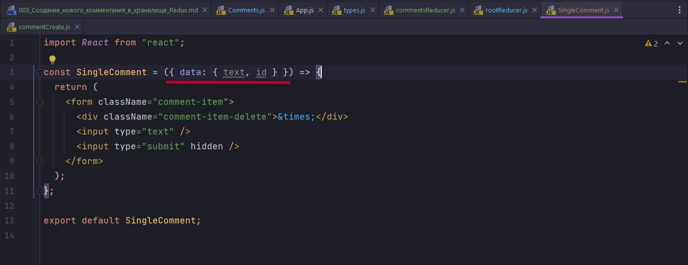

# 003_Создание_нового_комментания_в_хранилище_Redux

В  redux/types/types.js создаю новый тип COMMENT_CREATE

```js
export const INCREMENT = "INCREMENT";
export const DECREMENT = "DECREMENT";

export const INPUT_TEXT = "INPUT_TEXT";

export const COMMENT_CREATE = "COMMENT_CREATE";

```

Теперь создам action creator в redux/actions commentCreate

```js
import { COMMENT_CREATE } from "../types/types";

export const commentCreate = (text, id) => {
  return {
    type: COMMENT_CREATE,
    data: { text, id },
  };
};

```

Как видим данный action creator у нас будет принимать два свойства. Это text и id комментария. И так же в reducer я буду передавать объект data который будет содержать значения которые я передаю в action creator.

Далее создаю commentReducer. И пока просто верну текущий state.


Добавляю commentReducer к rootReducer

```js
import { combineReducers } from "redux";
import { counterReducer } from "./counterReducer";
import inputReducer from "./inputReducer";
import commentsReducer from "./commentsReducer";

export const rootReducer = combineReducers({
    counterReducer,
    inputReducer,
     commentsReducer,
});

```

И так теперь в компонент Comments нам нужно импортировать action creator commentCreate.

После чего в функции handleSubmit мы должны задиспатчить наш action и передать нужные данные. Это сам комментарий плюс id. 

Что бы задиспитчить нам нужно сначало подключить наш компонент к Redux. Для этого мы должны импортировать наши хуки useSelector и useDispatch из пакета react-redux.


И так для генерирования уникального id, т.к. мы не работаем с сервером, установлю пакет uniqid

```json
{
  "name": "example-react-redux",
  "version": "0.1.0",
  "private": true,
  "dependencies": {
    "@emotion/react": "^11.9.0",
    "@emotion/styled": "^11.8.1",
    "@mui/material": "^5.6.3",
    "@testing-library/jest-dom": "^5.16.4",
    "@testing-library/react": "^13.1.1",
    "@testing-library/user-event": "^13.5.0",
    "react": "^18.1.0",
    "react-dom": "^18.1.0",
    "react-redux": "^8.0.1",
    "react-scripts": "5.0.1",
    "redux": "^4.2.0",
    "uniqid": "^5.4.0",
    "web-vitals": "^2.1.4"
  },
  "scripts": {
    "start": "react-scripts start",
    "build": "react-scripts build",
    "test": "react-scripts test",
    "eject": "react-scripts eject"
  },
  "eslintConfig": {
    "extends": [
      "react-app",
      "react-app/jest"
    ]
  },
  "browserslist": {
    "production": [
      ">0.2%",
      "not dead",
      "not op_mini all"
    ],
    "development": [
      "last 1 chrome version",
      "last 1 firefox version",
      "last 1 safari version"
    ]
  }
}

```

С помощью uniqid мы будем создавать уникальные id для каждого комментария.

Импортирую данную библиотеку в компоненте Comment, после чего создаю id в функции handleSubmit.

После чего в функцию dispatch передаю наш action creator commentCreate в который передаю первым аргументом, наш комментарий хранящийся в переменной textComment, а вторым аргументом передаю наш сгенерированный id.

```js
import React, { useState } from "react";
import { useSelector, useDispatch } from "react-redux";
import uniqid from "uniqid";
import SingleComment from "./SingleComment/SingleComment";
import { commentCreate } from "../redux/actions/commentCreate";

const Comments = (props) => {
  // console.log(`comments props >`, props);
  const [textComment, setTextComment] = useState("");

  //Инициализирую функцию dispatch
  const dispatch = useDispatch();

  const handleInput = (event) => {
    setTextComment(event.target.value);
  };

  const handleSubmit = (event) => {
    event.preventDefault();
    //Создаю уникальный id для комментария
    const id = uniqid();
    dispatch(commentCreate(textComment, id));
  };
  return (
    <div className="card-comments">
      <form onSubmit={handleSubmit} className="comments-item-create">
        <input type="text" value={textComment} onChange={handleInput} />
        <input type="submit" hidden />
      </form>
      <SingleComment />
    </div>
  );
};

export default Comments;

```


Как видим комментарий попадает в объект action.


Теперь давайте в commentsReducer возьмем данные которые сюда пришли и обновим наш state.

В case COMMENT_CREATE: возвращаю объект в котором копирую состояние. И вся главная фишка работы с массивом. в массив comments:[] копирую сначало все старое сотояние комментариев ...state.comments, и после добавляю наш комментарий в массив action.data. И СДЕСЬ  Я СТУПИЛ state.comments НЕ СКОПИРОВАЛ!! В ТОГЕ КАЖДЫЙ РАЗ КОДА Я СОЗАВАЛ КОММЕНТАРИЙ НУЛЕВЫМ ИНДЕКСОМ В МАССИВЕ СОЗДАВАЛСЯ МАССИВ, А ПЕРВЫМ ИНДЕКСОМ ОБЪЕКТ С НУЖНЫМИ МНЕ ПАРАМЕТРАМИ. ПОСЛЕ ВТОРОГО ДОБАВЛЕНИЯ КОММЕНТАРИЯ В НУЛЕВОМ ИНДЕКСЕ МАССИВА СОЗДАВАЛСЯ ВЛОЖЕННЫЙ ОБЪЕКТ. А ОШИБКА БЫЛА В ТОМ ЧТО КАЖДЫЙ ЭЛЕМЕНТ В REACT ДОЛЖЕН БЫТЬ УНИКАЛЕН И ИСПОЛЬЗУЙТЕ key.

```js
import { COMMENT_CREATE } from "../types/types";

const initialState = {
  comments: [],
};

const commentsReducer = (state = initialState, action) => {
  switch (action.type) {
    case COMMENT_CREATE:
      return { ...state, comments: [...state.comments, action.data] };
    default:
      return state;
  }
};

export default commentsReducer;

```

И теперь получаю комментарии в компоненте comments.


И теперь после тега form я скажу что если в массиве что-то есть comments.length && то мне нужно пробежаться по массиву и для каждого конкретного комментария мы должны рендерить компонент SingleComment.


Теперь в SingleComment


Как видим блоки комментариев добавляются.

Теперь рендерим каждый конкретный комментарий. Он на простых примерах делает. Я же пытаюсь не забыть. В параметрах функции двойная деструктуризация, сначала деструктурирую объект data, а после деструктурирую поля text и id из объекта data.



Пришедшие пропсы в компонент SingleComment я буду сохранять в переменную т.е. в локальный стейт компонента SingleComment. Для этого мне понадобится два хука useState и useEffect.

useState по умолчанию пустая стока. Переменная которая хранит состояние commentText, функция изменения состояния setCommentText.

В useEffect в callback пишу условие что если это text, то вызываю функцию изменения состояния setCommentText и передаю значение text. И что бы изменения отслеживались вторым аргументом useState передаю массив зависимостей в котором прописываю text. 

Далее Далее в дефолтное состояние input помещаю значение локального состояния этого компонента commentText.

```js
import React, { useState, useEffect } from "react";

const SingleComment = ({ data: { text, id } }) => {
  const [commentText, setCommentText] = useState("");

  useEffect(() => {
    if (text) {
      setCommentText(text);
    }
  }, [text]);

  return (
    <form className="comment-item">
      <div className="comment-item-delete">&times;</div>
      <input type="text" value={commentText} />
      <input type="submit" hidden />
    </form>
  );
};

export default SingleComment;

```


Комментарии выводятся.

Теперь для того что бы пропала ошибка я должен принять изменения которые произошли в input. Для этого создаю функцию handleInput которая будет c помощью события event.target.value читать текущее значение значение input,  и заносить их в изменения onChange, менять, изменять, по словарю...

```js
import React, { useState, useEffect } from "react";

const SingleComment = ({ data: { text, id } }) => {
  const [commentText, setCommentText] = useState("");

  useEffect(() => {
    if (text) {
      setCommentText(text);
    }
  }, [text]);

  const handleInput = (event) => {
    return event.target.value;
  };

  return (
    <form className="comment-item">
      <div className="comment-item-delete">&times;</div>
      <input type="text" value={commentText} onChange={handleInput} />
      <input type="submit" hidden />
    </form>
  );
};

export default SingleComment;

```


