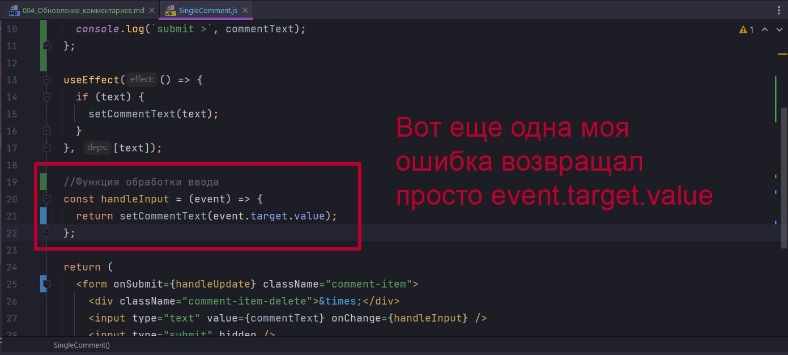
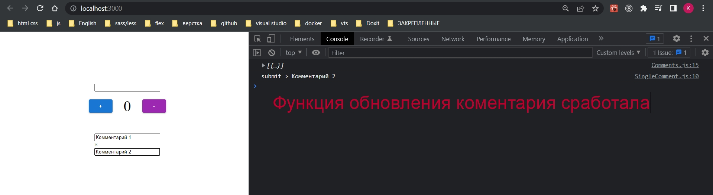
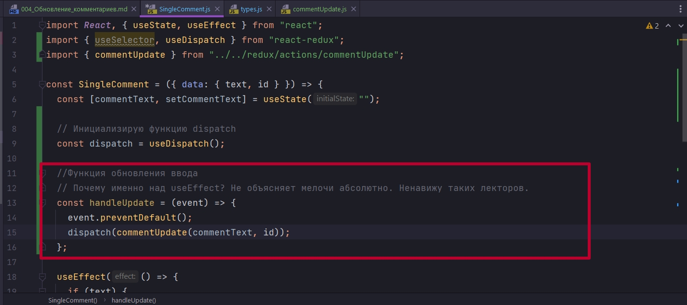
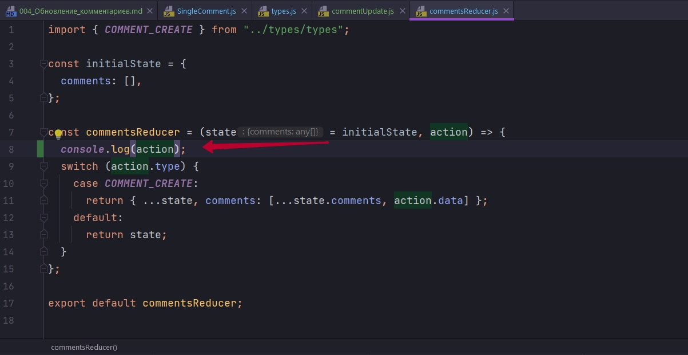
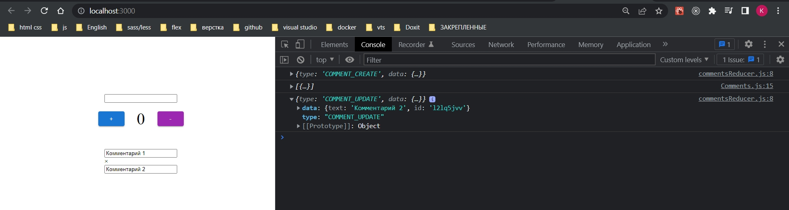
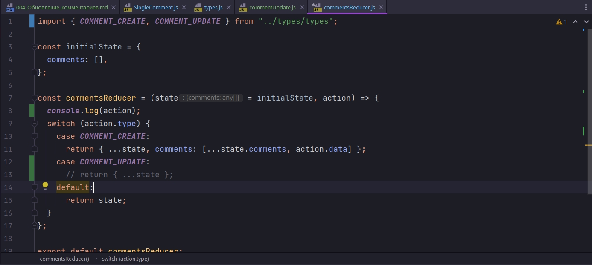
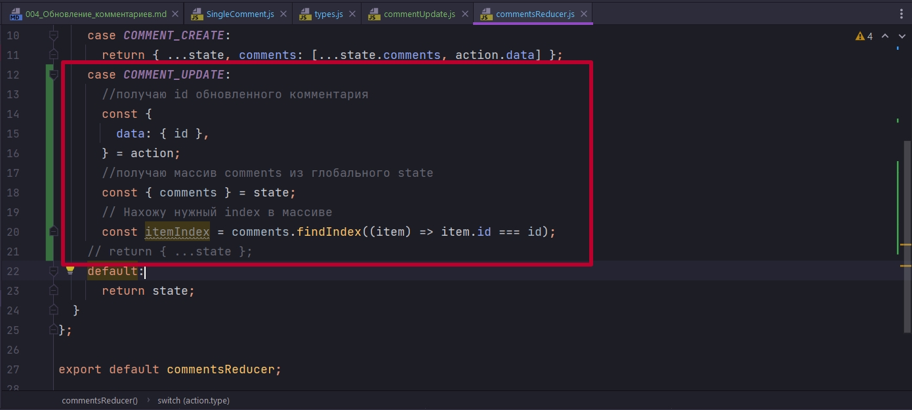
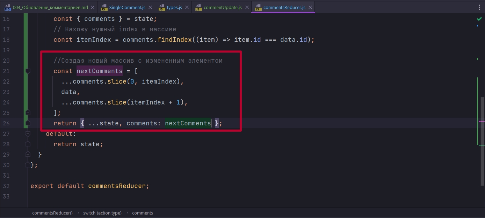
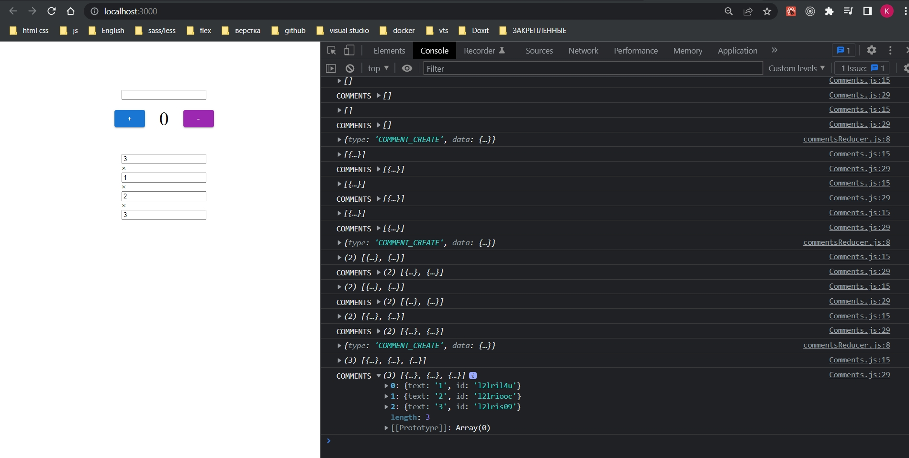
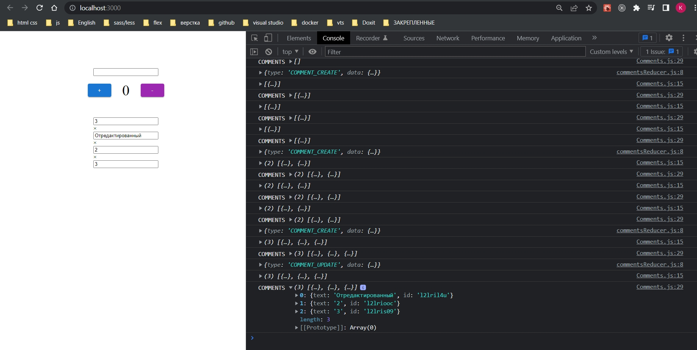

# 004_Обновление_комментариев

Обновляем каждый конкретный комментарий в нашем хранилище.

Давайте при каждом сабмите нашей формы, в компоненте SingleComment, мы будем вызывать функцию. Для этого на теге form вызываю атрибут onSubmit и передаю туда функцию handleUpdate.

И создаю эту функцию handleUpdate



```js
import React, { useState, useEffect } from "react";

const SingleComment = ({ data: { text, id } }) => {
  const [commentText, setCommentText] = useState("");

  //Функция обновления ввода
  // Почему именно над useEffect? Не объясняет мелочи абсолютно. Ненавижу таких лекторов.
  const handleUpdate = (event) => {
    event.preventDefault();
    console.log(`submit >`, commentText);
  };

  useEffect(() => {
    if (text) {
      setCommentText(text);
    }
  }, [text]);

  //Функция обработки ввода
  const handleInput = (event) => {
    return setCommentText(event.target.value);
  };

  return (
    <form onSubmit={handleUpdate} className="comment-item">
      <div className="comment-item-delete">&times;</div>
      <input type="text" value={commentText} onChange={handleInput} />
      <input type="submit" hidden />
    </form>
  );
};

export default SingleComment;

```



В функции handleUpdate мы получаем обновленный текст комментария. Само обновление происходит там где я допустил ошибку, в функции handleInput функция setCommentText следит за изменениями в input.

И собственно теперь мне нужно этот обновленный комментарий, в функции handleUpdate, по id доставить в redux и там этот конкретный комментарий обновить.

Первое что мы сделаем это перейдем в файл redux/types/types.js и создадим новый тип COMMENT_UPDATE

```js
export const INCREMENT = "INCREMENT";
export const DECREMENT = "DECREMENT";

export const INPUT_TEXT = "INPUT_TEXT";

export const COMMENT_CREATE = "COMMENT_CREATE";
export const COMMENT_UPDATE = "COMMENT_UPDATE";

```

Далее создадим наш новый action creator commentUpdate.js.

```js
import { COMMENT_UPDATE } from "../types/types";

export const commentUpdate = (text, id) => {
  return {
    type: COMMENT_UPDATE,
    data: { text, id },
  };
};

```

Импортируем action creator в наш компонент SingleComment. И далее для того что бы использовать dispatch в функции handleUpdate мы импортируем наши хуки useSelector useDispatch из пакета react-redux.



```js
import React, { useState, useEffect } from "react";
import { useSelector, useDispatch } from "react-redux";
import { commentUpdate } from "../../redux/actions/commentUpdate";

const SingleComment = ({ data: { text, id } }) => {
  const [commentText, setCommentText] = useState("");

  // Инициализирую функцию dispatch
  const dispatch = useDispatch();

  //Функция обновления ввода
  // Почему именно над useEffect? Не объясняет мелочи абсолютно. Ненавижу таких лекторов.
  const handleUpdate = (event) => {
    event.preventDefault();
    dispatch(commentUpdate(commentText, id));
  };

  useEffect(() => {
    if (text) {
      setCommentText(text);
    }
  }, [text]);

  //Функция обработки ввода
  const handleInput = (event) => {
    return setCommentText(event.target.value);
  };

  return (
    <form onSubmit={handleUpdate} className="comment-item">
      <div className="comment-item-delete">&times;</div>
      <input type="text" value={commentText} onChange={handleInput} />
      <input type="submit" hidden />
    </form>
  );
};

export default SingleComment;

```

Теперь перейду в наш commentsReducer и посмотрим что у нас в action.





Теперь в commentsReducer создаю еще один case COMMENT_UPDATE



И теперь займемся обновлением. Теперь что бы нам обновить комментарий, нам нужно сделать две вещи. Взфть наш новый обновленный комментарий который находится в объекте action.data. достаю его оттуда.

Далее мне нужно взять все комментарии из глобального state.comments и так же достать их. 

Далее нахожу индексное значение, которое я хочу поменять внутри массива comments. Создаю перемнную itemIndex. На массиве вызываю comments вызываю функцию findIndex и мне нужно найти элемент у которого id равен id который я получаю из объекта action который содержится в объекте data.



Теперь я знаю индексное значение комментария который я хочу поменять.

Теперь я создаю новую переменную и называю ее nextComments - это у нас будет новый массив. И теперь мы используем оператор spreed и метод slice что бы сначало скопировать в наш новый массив nextComments все элементы старого массива comments и до элемента с нашим индексным значением. После чего вставляю наш объект data, который содержит обновленный комментарий и id. Пришлось исправить деструктуризацию из объекта action. И далее вставляю все элементы после обновленного элемента массива.



Таким образом я как бы вырезаю старый комментарий и вставляю новый.

```js
import { COMMENT_CREATE, COMMENT_UPDATE } from "../types/types";

const initialState = {
  comments: [],
};

const commentsReducer = (state = initialState, action) => {
  console.log(action);
  switch (action.type) {
    case COMMENT_CREATE:
      return { ...state, comments: [...state.comments, action.data] };
    case COMMENT_UPDATE:
      //получаю id обновленного комментария
      const { data } = action;
      //получаю массив comments из глобального state
      const { comments } = state;
      // Нахожу нужный index в массиве
      const itemIndex = comments.findIndex((item) => item.id === data.id);

      //Создаю новый массив с измененным элементом
      const nextComments = [
        ...comments.slice(0, itemIndex),
        data,
        ...comments.slice(itemIndex + 1),
      ];
      return { ...state, comments: nextComments };
    default:
      return state;
  }
};

export default commentsReducer;

```

Далее в компоненте Comments посмотрю что прихдит.

```js
import React, { useState } from "react";
import { useSelector, useDispatch } from "react-redux";
import uniqid from "uniqid";
import SingleComment from "./SingleComment/SingleComment";
import { commentCreate } from "../redux/actions/commentCreate";

const Comments = (props) => {
  const [textComment, setTextComment] = useState("");

  //Инициализирую функцию dispatch
  const dispatch = useDispatch();

  //Получаю значения из глобального state
  const { comments } = useSelector((state) => state.commentsReducer);
  console.log(comments);

  //Функция обработки инпута
  const handleInput = (event) => {
    setTextComment(event.target.value);
  };

  const handleSubmit = (event) => {
    event.preventDefault();
    //Создаю уникальный id для комментария
    const id = uniqid();
    dispatch(commentCreate(textComment, id));
  };

  console.log(`COMMENTS`, comments);

  return (
    <div className="card-comments">
      <form onSubmit={handleSubmit} className="comments-item-create">
        <input type="text" value={textComment} onChange={handleInput} />
        <input type="submit" hidden />
      </form>
      {!!comments.length &&
        comments.map((comment) => {
          return <SingleComment key={comment.id} data={comment} />;
        })}
    </div>
  );
};

export default Comments;

```



И вот у меня есть три комментария. Редактирую




