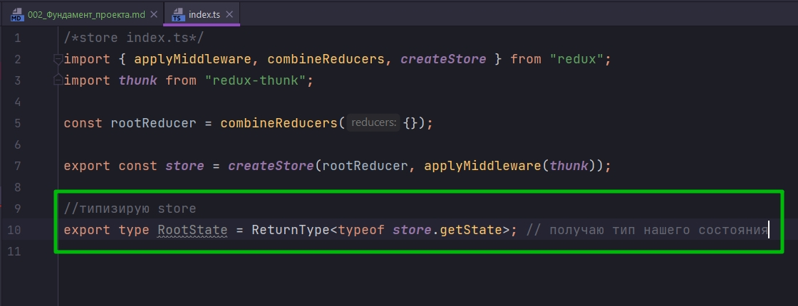
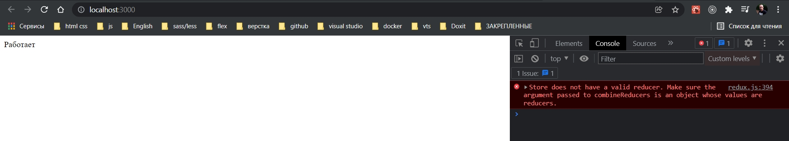

# Фундамент проекта. Роутинг. Управление состоянием. Файловая структура

Начнем с того что сделаем обертку над нашим компонентом **App**. Подключим **Redux** и **Browser-router** для того что бы была навигация.

```tsx
//index.tsx
import React from 'react';
import ReactDOM from 'react-dom';
import App from './App';
import {Provider} from "react-redux";

ReactDOM.render(
    <Provider store={}>
        <App />
    </Provider>
    ,
  document.getElementById('root')
);
```
Сам **store** мы создадим чуть позже и прокинем его в **Provider**.

Так же компонент **App** обернем в **BrowserRouter** для того что бы можно было комфортно работать с навигацией.

```tsx
//index.tsx
import React from 'react';
import ReactDOM from 'react-dom';
import App from './App';
import {Provider} from "react-redux";
import {BrowserRouter} from "react-router-dom";

ReactDOM.render(
    <Provider store={}>
        <BrowserRouter>
            <App />
        </BrowserRouter>

    </Provider>
    ,
  document.getElementById('root')
);
```

И так мы определились что в нашем приложении будет страница с логином и страница с календарем. Создаю папку **pages** и в ней сразу же создаю два компонента **Login.tsx** и **Event.tsx**

```tsx
// pages Login
import React, {FC} from 'react';

const Login : FC = () => {
    return (
        <div>
            Login PAGE
        </div>
    );
};

export default Login;
```

```tsx
//pages Event.tsx
import React, {FC} from 'react';

const Event : FC = () => {
    return (
        <div>
            Event PAGE
        </div>
    );
};

export default Event;
```

Теперь зададим файловую структуру.
- Создадим папку **components**. В ней будут все компоненты нашего приложения.
- Папку **store** в ней мы будем работать с **redux**.
- И папку **models** в ней мы будем описывать типы тех сущностей с которыми мы будем в ходе этого курса работать. 

Настроим **redux**. Сделаем всю необходимую конфигурацию. В папке **store** создаю **index.ts**

Отсюда сразу экспортирую константу **store**. C помощью функции **createStore()** мы инициализируем константу **store**.

```ts
/*store index.ts*/
import {createStore} from "redux";

export const store = createStore()
```

Первым параметром она принимает некоторый **reducer**. По этому создаю этот **reducer**. Создаю константу **rootReducer** и инициализирую ее с помощью функции **combineReducers()**. В **combineReducers()** аргументом передаю **{}** объект в котором в последующем будут наши редюссеры.

**rootReducer** передаю первым параметром в **createStore**. 

И сразу же подключаю **middleware**. **middleware** в **redux** подключаются с помощью функции **applyMiddleware**. У нас будет один **middleware** это **redux-thunk**.

```ts
/*store index.ts*/
import { applyMiddleware, combineReducers, createStore } from "redux";
import thunk from "redux-thunk";

const rootReducer = combineReducers({});

export const store = createStore(rootReducer, applyMiddleware(thunk));

```

И поскольку мы работаем с **TS** нам необходимо наш **store** типизировать. Знать с какими типами мы будем работать когда будем получать какие-то данные или их изменять. По этому первое что мы делаем это получаем тип нашего состояния



А само состояние мы достаем с помощью функции **getState** c помощью вот такой вот конструкции.

```ts
export type RootState = ReturnType<typeof store.getState>; // получаю тип нашего состояния

```

Этот тип будет знать о **reducers** с которыми мы работаем и о тех данных с которыми этот **reducer** работает т.е. состояние каждого отдельного **reducer**.

Так же сразу получим тип нашего **dispatch**

```ts
/*store index.ts*/
import { applyMiddleware, combineReducers, createStore } from "redux";
import thunk from "redux-thunk";

const rootReducer = combineReducers({});

export const store = createStore(rootReducer, applyMiddleware(thunk));

//типизирую store
export type RootState = ReturnType<typeof store.getState>; // получаю тип нашего состояния
// получаю тип dispatch
export type AppDispatch = typeof store.dispatch;

```

И вот в документации откуда я это беру. <https://redux.js.org/usage/usage-with-typescript>


здесь используется **redux-toolkit**, но в целом идея понятна.


Получаем тип состояния и получаем тип диспатча.

В папке **store** создаю папку **reducers**.

**store** у нас готов по этому прокидываю его в **Provider**.

```tsx
//index.tsx
import React from "react";
import ReactDOM from "react-dom";
import App from "./App";
import { Provider } from "react-redux";
import { BrowserRouter } from "react-router-dom";
import { store } from "./store";

ReactDOM.render(
    <Provider store={store}>
        <BrowserRouter>
            <App />
        </BrowserRouter>
    </Provider>,
    document.getElementById("root")
);
```



Приложение работает но нет валидного редюссера.
