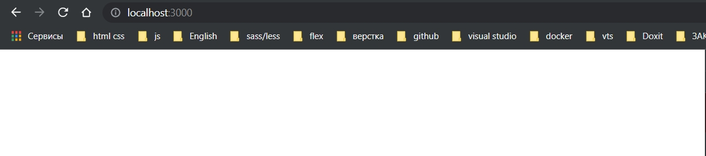

# 003_Постраничная_навигация

Создаю еще одну папку в корне проекта и называю ее **router**. Внутри создаю **index.ts**. И здесь мы будем описывать все маршруты, все страницы которые будут в нашем приложении. 

Создаю массив **routes**. Этот массив необходимо типизировать. Можно взять необходимый тип из библиотеки **react-router-dom**. Но давайте реализуем свой с минимально необходимым набором полей. 

Для этого создаю **interface IRoute**. В нем создаю поле **path:** которое будет **string**. В нем будет указываться путь до того или иного компонента. Соответственно сам **component:** он будет типа **React.ComponentType**.

И так же будет **boolean флаг exact?:** который позволяет однозначно индентифицировать маршрут.

```ts
import React from "react";

export interface IRoute {
  path: string;
  component: React.ComponentType;
  exact?: boolean;
}

export const routes = [];

```

Теперь для массива **routes** указываю что он будет состоять из объектов который имеет тип **IRoute**.


```ts
import React from "react";

export interface IRoute {
  path: string;
  component: React.ComponentType;
  exact?: boolean;
}

export const routes: IRoute[] = [];

```

У нас приложение не большое и здесь будет всего два маршрута. Это страница с логином, и страница с календарем. 

Но дело в том что на страницу с календарем могут попасть только авторизованные пользователи. А на страницу логина как раз не авторизованные пользователи.

По этому мы создадим два миссива с маршрутами. И в зависимости от того авторизован пользователь или нет, мы будем отображать тот или иной маршрут.

```ts
// router index.ts
import React from "react";
import Login from "../pages/Login";
import Event from "../pages/Event";

export interface IRoute {
    path: string;
    component: React.ComponentType;
    exact?: boolean;
}
// маршруты для не авторизованных пользователей
export const publicRoutes: IRoute[] = [
    { path: "/login", exact: true, component: Login },
];

//Маршруты для авторизованных пользователей
export const privetRoutes: IRoute[] = [
    { path: "/", exact: true, component: Event },
];

```

И в идеале. Поскольку у нас приложение будет разрастаться. Какие то маршруты будут изменяться. Мы создаем некоторый словарь, в котором будем хранить вс маршруты к тому или иному компоненту.

Поэтому создаю **enum**(перечисление), называю его **RouterNames**

```ts
// router index.ts
import React from "react";
import Login from "../pages/Login";
import Event from "../pages/Event";

export interface IRoute {
  path: string;
  component: React.ComponentType;
  exact?: boolean;
}

//создаю перечисления маршрутов
export enum RouteNames {
  LOGIN = "/login",
  EVENT = "/",
}

// маршруты для не авторизованных пользователей
export const publicRoutes: IRoute[] = [
  { path: RouteNames.LOGIN, exact: true, component: Login },
];

//Маршруты для авторизованных пользователей
export const privetRoutes: IRoute[] = [
  { path: RouteNames.EVENT, exact: true, component: Event },
];

```

И в дальнейшем если мы зохотим в одном месте что-то поменять. При использовании этого словаря у нас будет меняться все во всем приложении.

На данны момент мы описали маршруты, но как бы не сделали их физически активными.

Для этого в папке **components** создаю компонент **AppRouter.tsx**. Именно здесь мы будем описывать всю логику по маршрутизации. В корень я помещаю компонент **Switch** который импортирую из библиотеки **react-router-dom**. Так же нам понадобится **Route** и **Redirect**.

И так написал так как у него, но у меня подсвечиваются ошибки.


Решение <https://stackoverflow.com/questions/63124161/attempted-import-error-switch-is-not-exported-from-react-router-dom>


Решение <https://stackoverflow.com/questions/63690695/react-redirect-is-not-exported-from-react-router-dom>


```tsx
import React from "react";
import { Routes, Route, Navigate } from "react-router-dom";

const AppRouter = () => {
  return <Routes></Routes>;
};

export default AppRouter;

```

**Routes** как и **Switch** Позволяет выбрать только один маршрут. Документация <https://reactrouter.com/docs/en/v6/getting-started/overview>. Habr: <https://habr.com/ru/company/kts/blog/598835/>.

Мы можем выбрать только один маршрут. И если ни один из маршрутов не был найден, то мы можем сделать **Redirect** т.е. **Navigate** <https://reactrouter.com/docs/en/v6/api>.

С помощью **Routes** мы будем группировать какие-то логические куски. В данном случае по флагу **auth**, которы показывает авторизован пользователь или нет.

```ts
import React from "react";
import { Routes, Route, Navigate } from "react-router-dom";

const AppRouter = () => {
  const auth = true;
  return auth === true ? <Routes></Routes> : <Routes></Routes>;
};

export default AppRouter;

```

Если пользователь авторизован мы пробегаемся по массиву **privetRoutes**  с помощью функции **map**. И наша задача преобразовать объекты, которые у нас находятся в этом массиве, в компонент **Route**

```tsx
import React from "react";
import { Routes, Route, Navigate } from "react-router-dom";
import { privetRoutes, publicRoutes } from "../router";

const AppRouter = () => {
  const auth = true;
  return auth === true ? (
    <Routes>
      {privetRoutes.map((route) => (
        <Route
          path={route.path}
          exact={route.exact}
          component={route.component}
          key={route.path}
        />
      ))}
    </Routes>
  ) : (
    <Routes>
      {publicRoutes.map((route) => (
        <Route
          path={route.path}
          exact={route.exact}
          component={route.component}
          key={route.path}
        />
      ))}
    </Routes>
  );
};

export default AppRouter;
```


Почему то ругается на **exact**


> Exact не нужно использовать в этой версии библиотеки react-router-dom. 

**Так же у меня возникла проблема в атрибуте element - который используется в место component. Мои предположения он как то не правильно считывает Компонент который я ему передал в**


**Провозился несколько дней.**

**Перешел к  старой версии библиотеки**

```shell
npm i react-router-dom@5.2.0
```

```tsx
import React, { FC } from "react";
import { Switch, Route, Redirect } from "react-router-dom";
import { privateRoutes, publicRoutes } from "../router";

const AppRouter: FC = () => {
  const auth = false;
  return auth ? (
    <Switch>
      {privateRoutes.map((route) => (
        <Route
          path={route.path}
          exact={route.exact}
          component={route.component}
          key={route.path}
        />
      ))}
    </Switch>
  ) : (
    <Switch>
      {publicRoutes.map((route) => (
        <Route path={route.path} component={route.component} key={route.path} />
      ))}
    </Switch>
  );
};

export default AppRouter;

```

Когда пользователь не авторизован.




И когда пользователь авторизован.


Сейчас пользователь может указать любой **url** и у него будет просто белое окно. Обрабатываю этот случай. Делаю **Redirect**.

```tsx
import React, { FC } from "react";
import { Switch, Route, Redirect } from "react-router-dom";
import { privateRoutes, publicRoutes, RouteNames } from "../router";

const AppRouter: FC = () => {
  const auth = false;
  return auth ? (
    <Switch>
      {privateRoutes.map((route) => (
        <Route
          path={route.path}
          exact={route.exact}
          component={route.component}
          key={route.path}
        />
      ))}
      <Redirect to={RouteNames.EVENT} />
    </Switch>
  ) : (
    <Switch>
      {publicRoutes.map((route) => (
        <Route path={route.path} component={route.component} key={route.path} />
      ))}
      <Redirect to={RouteNames.LOGIN} />
    </Switch>
  );
};

export default AppRouter;

```


