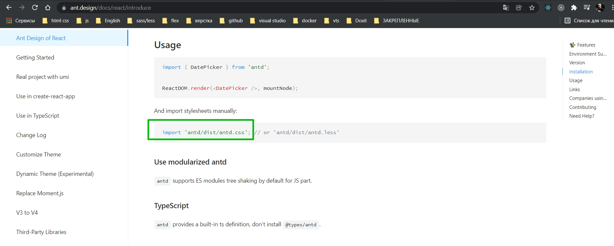
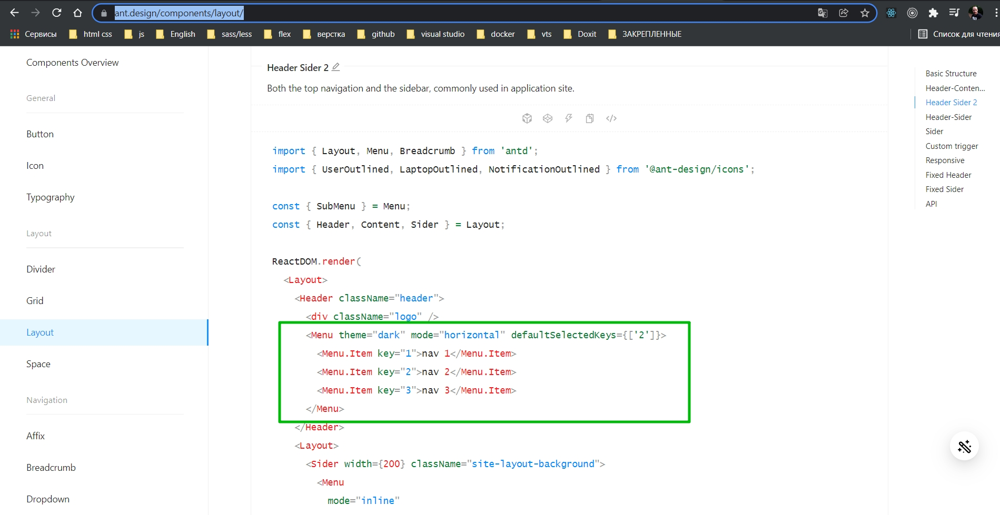

# Layout приложения. Каркас. Ant Design

Сделаем шапку. Какую-то контентную часть.

В **ant.design** есть такой компонент как **layout** <https://ant.design/components/layout/>.


таким вот образом примерно создается структура по семантике.

Создаю компонент **Navbar.tsx**

```tsx
import React, { FC } from "react";
import { Layout, Row } from "antd";

const Navbar: FC = () => {
  return (
    <Layout.Header>
      <Row justify="end">
        <h1>String</h1>
      </Row>
    </Layout.Header>
  );
};

export default Navbar;

```

```tsx
import React, { FC } from "react";
import AppRouter from "./components/AppRouter";
import Navbar from "./components/Navbar";
import { Layout } from "antd";

const App: FC = () => {
    return (
        <Layout>
            <Navbar />
            <Layout.Content>
                <AppRouter />
            </Layout.Content>
        </Layout>
    );
};

export default App;

```

**<Layout.Content>** - это чисто семантика.

Если мы сейчас посмотрим на сайт, то увидим что стили не применились. 


Все дело в том что необходимо импортировать некоторый css файл



Можем добавить ее как в компонент **App.tsx**, так и в файл со стилями. Добавлю в файл со стилями **App.css**. Единственное нужно внести некоторые корректировки. Перед импортом добавляю знак @, а в начале пути знак тильды ~.

```css
/*App.css*/
@import '~antd/dist/antd.css';
```

```tsx
import React, { FC } from "react";
import AppRouter from "./components/AppRouter";
import Navbar from "./components/Navbar";
import { Layout } from "antd";
import "./App.css";

const App: FC = () => {
  return (
    <Layout>
      <Navbar />
      <Layout.Content>
        <AppRouter />
      </Layout.Content>
    </Layout>
  );
};

export default App;

```


Реализуем навигационную панель. Аналогичным образом как это сделано в документации. Добавлю некоторе **Menu** <https://ant.design/components/layout/>



```tsx
import React, { FC } from "react";
import { Layout, Menu, Row } from "antd";

const Navbar: FC = () => {
    return (
        <Layout.Header>
            <Row justify="end">
                <Menu theme="dark" mode="horizontal">
                    <Menu.Item key={1}>Login</Menu.Item>
                </Menu>
            </Row>
        </Layout.Header>
    );
};

export default Navbar;

```

Пропсы беру из документации.


По факту не авторизованный пользователь сейчас может попасть на одну единственную страницу с логином. Но предусмотрим. Сделаем так что бы при нажатии на кнопку нас перекидывало на страницу логина.

Инициализирую переменную **router** хуком **useHistory()**.

```tsx
import React, { FC } from "react";
import { Layout, Menu, Row } from "antd";
import { useHistory } from "react-router-dom";
import { RouteNames } from "../router";

const Navbar: FC = () => {
  const router = useHistory();
  return (
    <Layout.Header>
      <Row justify="end">
        <Menu theme="dark" mode="horizontal" selectable={false}>
          <Menu.Item onClick={() => router.push(RouteNames.LOGIN)} key={1}>
            Login
          </Menu.Item>
        </Menu>
      </Row>
    </Layout.Header>
  );
};

export default Navbar;

```

Теперь опять же от того авторизован пользователь или нет. Нам необходимо отображать **Navbar** по разному.

```tsx
import React, { FC } from "react";
import { Layout, Menu, Row } from "antd";
import { useHistory } from "react-router-dom";
import { RouteNames } from "../router";

const Navbar: FC = () => {
  const router = useHistory();
  const auth = true;
  return (
    <Layout.Header>
      <Row justify="end">
        {auth ? (
          <>
            <div style={{ color: "white" }}>
              {/*Имя пользователя пока захардкоженое*/}
              USER
            </div>
            <Menu theme="dark" mode="horizontal" selectable={false}>
              <Menu.Item onClick={() => console.log(`Logout`)} key={1}>
                Logout
              </Menu.Item>
            </Menu>
          </>
        ) : (
          <Menu theme="dark" mode="horizontal" selectable={false}>
            <Menu.Item onClick={() => router.push(RouteNames.LOGIN)} key={1}>
              Login
            </Menu.Item>
          </Menu>
        )}
      </Row>
    </Layout.Header>
  );
};

export default Navbar;

```


