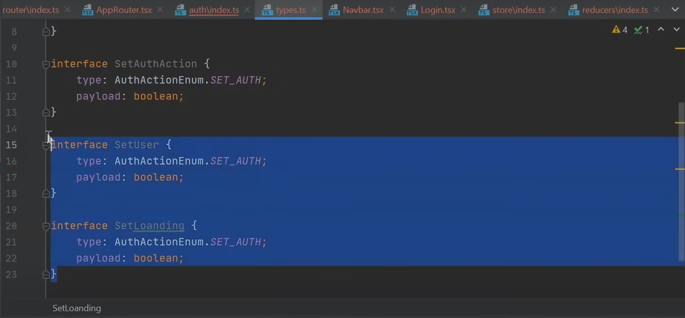
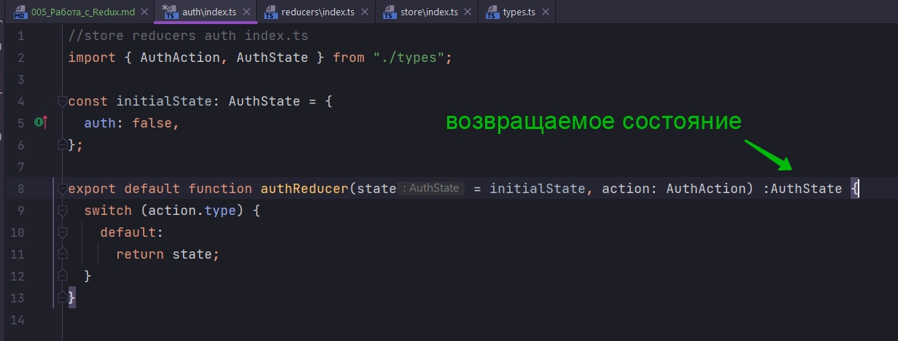
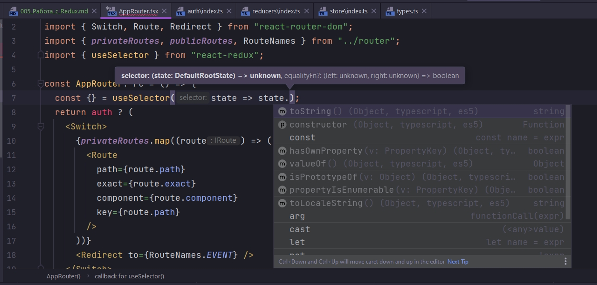
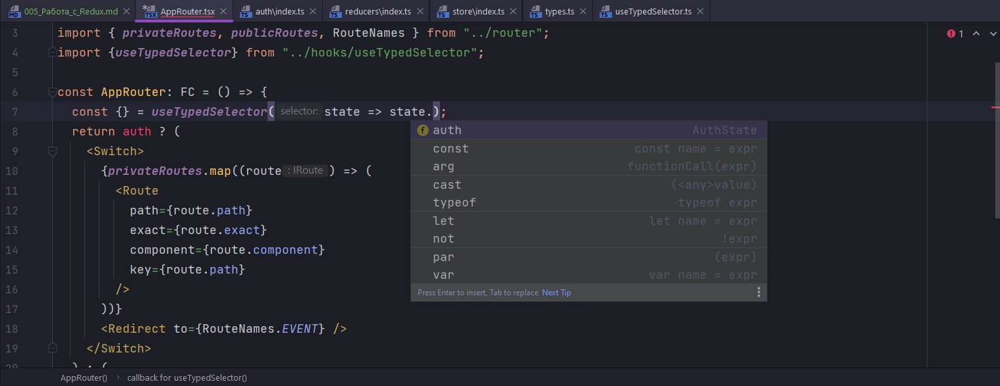
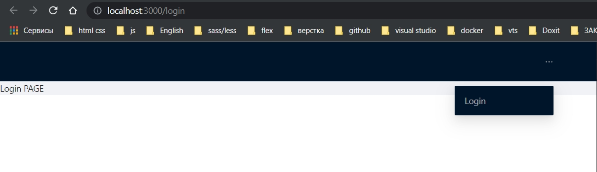

# Первый Reducer. Работа с Redux. Типизация

*[Типизирование_authReducer](##Типизирование_authReducer)
*[Хук_useTypedSelector](##Хук_useTypedSelector)

На данный момент этот флаг **auth** захардкожен у нас в **AppRouter.tsx** и в **Navbar.tsx**

```tsx
import React, {FC} from "react";
import {Switch, Route, Redirect} from "react-router-dom";
import {privateRoutes, publicRoutes, RouteNames} from "../router";

const AppRouter: FC = () => {
    const auth = true;
    return auth ? (
        <Switch>
            {privateRoutes.map((route) => (
                <Route
                    path={route.path}
                    exact={route.exact}
                    component={route.component}
                    key={route.path}
                />
            ))}
            <Redirect to={RouteNames.EVENT}/>
        </Switch>
    ) : (
        <Switch>
            {publicRoutes.map((route) => (
                <Route path={route.path} component={route.component} key={route.path}/>
            ))}
            <Redirect to={RouteNames.LOGIN}/>
        </Switch>
    );
};

export default AppRouter;

```

```tsx
import React, {FC} from "react";
import {Layout, Menu, Row} from "antd";
import {useHistory} from "react-router-dom";
import {RouteNames} from "../router";

const Navbar: FC = () => {
    const router = useHistory();
    const auth = true;
    return (
        <Layout.Header>
            <Row justify="end">
                {auth ? (
                    <>
                        <div style={{color: "white"}}>
                            {/*Имя пользователя пока захардкоженое*/}
                            USER
                        </div>
                        <Menu theme="dark" mode="horizontal" selectable={false}>
                            <Menu.Item onClick={() => console.log(`Logout`)} key={1}>
                                Logout
                            </Menu.Item>
                        </Menu>
                    </>
                ) : (
                    <Menu theme="dark" mode="horizontal" selectable={false}>
                        <Menu.Item onClick={() => router.push(RouteNames.LOGIN)} key={1}>
                            Login
                        </Menu.Item>
                    </Menu>
                )}
            </Row>
        </Layout.Header>
    );
};

export default Navbar;

```

Настал момент сделать первый **Reducer** который как раз будет отвечать за авторизацию и именно за логику по работе с
данными о пользователе.

Внутри папки **reducers** создаю папку **auth**, и в ней создаю **index.ts**. В этом файле по дефолту экспортирую функцию
**authReducer**. Это будет непосредственно сам редюсер. Редюсер параметрами принимает некоторый **state** и **action**.

```ts
//reducers auth index.ts
export default function authReducer(state, action) {
}

```

Так же сразу создаю объект который будет хранить дефолтное значение состояния. Называю его **initialState** и в него входят
такие поля как **auth:false**

```ts
//reducers auth index.ts

const initialState = {
    auth: false,
};

export default function authReducer(state, action) {
}

```

Типизирую **reducer** немного позже. А пока создаю конструкцию **switch** **case**, который в зависимости от **action.type** будет
возвращать разное состояние.

```ts
//reducers auth index.ts

const initialState = {
    auth: false,
};

export default function authReducer(state, action) {
    switch (action.type) {
        default:
            return state;
    }
}

```

Теперь для того что бы этот **reducer** стал живым его необходимо добавить в корневой **rootReducer**.

```ts
/*store index.ts*/
import {applyMiddleware, combineReducers, createStore} from "redux";
import thunk from "redux-thunk";

const rootReducer = combineReducers({});

export const store = createStore(rootReducer, applyMiddleware(thunk));

//типизирую store
export type RootState = ReturnType<typeof store.getState>; // получаю тип нашего состояния
// получаю тип dispatch
export type AppDispatch = typeof store.dispatch;

```

Но что бы не нагромождать этот файл, поскольку **reducer-ов** у нас может быть много, внутри папки **reducer** мы создадим еще
один **index.ts** файл, и все **reducer-ры** которые будут у нас в приложении будем импортировать сюда и одной пачкой их отсюда
экспортировать.

```ts
// store reducers index.ts
import auth from "./auth"; // authReducer

export default {
    auth,
};

```

Здесь может быть безграничное количество редюсеров. Мы по итого их собираем все в один объект. И далее экспортируем в
файл в котором мы инициализируем рутовый редюсер.

Импортирую этот объект с редусерами как **reducers** в файл в котором инициализирую рутовый редюсер. И передаю этот объект
**reducers** в **combineReducers(reducers)**. **reducers** - это объект. Если просто в **combineReducers** передавать редюсеры то это
будет выглядеть так **combineReducers(..., ..., ..., и т.д.)**

```ts
/*store index.ts*/
import {applyMiddleware, combineReducers, createStore} from "redux";
import thunk from "redux-thunk";
import reducers from "./reducers"; // импортирую все редюсеры

const rootReducer = combineReducers(reducers); // передаю объект со всеми reducers

export const store = createStore(rootReducer, applyMiddleware(thunk));

//типизирую store
export type RootState = ReturnType<typeof store.getState>; // получаю тип нашего состояния
// получаю тип dispatch
export type AppDispatch = typeof store.dispatch;

```

Как минимум этот файл остается чистым и нет нагромождения.

<br/>
<br/>
<br/>

## Типизирование_authReducer

Возвращаюсь обратно к **authReducer**. Теперь нам необходимо его типизировать. Типизировать **state** и типизировать все
возможные **actions** с которыми нам предстоит работать.

По этому внутри папки **auth** создаю еще один файл и называю его **types.ts**. Здесь мы экспортируем **interface AuthState**
который будет определять поля, которые будут в нашем состоянии.

```ts
//store reducers auth типизирую поля
export interface AuthState {
    auth: boolean;
}

```

Дальше у нас будет **action** с помощью которого мы будем изменять значение этого поля на **false** и на **true** соответственно.

По этому нам необходимо сделать некоторый **interface** который будет описывать поля **action**

```ts
//store reducers auth типизирую поля
export interface AuthState {
    auth: boolean;
}

//interface который описывает поля action
interface SetAuthAction {
    type: "SET_AUTH"; // обязательное поле для action
    payload: boolean; // некоторые данные которые этот action принимает
}

```

Но что бы не хардкодить строкой тип **action**, мы опять же создадим некоторое **enum**(перечисление) в котором мы все эти типы
будем хранить.

```ts
//store reducers auth типизирую поля
export interface AuthState {
    auth: boolean;
}

//перечисления типов
export enum AuthActionsEnum {
    SET_AUTH = "SET_AUTH",
}

//interface который описывает поля action
interface SetAuthAction {
    type: AuthActionsEnum.SET_AUTH; // обязательное поле для action
    payload: boolean; // некоторые данные которые этот action принимает
}

```

Ну и соответственно сколько бы **actions** у нас не было, нам необходимо создавать **interface** в котором мы будем указывать
уникальный тип и некоторый **payload** который будет ожидать этот **action**.



Пока что у нас один такой **action**.

Так же нужно сделать некоторый обобщающий тип который все эти интерфейсы в себя будет объеденять.

```ts
//store reducers auth типизирую поля
export interface AuthState {
    auth: boolean;
}

//перечисления типов
export enum AuthActionsEnum {
    SET_AUTH = "SET_AUTH",
}

//interface который описывает поля action
export interface SetAuthAction {
    type: AuthActionsEnum.SET_AUTH; // обязательное поле для action
    payload: boolean; // некоторые данные которые этот action принимает
}

// объеденяю interfaces
export type AuthAction = SetAuthAction; // остальные перечисляю через или |

```

Теперь мы можем возвращаться обратно к **reducer**. Во-первых указываем для состояния тип **AuthState**. И во-вторых указывам
тот обобщающий тип который мы сделали для **action**.

```ts
//store reducers auth index.ts
import {AuthAction, AuthState} from "./types";

const initialState: AuthState = {
    auth: false,
};

export default function authReducer(state = initialState, action: AuthAction) {
    switch (action.type) {
        default:
            return state;
    }
}

```

Так же **reducer** всегда должен возвращать состяние. **authReducer** - это функция. По этому в качестве возвращаемого значения
мы так же указываем **AuthState**. **Reducer** всегда должен возвращать состояние типа.



```ts
//store reducers auth index.ts
import {AuthAction, AuthState} from "./types";

const initialState: AuthState = {
    auth: false,
};

export default function authReducer(
    state = initialState,
    action: AuthAction
): AuthState {
    switch (action.type) {
        default:
            return state;
    }
}

```

Теперь я могу создать **case** который я получаю из перечисления **case AuthActionsEnum.SET_AUTH:** и отсюда мы так же
возвращаем состояние **return { ...state };** но уже с измененным полем **auth** которое мы получаем из **action**. Вторым
параметром я указываю **auth: action.payload**, т.е. ту полезную нагрузку которую я передаю в поле **auth**.

В **AppRouter** c помощью хука **useSelector**, мы можем нужное для нас поле **auth** из состояния вытащить. Но поумолчанию этот хук
не знает с каким типом мы работаем и какие у нас есть **reducers**, какое состояние в них находится.



По этому мы можем создать свой собственный хук который уже будет непосредственно работать с нашими типами.

Для лучшей семантики такие переменные как **auth** лучше называть как **isAuth**

```ts
//store reducers auth index.ts
import {AuthAction, AuthActionsEnum, AuthState} from "./types";

const initialState: AuthState = {
    isAuth: false,
};

export default function authReducer(
    state = initialState,
    action: AuthAction
): AuthState {
    switch (action.type) {
        case AuthActionsEnum.SET_AUTH:
            return {...state, isAuth: action.payload};
        default:
            return state;
    }
}

```

```ts
//store reducers auth типизирую поля
export interface AuthState {
    isAuth: boolean;
}

//перечисления типов
export enum AuthActionsEnum {
    SET_AUTH = "SET_AUTH",
}

//interface который описывает поля action
export interface SetAuthAction {
    type: AuthActionsEnum.SET_AUTH; // обязательное поле для action
    payload: boolean; // некоторые данные которые этот action принимает
}

// объеденяю interfaces
export type AuthAction = SetAuthAction; // остальные перечисляю через или |

```

## Хук_useTypedSelector

Теперь создаю хук. Создаю папку и называю ее **hooks**. В ней будут все пользовательские хуки которые мы будем в ходе
разработки создавать. Первых хук с которого начнем это c типизированного селектора **useTypedSelector.ts**. Это будет крейне
простой хук которыймы уместим в одну строчку.

Экспортируем отсюда константу, называем ее **useTypedSelector**. И сразу же зададим ей тип. Это будет специальный тип
**TypedUseSelectorHook** который предоставляет **react-redux**.

```ts
//hooks
import {TypedUseSelectorHook} from "react-redux";

export const useTypedSelector: TypedUseSelectorHook<any>;

```

В качестве **Generic** как раз указываю тот тип который отвечает за состояние нашего приложения т.е. **RootState**. И присваиваю
ему **useSelector** из пакета **react-redux**.

```ts
//hooks
import {TypedUseSelectorHook, useSelector} from "react-redux";
import {RootState} from "../store";

export const useTypedSelector: TypedUseSelectorHook<RootState> = useSelector;

```

Если не совсем понятно, то вникайте.

Теперь если в **AppRouter** мы воспользуемся этим хуком, то мы сразу увидим какие у нас есть **reducer**, какие у нас есть поля.
Т.е. у нас есть автокомплит и нам не нужно лазать по **reducer** смотреть.



```tsx
import React, {FC} from "react";
import {Switch, Route, Redirect} from "react-router-dom";
import {privateRoutes, publicRoutes, RouteNames} from "../router";
import {useTypedSelector} from "../hooks/useTypedSelector";

const AppRouter: FC = () => {
    const {isAuth} = useTypedSelector((state) => state.auth);
    return isAuth ? (
        <Switch>
            {privateRoutes.map((route) => (
                <Route
                    path={route.path}
                    exact={route.exact}
                    component={route.component}
                    key={route.path}
                />
            ))}
            <Redirect to={RouteNames.EVENT}/>
        </Switch>
    ) : (
        <Switch>
            {publicRoutes.map((route) => (
                <Route path={route.path} component={route.component} key={route.path}/>
            ))}
            <Redirect to={RouteNames.LOGIN}/>
        </Switch>
    );
};

export default AppRouter;

```

Теперь подобный флаг **isAuth** у нас один на все приложение. Мы можем его использовать как в **AppRouter** так и в нашем
**Navbar**.

```tsx
import React, { FC } from "react";
import { Layout, Menu, Row } from "antd";
import { useHistory } from "react-router-dom";
import { RouteNames } from "../router";
import { useTypedSelector } from "../hooks/useTypedSelector";

const Navbar: FC = () => {
  const router = useHistory();
  const { isAuth } = useTypedSelector((state) => state.auth);
  return (
    <Layout.Header>
      <Row justify="end">
        {isAuth ? (
          <>
            <div style={{ color: "white" }}>
              {/*Имя пользователя пока захардкоженое*/}
              USER
            </div>
            <Menu theme="dark" mode="horizontal" selectable={false}>
              <Menu.Item onClick={() => console.log(`Logout`)} key={1}>
                Logout
              </Menu.Item>
            </Menu>
          </>
        ) : (
          <Menu theme="dark" mode="horizontal" selectable={false}>
            <Menu.Item onClick={() => router.push(RouteNames.LOGIN)} key={1}>
              Login
            </Menu.Item>
          </Menu>
        )}
      </Row>
    </Layout.Header>
  );
};

export default Navbar;

```

Теперь в **store/reducers/auth/index.ts** попробуем поменять **isAuth** на значение **true**.

Т.е. изначально стоит **false**

```ts
//store reducers auth index.ts
import { AuthAction, AuthActionsEnum, AuthState } from "./types";

const initialState: AuthState = {
  isAuth: false,
};

export default function authReducer(
  state = initialState,
  action: AuthAction
): AuthState {
  switch (action.type) {
    case AuthActionsEnum.SET_AUTH:
      return { ...state, isAuth: action.payload };
    default:
      return state;
  }
}

```

При загрузке приложения я сразу попадаю на страницу логина.



Меняю на **true**, сразу редиректит на главную страницу. **Navbar** адаптируется под изменение состояния.

И так некоторый каркас приложения готов. Мы настроили наш **redux**, мы настроили маршрутизацию.


