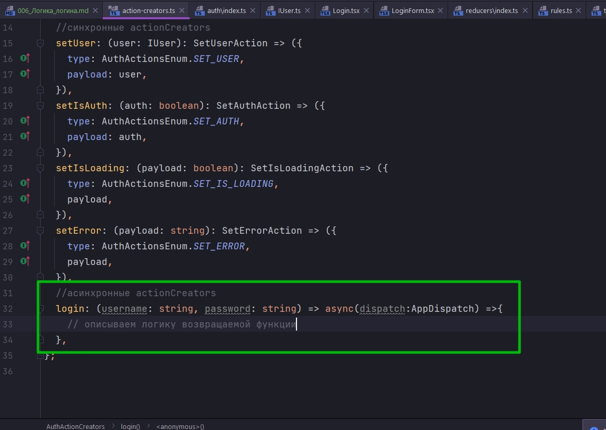
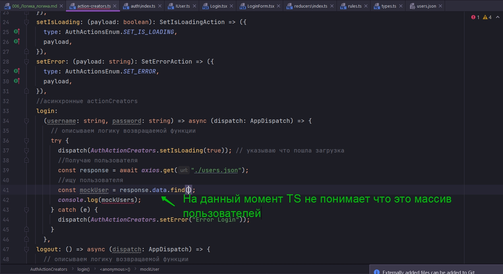
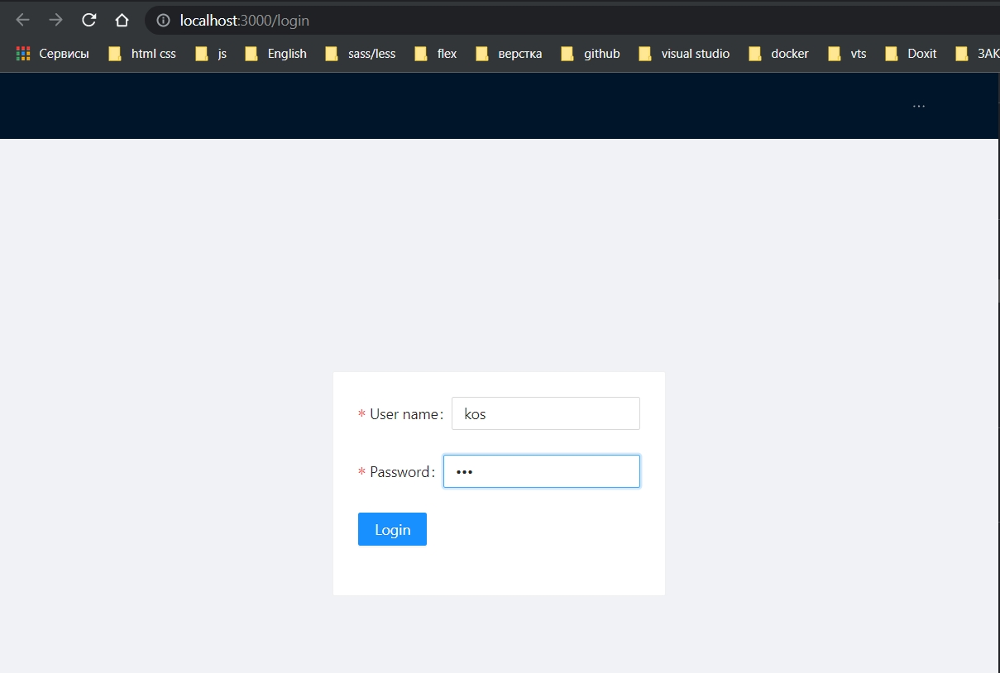

# 006_Логика_логина

* [Стили](##Стили)
* [пропс_rules](##пропс_rules)
* [Логика_Login_моковые_данные](##Логика_Login_моковые_данные)
* [Обработка_Submit](##Обработка_Submit)
* [redux_actions](###redux_actions)
* [model_IUser](###model_IUser)
* [enum_actions](###enum_actions)
* [interface_для_каждого_action](###interface_для_каждого_action)
* [reducer](###reducer)
* [actionCreators_синхронные](###actionCreators_синхронные)
* [actionCreators_асинхронные](###actionCreators_асинхронные)
* [Вывод_ошибки_в_форму_и_обработки_индекации_загрузки](###Вывод_ошибки_в_форму_и_обработки_индекации_загрузки)
* [Управляемые_input](###Управляемые_input)
* [Кнопка_Logout](###Кнопка_Logout)

## Стили
В компоненте **Login** в корень опять же помещаю **Layout**, поскольку это у нас будет страница. После чего мы добавляем некоторую строку.

```tsx
// pages Login
import React, { FC } from "react";
import { Layout, Row } from "antd";

const Login: FC = () => {
  return (
    <Layout>
      <Row justify="center" align="middle" className="h100"></Row>
    </Layout>
  );
};

export default Login;

```

**justify="center"** - по ширине центр

**align="middle"** - по высоте центр

**className="h100"** - задаю класс для того что бы весь контент был по высоте экрана.

Теперь открою **App.css** файл и напишу некоторые стили. 

Посчитаю высоту с помощью функции **calc**. От всей высоты буду отнимать высоту **Navbar**.


```css
/*App.css*/
@import '~antd/dist/antd.css';

.h100{
    height: calc(100vh - 64px);
}
```

```tsx
// pages Login
import React, { FC } from "react";
import { Layout, Row } from "antd";

const Login: FC = () => {
  return (
    <Layout>
      <Row justify="center" align="middle" className="h100">
        Example Layout
      </Row>
    </Layout>
  );
};

export default Login;

```


Выглядит это так как и должно быть. Где будет находиться форма логина.

Создадим под эту форму отдельный компонент что бы мы могли ее переиспользовать. Создаю компонент **loginForm**. Возможно в будущем добавить в модальное окно или еще куда-то.

```tsx
//component LoginForm.jsx
import React, { FC } from "react";
import { Form } from "antd";

const LoginForm: FC = () => {
  return <Form></Form>;
};

export default LoginForm;

```

Ищем в документации компонент **Form** <https://ant.design/components/form/>. Если посмотрим код то в нутри **Form** Содержаться компоненты **Form.Item**, внутри которых уже находяться **Input-ы** c различными типами, **checkbox** и т.д.


```tsx
//component LoginForm.jsx
import React, { FC } from "react";
import { Form, Input } from "antd";

const LoginForm: FC = () => {
  return (
    <Form>
      <Form.Item
        label="Username"
        name="username"
        rules={[{ required: true, message: "Please input your username!" }]}
      >
        <Input />
      </Form.Item>
    </Form>
  );
};

export default LoginForm;

```
<br/>
<br/>
<br/>

## пропс_rules

Пропс **rules** в который передается массив с некоторыми настройками. Этот пропс предназначен для валидации. Мы можем сюда передавать несколько объектов по которым будет валидироваться тот или иной **input**. В данном случае **required** показывает что наличие какого-то текста внутри этого **input** обязательно.

```tsx
//component LoginForm.jsx
import React, { FC } from "react";
import { Form, Input } from "antd";

const LoginForm: FC = () => {
  return (
    <Form>
      <Form.Item
        label="User name"
        name="username"
        rules={[{ required: true, message: "Please input your username!" }]}
      >
        <Input />
      </Form.Item>
      <Form.Item
        label="Password"
        name="password"
        rules={[{ required: true, message: "Please input your password!" }]}
      >
        <Input />
      </Form.Item>
    </Form>
  );
};

export default LoginForm;

```

И добавляю на страницу логина

```tsx
// pages Login
import React, { FC } from "react";
import { Layout, Row } from "antd";
import LoginForm from "../components/LoginForm";

const Login: FC = () => {
  return (
    <Layout>
      <Row justify="center" align="middle" className="h100">
        <LoginForm />
      </Row>
    </Layout>
  );
};

export default Login;

```


>Так как почему-то у меня какая-то проблема с кирилицей, пишу на английском.

Остается добавить кнопку при которой будет происходить **submit** формы.

Откроем документаци. и посмотрим как это реализовано там.


```tsx
//component LoginForm.jsx
import React, { FC } from "react";
import { Button, Form, Input } from "antd";

const LoginForm: FC = () => {
  return (
    <Form>
      <Form.Item
        label="User name"
        name="username"
        rules={[{ required: true, message: "Please input your username!" }]}
      >
        <Input />
      </Form.Item>
      <Form.Item
        label="Password"
        name="password"
        rules={[{ required: true, message: "Please input your password!" }]}
      >
        <Input />
      </Form.Item>
      <Form.Item>
        <Button type="primary" htmlType="submit">
          Login
        </Button>
      </Form.Item>
    </Form>
  );
};

export default LoginForm;

```


При нажатии на кнопку у нас инпуты сразу валидируются.

Сейчас есть одна проблема. Мы передаем целый объект в котором есть поле **required**, поле **message**. Хотелось бы просто вызвать какую-то функцию, передать в нее сообщение и не париться какие поля там должны быть, особенно когда **rules** у нас может быть очень много. К примеру проверка ввода на максимальную, минимальную длинну, на проверку дат и т.д.

Создаю папку **utils** и в ней создаю **rules.ts**.

```tsx
// utils rules.ts
export const rules = {
    required: (message: string) => ({}),
};
```

В объект добавляю одно единственное правило **required**. Это будет стрелочная функция которая возвращает объект. Сама функция аргументом принимает **message:string**. И объект как раз будет содержать вот эти вот поля 


```tsx
// utils rules.ts
export const rules = {
  required: (message: string) => ({
    required: true,
    message, // уже не просто хардкожу а принимаю аргументом
  }),
};

```

Теперь когда мы вернем эту функцию, она вернет объект, и этот объект по итогу попадет в исходный массив, массив **rules**. В массиве обращаюсь к объекту **rules**, вызываю функцию **required** и туда просто передаю сообщение.


```tsx
//component LoginForm.jsx
import React, { FC } from "react";
import { Button, Form, Input } from "antd";
import { rules } from "../utils/rules";

const LoginForm: FC = () => {
  return (
    <Form>
      <Form.Item
        label="User name"
        name="username"
        rules={[rules.required("Please input your username!")]}
      >
        <Input />
      </Form.Item>
      <Form.Item
        label="Password"
        name="password"
        rules={[rules.required("Please input your password!")]}
      >
        <Input />
      </Form.Item>
      <Form.Item>
        <Button type="primary" htmlType="submit">
          Login
        </Button>
      </Form.Item>
    </Form>
  );
};

export default LoginForm;

```

При таком подходе нам не обязательно знать какие поля есть у объекта. Нам просто нужно вызвать соответствующую функцию валидатор и она вернет для нас необходимый объект. При этом мы передаем только сообщение, которе должно появлятся рядом с **input**, на тот случа если правило не сработало.


Все работает. На Этом этапе форма у нас готова и мы можем реализовать логику логина.

<br/>
<br/>
<br/>

## Логика_Login_моковые_данные

Работать мы будем с фейковыми моковыми данными т.е. с реальным серваком работать не будем. По этому в папке **public** создаю **users.json**. И здесь будет массив с уже заготовленными объектами.

```json
[
  {
    "username" : "user",
    "password" : "123"
  },
  {
    "username" : "admin",
    "password" : "123"
  },
  {
    "username" : "kos",
    "password" : "123"
  }
]
```

Если пользователь введет данные которые равны одному из этих объектов, то он залогинется. Такая имитация БД.

<br/>
<br/>
<br/>

## Обработка_Submit

Теперь посмотрим как обрабатывается **Submit** формы. Рекомендуется использовать **onFinish** на успешный сабмит формы, и **onFinishFailed** в случае когда **submit** формы провалился т.е. когда какое-то правило у нас не прошло и у нас есть ошибки.


Откроем компонент формы и добавим слушатель **onFinish**. Функцию которая на этот слушатель будет отрабатывать назовем **submit**. И сразу же внутри компонента ее создадим. 

```tsx
//component LoginForm.jsx
import React, { FC } from "react";
import { Button, Form, Input } from "antd";
import { rules } from "../utils/rules";

const submit = () => {
  console.log(`submit`);
};

const LoginForm: FC = () => {
  return (
    <Form onFinish={submit}>
      <Form.Item
        label="User name"
        name="username"
        rules={[rules.required("Please input your username!")]}
      >
        <Input />
      </Form.Item>
      <Form.Item
        label="Password"
        name="password"
        rules={[rules.required("Please input your password!")]}
      >
        <Input />
      </Form.Item>
      <Form.Item>
        <Button type="primary" htmlType="submit">
          Login
        </Button>
      </Form.Item>
    </Form>
  );
};

export default LoginForm;

```


<br/>
<br/>
<br/>

### redux_actions

Всю логику мы будем выносить в **redux** **actions**. Нам помимо флага **isAuth** необходимо будет хранить данные о пользователе. Перехожу в **types.ts** В **AuthState** добавляю еще одно поле **user:**


<br/>
<br/>
<br/>

### model_IUser

Но для этого поля **user** я создам отдельный **interface**, отдельную **model** в папке **models** **IUser.ts**  в которой опишем какие у него будут поля и какого типа.

```ts
//models User.tsx
//Здесь описываю поля которые буду забирать из users.json
export interface IUser {
    username: string;
    password: string;
}
```

Теперь открываю файл в котором я описываю типы и состояния **types.ts**. В **AuthState** добавляю поле **user: IUser;**  и еще добавляю поле   **isLoading: boolean;** а так же поле **error:string**.


<br/>
<br/>
<br/>

### enum_actions

Соответственно для изменения для каждого из этих полей мы создадим по соответствующему типу **actions** в нашем перечислении **enum**.


<br/>
<br/>
<br/>

### interface_для_каждого_action

И теперь создадим по отдельно взятому **interface** для каждого **action**.

```ts
//store reducers auth типизирую поля
import { IUser } from "../../../models/IUser";

export interface AuthState {
  isAuth: boolean;

  user: IUser;
  isLoading: boolean; // индикация загрузки
  error: string;
}

//перечисления типов
export enum AuthActionsEnum {
  SET_AUTH = "SET_AUTH",
  SET_ERROR = "SET_ERROR",
  SET_USER = "SET_USER",
  SET_IS_LOADING = "SET_IS_LOADING",
}

//interface который описывает поля action
export interface SetAuthAction {
  type: AuthActionsEnum.SET_AUTH; // обязательное поле для action
  payload: boolean; // некоторые данные которые этот action принимает
}

export interface SetErrorAction {
  type: AuthActionsEnum.SET_ERROR;
  payload: string; // сообщение об ошибке
}

export interface SetUserAction {
  type: AuthActionsEnum.SET_USER;
  payload: IUser; // Ожидаю данные описанные в interface IUser
}

export interface SetIsLoadingAction {
  type: AuthActionsEnum.SET_IS_LOADING;
  payload: boolean;
}

// объеденяю interfaces
export type AuthAction =
  | SetAuthAction
  | SetErrorAction
  | SetUserAction
  | SetIsLoadingAction; // остальные перечисляю через или |

```
<br/>
<br/>
<br/>

### reducer

Теперь открываю **reducer**. Нам сразу подсказывает что в **default** состоянии не хватает полей.


```ts
//store reducers auth index.ts
import { AuthAction, AuthActionsEnum, AuthState } from "./types";
import { IUser } from "../../../models/IUser";

const initialState: AuthState = {
  isAuth: false,
  error: "",
  isLoading: false,
  user: {} as IUser, // пустой объект типа IUser В котором описаны поля пользователя
};

export default function authReducer(
  state = initialState,
  action: AuthAction
): AuthState {
  switch (action.type) {
    case AuthActionsEnum.SET_AUTH:
      return { ...state, isAuth: action.payload };
    default:
      return state;
  }
}

```

Следующим этапом, внутри **reducer**, каждый из этих **action** необходимо обработать. Автокомплит сразуже нам подсказывает какие у нас есть возможные типы.


```ts
//store reducers auth index.ts
import { AuthAction, AuthActionsEnum, AuthState } from "./types";
import { IUser } from "../../../models/IUser";

const initialState: AuthState = {
  isAuth: false,
  error: "",
  isLoading: false,
  user: {} as IUser, // пустой объект типа IUser В котором описаны поля пользователя
};

export default function authReducer(
  state = initialState,
  action: AuthAction
): AuthState {
  switch (action.type) {
    case AuthActionsEnum.SET_AUTH:
      return { ...state, isAuth: action.payload, isLoading: false };
    case AuthActionsEnum.SET_USER:
      return { ...state, user: action.payload };
    case AuthActionsEnum.SET_ERROR:
      return { ...state, error: action.payload, isLoading: false }; // помимо того что мы устанавливаем ошибку, мы устанавливаем isLoading: false
    case AuthActionsEnum.SET_IS_LOADING:
      return { ...state, isLoading: action.payload };
    default:
      return state;
  }
}

```

И так с **actions** разобрались. Теперь реализуем **actionCreators**.

<br/>
<br/>
<br/>

### actionCreators_синхронные

Для этого внутри папки **auth** создаю файл **action-creators.ts**. Здесь можно **action-creators** либо экспортировать по отдельности, либо создать какой-нибудь объект и внутри него указать эти **action-creators**. Этот объект будет выступать в качестве обертки. **actionCreator** - это просто функция, которая принимает какой-то аргумент, и возвращает объект, соответственно сам **action**. У этого **action** есть какой-то тип **type: AuthActionsEnum.SET_USER**, и какой-то **payload: user**.


В нашем случае у нас уже есть соответствующий **interface** для каждого **action**, который как **type**, так и **payload** уже задает. В данном случае мы сделали **actionCreator** который аргументом принимает **user** и в **action** в качестве **payload** этого **user** прокидывает.

```ts
//store reducers auth action-creators.ts
// Объект обертка
import {
  AuthActionsEnum,
  SetAuthAction,
  SetUserAction,
  SetIsLoadingAction,
  SetErrorAction,
} from "./types";
import { IUser } from "../../../models/IUser";

export const AuthActionCreators = {
  setUser: (user: IUser): SetUserAction => ({
    type: AuthActionsEnum.SET_USER,
    payload: user,
  }),
  setIsAuth: (auth: boolean): SetAuthAction => ({
    type: AuthActionsEnum.SET_AUTH,
    payload: auth,
  }),
  setIsLoading: (payload: boolean): SetIsLoadingAction => ({
    type: AuthActionsEnum.SET_IS_LOADING,
    payload,
  }),
  setError: (payload: string): SetErrorAction => ({
    type: AuthActionsEnum.SET_ERROR,
    payload,
  }),
};

```

С синхронными **actionCreator** которые как-то изменяют **state** мы закончили. Теперь раелизую асинхронный **actionCreator**, который как раз будет отвечать за логику логина. Аргументами эта функция **login**, будет принимать **username:string**, **password:string**


<br/>
<br/>
<br/>

### actionCreators_асинхронные

Поскольку мы будем использовать **redux-thunk**, нам необходимо из этой функции вернуть новую функцию, которая аргументом принимает **dispatch**.



И сразу же создадим такую же функцию для **logout**

```ts
//store reducers auth action-creators.ts
// Объект обертка
import {
  AuthActionsEnum,
  SetAuthAction,
  SetUserAction,
  SetIsLoadingAction,
  SetErrorAction,
} from "./types";
import { IUser } from "../../../models/IUser";
import { AppDispatch } from "../../index";

export const AuthActionCreators = {
  //синхронные actionCreators
  setUser: (user: IUser): SetUserAction => ({
    type: AuthActionsEnum.SET_USER,
    payload: user,
  }),
  setIsAuth: (auth: boolean): SetAuthAction => ({
    type: AuthActionsEnum.SET_AUTH,
    payload: auth,
  }),
  setIsLoading: (payload: boolean): SetIsLoadingAction => ({
    type: AuthActionsEnum.SET_IS_LOADING,
    payload,
  }),
  setError: (payload: string): SetErrorAction => ({
    type: AuthActionsEnum.SET_ERROR,
    payload,
  }),
  //асинхронные actionCreators
  login:
    (username: string, password: string) => async (dispatch: AppDispatch) => {
      // описываем логику возвращаемой функции
      try {
      } catch (e) {}
    },
  logout: () => async (dispatch: AppDispatch) => {
    // описываем логику возвращаемой функции
    try {
    } catch (e) {}
  },
};

```

И так в первую очередь мне необходимо показать индикатор загрузки. О том что **login** действильтельно проходит и запрос на сервер у нас улетел. Прописываю блок **try catch**. и **dispatch(AuthActionCreators.setIsLoading(true));** таким образом передаю в состояние загрузки **true** о том что она началась.

Так же обработаю ошибку  **dispatch(AuthActionCreators.setError("Error Login"));** передаю сообщение об ошибке если что-то пошло не так.

Далее получаю пользователей из файла  **const mockUsers = await axios.get("./users.json");**

```ts
//store reducers auth action-creators.ts
// Объект обертка
import {
  AuthActionsEnum,
  SetAuthAction,
  SetUserAction,
  SetIsLoadingAction,
  SetErrorAction,
} from "./types";
import { IUser } from "../../../models/IUser";
import { AppDispatch } from "../../index";
import axios from "axios";
import { log } from "util";
import mock = jest.mock;

export const AuthActionCreators = {
  //синхронные actionCreators
  setUser: (user: IUser): SetUserAction => ({
    type: AuthActionsEnum.SET_USER,
    payload: user,
  }),
  setIsAuth: (auth: boolean): SetAuthAction => ({
    type: AuthActionsEnum.SET_AUTH,
    payload: auth,
  }),
  setIsLoading: (payload: boolean): SetIsLoadingAction => ({
    type: AuthActionsEnum.SET_IS_LOADING,
    payload,
  }),
  setError: (payload: string): SetErrorAction => ({
    type: AuthActionsEnum.SET_ERROR,
    payload,
  }),
  //асинхронные actionCreators
  login:
    (username: string, password: string) => async (dispatch: AppDispatch) => {
      // описываем логику возвращаемой функции
      try {
        dispatch(AuthActionCreators.setIsLoading(true)); // указываю что пошла загрузка
        //Получаю пользователя
        const mockUsers = await axios.get("./users.json");
        console.log(mockUsers);
      } catch (e) {
        dispatch(AuthActionCreators.setError("Error Login"));
      }
    },
  logout: () => async (dispatch: AppDispatch) => {
    // описываем логику возвращаемой функции
    try {
    } catch (e) {}
  },
};

```

Возвращаюсь в компонент **LoginForm** и попробую этот **actionCreator** вызвать. Для этого нам понадобится **dispatch**. Что бы этот **dispatch** получить нам понадобится хук **useDispatch** который предоставляет **react-redux**.

Инициализирую его в переменной   **const dispatch = useDispatch();**

Далее в функции **submit** вызываю **dispatch()** в ней вызываю **AuthActionCreators** и функцию **login** в которую пока передаю захаркоженные данные.

```tsx
//component LoginForm.jsx
import React, { FC } from "react";
import { Button, Form, Input } from "antd";
import { rules } from "../utils/rules";
import { useDispatch } from "react-redux";
import { AuthActionCreators } from "../store/reducers/auth/action-creators";

const LoginForm: FC = () => {
  const dispatch = useDispatch();
  const submit = () => {
    dispatch(AuthActionCreators.login("", ""));
  };

  return (
    <Form onFinish={submit}>
      <Form.Item
        label="User name"
        name="username"
        rules={[rules.required("Please input your username!")]}
      >
        <Input />
      </Form.Item>
      <Form.Item
        label="Password"
        name="password"
        rules={[rules.required("Please input your password!")]}
      >
        <Input />
      </Form.Item>
      <Form.Item>
        <Button type="primary" htmlType="submit">
          Login
        </Button>
      </Form.Item>
    </Form>
  );
};

export default LoginForm;

```


Внутри поля **data** как раз находяться те три пользователя которые лежат в файле **users.json**.


Теперь задача по этому массиву пользователей пробежаться и проверить совпадает ли логин и пароль который мы ввели в форму, с тем логином и паролем, который есть хотябы у одного из этих пользователей.

Возвращаюсь обратно к нашему **action**


Далее ищу пользователя **const mockUser = response.data.find()**



По этому когда мы используем **axios** в качестве **Generic** указываем что **data** это у нас массив типа **IUser**.


Смотри более подробно я описал в коде. Ебанешся это все описывать

```ts

//store reducers auth action-creators.ts
// Объект обертка
import {
  AuthActionsEnum,
  SetAuthAction,
  SetUserAction,
  SetIsLoadingAction,
  SetErrorAction,
} from "./types";
import { IUser } from "../../../models/IUser";
import { AppDispatch } from "../../index";
import axios from "axios";

export const AuthActionCreators = {
  //синхронные actionCreators
  setUser: (user: IUser): SetUserAction => ({
    type: AuthActionsEnum.SET_USER,
    payload: user,
  }),
  setIsAuth: (auth: boolean): SetAuthAction => ({
    type: AuthActionsEnum.SET_AUTH,
    payload: auth,
  }),
  setIsLoading: (payload: boolean): SetIsLoadingAction => ({
    type: AuthActionsEnum.SET_IS_LOADING,
    payload,
  }),
  setError: (payload: string): SetErrorAction => ({
    type: AuthActionsEnum.SET_ERROR,
    payload,
  }),
  //асинхронные actionCreators
  login:
    (username: string, password: string) => async (dispatch: AppDispatch) => {
      // описываем логику возвращаемой функции
      try {
        dispatch(AuthActionCreators.setIsLoading(true)); // указываю что пошла загрузка
        // для того что бы увидить индикацию загрузки
        setTimeout(async () => {
          //Получаю пользователя
          const response = await axios.get<IUser[]>("./users.json");
          //ищу пользователя
          const mockUser = response.data.find(
            (user) => user.username === username && user.password === password
          );
          // Проверяю найден ли пользователь
          if (mockUser) {
            localStorage.setItem("auth", "true");
            localStorage.setItem("username", mockUser.username);
            //Меняю состояние на авторизованное
            dispatch(AuthActionCreators.setIsAuth(true));
            //Помещаю информацию о пользователе
            dispatch(AuthActionCreators.setUser(mockUser));
            // убираю индикацию загрузки
            dispatch(AuthActionCreators.setIsLoading(false));
          } else {
            dispatch(
              AuthActionCreators.setError(`Incorrect username or password`)
            );
          }
        }, 1000);
      } catch (e) {
        dispatch(AuthActionCreators.setError("Error Login"));
      }
    },
  logout: () => async (dispatch: AppDispatch) => {
    // описываем логику возвращаемой функции
    try {
    } catch (e) {}
  },
};

```

Возвращаюсь обратно в компонент **LoginForm**. На данный момент в функцию **login** мы передаем пустой **login** и пустой **password**.

Передаю имя и пароль которые соответствуют одному из пользователей.


```tsx
//component LoginForm.jsx
import React, { FC } from "react";
import { Button, Form, Input } from "antd";
import { rules } from "../utils/rules";
import { useDispatch } from "react-redux";
import { AuthActionCreators } from "../store/reducers/auth/action-creators";

const LoginForm: FC = () => {
  const dispatch = useDispatch();
  const submit = () => {
    dispatch(AuthActionCreators.login("user", "123"));
  };

  return (
    <Form onFinish={submit}>
      <Form.Item
        label="User name"
        name="username"
        rules={[rules.required("Please input your username!")]}
      >
        <Input />
      </Form.Item>
      <Form.Item
        label="Password"
        name="password"
        rules={[rules.required("Please input your password!")]}
      >
        <Input />
      </Form.Item>
      <Form.Item>
        <Button type="primary" htmlType="submit">
          Login
        </Button>
      </Form.Item>
    </Form>
  );
};

export default LoginForm;

```


Логика логина у нас корректная.

<br/>
<br/>
<br/>


### Вывод_ошибки_в_форму_и_обработки_индекации_загрузки

В **LoginForm** используем **useTypeSelector**. Достаем редюссер **auth** из состояния. И деструктурирую интересуемые поля **error** и **isLoading**


Начнем с того что обработаем индикацию загрузки. В **antd** на **Button** можно прокинуть флаг **loading={isLoading}** и в зависимости от этого флага у нас будет появляться крутилка.


И так же внутрь самой формы добавляю просто блок **div** c цветом шрифта красный будем выводить саму ошибку. Только мы будем отображать этот блок если ошибка имеется.

```tsx
//component LoginForm.jsx
import React, { FC } from "react";
import { Button, Form, Input } from "antd";
import { rules } from "../utils/rules";
import { useDispatch } from "react-redux";
import { AuthActionCreators } from "../store/reducers/auth/action-creators";
import { useTypedSelector } from "../hooks/useTypedSelector";

const LoginForm: FC = () => {
  const dispatch = useDispatch();

  const { error, isLoading } = useTypedSelector((state) => state.auth);

  const submit = () => {
    dispatch(AuthActionCreators.login("user", "1234"));
  };

  return (
    <Form onFinish={submit}>
      {/*Отображение ошибки*/}
      {error && <div style={{ color: "red" }}>{error}</div>}
      <Form.Item
        label="User name"
        name="username"
        rules={[rules.required("Please input your username!")]}
      >
        <Input />
      </Form.Item>
      <Form.Item
        label="Password"
        name="password"
        rules={[rules.required("Please input your password!")]}
      >
        <Input />
      </Form.Item>
      <Form.Item>
        <Button type="primary" htmlType="submit" loading={isLoading}>
          Login
        </Button>
      </Form.Item>
    </Form>
  );
};

export default LoginForm;

```


Оборачиваю в компонент **Card**.

```tsx
// pages Login.tsx
import React, { FC } from "react";
import { Card, Layout, Row } from "antd";
import LoginForm from "../components/LoginForm";

const Login: FC = () => {
  return (
    <Layout>
      <Row justify="center" align="middle" className="h100">
        <Card>
          <LoginForm />
        </Card>
      </Row>
    </Layout>
  );
};

export default Login;


```


<br/>
<br/>
<br/>

### Управляемые_input

Следующим этапом мне необходимо сделать **input** управляемыми.

Для этого создадим два состояния с помощью **useState**.


Далее в **Input** передаю начальное состояние и с помощью **onChange** в которую передаю функция с помощью которой отлавливаю то что ввожу в **input** и тем самым меняю начальное состояние.


```tsx
//component LoginForm.jsx
import React, { FC, useState } from "react";
import { Button, Form, Input } from "antd";
import { rules } from "../utils/rules";
import { useDispatch } from "react-redux";
import { AuthActionCreators } from "../store/reducers/auth/action-creators";
import { useTypedSelector } from "../hooks/useTypedSelector";

const LoginForm: FC = () => {
    const dispatch = useDispatch();
    const { error, isLoading } = useTypedSelector((state) => state.auth);

    const [username, setUsername] = useState("");
    const [password, setPassword] = useState("");

    const submit = () => {
        dispatch(AuthActionCreators.login(username, password));
    };

    return (
        <Form onFinish={submit}>
            {/*Отображение ошибки*/}
            {error && <div style={{ color: "red" }}>{error}</div>}
            <Form.Item
                label="User name"
                name="username"
                rules={[rules.required("Please input your username!")]}
            >
                <Input
                    value={username}
                    onChange={(event) => setUsername(event.target.value)}
                />
            </Form.Item>
            <Form.Item
                label="Password"
                name="password"
                rules={[rules.required("Please input your password!")]}
            >
                <Input
                    value={password}
                    onChange={(event) => setPassword(event.target.value)}
                    type="password"
                />
            </Form.Item>
            <Form.Item>
                <Button type="primary" htmlType="submit" loading={isLoading}>
                    Login
                </Button>
            </Form.Item>
        </Form>
    );
};

export default LoginForm;

```


<br/>
<br/>
<br/>

### Кнопка_Logout

Здесь логика крайне простая. Необходимо из **localStorage** удалить флаг **auth**. И так же нам необходимо удалить **username** пользователя который мы туда сохраняли. После чего нам так же необходимо обнулить сотояние. Для этого вызываю **dispatch()**  в **AuthActionCreators** вызываю функцию **setUser()** Передаю пустой объект типа **IUser** т.е. **{} as IUser**. 
И тоже самое мы делаем для флага **setIsAuth** только туда передаю значение **false**.

```tsx
//store reducers auth action-creators.ts
// Объект обертка
import {
  AuthActionsEnum,
  SetAuthAction,
  SetUserAction,
  SetIsLoadingAction,
  SetErrorAction,
} from "./types";
import { IUser } from "../../../models/IUser";
import { AppDispatch } from "../../index";
import axios from "axios";

export const AuthActionCreators = {
  //синхронные actionCreators
  setUser: (user: IUser): SetUserAction => ({
    type: AuthActionsEnum.SET_USER,
    payload: user,
  }),
  setIsAuth: (auth: boolean): SetAuthAction => ({
    type: AuthActionsEnum.SET_AUTH,
    payload: auth,
  }),
  setIsLoading: (payload: boolean): SetIsLoadingAction => ({
    type: AuthActionsEnum.SET_IS_LOADING,
    payload,
  }),
  setError: (payload: string): SetErrorAction => ({
    type: AuthActionsEnum.SET_ERROR,
    payload,
  }),
  //асинхронные actionCreators
  login:
    (username: string, password: string) => async (dispatch: AppDispatch) => {
      // описываем логику возвращаемой функции
      try {
        dispatch(AuthActionCreators.setIsLoading(true)); // указываю что пошла загрузка
        // для того что бы увидить индикацию загрузки
        setTimeout(async () => {
          //Получаю пользователя
          const response = await axios.get<IUser[]>("./users.json");
          //ищу пользователя
          const mockUser = response.data.find(
            (user) => user.username === username && user.password === password
          );
          // Проверяю найден ли пользователь
          if (mockUser) {
            localStorage.setItem("auth", "true");
            localStorage.setItem("username", mockUser.username);
            //Меняю состояние на авторизованное
            dispatch(AuthActionCreators.setIsAuth(true));
            //Помещаю информацию о пользователе
            dispatch(AuthActionCreators.setUser(mockUser));
            // убираю индикацию загрузки
            dispatch(AuthActionCreators.setIsLoading(false));
          } else {
            dispatch(
              AuthActionCreators.setError(`Incorrect username or password`)
            );
          }
        }, 1000);
      } catch (e) {
        dispatch(AuthActionCreators.setError("Error Login"));
      }
    },
  logout: () => async (dispatch: AppDispatch) => {
    // описываем логику возвращаемой функции
    try {
      localStorage.removeItem("auth");
      localStorage.removeItem("username");
      dispatch(AuthActionCreators.setUser({} as IUser));
      dispatch(AuthActionCreators.setIsAuth(false));
    } catch (e) {
      // Автор говорит что здесь впринципе ошибки произойти не может
      dispatch(AuthActionCreators.setError("Error Logout"));
    }
  },
};
```

Функция **logout** готова. Теперь ее нужно вызывать на соответствующую кнопку.


```tsx
import React, { FC } from "react";
import { Layout, Menu, Row } from "antd";
import { useHistory } from "react-router-dom";
import { RouteNames } from "../router";
import { useTypedSelector } from "../hooks/useTypedSelector";
import { AuthActionCreators } from "../store/reducers/auth/action-creators";
import { useDispatch } from "react-redux";

const Navbar: FC = () => {
  const router = useHistory();
  const { isAuth } = useTypedSelector((state) => state.auth);
  const dispatch = useDispatch();
  return (
    <Layout.Header>
      <Row justify="end">
        {isAuth ? (
          <>
            <div style={{ color: "white" }}>
              {/*Имя пользователя пока захардкоженое*/}
              USER
            </div>
            <Menu theme="dark" mode="horizontal" selectable={false}>
              <Menu.Item
                onClick={() => dispatch(AuthActionCreators.logout())}
                key={1}
              >
                Logout
              </Menu.Item>
            </Menu>
          </>
        ) : (
          <Menu theme="dark" mode="horizontal" selectable={false}>
            <Menu.Item onClick={() => router.push(RouteNames.LOGIN)} key={1}>
              Login
            </Menu.Item>
          </Menu>
        )}
      </Row>
    </Layout.Header>
  );
};

export default Navbar;

```

Все работает!!! 

Так же в **Navbar** у нас захардкожено имя пользователя. Теперь мы его можем смело получать из **user** которого храним в состоянии.

```tsx
import React, { FC } from "react";
import { Layout, Menu, Row } from "antd";
import { useHistory } from "react-router-dom";
import { RouteNames } from "../router";
import { useTypedSelector } from "../hooks/useTypedSelector";
import { AuthActionCreators } from "../store/reducers/auth/action-creators";
import { useDispatch } from "react-redux";

const Navbar: FC = () => {
  const router = useHistory();
  const { isAuth, user } = useTypedSelector((state) => state.auth);
  const dispatch = useDispatch();
  return (
    <Layout.Header>
      <Row justify="end">
        {isAuth ? (
          <>
            <div style={{ color: "white" }}>
              {/*Имя пользователя пока захардкоженое*/}
              {user.username}
            </div>
            <Menu theme="dark" mode="horizontal" selectable={false}>
              <Menu.Item
                onClick={() => dispatch(AuthActionCreators.logout())}
                key={1}
              >
                Logout
              </Menu.Item>
            </Menu>
          </>
        ) : (
          <Menu theme="dark" mode="horizontal" selectable={false}>
            <Menu.Item onClick={() => router.push(RouteNames.LOGIN)} key={1}>
              Login
            </Menu.Item>
          </Menu>
        )}
      </Row>
    </Layout.Header>
  );
};

export default Navbar;

```




