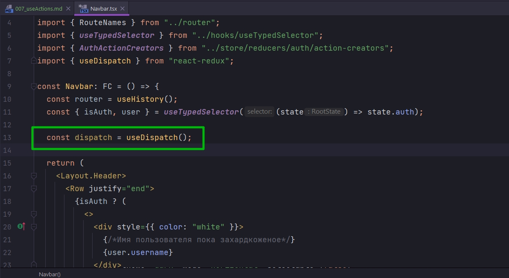
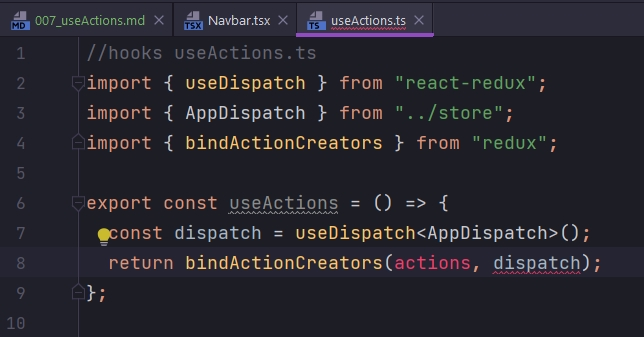
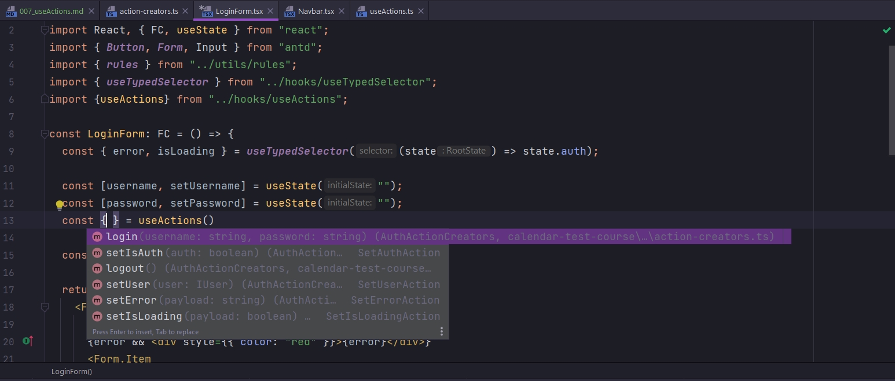
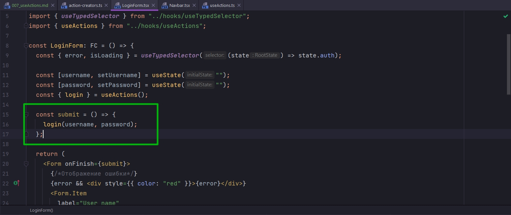
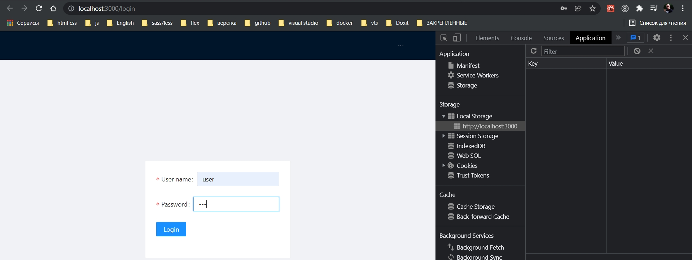
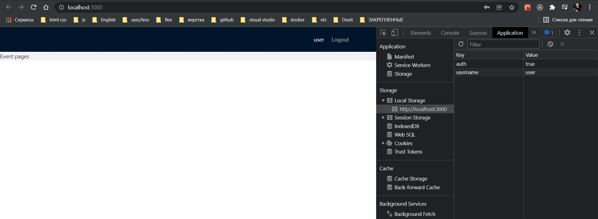
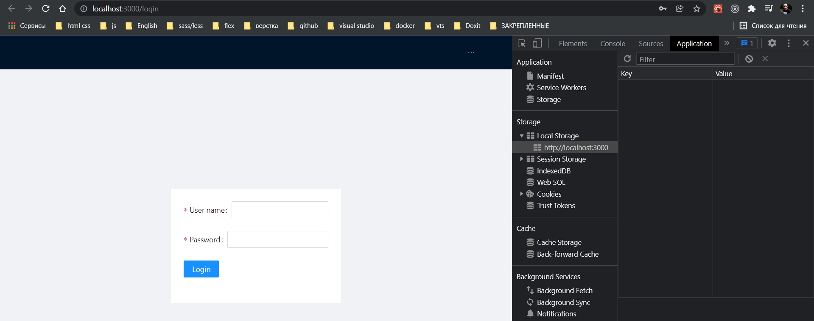

# 007_useActions

Нам каждый раз приходится диспатчить наши **actionCreators** т.е. инициализировать **dispatch**.



Этот процесс таже можно оптимизировать если создать свой кастомный хук. В папке **hooks** создаю **useActions**. Это будет достаточно простой хук с помощью которого, можно к нашим готовым **actionCreators** связать **bind** **dispatch**.

```ts
//hooks useActions.ts
import { useDispatch } from "react-redux";
import { AppDispatch } from "../store";

export const useActions = () => {
  const dispatch = useDispatch<AppDispatch>();
};

```
И по итогу из этого хука нам необходимо вернуть **actionCreators** к которым **bind** этот **dispatch**. Для этого предназначена функция **bindActionCreators()** из пакета **redux**. Первым аргументом эта функция как раз ожидает **actionCreators**, передаю **actions**, а вторым **dispatch**.



**actions** впринципе можно передавать в сам хук аргументом, но можно их обобщить и передать все сразу. Поскольку приложение у нас не большое предлагаю пойти вторым путем.

На данный момент у нас есть **action-creators** у нас есть только для одного **reducer**

```ts
//store reducers auth action-creators.ts
// Объект обертка
import {
  AuthActionsEnum,
  SetAuthAction,
  SetUserAction,
  SetIsLoadingAction,
  SetErrorAction,
} from "./types";
import { IUser } from "../../../models/IUser";
import { AppDispatch } from "../../index";
import axios from "axios";

export const AuthActionCreators = {
  //синхронные actionCreators
  setUser: (user: IUser): SetUserAction => ({
    type: AuthActionsEnum.SET_USER,
    payload: user,
  }),
  setIsAuth: (auth: boolean): SetAuthAction => ({
    type: AuthActionsEnum.SET_AUTH,
    payload: auth,
  }),
  setIsLoading: (payload: boolean): SetIsLoadingAction => ({
    type: AuthActionsEnum.SET_IS_LOADING,
    payload,
  }),
  setError: (payload: string): SetErrorAction => ({
    type: AuthActionsEnum.SET_ERROR,
    payload,
  }),
  //асинхронные actionCreators
  login:
    (username: string, password: string) => async (dispatch: AppDispatch) => {
      // описываем логику возвращаемой функции
      try {
        dispatch(AuthActionCreators.setIsLoading(true)); // указываю что пошла загрузка
        // для того что бы увидить индикацию загрузки
        setTimeout(async () => {
          //Получаю пользователя
          const response = await axios.get<IUser[]>("./users.json");
          //ищу пользователя
          const mockUser = response.data.find(
            (user) => user.username === username && user.password === password
          );
          // Проверяю найден ли пользователь
          if (mockUser) {
            localStorage.setItem("auth", "true");
            localStorage.setItem("username", mockUser.username);
            //Меняю состояние на авторизованное
            dispatch(AuthActionCreators.setIsAuth(true));
            //Помещаю информацию о пользователе
            dispatch(AuthActionCreators.setUser(mockUser));
            // убираю индикацию загрузки
            dispatch(AuthActionCreators.setIsLoading(false));
          } else {
            dispatch(
              AuthActionCreators.setError(`Incorrect username or password`)
            );
          }
        }, 1000);
      } catch (e) {
        dispatch(AuthActionCreators.setError("Error Login"));
      }
    },
  logout: () => async (dispatch: AppDispatch) => {
    // описываем логику возвращаемой функции
    try {
      localStorage.removeItem("auth");
      localStorage.removeItem("username");
      dispatch(AuthActionCreators.setUser({} as IUser));
      dispatch(AuthActionCreators.setIsAuth(false));
    } catch (e) {
      // Автор говорит что здесь впринципе ошибки произойти не может
      dispatch(AuthActionCreators.setError("Error Logout"));
    }
  },
};

```

Но этих **reducers** может быть много. И по хорошему лучше все эти **action-creators** лучше собрать в одном месте. 

По-этому внутри папки **reducers** мы создадим файл **action-creators.ts**. Отсюда будем просто экспортировать некоторый обобщающий объект **allActionCreators = {}**. И в этот объект мы будем разворачивать уже те **action-creators** которые на данный момент у нас созданы.

```ts
//reducers action-creators.ts все action-creators
import { AuthActionCreators } from "./auth/action-creators";

export const allActionCreators = {
  ...AuthActionCreators,
  //...
  //...
};

```

Возвращаемся обратно к хуку. И в функцию **bindActionCreators** парвым параметром передаю этот объект  **allActionCreators**.

```ts
//hooks useActions.ts
import { useDispatch } from "react-redux";
import { bindActionCreators } from "redux";
import { allActionCreators } from "../store/reducers/action-creators";

export const useActions = () => {
  const dispatch = useDispatch();
  return bindActionCreators(allActionCreators, dispatch);
};

```

Теперь когда мы хотим вызвать тот или иной acti**on-creator** нам не обязательно использовать **dispatch**. Мы можем воспользоваться хуком **useActions**



И поскольку он возвращает все **action-creators**, мы можем сразу выцепить нужный для нас, и просто как обычную функция вызывать т.е. никаких **dispatch**.



выглядит намного круче чем было.

```tsx
//component LoginForm.jsx
import React, { FC, useState } from "react";
import { Button, Form, Input } from "antd";
import { rules } from "../utils/rules";
import { useTypedSelector } from "../hooks/useTypedSelector";
import { useActions } from "../hooks/useActions";

const LoginForm: FC = () => {
  const { error, isLoading } = useTypedSelector((state) => state.auth);

  const [username, setUsername] = useState("");
  const [password, setPassword] = useState("");
  const { login } = useActions();

  const submit = () => {
    login(username, password);
  };

  return (
    <Form onFinish={submit}>
      {/*Отображение ошибки*/}
      {error && <div style={{ color: "red" }}>{error}</div>}
      <Form.Item
        label="User name"
        name="username"
        rules={[rules.required("Please input your username!")]}
      >
        <Input
          value={username}
          onChange={(event) => setUsername(event.target.value)}
        />
      </Form.Item>
      <Form.Item
        label="Password"
        name="password"
        rules={[rules.required("Please input your password!")]}
      >
        <Input
          value={password}
          onChange={(event) => setPassword(event.target.value)}
          type="password"
        />
      </Form.Item>
      <Form.Item>
        <Button type="primary" htmlType="submit" loading={isLoading}>
          Login
        </Button>
      </Form.Item>
    </Form>
  );
};

export default LoginForm;

```

Тоже самое делаем и для **logout**

```tsx
//component LoginForm.jsx
import React, { FC, useState } from "react";
import { Button, Form, Input } from "antd";
import { rules } from "../utils/rules";
import { useTypedSelector } from "../hooks/useTypedSelector";
import { useActions } from "../hooks/useActions";

const LoginForm: FC = () => {
  const { error, isLoading } = useTypedSelector((state) => state.auth);

  const [username, setUsername] = useState("");
  const [password, setPassword] = useState("");
  const { login } = useActions();

  const submit = () => {
    login(username, password);
  };

  return (
    <Form onFinish={submit}>
      {/*Отображение ошибки*/}
      {error && <div style={{ color: "red" }}>{error}</div>}
      <Form.Item
        label="User name"
        name="username"
        rules={[rules.required("Please input your username!")]}
      >
        <Input
          value={username}
          onChange={(event) => setUsername(event.target.value)}
        />
      </Form.Item>
      <Form.Item
        label="Password"
        name="password"
        rules={[rules.required("Please input your password!")]}
      >
        <Input
          value={password}
          onChange={(event) => setPassword(event.target.value)}
          type="password"
        />
      </Form.Item>
      <Form.Item>
        <Button type="primary" htmlType="submit" loading={isLoading}>
          Login
        </Button>
      </Form.Item>
    </Form>
  );
};

export default LoginForm;

```







На данный момент есть одна проблема. Если мы залогинемся и обновим страницу, то мы опять попадем на страницу логина. Хотя в **localStorage** у нас пользователь залогинен. В зависимости от того есть флаг **auth** в **localstorage** или нет, мы можем пользователя либо залогинить либо разлогинить.

Для этого перехожу в компонент **App**. И воспользуемся **useEffect** c пустым массивом зависимостей, для того что бы **callback** который мы в этот хук передаем отработал лишь единажды при первом запуске приложения. А внутри самого **callback** мы сделаем простую проверку

```tsx
import React, { FC, useEffect } from "react";
import AppRouter from "./components/AppRouter";
import Navbar from "./components/Navbar";
import { Layout } from "antd";
import "./App.css";
import { useActions } from "./hooks/useActions";
import { IUser } from "./models/IUser";

const App: FC = () => {
    const { setUser, setIsAuth } = useActions();
    useEffect(() => {
        if (localStorage.getItem("auth")) {
            setUser({ username: localStorage.getItem("username" || "") } as IUser);
            setIsAuth(true);
        }
    }, []);

    return (
        <Layout>
            <Navbar />
            <Layout.Content>
                <AppRouter />
            </Layout.Content>
        </Layout>
    );
};

export default App;

```

Это все имитация. Если бы мы работали с реальным сервером, то здесь мы бы отправляли бы какой-нибудь токен на проверку и в зависимости от этого устанавливали бы нужные для нас значения в состоянии.