# 008_Работа_с_календарем_событиями

* [Кнопка_Add_и_Modal_окно](#Кнопка_Add_и_Modal_окно)
* [Форма_модального_окна](#Форма_модального_окна)
* [Сохранение_пользователей_в_глобальный_store](#Сохранение_пользователей_в_глобальный_store)
* [action-creators_для_EventReducer](#action-creators_для_EventReducer)

<https://ant.design/components/calendar/>

Здесь **antd** представляет вот такой вот компонент

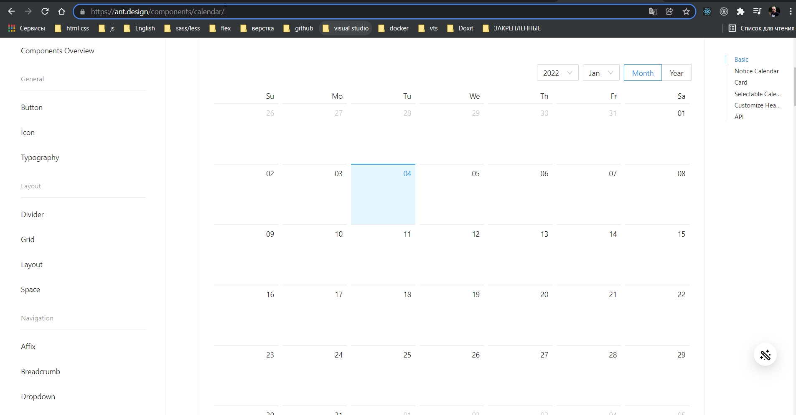

Под календарь и под логику отрисовки событий на нем создадим отдельный компонент **EventCalendar.tsx**.

Из этого компонента мы будем возвращать компонент который нам предоставляет **antd**.

```tsx
//component EventCalendar.tsx
import React from "react";
import { Calendar } from "antd";

const EventCalendar = () => {
    return <Calendar />;
};

export default EventCalendar;

```

Теперь создадим еще один тип, еще один **interface** который будет соответствовать самому событию. В папке **models** создаю **IEvent.ts**

```ts
//models IEvent.ts
export interface IEvent {
  author: string; // автор
  guest: string; //гость
  date: string; // дата события
  description: string;
}

```

Тип **date:** можно было указать как **Date()**, но мы осознанно укажем **string** и будем приводить к нужному для нас формату для того что бы отправлять его на **back-end**.

Возвращаюсь обратно к компоненту.

Создаю **interface** **EventCalendarProps** в котором опишем какие пропсы этот компонент будет ожидать. На данный момент здесь будет всего один пропс **events: IEvent** - это как раз массив событий для которых мы только что в models сделали **interface**.

```tsx
//component EventCalendar.tsx
import React, { FC } from "react";
import { Calendar } from "antd";
import { IEvent } from "../models/IEvent";

interface EventCalendarProps {
  events: IEvent[];
}

const EventCalendar: FC<EventCalendarProps> = () => {
  return <Calendar />;
};

export default EventCalendar;

```

Как **Generic** указываю этот **interface** с пропсами.

Возвращаюсь к **pages** **Event.tsx** и добавляю компонент **EventCalendar**.

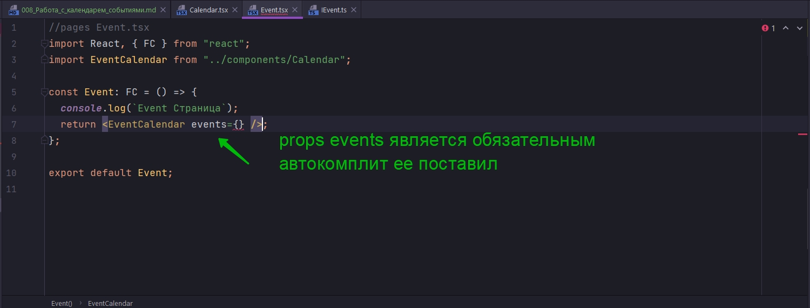

Пока что просто передаю пустой массив. Чуть позже мы эти события будет где-то сохранять.

```tsx
//pages Event.tsx
import React, { FC } from "react";
import EventCalendar from "../components/Calendar";

const Event: FC = () => {
  console.log(`Event Страница`);
  return <EventCalendar events={[]} />;
};

export default Event;

```

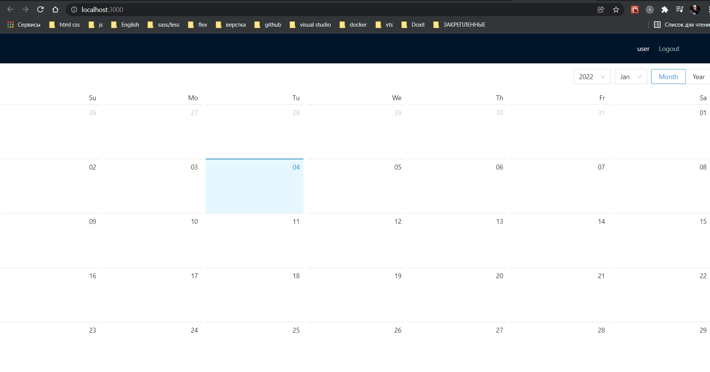

Остается теперь научится добавлять события на конкретную дату.

<br/>
<br/>
<br/>

# Кнопка_Add_и_Modal_окно

Добавляю кнопку которая будет добавлять событие.

```tsx
//pages Event.tsx
import React, { FC } from "react";
import EventCalendar from "../components/Calendar";
import { Button, Layout, Row } from "antd";

const Event: FC = () => {
  console.log(`Event Страница`);
  return (
    <Layout>
      <EventCalendar events={[]} />
      <Row justify="center">
        <Button>Add Event</Button>
      </Row>
    </Layout>
  );
};

export default Event;

```

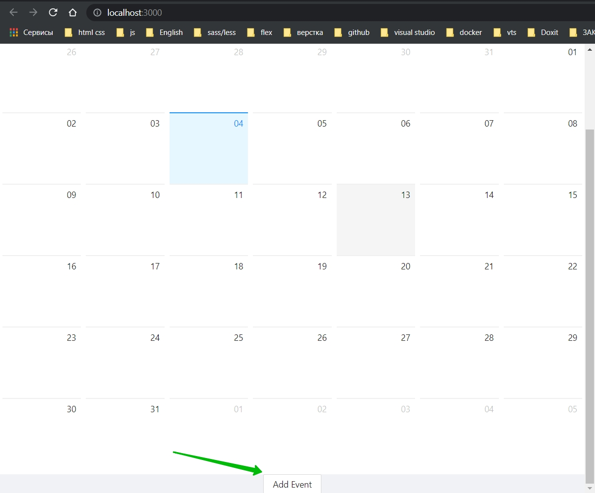

Осталось при нажатии на эту кнопку открывать модальное окно. <https://ant.design/components/modal/#header>

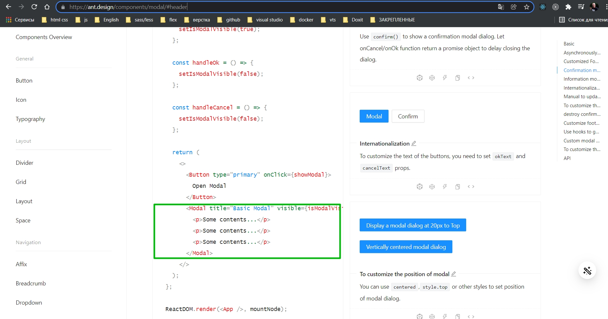

Вот здесь есть простейший JSX.

Под компонентом **Row** добавляю компонент **Modal**.

```tsx
//pages Event.tsx
import React, { FC, useState } from "react";
import EventCalendar from "../components/Calendar";
import { Button, Layout, Modal, Row } from "antd";

const Event: FC = () => {
  const [modalVisible, setModalVisible] = useState(false);
  return (
    <Layout>
      <EventCalendar events={[]} />
      <Row justify="center">
        <Button onClick={() => setModalVisible(true)}>Add Event</Button>
      </Row>
      {/*Модальное окно*/}
      <Modal title={"Add Event"} visible={modalVisible}></Modal>
    </Layout>
  );
};

export default Event;

```

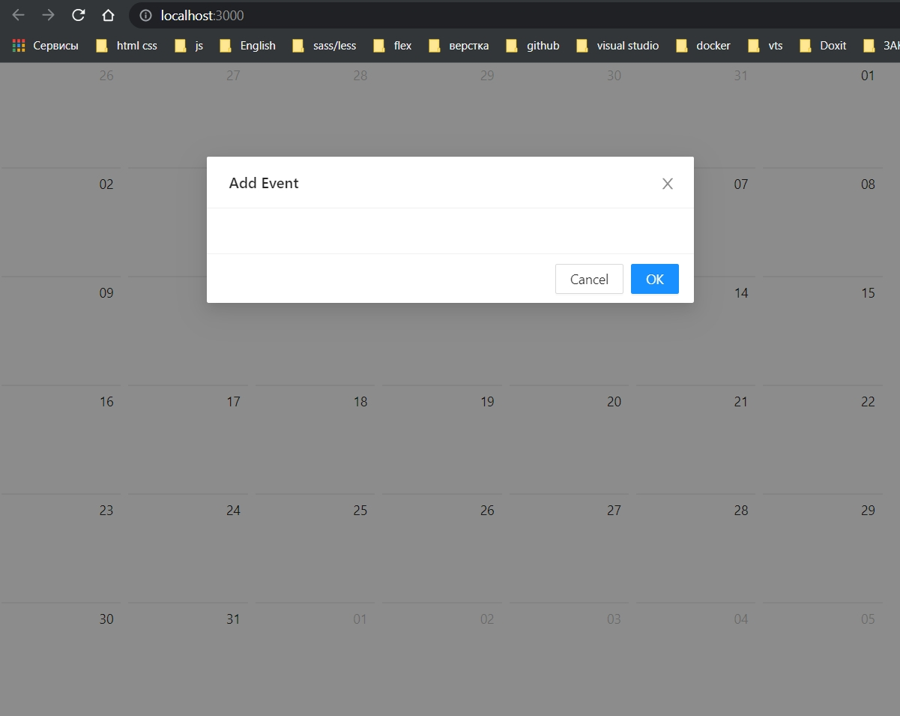

Как видите по умолчанию в модалке есть две кнопки. Они нам не подходять. Мы можем написать свой кастомный **footer** или же просто пока убрать его.

```tsx
//pages Event.tsx
import React, { FC, useState } from "react";
import EventCalendar from "../components/Calendar";
import { Button, Layout, Modal, Row } from "antd";

const Event: FC = () => {
  const [modalVisible, setModalVisible] = useState(false);
  return (
    <Layout>
      <EventCalendar events={[]} />
      <Row justify="center">
        <Button onClick={() => setModalVisible(true)}>Add Event</Button>
      </Row>
      {/*Модальное окно*/}
      <Modal title={"Add Event"} visible={modalVisible} footer={null}></Modal>
    </Layout>
  );
};

export default Event;

```

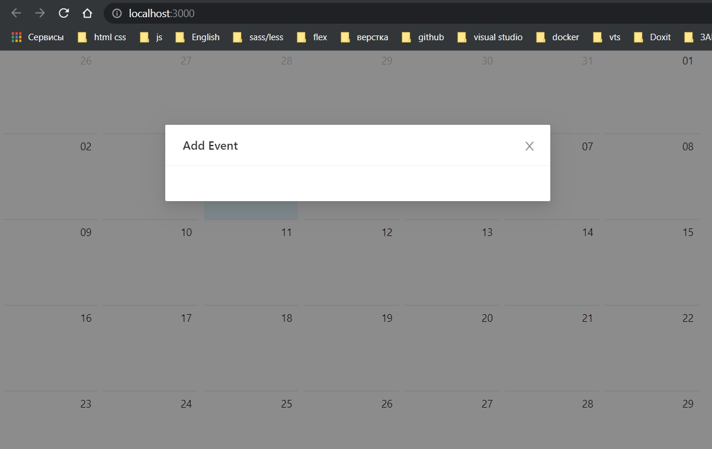

Так же сразу необходимо отработать закрытие модального окна **onCancel={() => setModalVisible(false)}**. И если кликнуть на темную область или на крестик то модалка закроется.

```tsx
//pages Event.tsx
import React, { FC, useState } from "react";
import EventCalendar from "../components/Calendar";
import { Button, Layout, Modal, Row } from "antd";

const Event: FC = () => {
  const [modalVisible, setModalVisible] = useState(false);
  return (
    <Layout>
      <EventCalendar events={[]} />
      <Row justify="center">
        <Button onClick={() => setModalVisible(true)}>Add Event</Button>
      </Row>
      {/*Модальное окно*/}
      <Modal
        title={"Add Event"}
        visible={modalVisible}
        footer={null}
        onCancel={() => setModalVisible(false)}
      ></Modal>
    </Layout>
  );
};

export default Event;

```

<br/>
<br/>
<br/>

# Форма_модального_окна

Следующим этапом займемся созданием формы для создания события.

Под эту форму мы создадим отдельный компонент **EventForms.jsx**.

```tsx
import React, { FC } from "react";
import { Form } from "antd";
import { rules } from "../utils/rules";

const EventForms: FC = () => {
  return (
    <Form>
      <Form.Item
        label="Event description"
        name="description"
        rules={[rules.required("field required")]}
      ></Form.Item>
    </Form>
  );
};

export default EventForms;

```

Смотрите во время валидации мы можем передать сообщение в функцию **required("field required")**. Однако мы можем пойти еще дальше. Мы можем задать это значение как дефолтное для самой функции **required**.

```ts
// utils rules.ts
export const rules = {
    required: (message: string = "required field") => ({
        required: true,
        message, // уже не просто хардкожу а принимаю аргументом
    }),
};


```

И теперь мы можем просто вызывать эту функцию. Теперь мы можем не передавать какой-либо параметр в функцию **required** т.е. она выведет значение по умолчанию.

```tsx
import React, { FC } from "react";
import { Form, Input } from "antd";
import { rules } from "../utils/rules";

const EventForm: FC = () => {
    return (
        <Form>
            <Form.Item
                label="Event description"
                name="description"
                rules={[rules.required()]}
            >
                <Input />
            </Form.Item>
        </Form>
    );
};

export default EventForm;


```

В форме у нас один **input**, но мы уже можем добавить его в модалку.

```tsx
//pages Event.tsx
import React, { FC, useState } from "react";
import EventCalendar from "../components/Calendar";
import { Button, Layout, Modal, Row } from "antd";
import EventForm from "../components/EventForm";

const Event: FC = () => {
  const [modalVisible, setModalVisible] = useState(false);
  return (
    <Layout>
      <EventCalendar events={[]} />
      <Row justify="center">
        <Button onClick={() => setModalVisible(true)}>Add Event</Button>
      </Row>
      {/*Модальное окно*/}
      <Modal
        title={"Add Event"}
        visible={modalVisible}
        footer={null}
        onCancel={() => setModalVisible(false)}
      >
        <EventForm />
      </Modal>
    </Layout>
  );
};

export default Event;

```
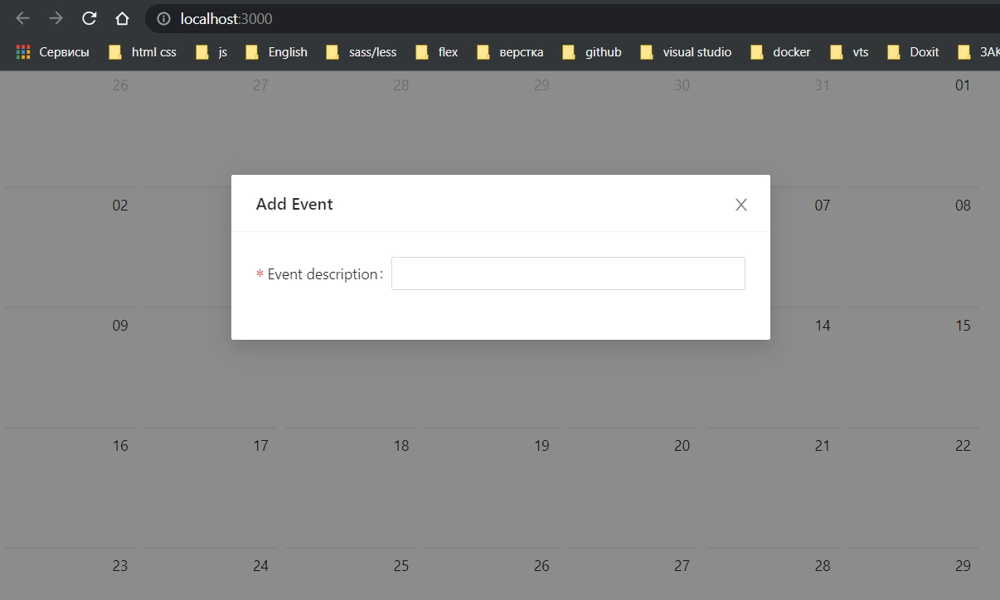

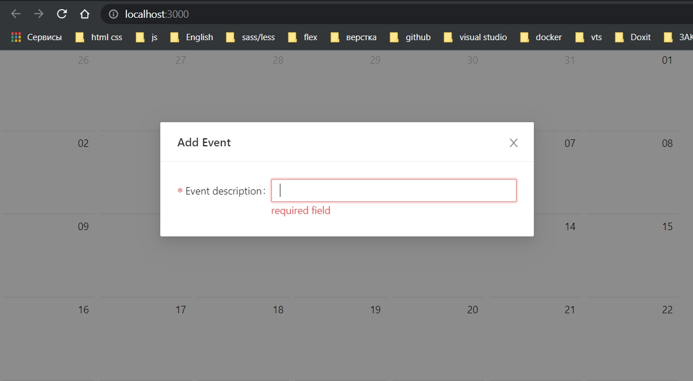

Возвращаемся обратно к форме и здесь будет еще пару элементов. 

Во первых нам необходимо выбирать дату. Для этого в **antd** есть соответсвущий компонент **Date picker** <https://ant.design/components/date-picker/#header>

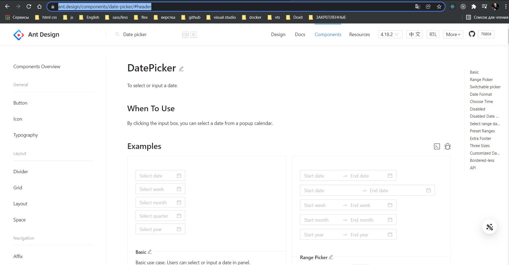

```tsx
import React, { FC } from "react";
import { Button, Form, Input, Row } from "antd";
import { rules } from "../utils/rules";
import { DatePicker } from "antd";

const EventForm: FC = () => {
  return (
    <Form>
      <Form.Item
        label="Event description"
        name="description"
        rules={[rules.required()]}
      >
        <Input />
      </Form.Item>

      <Form.Item label="Date Event" name="date" rules={[rules.required()]}>
        <DatePicker />
      </Form.Item>
      <Row justify="end">
        <Form.Item>
          <Button type="primary" htmlType="submit">
            Create
          </Button>
        </Form.Item>
      </Row>
    </Form>
  );
};

export default EventForm;

```

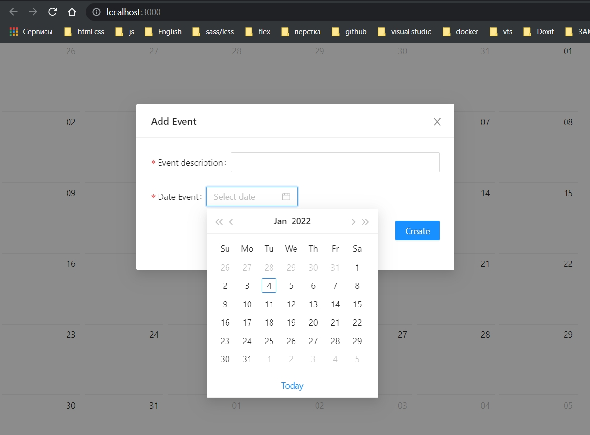

Но так же у меня должен быть список имен пользователей которых к этому событию мы будем прикреплять.

Select <https://ant.design/components/select/#header>

```tsx
import React, { FC } from "react";
import { Button, Form, Input, Row, Select } from "antd";
import { rules } from "../utils/rules";
import { DatePicker } from "antd";

const EventForm: FC = () => {
  return (
    <Form>
      <Form.Item
        label="Event description"
        name="description"
        rules={[rules.required()]}
      >
        <Input />
      </Form.Item>

      <Form.Item label="Date Event" name="date" rules={[rules.required()]}>
        <DatePicker />
      </Form.Item>

      <Form.Item>
        <Select>
          <Select.Option value="jack">Jack</Select.Option>
          <Select.Option value="lucy">Lucy</Select.Option>
          <Select.Option value="disabled" disabled>
            Disabled
          </Select.Option>
          <Select.Option value="Yiminghe">yiminghe</Select.Option>
        </Select>
      </Form.Item>

      <Row justify="end">
        <Form.Item>
          <Button type="primary" htmlType="submit">
            Create
          </Button>
        </Form.Item>
      </Row>
    </Form>
  );
};

export default EventForm;

```

Пока что у меня такие выпадающие списки.

Но нам необходимо получать имена пользователей которые лежат у нас в **users.json**

```json
[
  {
    "username" : "user",
    "password" : "123"
  },
  {
    "username" : "admin",
    "password" : "123"
  },
  {
    "username" : "kos",
    "password" : "123"
  }
]
```
<br/>
<br/>
<br/>

# Сохранение_пользователей_в_глобальный_store

Самих пользователей будем сохранять в глобальный **store**. 

Создадим еще один **reducers**. В папке **reducers** создаю папку event. Внутри создаю **index.ts** где и будет располагаться наш второй **reducer**.

```ts
//reducers event index.ts
const initialState = {};

export default function EventReducer(state = initialState, action) {
  switch (action.type) {
    default:
      return state;
  }
}

```

Сразу же перехожу к типизации. В этой же папке **event** создаю **types.ts**

```ts
//reducers event types.ts
import { IUser } from "../../../models/IUser";
import { IEvent } from "../../../models/IEvent";

export interface EventState {
  guests: IUser[];
  events: IEvent[];
}

```

По хорошему здесь не мешало бы обработать индикицию загрузки,сделать поле **isLoading**, но поскольку мы работать с реальным сервером не будем, не будем тратить на это время.

Далее создадим перечисления в котором будем хранить типы **actions**, называю как **EventActionEnum**.

```ts
//reducers event types.ts
import { IUser } from "../../../models/IUser";
import { IEvent } from "../../../models/IEvent";

export interface EventState {
    guests: IUser[];
    events: IEvent[];
}
export enum EventActionEnum {
  SET_GUESTS = "SET_GUESTS",
  SET_EVENTS = "SET_EVENTS",
}

```

Теперь для каждого action создадим по **interface**.

```ts
//reducers event types.ts
import { IUser } from "../../../models/IUser";
import { IEvent } from "../../../models/IEvent";

export interface EventState {
  guests: IUser[];
  events: IEvent[];
}

export enum EventActionEnum {
  SET_GUESTS = "SET_GUESTS",
  SET_EVENTS = "SET_EVENTS",
}

export interface SetGuestsAction {
  type: EventActionEnum.SET_GUESTS;
  payload: IUser[];
}

export interface SetEventsAction {
  type: EventActionEnum.SET_EVENTS;
  payload: IEvent[];
}

//тип который обобщает эти два интерфейса
export type EventAction = SetGuestsAction | SetEventsAction;

```

Теперь созданные типы мы указываем для состояния и для **action** уже в самом **reducer**.

```ts
//reducers event index.ts
import { EventAction, EventActionEnum, EventState } from "./types";

const initialState: EventState = {
  guests: [],
  events: [],
};

export default function EventReducer(
  state = initialState,
  action: EventAction
): EventState {
  switch (action.type) {
    case EventActionEnum.SET_GUESTS:
      return { ...state, guests: action.payload };
    case EventActionEnum.SET_EVENTS:
      return { ...state, events: action.payload };
    default:
      return state;
  }
}

```

<br/>
<br/>
<br/>

# action-creators_для_EventReducer

Создадим **action-creators** которые которые соответствуют конкретно этому **reducer**.

Для этого в папке event создаем **action-creators.ts**

```ts
//reducers event action-creators.ts
import { EventActionEnum, SetEventsAction, SetGuestsAction } from "./types";
import { IUser } from "../../../models/IUser";
import { IEvent } from "../../../models/IEvent";

export const EventActionCreators = {
    setGuests: (payload: IUser[]): SetGuestsAction => ({
        type: EventActionEnum.SET_GUESTS,
        payload,
    }),
    setEvents: (payload: IEvent[]): SetEventsAction => ({
        type: EventActionEnum.SET_EVENTS,
        payload,
    }),
};


```

Внутри объекта создаем две функции **setGuests**, **setGuests**. Одна будет возвращать **action-creator** для того что бы поместить в состояние гостей **guests**, а вторая для события **event**.

Все делаю по аналогии с **auth** **reducer**.

Далее делаю асинхронный **action** **fetchGuests** с помощью которого мы будем получать пользователей из файла. Асинхронный **action** должен возвращать еще одну функцию которая аргументом принимает **dispatch**

```ts
//reducers event action-creators.ts
import { EventActionEnum, SetEventsAction, SetGuestsAction } from "./types";
import { IUser } from "../../../models/IUser";
import { IEvent } from "../../../models/IEvent";
import { AppDispatch } from "../../index";
import axios from "axios";

export const EventActionCreators = {
  setGuests: (payload: IUser[]): SetGuestsAction => ({
    type: EventActionEnum.SET_GUESTS,
    payload,
  }),
  setEvents: (payload: IEvent[]): SetEventsAction => ({
    type: EventActionEnum.SET_EVENTS,
    payload,
  }),
  fetchGuests:()=> async (payload: AppDispatch) => {
    try {
        //Получаю пользователей
      const guests = await axios.get("./users.json");
    } catch (error) {
      console.log(error);
    }
  },
};

```

 