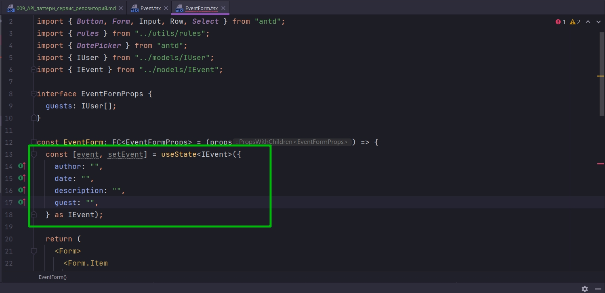
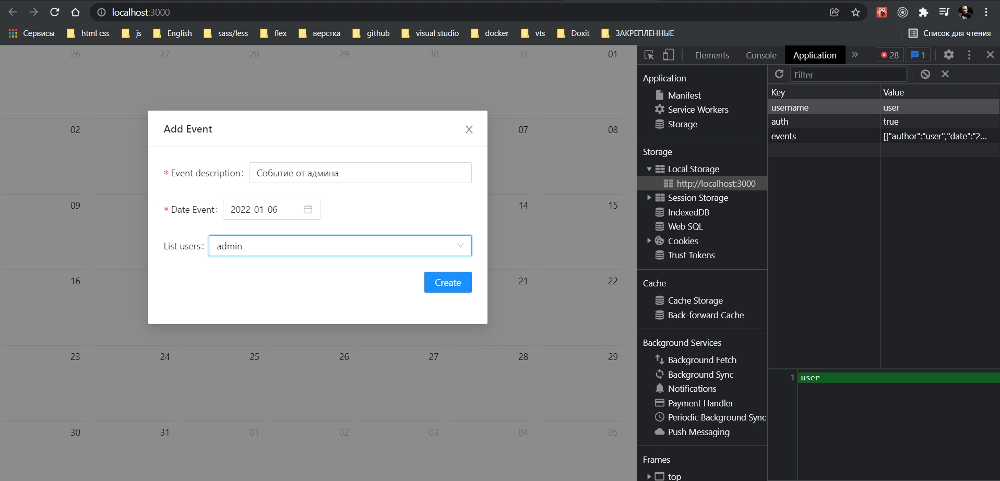
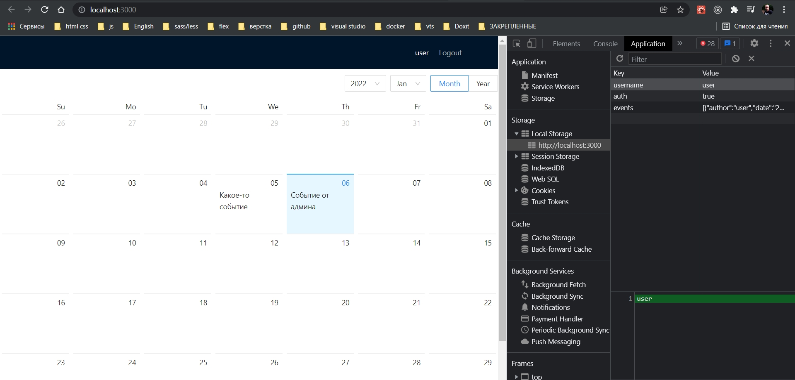

# 009_API_паттерн_сервис_репозиторий

* [Выделение_слоя_клиент-серверного_взаимодействия](#Выделение_слоя_клиент_серверного_взаимодействия)
* [Создание_сервиса_UserService](#Создание_сервиса_UserService)
* [Рефактор_запроса_получения_данных](#Рефактор_запроса_получения_данных)
* [dispatch_EventActionCreators_setGuests](#dispatch_EventActionCreators_setGuests)
* [select_со_списком пользователей](#select_со_списком пользователей)
* [управляемый_select](#управляемый_select)
* [управляемый_DatePicker](#управляемый_DatePicker)
* [создание_функции_форматирования_даты_в_строку](#создание_функции_форматирования_даты_в_строку)
* [форматирование_даты_в_DatePicker](#форматирование_даты_в_DatePicker)
* [обработка_отправки_формы](#обработка_отправки_формы)
* [# отрисовка_задач_в_календаре](#отрисовка_задач_в_календаре)
* [#кастомный_валидатор_запрет_добавления_событий_на_прошедшие_даты](#кастомный_валидатор_запрет_добавления_событий_на_прошедшие_даты)

```ts
//reducers event action-creators.ts
import { EventActionEnum, SetEventsAction, SetGuestsAction } from "./types";
import { IUser } from "../../../models/IUser";
import { IEvent } from "../../../models/IEvent";
import { AppDispatch } from "../../index";
import axios from "axios";

export const EventActionCreators = {
  setGuests: (payload: IUser[]): SetGuestsAction => ({
    type: EventActionEnum.SET_GUESTS,
    payload,
  }),
  setEvents: (payload: IEvent[]): SetEventsAction => ({
    type: EventActionEnum.SET_EVENTS,
    payload,
  }),
  fetchGuests:()=> async (dispatch: AppDispatch) => {
    try {
      const guests = await axios.get("./users.json");
    } catch (error) {
      console.log(error);
    }
  },
};

```

# Выделение_слоя_клиент_серверного_взаимодействия

Получается так что запрос к файлу **users.json**, вместо этого может быть любой запрос к серверу, у нас дублируется дважды. Нам необходимо каждый раз прописывать **url**, какие-то **query** параметры, тело запроса, возможно какие-то **headers**. Происходит явное дублирование логики, дублирование кода. 

Хорошим архитектурным паттерном является выделение еще одного слоя, который отвечает за клиент-серверное взаимодействие. Да даже не всегда клиент-серверное. Это впринципе слой который получает какие-то данные и отдает их.

# Создание_сервиса_UserService

В корне создаю папку **api**. Создаю файл **UserService.ts** в котором создаю одноименный класс. Внутри этого класса будет один единственный на данный момент метод который называется **getUsers**.

```ts
//api UserService.ts

import axios, { AxiosResponse } from "axios";
import { IUser } from "../models/IUser";

export default class UserService {
  static async getUsers(): Promise<AxiosResponse<IUser[]>> {
    return axios.get<IUser[]>("./users.json");
  }
}

```

**getUsers** будет асинхронной функцией внутри которой мы как раз и будем делать запрос на получение данных из файла. Поскольку функция асинхронная она всегда будет возвращать **Promise**. В **Promise** завернуты какие-то данные и в нашем случае это **AxiosResponse** т.е. то что получит и вернет **axios**. Так же в **AxiosResponse** указываю  **Generic** **IUser[]**  котором описаны поля которые нам нужно вернуть. Т.е. в поле **data** будет находиться массив пользователей. Получается что из метода **getUsers** мы возвращаем результат выполнения функции **axios.get<IUser[]>()**. Опять же через **Generic** указываю **interface** **IUser** в котором описаны возвращаемые поля. И указываю что возвращаемые данные должны быть массивом. В вызове функции указываю **url**. Ожидаю что в поле **data** будет находится массив пользователей.

Единственное указываю что эта функция **static**, что бы мы могли вызывать ее без создания экземпляра класса.

<br/>
<br/>
<br/>

# Рефактор_запроса_получения_данных

Теперь вернемся к тем участкам кода где мы делали запрос на получение данных

Было:


```ts
//store reducers auth action-creators.ts
// Объект обертка
import {
  AuthActionsEnum,
  SetAuthAction,
  SetUserAction,
  SetIsLoadingAction,
  SetErrorAction,
} from "./types";
import { IUser } from "../../../models/IUser";
import { AppDispatch } from "../../index";
import axios from "axios";

export const AuthActionCreators = {
  //синхронные actionCreators
  setUser: (user: IUser): SetUserAction => ({
    type: AuthActionsEnum.SET_USER,
    payload: user,
  }),
  setIsAuth: (auth: boolean): SetAuthAction => ({
    type: AuthActionsEnum.SET_AUTH,
    payload: auth,
  }),
  setIsLoading: (payload: boolean): SetIsLoadingAction => ({
    type: AuthActionsEnum.SET_IS_LOADING,
    payload,
  }),
  setError: (payload: string): SetErrorAction => ({
    type: AuthActionsEnum.SET_ERROR,
    payload,
  }),
  //асинхронные actionCreators
  login:
    (username: string, password: string) => async (dispatch: AppDispatch) => {
      // описываем логику возвращаемой функции
      try {
        dispatch(AuthActionCreators.setIsLoading(true)); // указываю что пошла загрузка
        // для того что бы увидить индикацию загрузки
        setTimeout(async () => {
          //Получаю пользователя
          const response = await axios.get<IUser[]>("./users.json");

          //ищу пользователя
          const mockUser = response.data.find(
            (user) => user.username === username && user.password === password
          );
          // Проверяю найден ли пользователь
          if (mockUser) {
            localStorage.setItem("auth", "true");
            localStorage.setItem("username", mockUser.username);
            //Меняю состояние на авторизованное
            dispatch(AuthActionCreators.setIsAuth(true));
            //Помещаю информацию о пользователе
            dispatch(AuthActionCreators.setUser(mockUser));
            // убираю индикацию загрузки
            dispatch(AuthActionCreators.setIsLoading(false));
          } else {
            dispatch(
              AuthActionCreators.setError(`Incorrect username or password`)
            );
          }
        }, 1000);
      } catch (e) {
        dispatch(AuthActionCreators.setError("Error Login"));
      }
    },
  logout: () => async (dispatch: AppDispatch) => {
    // описываем логику возвращаемой функции
    try {
      localStorage.removeItem("auth");
      localStorage.removeItem("username");
      dispatch(AuthActionCreators.setUser({} as IUser));
      dispatch(AuthActionCreators.setIsAuth(false));
    } catch (e) {
      // Автор говорит что здесь впринципе ошибки произойти не может
      dispatch(AuthActionCreators.setError("Error Logout"));
    }
  },
};

```

Стало:


```ts
//store reducers auth action-creators.ts
// Объект обертка
import {
  AuthActionsEnum,
  SetAuthAction,
  SetUserAction,
  SetIsLoadingAction,
  SetErrorAction,
} from "./types";
import { IUser } from "../../../models/IUser";
import { AppDispatch } from "../../index";
import axios from "axios";
import UserService from "../../../api/UserService";

export const AuthActionCreators = {
  //синхронные actionCreators
  setUser: (user: IUser): SetUserAction => ({
    type: AuthActionsEnum.SET_USER,
    payload: user,
  }),
  setIsAuth: (auth: boolean): SetAuthAction => ({
    type: AuthActionsEnum.SET_AUTH,
    payload: auth,
  }),
  setIsLoading: (payload: boolean): SetIsLoadingAction => ({
    type: AuthActionsEnum.SET_IS_LOADING,
    payload,
  }),
  setError: (payload: string): SetErrorAction => ({
    type: AuthActionsEnum.SET_ERROR,
    payload,
  }),
  //асинхронные actionCreators
  login:
    (username: string, password: string) => async (dispatch: AppDispatch) => {
      // описываем логику возвращаемой функции
      try {
        dispatch(AuthActionCreators.setIsLoading(true)); // указываю что пошла загрузка
        // для того что бы увидить индикацию загрузки
        setTimeout(async () => {
          //Получаю пользователя
          const response = await UserService.getUsers();

          //ищу пользователя
          const mockUser = response.data.find(
            (user) => user.username === username && user.password === password
          );
          // Проверяю найден ли пользователь
          if (mockUser) {
            localStorage.setItem("auth", "true");
            localStorage.setItem("username", mockUser.username);
            //Меняю состояние на авторизованное
            dispatch(AuthActionCreators.setIsAuth(true));
            //Помещаю информацию о пользователе
            dispatch(AuthActionCreators.setUser(mockUser));
            // убираю индикацию загрузки
            dispatch(AuthActionCreators.setIsLoading(false));
          } else {
            dispatch(
              AuthActionCreators.setError(`Incorrect username or password`)
            );
          }
        }, 1000);
      } catch (e) {
        dispatch(AuthActionCreators.setError("Error Login"));
      }
    },
  logout: () => async (dispatch: AppDispatch) => {
    // описываем логику возвращаемой функции
    try {
      localStorage.removeItem("auth");
      localStorage.removeItem("username");
      dispatch(AuthActionCreators.setUser({} as IUser));
      dispatch(AuthActionCreators.setIsAuth(false));
    } catch (e) {
      // Автор говорит что здесь впринципе ошибки произойти не может
      dispatch(AuthActionCreators.setError("Error Logout"));
    }
  },
};

```

И тоже самое делаю в **event** **action-creators.ts**

Было:

```ts
//reducers event action-creators.ts
import { EventActionEnum, SetEventsAction, SetGuestsAction } from "./types";
import { IUser } from "../../../models/IUser";
import { IEvent } from "../../../models/IEvent";
import { AppDispatch } from "../../index";
import axios from "axios";

export const EventActionCreators = {
    setGuests: (payload: IUser[]): SetGuestsAction => ({
        type: EventActionEnum.SET_GUESTS,
        payload,
    }),
    setEvents: (payload: IEvent[]): SetEventsAction => ({
        type: EventActionEnum.SET_EVENTS,
        payload,
    }),
    fetchGuests: ()=> async (dispatch: AppDispatch) => {
        try {
            const guests = await axios.get("./users.json");
        } catch (error) {
            console.log(error);
        }
    },
};

```

Стало:

```ts
//reducers event action-creators.ts
import { EventActionEnum, SetEventsAction, SetGuestsAction } from "./types";
import { IUser } from "../../../models/IUser";
import { IEvent } from "../../../models/IEvent";
import { AppDispatch } from "../../index";
import axios from "axios";
import UserService from "../../../api/UserService";

export const EventActionCreators = {
  setGuests: (payload: IUser[]): SetGuestsAction => ({
    type: EventActionEnum.SET_GUESTS,
    payload,
  }),
  setEvents: (payload: IEvent[]): SetEventsAction => ({
    type: EventActionEnum.SET_EVENTS,
    payload,
  }),
  fetchGuests: () => async (dispatch: AppDispatch) => {
    try {
      const guests = await UserService.getUsers();
    } catch (error) {
      console.log(error);
    }
  },
};

```
<br/>
<br/>
<br/>

# dispatch_EventActionCreators_setGuests

Остается задиспатчить нужный **action-creator** и передать туда то что мы получили в **response**.


```ts
//reducers event action-creators.ts
import { EventActionEnum, SetEventsAction, SetGuestsAction } from "./types";
import { IUser } from "../../../models/IUser";
import { IEvent } from "../../../models/IEvent";
import { AppDispatch } from "../../index";
import UserService from "../../../api/UserService";

export const EventActionCreators = {
  setGuests: (payload: IUser[]): SetGuestsAction => ({
    type: EventActionEnum.SET_GUESTS,
    payload,
  }),
  setEvents: (payload: IEvent[]): SetEventsAction => ({
    type: EventActionEnum.SET_EVENTS,
    payload,
  }),
    fetchGuests: () => async (dispatch: AppDispatch) => {
        try {
            const response = await UserService.getUsers();

            dispatch(EventActionCreators.setGuests(response.data));
        } catch (error) {
            console.log(error);
        }
    },
};

```

Среда разработки ругается. И все делов в том что этот **dispatch** не воспринимает этот **action-creator** по той простой причине что мы не добавили в корневой **reducer**, т.е. тот **reducer** который связан с **event**.

```ts
// store reducers index.ts
import auth from "./auth"; // authReducer
import event from "./event"; //

export default {
  auth,
  event,
};

```


Теперь вернемся в компонент **Event.ts** и вызовем этот **action-creator**.

Для этого нам понадобится воспользоватся **useEffect** для того что бы при первой отриовке данного компонента мы сразу же подгрузили список пользователей.

У нас уже есть хук **useActions** c помощью которого мы можем нужный для нас **action-creator** получить.


Но как видите в списке его нет. Опять по той же причине что мы не развернули в обобщающий объект наши **action-creators**.

```ts
//reducers action-creators.ts все action-creators
import { AuthActionCreators } from "./auth/action-creators";
import {EventActionCreators} from "./event/action-creator";

export const allActionCreators = {
  ...AuthActionCreators,
  ...EventActionCreators
};

```


И вот теперь мы видим что наш список значительно пополнился. Теперь соответствующий **action-creator** вызываю в **useEffect**. Диспатчить его нужды нет поскольку мы используем хук **useActions**.

```tsx
//pages Event.tsx
import React, { FC, useEffect, useState } from "react";
import EventCalendar from "../components/Calendar";
import { Button, Layout, Modal, Row } from "antd";
import EventForm from "../components/EventForm";
import { useActions } from "../hooks/useActions";

const Event: FC = () => {
  const [modalVisible, setModalVisible] = useState(false);
  const { fetchGuests } = useActions();

  useEffect(() => {
    fetchGuests();
  }, []);

  return (
    <Layout>
      <EventCalendar events={[]} />
      <Row justify="center">
        <Button onClick={() => setModalVisible(true)}>Add Event</Button>
      </Row>
      {/*Модальное окно*/}
      <Modal
        title={"Add Event"}
        visible={modalVisible}
        footer={null}
        onCancel={() => setModalVisible(false)}
      >
        <EventForm />
      </Modal>
    </Layout>
  );
};

export default Event;

```
<br/>
<br/>
<br/>

# select_со_списком пользователей

Перехожу в **EventForm.tsx**. И следующим этапом в выпадающий список **Select** необходимо поместить список пользователей.

1. Необходимо определить какие пропсы принимает данный компонент.

И как раз компонент **EventForm.tsx** будет принимать список гостей


```tsx
import React, { FC } from "react";
import { Button, Form, Input, Row, Select } from "antd";
import { rules } from "../utils/rules";
import { DatePicker } from "antd";
import { IUser } from "../models/IUser";

interface EventFormProps {
  guests: IUser[];
}

const EventForm: FC<EventFormProps> = (props) => {
  return (
    <Form>
      <Form.Item
        label="Event description"
        name="description"
        rules={[rules.required()]}
      >
        <Input />
      </Form.Item>

      <Form.Item label="Date Event" name="date" rules={[rules.required()]}>
        <DatePicker />
      </Form.Item>

      <Form.Item>
        <Select>
          <Select.Option value="jack">Jack</Select.Option>
          <Select.Option value="lucy">Lucy</Select.Option>
          <Select.Option value="disabled" disabled>
            Disabled
          </Select.Option>
          <Select.Option value="Yiminghe">yiminghe</Select.Option>
        </Select>
      </Form.Item>

      <Row justify="end">
        <Form.Item>
          <Button type="primary" htmlType="submit">
            Create
          </Button>
        </Form.Item>
      </Row>
    </Form>
  );
};

export default EventForm;

```

Т.е. в данном случае мы не получаем этих гостей из состояния, а принимаем пропсом для того что бы эту форму можно было переиспользовать. И возможно в каком-то другом месте нашего приложения у нас был другой список пользователей.

Теперь мы все эти **Option** из **Select** удаляем


И итерируемся с помощью функции map по списку гостей. Для каждого гостя будем отрисовывать свою **Select.Option**. В качестве **value** передаю **guest.username** гостя.


```tsx
import React, { FC } from "react";
import { Button, Form, Input, Row, Select } from "antd";
import { rules } from "../utils/rules";
import { DatePicker } from "antd";
import { IUser } from "../models/IUser";

interface EventFormProps {
    guests: IUser[];
}

const EventForm: FC<EventFormProps> = (props) => {
    return (
        <Form>
            <Form.Item
                label="Event description"
                name="description"
                rules={[rules.required()]}
            >
                <Input />
            </Form.Item>

            <Form.Item label="Date Event" name="date" rules={[rules.required()]}>
                <DatePicker />
            </Form.Item>

            <Form.Item label={"List users"} name='guest'>
                <Select>
                    {props.guests.map((guest) => (
                        <Select.Option value={guest.username} key={guest.username}>
                            {guest.username}
                        </Select.Option>
                    ))}
                </Select>
            </Form.Item>

            <Row justify="end">
                <Form.Item>
                    <Button type="primary" htmlType="submit">
                        Create
                    </Button>
                </Form.Item>
            </Row>
        </Form>
    );
};

export default EventForm;

```

Теперь открываю компонент **Event.tsx** И мне теперь нужно передать соответствующий пропс. Среда разработки подсказывает


И этот список с помощью хука **useTypeSelector** мы получаем из нашего состояния.


```tsx
//pages Event.tsx
import React, { FC, useEffect, useState } from "react";
import EventCalendar from "../components/Calendar";
import { Button, Layout, Modal, Row } from "antd";
import EventForm from "../components/EventForm";
import { useActions } from "../hooks/useActions";
import { useTypedSelector } from "../hooks/useTypedSelector";

const Event: FC = () => {
  const [modalVisible, setModalVisible] = useState(false);
  const { fetchGuests } = useActions();

  const { guests } = useTypedSelector((state) => state.event); // получаю гостей из состояния

  useEffect(() => {
    fetchGuests();
  }, []);

  return (
    <Layout>
      <EventCalendar events={[]} />
      <Row justify="center">
        <Button onClick={() => setModalVisible(true)}>Add Event</Button>
      </Row>
      {/*Модальное окно*/}
      <Modal
        title={"Add Event"}
        visible={modalVisible}
        footer={null}
        onCancel={() => setModalVisible(false)}
      >
        <EventForm guests={guests} />
      </Modal>
    </Layout>
  );
};

export default Event;

```


И вот я получаю список пользователей.

<br/>
<br/>
<br/>

# управляемый_select

Сразу делаю нашу форму управляемой. В **Select** реализую **onChange**  и передадим **value** в соответствующие элементы формы. Так же для начало необходимо создать это состояние в котором будем хранить информацию о событии которое мы будем создавать. Сам объект назовем **event**. Функция которая будет изменять состояние **setEvent**. Сразу же типизирую **useState<IEvent>** т.е. указываю какого типа у нас будет находится объект внутри. И сразу же по дефолту проинициализируем **({} as IEvent)**.  В принципе можно оставить и так, но по хорошему лучше в объекте сразу объявить какие у нас будут поля и чему по умолчанию они будут равняться 



Теперь реализуем **onChange**


```tsx
import React, { FC, useState } from "react";
import { Button, Form, Input, Row, Select } from "antd";
import { rules } from "../utils/rules";
import { DatePicker } from "antd";
import { IUser } from "../models/IUser";
import { IEvent } from "../models/IEvent";

interface EventFormProps {
    guests: IUser[];
}

const EventForm: FC<EventFormProps> = (props) => {
    const [event, setEvent] = useState<IEvent>({
        author: "",
        date: "",
        description: "",
        guest: "",
    } as IEvent);

    return (
        <Form>
            <Form.Item
                label="Event description"
                name="description"
                rules={[rules.required()]}
            >
                <Input />
            </Form.Item>

            <Form.Item label="Date Event" name="date" rules={[rules.required()]}>
                <DatePicker />
            </Form.Item>

            <Form.Item label={"List users"} name='guest'>
                <Select onChange={(guest: string) => setEvent({ ...event, guest })}>
                    {props.guests.map((guest) => (
                        <Select.Option value={guest.username} key={guest.username}>
                            {guest.username}
                        </Select.Option>
                    ))}
                </Select>
            </Form.Item>

            <Row justify="end">
                <Form.Item>
                    <Button type="primary" htmlType="submit">
                        Create
                    </Button>
                </Form.Item>
            </Row>
        </Form>
    );
};

export default EventForm;


```

<br/>
<br/>
<br/>

# управляемый_DatePicker

Остается сделать управлемым наш **Date** **Picker** и описание события.

Начну с описания события. В **Input** описания события в качестве **value** передаю **value={event.description}**.  И сразу реализовываю слушатель **onChange**. В котором изменяем так же соответствующее поле нашего состояния.


```tsx
import React, { FC, useState } from "react";
import { Button, Form, Input, Row, Select } from "antd";
import { rules } from "../utils/rules";
import { DatePicker } from "antd";
import { IUser } from "../models/IUser";
import { IEvent } from "../models/IEvent";

interface EventFormProps {
  guests: IUser[];
}

const EventForm: FC<EventFormProps> = (props) => {
  const [event, setEvent] = useState<IEvent>({
    author: "",
    date: "",
    description: "",
    guest: "",
  } as IEvent);

  return (
    <Form>
      <Form.Item
        label="Event description"
        name="description"
        rules={[rules.required()]}
      >
        <Input
          value={event.description}
          onChange={(e) => setEvent({ ...event, description: e.target.value })}
        />
      </Form.Item>

      <Form.Item label="Date Event" name="date" rules={[rules.required()]}>
        <DatePicker />
      </Form.Item>

      <Form.Item label={"List users"} name="guest">
        <Select onChange={(guest: string) => setEvent({ ...event, guest })}>
          {props.guests.map((guest) => (
            <Select.Option value={guest.username} key={guest.username}>
              {guest.username}
            </Select.Option>
          ))}
        </Select>
      </Form.Item>

      <Row justify="end">
        <Form.Item>
          <Button type="primary" htmlType="submit">
            Create
          </Button>
        </Form.Item>
      </Row>
    </Form>
  );
};

export default EventForm;


```


С **Date** **Picker** будем работать несколько иначе.

В качестве **value** **Date** **Picker** возвращает нам объект типа **Moment**


**antd** внутри себя использует библиотеку **moment.js** которую мы установили в начале.

**value** в **DatePicker** пока передавать не будем. Реализуем слушатель **onChange** и посмотрим как этот объект вообще выглядит. Выведем его в логи и посмотрим какие там есть поля, какие там есть методы.


Создаю функция **selectDate**. Это будет обычная стрелочная функция параметром которая принимает **date:** типа **Moment**. И в теле этой функции просто выведем в консоль **date**.


```tsx
import React, { FC, useState } from "react";
import { Button, Form, Input, Row, Select } from "antd";
import { rules } from "../utils/rules";
import { DatePicker } from "antd";
import { IUser } from "../models/IUser";
import { IEvent } from "../models/IEvent";
import { Moment } from "moment";

interface EventFormProps {
  guests: IUser[];
}

const EventForm: FC<EventFormProps> = (props) => {
  const [event, setEvent] = useState<IEvent>({
    author: "",
    date: "",
    description: "",
    guest: "",
  } as IEvent);

  const selectDate = (date: Moment | null) => {
    console.log(date);
  };

  return (
    <Form>
      <Form.Item
        label="Event description"
        name="description"
        rules={[rules.required()]}
      >
        <Input
          value={event.description}
          onChange={(e) => setEvent({ ...event, description: e.target.value })}
        />
      </Form.Item>

      <Form.Item label="Date Event" name="date" rules={[rules.required()]}>
        <DatePicker onChange={(date) => selectDate(date)} />
      </Form.Item>

      <Form.Item label={"List users"} name="guest">
        <Select onChange={(guest: string) => setEvent({ ...event, guest })}>
          {props.guests.map((guest) => (
            <Select.Option value={guest.username} key={guest.username}>
              {guest.username}
            </Select.Option>
          ))}
        </Select>
      </Form.Item>

      <Row justify="end">
        <Form.Item>
          <Button type="primary" htmlType="submit">
            Create
          </Button>
        </Form.Item>
      </Row>
    </Form>
  );
};

export default EventForm;

```

Выбираем дату и заглядываем в прототип объекта.


Здесь есть ряд методов и свойств. Например для сравнения дат **isAfter()** и т.д.

Но как я говорил дату в объекте я хочу хранить как обычную строку


Форматировать ее так как я хочу и отправлять на **back-end** в формате строки.

Для этого нам понадобится создать некотору функцию которая будет  форматировать, в тот вид который нужен для меня.

<br/>
<br/>
<br/>

# создание_функции_форматирования_даты_в_строку

В папке **utils** создаю **date.ts**  В ней создаю функцию **formatDate**. Эта функция аргументом будет принимать **date:** с типом **Moment**. Возвращать эта функция будет **string**


```ts
//utils date.ts
import { Moment } from "moment";

export const formatDate = (date: Moment): string => {};

```

В принципе что бы эта функция не зависили от библиотеки **Moment**, можно принимать тип **Date** и позже **Moment** преобразовывать к типу **Date**.

```ts
//utils date.ts

export const formatDate = (date: Date): string => {};

```

В таком случае будет работать несколько проще и функция получится более гибкая.

Сейчас мы получим год, месяц и день и все это склеим в нужном для нас формате.

```ts
//utils date.ts
export const formatDate = (date: Date): string => {
  const year = date.getFullYear();
  const month =
    date.getMonth() < 10 ? `0${date.getMonth() + 1}` : date.getMonth() + 1;
    const day = date.getDate() < 10 ? `0${date.getDate()}` : date.getDate()
  return `${year}.${month}.${day}`;
};

```

Вообще это мохно было сделать с помощью специальных форматирующих функций. Здесь конкретно сделал это сам.

<br/>
<br/>
<br/>

# форматирование_даты_в_DatePicker

Возвращаюсь к **DatePicker**. В функции **selectDate** попробуем эту дату отформатировать с помощью этой функции


Но для этого нам необходимо объект типа **Moment** преобразовать к объекту типа **Date**. Но поскольку в качестве **Date** может вернутся **null** нам необходимо сделать так же проверку и уже внутри этой проверки делать соответствующие преобразования.


```tsx
import React, { FC, useState } from "react";
import { Button, Form, Input, Row, Select } from "antd";
import { rules } from "../utils/rules";
import { DatePicker } from "antd";
import { IUser } from "../models/IUser";
import { IEvent } from "../models/IEvent";
import { Moment } from "moment";
import { formatDate } from "../utils/date";

interface EventFormProps {
  guests: IUser[];
}

const EventForm: FC<EventFormProps> = (props) => {
  const [event, setEvent] = useState<IEvent>({
    author: "",
    date: "",
    description: "",
    guest: "",
  } as IEvent);

  const selectDate = (date: Moment | null) => {
    if (date) {
      console.log(formatDate(date.toDate()));
    }
  };

  return (
    <Form>
      <Form.Item
        label="Event description"
        name="description"
        rules={[rules.required()]}
      >
        <Input
          value={event.description}
          onChange={(e) => setEvent({ ...event, description: e.target.value })}
        />
      </Form.Item>

      <Form.Item label="Date Event" name="date" rules={[rules.required()]}>
        <DatePicker onChange={(date) => selectDate(date)} />
      </Form.Item>

      <Form.Item label={"List users"} name="guest">
        <Select onChange={(guest: string) => setEvent({ ...event, guest })}>
          {props.guests.map((guest) => (
            <Select.Option value={guest.username} key={guest.username}>
              {guest.username}
            </Select.Option>
          ))}
        </Select>
      </Form.Item>

      <Row justify="end">
        <Form.Item>
          <Button type="primary" htmlType="submit">
            Create
          </Button>
        </Form.Item>
      </Row>
    </Form>
  );
};

export default EventForm;

```


Теперь остается эту отформатированную дату поместить в состояние. В функции **selectDate** **console.log** убираю. Вызываю функцию **setEvent()**, передаю объект в который передаю старый **...event**, и перезаписываю у него поле **date: formatDate(date.toDate())**. Передаю отформатированную дату.


```tsx
import React, { FC, useState } from "react";
import { Button, Form, Input, Row, Select } from "antd";
import { rules } from "../utils/rules";
import { DatePicker } from "antd";
import { IUser } from "../models/IUser";
import { IEvent } from "../models/IEvent";
import { Moment } from "moment";
import { formatDate } from "../utils/date";

interface EventFormProps {
  guests: IUser[];
}

const EventForm: FC<EventFormProps> = (props) => {
  const [event, setEvent] = useState<IEvent>({
    author: "",
    date: "",
    description: "",
    guest: "",
  } as IEvent);

  const selectDate = (date: Moment | null) => {
    if (date) {
      setEvent({ ...event, date: formatDate(date.toDate()) });
    }
  };

  return (
    <Form>
      <Form.Item
        label="Event description"
        name="description"
        rules={[rules.required()]}
      >
        <Input
          value={event.description}
          onChange={(e) => setEvent({ ...event, description: e.target.value })}
        />
      </Form.Item>

      <Form.Item label="Date Event" name="date" rules={[rules.required()]}>
        <DatePicker onChange={(date) => selectDate(date)} />
      </Form.Item>

      <Form.Item label={"List users"} name="guest">
        <Select onChange={(guest: string) => setEvent({ ...event, guest })}>
          {props.guests.map((guest) => (
            <Select.Option value={guest.username} key={guest.username}>
              {guest.username}
            </Select.Option>
          ))}
        </Select>
      </Form.Item>

      <Row justify="end">
        <Form.Item>
          <Button type="primary" htmlType="submit">
            Create
          </Button>
        </Form.Item>
      </Row>
    </Form>
  );
};

export default EventForm;

```


<br/>
<br/>
<br/>


# обработка_отправки_формы

Со всеми элементами формы мы разобрались. Теперь необходимо обработать отправку этой формы.

В **antd** слушатель называется **onFinish**. А функция которая при этом событии будет вызываться назовем **submitForm**.

```tsx
import React, { FC, useState } from "react";
import { Button, Form, Input, Row, Select } from "antd";
import { rules } from "../utils/rules";
import { DatePicker } from "antd";
import { IUser } from "../models/IUser";
import { IEvent } from "../models/IEvent";
import { Moment } from "moment";
import { formatDate } from "../utils/date";

interface EventFormProps {
  guests: IUser[];
}

const EventForm: FC<EventFormProps> = (props) => {
  const [event, setEvent] = useState<IEvent>({
    author: "",
    date: "",
    description: "",
    guest: "",
  } as IEvent);

  const selectDate = (date: Moment | null) => {
    if (date) {
      setEvent({ ...event, date: formatDate(date.toDate()) });
    }
  };

  const submitForm = () => {
    console.log(event);
  };

  return (
    <Form onFinish={submitForm}>
      <Form.Item
        label="Event description"
        name="description"
        rules={[rules.required()]}
      >
        <Input
          value={event.description}
          onChange={(e) => setEvent({ ...event, description: e.target.value })}
        />
      </Form.Item>

      <Form.Item label="Date Event" name="date" rules={[rules.required()]}>
        <DatePicker onChange={(date) => selectDate(date)} />
      </Form.Item>

      <Form.Item label={"List users"} name="guest">
        <Select onChange={(guest: string) => setEvent({ ...event, guest })}>
          {props.guests.map((guest) => (
            <Select.Option value={guest.username} key={guest.username}>
              {guest.username}
            </Select.Option>
          ))}
        </Select>
      </Form.Item>

      <Row justify="end">
        <Form.Item>
          <Button type="primary" htmlType="submit">
            Create
          </Button>
        </Form.Item>
      </Row>
    </Form>
  );
};

export default EventForm;

```

Пока что в логи выведу сам **event**.


У нас пустое поле **author**. Туда нам необходимо добавлять того пользвателя, который на текущий момент залогинен. Эту информацию мы можем получить из нашего состяния


И соответственно **username** этого пользователя при **submit** формы мы можем получать. Что бы не изменять исходное состояние мы создаем новый объект **...event**, и перезаписывать у него соответственно поле **author**


Но поскольку форма у нас своего рода переиспользуемая, определять логику **submit** на компонент выше в **Event.tsx**. Т.е. компонент который внутри себя эту форму использует. 

По этому в **EventForm.tsx** определяем входящий пропс и называю его **submit**. Это будет обычная функция которая ничего не возвращает, но аргументом принимает как раз **event:IEvent**.


Т.е. таким образом мы будем с помощью **callback** отдавать созданный **event** на уровень выше.


Таким образом получается что логику **submit** обрабатывает компонент который внутри себя использует нашу форму. Поскольку логика может быть разная.


Логика в принципе может быть разной. В одном случае мы созданный **event** добавляем в локальное состояние компонента. В другом в глобальное, то что мы как раз сейчас и будем делать. Получается задача этой формы просто отдать **event** выше. А что с этим **event** делать это задача отдельного контейнера, какого-то отдельного компонента.

И сейчас создадим еще один **action-creator** с помощью которого мы будем добавлять новый созданный **event** в наше глобальное хранилище.

В папке **reducers/event/action-creators.ts** создаю **createEvent**


Опять же сделаем некоторую имитацию по работе с сервером. Поскольку **event** мы будем хранить в **localStorage**. Во-первых мы их оттуда получим. Если же нам оттуда ничего не вернулось, то будем получать пустой массив.


Эту логику опять же хорошо вынести на уровень сервиса, но пока что оставим так.

Поскольку в **localStorage** мы храним наши данные как строку. Нам необходимо преобразовать в **JS** объект.


После чего в полученный массив нам необходимо добавить новый созданный **event**.  **json** это массив, но посмотрите что **TS** явно не понимает что это такое. По этому нам необходимо явно указать.


Теперь в этот массив мы добавляем новый созданный **event**. После чего этот массив нам необходимо поместить в состояние что бы мы увидили обновление интерфеса и увидили новое созданное событие.


После чего массив с новым элементом нам необходимо опять поместить в **localStorage**.


```ts
//reducers event action-creators.ts
import { EventActionEnum, SetEventsAction, SetGuestsAction } from "./types";
import { IUser } from "../../../models/IUser";
import { IEvent } from "../../../models/IEvent";
import { AppDispatch } from "../../index";
import UserService from "../../../api/UserService";

export const EventActionCreators = {
  setGuests: (payload: IUser[]): SetGuestsAction => ({
    type: EventActionEnum.SET_GUESTS,
    payload,
  }),
  setEvents: (payload: IEvent[]): SetEventsAction => ({
    type: EventActionEnum.SET_EVENTS,
    payload,
  }),
  fetchGuests: () => async (dispatch: AppDispatch) => {
    try {
      const response = await UserService.getUsers();

      dispatch(EventActionCreators.setGuests(response.data));
    } catch (error) {
      console.log(error);
    }
  },

  createEvent: (event: IEvent) => async (dispatch: AppDispatch) => {
    try {
      const events = localStorage.getItem("events") || "[]";
      const json = JSON.parse(events) as IEvent[]; //переобразую строку в объект
      json.push(event);
      dispatch(EventActionCreators.setEvents(json));
      localStorage.setItem("events", JSON.stringify(json));
    } catch (error) {
      console.log(error);
    }
  },
};

```

**action-creator** готов.

Теперь в **Event.tsx** необходимо наш **callback** передать в **EventForm.tsx**.


Теперь что бы убедится что наше состояние обновляется, что туда действительно добавляется новый элемент. Давайте получим эти **event** из состояния. Деструктурирую из **useTypeSelector** **events** и поросто выведу их в шаблон предварительно преобразовав к строке.


```tsx
//pages Event.tsx
import React, { FC, useEffect, useState } from "react";
import EventCalendar from "../components/Calendar";
import { Button, Layout, Modal, Row } from "antd";
import EventForm from "../components/EventForm";
import { useActions } from "../hooks/useActions";
import { useTypedSelector } from "../hooks/useTypedSelector";

const Event: FC = () => {
  const [modalVisible, setModalVisible] = useState(false);
  const { fetchGuests, createEvent } = useActions();

  const { guests, events } = useTypedSelector((state) => state.event); // получаю гостей из состояния

  useEffect(() => {
    fetchGuests();
  }, []);

  return (
    <Layout>
      {JSON.stringify(events)}

      <EventCalendar events={[]} />
      <Row justify="center">
        <Button onClick={() => setModalVisible(true)}>Add Event</Button>
      </Row>
      {/*Модальное окно*/}
      <Modal
        title={"Add Event"}
        visible={modalVisible}
        footer={null}
        onCancel={() => setModalVisible(false)}
      >
        <EventForm guests={guests} submit={(event) => createEvent(event)} />
      </Modal>
    </Layout>
  );
};

export default Event;


```


Если мы обновляем страницу то соотвтетственно все теряется. Все потому что нет первичной загрузки данных из **localStorage**. Пока что мы их просто создаем. 

И так же хотельсь бы что бы после создания события закрывалось модальное окно. По этому создадим отдельную функцию **addNewEvent**


Во-первых скроем модальное окно. А во вторых нам необходимо создать само событие.


```tsx
//pages Event.tsx
import React, { FC, useEffect, useState } from "react";
import EventCalendar from "../components/Calendar";
import { Button, Layout, Modal, Row } from "antd";
import EventForm from "../components/EventForm";
import { useActions } from "../hooks/useActions";
import { useTypedSelector } from "../hooks/useTypedSelector";
import { IEvent } from "../models/IEvent";

const Event: FC = () => {
  const [modalVisible, setModalVisible] = useState(false);
  const { fetchGuests, createEvent } = useActions();

  const { guests, events } = useTypedSelector((state) => state.event); // получаю гостей из состояния

  useEffect(() => {
    fetchGuests();
  }, []);

  const addNewEvent = (event: IEvent) => {
    setModalVisible(false);
    createEvent(event);
  };

  return (
    <Layout>
      {JSON.stringify(events)}

      <EventCalendar events={[]} />
      <Row justify="center">
        <Button onClick={() => setModalVisible(true)}>Add Event</Button>
      </Row>
      {/*Модальное окно*/}
      <Modal
        title={"Add Event"}
        visible={modalVisible}
        footer={null}
        onCancel={() => setModalVisible(false)}
      >
        <EventForm guests={guests} submit={addNewEvent} />
      </Modal>
    </Layout>
  );
};

export default Event;

```

Делаю первичную подгрузку событий.

Для этого в **reducers** event **action-creators.ts** создаю еще один **action-creator**. Называю его **fetchEvents**. По хорошему при получении каких-либо данных обрабатывать так же индикацию загрузки. Перед началом запроса делать какую-нибудь переменную **isLoading** в значении **true** и после того как запрос прошел делать ее значение **false**, но поскольку с реальным сервером мы не работаем этот момент я опускаю.


Так же лучше по нормальному обрабатывать ошибки а не просто выводить их в логи. Отрисовать их в каком-нибудь **alert** или в форме. 


По сути в этом **action-creator** нам необходимо получить данные из **localStorage**, распарсить их и поместить в состояние. Но в **localStorage** мы храним все данные, а нам необходимо получать данные только для конкретного пользователя. Либо если он является гостем, либо же если он является автором того или инго события. По этому весь массив мы **filter** и делаем две проверки **const currentUserEvents = json.filter((ev) => ev.author === authorName || ev.guest === guestName);** Оставляем в массиве только те события которые удовлетворяют этому условию.

После того как мы массив отфильтровали остается задиспатчить соответствующий **action-creator** и туда передать отфильтрованный массив.

```tsx
//reducers event action-creators.ts
import { EventActionEnum, SetEventsAction, SetGuestsAction } from "./types";
import { IUser } from "../../../models/IUser";
import { IEvent } from "../../../models/IEvent";
import { AppDispatch } from "../../index";
import UserService from "../../../api/UserService";
import { json } from "stream/consumers";

export const EventActionCreators = {
  setGuests: (payload: IUser[]): SetGuestsAction => ({
    type: EventActionEnum.SET_GUESTS,
    payload,
  }),
  setEvents: (payload: IEvent[]): SetEventsAction => ({
    type: EventActionEnum.SET_EVENTS,
    payload,
  }),
  fetchGuests: () => async (dispatch: AppDispatch) => {
    try {
      const response = await UserService.getUsers();

      dispatch(EventActionCreators.setGuests(response.data));
    } catch (error) {
      console.log(error);
    }
  },

  createEvent: (event: IEvent) => async (dispatch: AppDispatch) => {
    try {
      const events = localStorage.getItem("events") || "[]";
      const json = JSON.parse(events) as IEvent[]; //переобразую строку в объект
      json.push(event);
      dispatch(EventActionCreators.setEvents(json));
      localStorage.setItem("events", JSON.stringify(json));
    } catch (error) {
      console.log(error);
    }
  },

  fetEvents:
    (guestName: string, authorName: string) =>
    async (dispatch: AppDispatch) => {
      try {
        const events = localStorage.getItem("events") || "[]";
        const json = JSON.parse(events) as IEvent[];
        const currentUserEvents = json.filter(
          (ev) => ev.author === authorName || ev.guest === guestName
        );
        dispatch(EventActionCreators.setEvents(currentUserEvents));
      } catch (error) {
        console.log(error);
      }
    },
};

```

Теперь возвращаюсь в **Event.tsx**


**Оказывается реализовали мы его немного не правильно.** 

Мы принимаем


Мы принимаем аргументом имя гостя **guestName**  и имя автора **authorName**. **Хотя по сути нам необходимо принимать только имя пользователя который авторизоват в текущий момет**.


**username** мы так же можем внутри **action-creator** вытащить из состояния. И далее в условии фильтрования необходимо гостя и автора сравнивать с текущим пользователем.


```tsx
//pages Event.tsx
import React, { FC, useEffect, useState } from "react";
import EventCalendar from "../components/Calendar";
import { Button, Layout, Modal, Row } from "antd";
import EventForm from "../components/EventForm";
import { useActions } from "../hooks/useActions";
import { useTypedSelector } from "../hooks/useTypedSelector";
import { IEvent } from "../models/IEvent";

const Event: FC = () => {
  const [modalVisible, setModalVisible] = useState(false);
  const { fetchGuests, createEvent, fetEvents } = useActions();

  const { guests, events } = useTypedSelector((state) => state.event); // получаю гостей из состояния
  const { user } = useTypedSelector((state) => state.auth); // получаю пользователя из состояния

  useEffect(() => {
    fetchGuests();
    fetEvents(user.username);
  }, []);

  const addNewEvent = (event: IEvent) => {
    setModalVisible(false);
    createEvent(event);
  };

  return (
    <Layout>
      {JSON.stringify(events)}
      <EventCalendar events={[]} />
      <Row justify="center">
        <Button onClick={() => setModalVisible(true)}>Add Event</Button>
      </Row>
      {/*Модальное окно*/}
      <Modal
        title={"Add Event"}
        visible={modalVisible}
        footer={null}
        onCancel={() => setModalVisible(false)}
      >
        <EventForm guests={guests} submit={addNewEvent} />
      </Modal>
    </Layout>
  );
};

export default Event;

````


И вот происходит подгрузка при первой загрузке приложения.


<br/>
<br/>
<br/>

# отрисовка_задач_в_календаре

Отрисовка задач непосредственно в самом календаре.

Откороем документацию конкретно по компоненту **Calendar** и посомтрим как происходит вывод этих событий.

Конкретно мы можем делать отрисовку по месяцам, по конкретным дням


Для этого предназначены некоторые **render** функции внутри которых мы определяем как и чем заполнять ячейки календаря.

Во-первых передадим наши **events**  в сам календарь.


И в сам **EventCalendar.jsx**, переименовал свой **Calendar.js**, добавляю **render** функцию.

Немного сложно описывать. Добавляю **props** в аргументы функции **EventCalendar**. 

Далее пишу функцию **dateCellRender** которая параметрами принимает **value: Moment**. И передаю эту функцию как пропс в **Calendar**.

```tsx
//component EventCalendar.tsx
import React, { FC } from "react";
import { Calendar } from "antd";
import { IEvent } from "../models/IEvent";
import { Moment } from "moment";

interface EventCalendarProps {
  events: IEvent[];
}

const EventCalendar: FC<EventCalendarProps> = (props) => {
  function dateCellRender(value: Moment) {
    return <div></div>;
  }
  return <Calendar dateCellRender={dateCellRender} />;
};

export default EventCalendar;

```

Функция **dateCellRender** возвращает некоторый **JSX** и соответственно он будет помещаться внутрь ячейки. Но нам необходимо определить для каких ячеек мы будем что-то отрисовывать а для каких не будем.

Начнем с того что мы преобразуем дату к тому формату в котором мы хотим работать.

```tsx
//component EventCalendar.tsx
import React, { FC } from "react";
import { Calendar } from "antd";
import { IEvent } from "../models/IEvent";
import { Moment } from "moment";
import { formatDate } from "../utils/date";

interface EventCalendarProps {
  events: IEvent[];
}

const EventCalendar: FC<EventCalendarProps> = (props) => {
  function dateCellRender(value: Moment) {
    //value преобразовываю к типу Date
    const formatedDate = formatDate(value.toDate());
    return <div></div>;
  }

  return <Calendar dateCellRender={dateCellRender} />;
};

export default EventCalendar;

```

Теперь нам необходимо пробежаться по нашему массиву с событиями и убедится в том что там есть объект с такой датой.

Теперь нам необходимо пробежаться по нашему массиву с событиями и убедится в том что там есть объект с такой датой. Обратите внимание что мы используем не функцию **find** а функцию **filter**, поскольку на одну дату у нас может быть несколько событий. И нам надо получить не конкретное событие а массив этих событий.

```tsx
//component EventCalendar.tsx
import React, { FC } from "react";
import { Calendar } from "antd";
import { IEvent } from "../models/IEvent";
import { Moment } from "moment";
import { formatDate } from "../utils/date";

interface EventCalendarProps {
  events: IEvent[];
}

const EventCalendar: FC<EventCalendarProps> = (props) => {
  function dateCellRender(value: Moment) {
    //value преобразовываю к типу Date
    const formatedDate = formatDate(value.toDate());
    const currentDayEvents = props.events.filter(
      (ev) => ev.date === formatedDate
    );
    return <div></div>;
  }

  return <Calendar dateCellRender={dateCellRender} />;
};

export default EventCalendar;

```

Теперь переходим непосредственно в **JSX**. И здесь будет крайне просто. Мы по массиву с помощью функции **map** итерируемся, и на каждой итерации будем отрисовывать просто блок **div**

```tsx
//component EventCalendar.tsx
import React, { FC } from "react";
import { Calendar } from "antd";
import { IEvent } from "../models/IEvent";
import { Moment } from "moment";
import { formatDate } from "../utils/date";

interface EventCalendarProps {
  events: IEvent[];
}

const EventCalendar: FC<EventCalendarProps> = (props) => {
  function dateCellRender(value: Moment) {
    //value преобразовываю к типу Date
    const formatedDate = formatDate(value.toDate());
    const currentDayEvents = props.events.filter(
      (ev) => ev.date === formatedDate
    );
    return (
      <>
        {currentDayEvents.map((ev, index) => (
          <div key={index}>{ev.description}</div>
        ))}
      </>
    );
  }

  return <Calendar dateCellRender={dateCellRender} />;
};

export default EventCalendar;

```


И так еще одна проблема. Я авторизован под **user**. Добавляю событие как **admin**.





Разлогинемся и попробуем зайти под **admin**.


первай загрузка ничего не выводит. После перезагрузки страницы.


Так происходит потому что на этапе получения событий, в момент когда мы логинемся, при вот этой вот фильтрации


**username** у нас пустой. И Это достаточно легко поправить. Откроем **reducers** **auth action-creators.ts**. И все дело в том что **isAuth** мы вызываем раньше чем **setUser**


И получается так что у нас отрисовывется компонент


Отрабатываю эти два запроса. Но **username** у нас пустой.

Что бы исправить этот косяк необходимо просто два **dispatch** просто поменять местами.

```tsx
//store reducers auth action-creators.ts
// Объект обертка
import {
  AuthActionsEnum,
  SetAuthAction,
  SetUserAction,
  SetIsLoadingAction,
  SetErrorAction,
} from "./types";
import { IUser } from "../../../models/IUser";
import { AppDispatch } from "../../index";
import axios from "axios";
import UserService from "../../../api/UserService";

export const AuthActionCreators = {
  //синхронные actionCreators
  setUser: (user: IUser): SetUserAction => ({
    type: AuthActionsEnum.SET_USER,
    payload: user,
  }),
  setIsAuth: (auth: boolean): SetAuthAction => ({
    type: AuthActionsEnum.SET_AUTH,
    payload: auth,
  }),
  setIsLoading: (payload: boolean): SetIsLoadingAction => ({
    type: AuthActionsEnum.SET_IS_LOADING,
    payload,
  }),
  setError: (payload: string): SetErrorAction => ({
    type: AuthActionsEnum.SET_ERROR,
    payload,
  }),
  //асинхронные actionCreators
  login:
    (username: string, password: string) => async (dispatch: AppDispatch) => {
      // описываем логику возвращаемой функции
      try {
        dispatch(AuthActionCreators.setIsLoading(true)); // указываю что пошла загрузка
        // для того что бы увидить индикацию загрузки
        setTimeout(async () => {
          //Получаю пользователя
          const response = await UserService.getUsers();

          //ищу пользователя
          const mockUser = response.data.find(
            (user) => user.username === username && user.password === password
          );
          // Проверяю найден ли пользователь
          if (mockUser) {
            localStorage.setItem("auth", "true");
            localStorage.setItem("username", mockUser.username);
            //Помещаю информацию о пользователе
            dispatch(AuthActionCreators.setUser(mockUser));
            //Меняю состояние на авторизованное
            dispatch(AuthActionCreators.setIsAuth(true));
            // убираю индикацию загрузки
            dispatch(AuthActionCreators.setIsLoading(false));
          } else {
            dispatch(
              AuthActionCreators.setError(`Incorrect username or password`)
            );
          }
        }, 1000);
      } catch (e) {
        dispatch(AuthActionCreators.setError("Error Login"));
      }
    },
  logout: () => async (dispatch: AppDispatch) => {
    // описываем логику возвращаемой функции
    try {
      localStorage.removeItem("auth");
      localStorage.removeItem("username");
      dispatch(AuthActionCreators.setUser({} as IUser));
      dispatch(AuthActionCreators.setIsAuth(false));
    } catch (e) {
      // Автор говорит что здесь впринципе ошибки произойти не может
      dispatch(AuthActionCreators.setError("Error Logout"));
    }
  },
};

```

Создаю событие для **user** от **admin**.


<br/>
<br/>
<br/>

# кастомный_валидатор_запрет_добавления_событий_на_прошедшие_даты

Но на данный момент приложение еще не доработано. Мы можем создать событие на дату которая уже прошла. И приложение у нас на это нормально отреагирует. Но хотелось бы что бы события на прошлые даты создавать нельзя было.


По этому мне придется добавить еще один валидатор. Еще одно правило с помощью которого мы будем проверять является ли дата в будущем или она уже в прошлом.

Для этого создам кастомный валидатор.


Это некоторая функция которая возвращает объект внутри которого есть свойство **validator**. И это свойство тоже является функцией.

Здесь воспользуемся некоторыммеханизмом замыканий для того что бы помимо этой функции, мы могли принимать так же некоторое сообщение. Т.е. на уровень выше аргументом мы принимаем сообщение.


Еще раз. У нас есть некоторая функция, она принимает сообщение об ошибке. И эта функция возвращает другую функцию, которая возвращает для нас нужный объект. Вот за эту гибкость, за подобные манипуляции я и люблю **JS**.


Как видим из документации **validator** первым параметром принимает нижнее подчеркивание. Это говорит о том что этот аргумент не обязателен. По этому сделаем его как **any**.

```ts
// utils rules.ts
import moment, { Moment } from "moment";

export const rules = {
  required: (message: string = "required field") => ({
    required: true,
    message, // уже не просто хардкожу а принимаю аргументом
  }),
  isDateAfter: (message: string) => () => ({
    validator(_: any, value: Moment) {
      //сравниваем дату которая пришла с DatePicker с текущей датой
      //у Moment есть ряд функций которые сравнивают дату
      if (value.isSameOrAfter(moment())) {
        return Promise.resolve();
      } else {
        return Promise.reject(new Error(message));
      }
    },
  }),
};

```

**value:Moment** поскольку мы работаем с датами.

Все что нам остается это сравнить дату которая пришла с **DatePicker** с текущей датой. У **Moment.js** есть ряд функций которые сравнивают дату. И в нашем случае нас интересует сравнение **isSameOrAfter()** либо сдатой которая является текущей либо с датой в будущем. Мы можем создавать события на даты вперед. Текущую дату мы получаем вызвав функцию **moment()**. И после того как мы сравнили даты нам нужно либо зарезолвить промис либо зареджектить.

Остается на **DatePicker** этот валидатор повешать.


```tsx
import React, { FC, useState } from "react";
import { Button, Form, Input, Row, Select } from "antd";
import { rules } from "../utils/rules";
import { DatePicker } from "antd";
import { IUser } from "../models/IUser";
import { IEvent } from "../models/IEvent";
import { Moment } from "moment";
import { formatDate } from "../utils/date";
import { useTypedSelector } from "../hooks/useTypedSelector";

interface EventFormProps {
  guests: IUser[];
  submit: (event: IEvent) => void;
}

const EventForm: FC<EventFormProps> = (props) => {
  const [event, setEvent] = useState<IEvent>({
    author: "",
    date: "",
    description: "",
    guest: "",
  } as IEvent);

  //Получаю пользователя который сейчас авторизован
  const { user } = useTypedSelector((state) => state.auth);

  const selectDate = (date: Moment | null) => {
    if (date) {
      setEvent({ ...event, date: formatDate(date.toDate()) });
    }
  };

  const submitForm = () => {
    props.submit({ ...event, author: user.username });
  };

  return (
    <Form onFinish={submitForm}>
      <Form.Item
        label="Event description"
        name="description"
        rules={[rules.required()]}
      >
        <Input
          value={event.description}
          onChange={(e) => setEvent({ ...event, description: e.target.value })}
        />
      </Form.Item>

      <Form.Item
        label="Date Event"
        name="date"
        rules={[
          rules.required(),
          rules.isDateAfter(" Нельзя создать событие в прошлом"),
        ]}
      >
        <DatePicker onChange={(date) => selectDate(date)} />
      </Form.Item>

      <Form.Item label={"List users"} name="guest">
        <Select onChange={(guest: string) => setEvent({ ...event, guest })}>
          {props.guests.map((guest) => (
            <Select.Option value={guest.username} key={guest.username}>
              {guest.username}
            </Select.Option>
          ))}
        </Select>
      </Form.Item>

      <Row justify="end">
        <Form.Item>
          <Button type="primary" htmlType="submit">
            Create
          </Button>
        </Form.Item>
      </Row>
    </Form>
  );
};

export default EventForm;

```


Вот она проблема с кирилицей.


Конец!!! Кто читал и слушал сказочку молодец))) 

