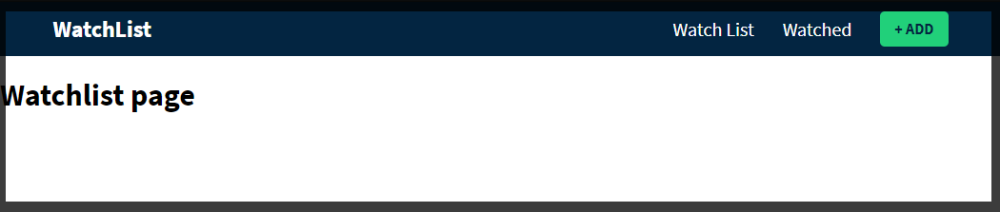
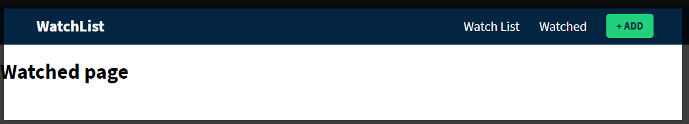

# 002

Устанавливаю

```shell
npm i react-router-dom
```

И так что бы было быстрее добавляю в **App.css**

```css
@import url('https://fonts.googleapis.com/css2?family=Source+Sans+Pro:wght@300;400;600;700;900&display=swap');

:root {
  --primary: #032541;
  --secondary: #21d07a;
  --white: #fff;
}

body {
  font-family: 'Source Sans Pro', sans-serif;
  padding: 0;
  margin: 0;
}

.container {
  padding-right: 15px;
  padding-left: 15px;
  margin-right: auto;
  margin-left: auto;
}

@media (min-width: 768px) {
  .container {
    width: 750px;
  }
}

@media (min-width: 992px) {
  .container {
    width: 970px;
  }
}

@media (min-width: 1200px) {
  .container {
    width: 1170px;
  }
}

*,
*:before,
*:after {
  box-sizing: border-box;
}

.btn {
  padding: 10px 15px;
  background-color: var(--secondary);
  color: var(--primary);
  border-radius: 5px;
  text-transform: uppercase;
  font-weight: 700;
  display: inline-block;
  border: none;
  font-size: 1rem;
  transition: all 0.3s ease;
  line-height: 1.1;
}

.btn:hover {
  background-color: #1aa762;
  opacity: 1;
  cursor: pointer;
}

.btn:disabled {
  pointer-events: none;
  opacity: 0.5;
}

input:focus {
  outline: none;
}

/* Header Styles */
header {
  background-color: var(--primary);
}

header .inner-content {
  display: flex;
  justify-content: space-between;
  align-items: center;
  padding: 10px 0;
}

header a {
  color: var(--white);
  font-size: 1.25rem;
  text-decoration: none;
  transition: all 0.3s ease;
}

header a:hover {
  opacity: 0.7;
}

header .brand a {
  font-weight: 700;
  font-size: 1.5rem;
}

header .nav-links {
  padding: 0;
  margin: 0;
  list-style: none;
  display: flex;
  align-items: center;
}

header .nav-links li {
  display: inline-block;
  margin-right: 30px;
}

header .nav-links li:last-child {
  margin-right: 0;
}

/* Add Page */
.add-content {
  padding: 50px 0;
  max-width: 600px;
  margin: 0 auto;
}

.add-content .input-wrapper input {
  width: 100%;
  background-color: var(--primary);
  padding: 10px;
  border-radius: 5px;
  border: none;
  color: var(--white);
  font-size: 1.25rem;
}

.results {
  padding: 0;
  margin: 0;
  margin-top: 20px;
}

.results li {
  list-style: none;
}

.result-card {
  display: flex;
  margin-bottom: 20px;
}

.result-card .poster-wrapper img,
.filler-poster {
  width: 75px;
  height: 113px;
  background-color: #dbdada;
  border-radius: 5px;
  margin-right: 15px;
  display: block;
  color: transparent;
}

.result-card .info {
  display: flex;
  flex-direction: column;
  justify-content: space-between;
}

.result-card .info .title {
  font-size: 1.25rem;
  color: var(--primary);
  font-weight: 600;
  margin: 0;
}

.result-card .info .release-date {
  font-size: 1.25rem;
  font-weight: 300;
  color: var(--primary);
  margin: 0;
}

.result-card .controls button {
  margin-right: 10px;
}

/* Movie Page */
.movie-page {
  padding: 30px 0;
}

.movie-page .header {
  display: flex;
  align-items: center;
  justify-content: space-between;
  margin-bottom: 30px;
}

.count-pill {
  display: block;
  background-color: var(--secondary);
  padding: 5px 15px;
  font-size: 1.125rem;
  font-weight: 600;
  border-radius: 999px;
  color: var(--primary);
}

.movie-page .heading {
  color: var(--primary);
  margin: 0;
}

.movie-grid {
  display: grid;
  grid-template-columns: repeat(3, 1fr);
  grid-gap: 30px;
}

@media (min-width: 992px) {
  .movie-grid {
    grid-template-columns: repeat(5, 1fr);
  }
}

.movie-card {
  width: 100%;
  border-radius: 5px;
  overflow: hidden;
  position: relative;
  border: 0;
  display: block;
}

.movie-card img {
  width: 100%;
  display: block;
}

.movie-card .overlay {
  position: absolute;
  top: 0;
  left: 0;
  width: 100%;
  height: 100%;
  border: 2px solid transparent;
  transition: all 0.3s ease;
}

.movie-card:hover .overlay {
  border: 3px solid var(--secondary);
}

.movie-card .inner-card-controls {
  display: inline;
  background-color: red;
  position: absolute;
  bottom: 20px;
  left: 50%;
  transform: translateX(-50%);
  background: rgba(0, 0, 0, 0.8);
  border-radius: 5px;
  padding: 3px;
  opacity: 0;
  transition: all 0.3s ease;
}

.movie-card:hover .inner-card-controls {
  opacity: 1;
}

.ctrl-btn {
  color: #fefefe;
  background-color: transparent;
  border: none;
  transition: all 0.3s ease;
  font-size: 1.25rem;
  padding: 5px;
  margin: 0;
}

.ctrl-btn:hover {
  color: var(--secondary);
  cursor: pointer;
}

.movie-page .no-movies {
  color: #c4c4c4;
  font-size: 3rem;
  text-align: center;
}
```

Добавляю папку со шрифтами **lib**.

Создаю папку components. В ней файлы **Watchlist.js** т.е. список наблюдения. Как я уже сказал во время настройки мы будем использовать расширение для быстрого создания компонентов <https://marketplace.visualstudio.com/items?itemName=dsznajder.es7-react-js-snippets>. Теперь после установки я могу ввести rafc

```js
import React from 'react';

export const Watchlist = () => {
  return <div></div>;
};
```

Таким же образом создаю компоненты **Add.js**.

```jsx
import React from 'react';

export const Add = () => {
  return <div></div>;
};
```

Далее **Watched.js** Будут содержаться просмотренные фильмы.

```js
import React from 'react';

export const Watched = () => {
  return (
    <div>
      <h1>Watched page</h1>
    </div>
  );
};
```

Так же нужна навигационная панель **Header.js**

```js
import React from 'react';

export const Header = () => {
  return <div></div>;
};
```

И начинаю заполнять навигационную панель. Для того что бы перемещаться по навигационным ссылкам импортирую **Link** из **react-router-dom**. И создаю разметку.

```jsx
// Header.js

import React from 'react';
import { Link } from 'react-router-dom';

export const Header = () => {
  return (
    <header>
      <div className="container">
        <div className="inner-content">
          <div className="brand">
            <Link to="/">Watch list</Link>
          </div>

          <ul className="nav-links">
            <li>
              <Link to="/">Watch list</Link>
            </li>
            <li>
              <Link to="/watched">Watched</Link>
            </li>
            <li>
              <Link to="/add" className="btn">
                Add
              </Link>
            </li>
          </ul>
        </div>
      </div>
    </header>
  );
};
```

Теперь возвращаюсь в **App.js** для того что бы разобраться маршрутизацией. Здесь я импортирую **BrowserRouter** как **Router** и само сабой **Switch** и **Route** из библиотеки **react-router-dom**. И далее так же импортирую компоненты которые я создал. И так же импортирую шрифт.

```jsx
import React from 'react';
import { BrowserRouter as Router, Switch, Route } from 'react-router-dom';
import {} from './components/Add.js';
import {} from './components/Header.js';
import {} from './components/Watched.js';
import {} from './components/Watchlist.js';
import './App.css';
import './lib/font-awesome/css/all.min.css';

function App() {
  return (
    <div className="App">
      <p>React и localStorage</p>
    </div>
  );
}

export default App;
```

И так начинаю работу над роутингом.

```js
import React from 'react';
import { BrowserRouter as Router, Switch, Route } from 'react-router-dom';
import { Add } from './components/Add.js';
import { Header } from './components/Header.js';
import { Watched } from './components/Watched.js';
import { Watchlist } from './components/Watchlist.js';
import './App.css';
import './lib/font-awesome/css/all.min.css';

function App() {
  return (
    <Router>
      <Header />

      <Switch>
        <Route exact path="/">
          <Watchlist />
        </Route>
        <Route path="watched">
          <Watched />
        </Route>
        <Route path="/add">
          <Add />
        </Route>
      </Switch>
    </Router>
  );
}

export default App;
```

И так вот все рабочие файлы

```jsx
//Watchlist
import React from 'react';

export const Watchlist = () => {
  return (
    <div>
      <h1>Watchlist page</h1>
    </div>
  );
};
```

```jsx
//Watched
import React from 'react';

export const Watched = () => {
  return (
    <div>
      <h1>Watched page</h1>
    </div>
  );
};
```

```js
//App
import React from 'react';
import { BrowserRouter as Router, Switch, Route } from 'react-router-dom';
import { Add } from './components/Add.js';
import { Header } from './components/Header.js';
import { Watched } from './components/Watched.js';
import { Watchlist } from './components/Watchlist.js';
import './App.css';
import './lib/font-awesome/css/all.min.css';

function App() {
  return (
    <Router>
      <Header />

      <Switch>
        <Route exact path="/">
          <Watchlist />
        </Route>
        <Route path="/watched">
          <Watched />
        </Route>
        <Route path="/add">
          <Add />
        </Route>
      </Switch>
    </Router>
  );
}

export default App;
```

```jsx
//Add
import React from 'react';

export const Add = () => {
  return (
    <div>
      <h1>Add page</h1>
    </div>
  );
};
```

```jsx
//Header
import React from 'react';
import { Link } from 'react-router-dom';

export const Header = () => {
  return (
    <header>
      <div className="container">
        <div className="inner-content">
          <div className="brand">
            <Link to="/">WatchList</Link>
          </div>

          <ul className="nav-links">
            <li>
              <Link to="/">Watch List</Link>
            </li>

            <li>
              <Link to="/watched">Watched</Link>
            </li>

            <li>
              <Link to="/add" className="btn btn-main">
                + Add
              </Link>
            </li>
          </ul>
        </div>
      </div>
    </header>
  );
};
```






И так маршрутизация настроена.
