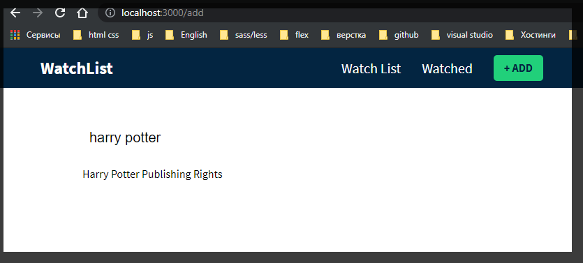
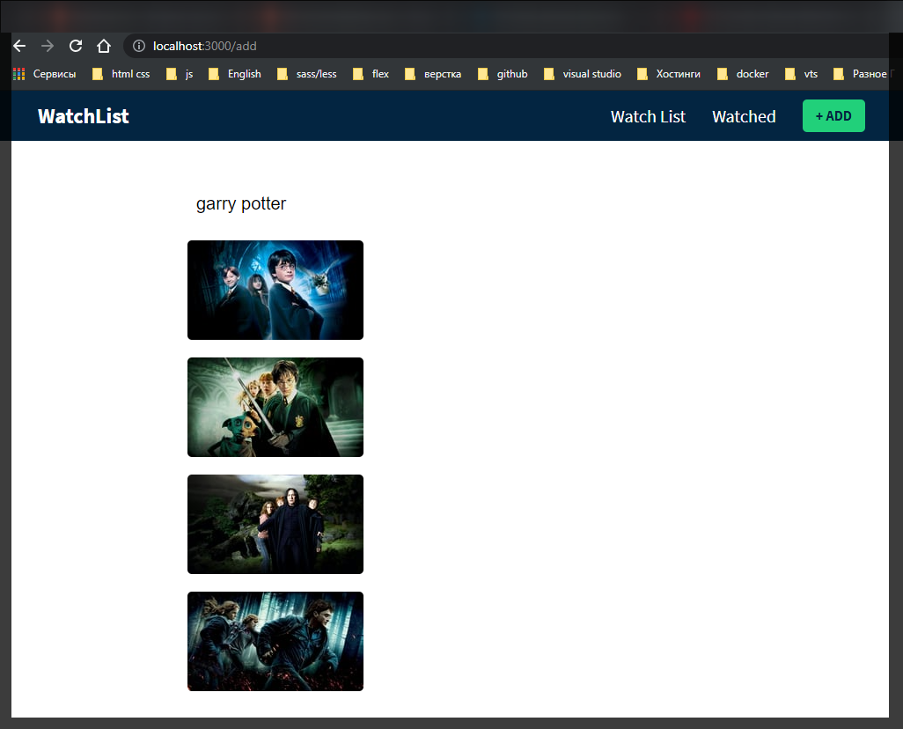
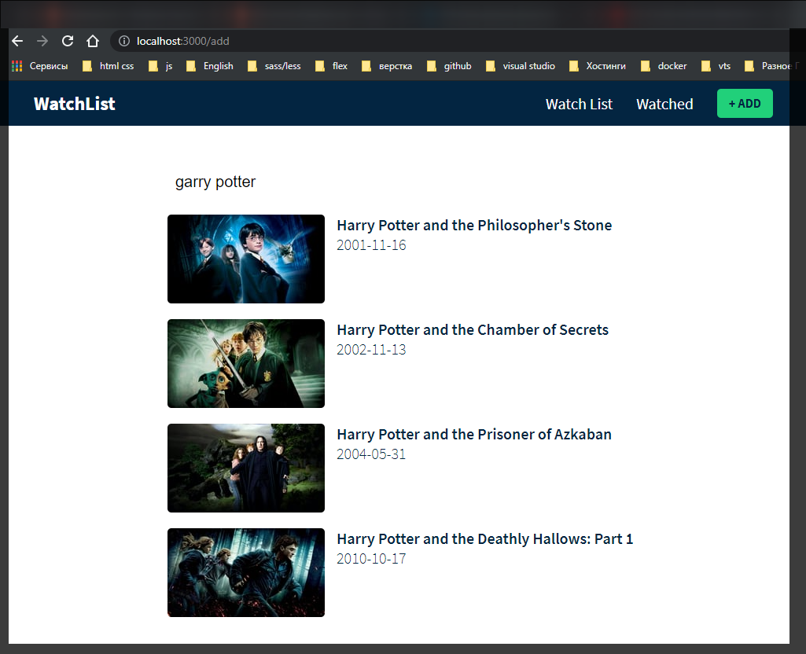
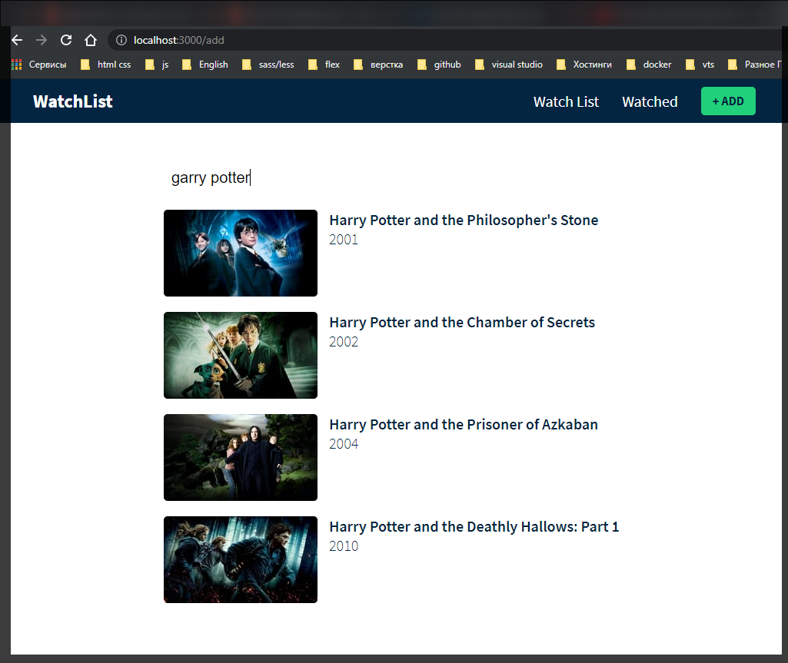

**Смотри внимательно много чего переписывалось**

И так мне теперь это нужно как-то хранить.

Мне нужно создать другое состояния для хранения результатов API. По этому я собираюсь сделать еще одну переменную состояния.

```jsx
//Add
import React, { useState } from 'react';

export const Add = () => {
  const [query, setQuery] = useState('');
  const [results, setResults] = useState([]);

  const onChange = (e) => {
    e.preventDefault();
    setQuery(e.target.value);
    fetch(
      `https://api.themoviedb.org/3/search/company?api_key=${process.env.REACT_APP_TMDB_KEY}&language=en-US$page=1&include_adult=false&query=${e.target.value}`
    ).then((res) =>
      res.json().then((data) => {
        console.log(data);
      })
    );
  };

  return (
    <div className="add-page">
      <div className="container">
        <div className="add-content">
          <div className="input-wrapper">
            <input
              type="text"
              placeholder="Search for a  movie"
              value={query}
              onChange={onChange}
            />
          </div>
        </div>
      </div>
    </div>
  );
};
```

Теперь там где я выводил в консоль пишу условие. проверяю есть ли ошибка

```js
//Add
import React, { useState } from 'react';

export const Add = () => {
  const [query, setQuery] = useState('');
  const [results, setResults] = useState([]);

  const onChange = (e) => {
    e.preventDefault();
    setQuery(e.target.value);
    fetch(
      `https://api.themoviedb.org/3/search/company?api_key=${process.env.REACT_APP_TMDB_KEY}&language=en-US$page=1&include_adult=false&query=${e.target.value}`
    ).then((res) =>
      res.json().then((data) => {
        if (!data.errors) {
          setResults(data.results);
        } else {
          setResults([]);
        }
      })
    );
  };

  return (
    <div className="add-page">
      <div className="container">
        <div className="add-content">
          <div className="input-wrapper">
            <input
              type="text"
              placeholder="Search for a  movie"
              value={query}
              onChange={onChange}
            />
          </div>
        </div>
      </div>
    </div>
  );
};
```

И далее я хочу отобразить результат. Оказывается получаемый масси данных у нас с ним разнятся. Он при переборе массива обращается к **title**. А у меня это name. Так что смотри внимательно.

```jsx
//Add
import React, { useState } from 'react';

export const Add = () => {
  const [query, setQuery] = useState('');
  const [results, setResults] = useState([]);

  const onChange = (e) => {
    e.preventDefault();
    setQuery(e.target.value);
    fetch(
      `https://api.themoviedb.org/3/search/company?api_key=${process.env.REACT_APP_TMDB_KEY}&language=en-US$page=1&include_adult=false&query=${e.target.value}`
    )
      .then((res) => res.json())
      .then((data) => {
        if (!data.errors) {
          setResults(data.results);
          console.log(data.results);
        } else {
          setResults([]);
        }
      });
  };

  return (
    <div className="add-page">
      <div className="container">
        <div className="add-content">
          <div className="input-wrapper">
            <input
              type="text"
              placeholder="Search for a  movie"
              value={query}
              onChange={onChange}
            />
          </div>
          {results.length > 0 && (
            <ul className="results">
              {results.map((movie) => (
                <li key={movie.id}>{movie.name}</li>
              ))}
            </ul>
          )}
        </div>
      </div>
    </div>
  );
};
```



Очевидно то что я хочу лучшего отображения.

Я собираюсь сделать новый компонент под названием карта результатов. Создаю компонент **ResultCard.js**

```js
import React from 'react';

export const ResultCard = () => {
  return <div></div>;
};
```

В этот компонент я передаю получаемый объект. В параметр функции передаю **movie**. Для того что бы получить **props** из данного объекта я его деструктурирую.

```jsx
import React from 'react';

export const ResultCard = ({ movie }) => {
  return <div></div>;
};
```

В разметку я собираюсь вернуть **div** с классом **result-card**.

```jsx
import React from 'react';

export const ResultCard = ({ movie }) => {
  return (
    <div className="result-card">
      <div className="poster-wrapper"></div>
    </div>
  );
};
```

И далее возвращаю плакат фильмов. Пишу **{movie.poster_path ?}**. И далее я собираюсь создать элемент изображения с исходным кодом. Прописываю элемент **img**.

```jsx
import React from 'react';

export const ResultCard = ({ movie }) => {
  return (
    <div className="result-card">
      <div className="poster-wrapper">
        {movie.poster_path ?
      
      }
      </div>
    </div>
  );
};
```

В **src** прописываю шаблонную строку. И собираю здесь строку.

```
https://image.tmdb.org
```

Попадаю в **CDN**. Далее после косой черты я могу отображать плакат. Нам нужно создать **URL**. Я так понял что для начало вбиваю адрес для проверки.

```
/t/p/
```

Я так понял возвращает случайное изображение

```jsx
w200;
```

Ширина изображения. А затем поскольку мы снова используем шаблон. Дале вставляю путь к постеру фильма

```jsx
import React from 'react';

export const ResultCard = ({ movie }) => {
  return (
    <div className="result-card">
      <div className="poster-wrapper">
        {movie.poster_path ?
      
      }
      </div>
    </div>
  );
};
```

Так же мне нужно сделать элемент **alt**. Мне так же нужно поместить сюда все элементы. Так же ставлю фигурные скобки и использую литералы. Сюда помещаю название фильма.

```jsx
import React from 'react';

export const ResultCard = ({ movie }) => {
  return (
    <div className="result-card">
      <div className="poster-wrapper">
        {
          movie.poster_path ? (
            
          ) : (
            <div className="filter-poster"></div>
          ) // Пустое изображение
        }
      </div>
    </div>
  );
};
```

Далее я импортирую данный файл в **Add.js**.

```jsx
//Add
import React, { useState } from 'react';
import { ResultCard } from './ResultCard.js';

export const Add = () => {
  const [query, setQuery] = useState('');
  const [results, setResults] = useState([]);

  const onChange = (e) => {
    e.preventDefault();
    setQuery(e.target.value);
    fetch(
      `https://api.themoviedb.org/3/search/company?api_key=${process.env.REACT_APP_TMDB_KEY}&language=en-US$page=1&include_adult=false&query=${e.target.value}`
    )
      .then((res) => res.json())
      .then((data) => {
        if (!data.errors) {
          setResults(data.results);
          console.log(data.results);
        } else {
          setResults([]);
        }
      });
  };

  return (
    <div className="add-page">
      <div className="container">
        <div className="add-content">
          <div className="input-wrapper">
            <input
              type="text"
              placeholder="Search for a  movie"
              value={query}
              onChange={onChange}
            />
          </div>
          {results.length > 0 && (
            <ul className="results">
              {results.map((movie) => (
                <li key={movie.id}>{movie.name}</li>
              ))}
            </ul>
          )}
        </div>
      </div>
    </div>
  );
};
```

А затем внутри когда я отображаю результаты. Я удаляю старый **li** и прописываю новый. Не забываю про уникальный ключ. И добавляю туда компонент **ResultCard**. В **prop** ему передаю **movie** т.е. через этот prop передаю ему сам фильм.

```jsx
//Add
import React, { useState } from 'react';
import { ResultCard } from './ResultCard.js';

export const Add = () => {
  const [query, setQuery] = useState('');
  const [results, setResults] = useState([]);

  const onChange = (e) => {
    e.preventDefault();
    setQuery(e.target.value);
    fetch(
      `https://api.themoviedb.org/3/search/company?api_key=${process.env.REACT_APP_TMDB_KEY}&language=en-US$page=1&include_adult=false&query=${e.target.value}`
    )
      .then((res) => res.json())
      .then((data) => {
        if (!data.errors) {
          setResults(data.results);
          console.log(data.results);
        } else {
          setResults([]);
        }
      });
  };

  return (
    <div className="add-page">
      <div className="container">
        <div className="add-content">
          <div className="input-wrapper">
            <input
              type="text"
              placeholder="Search for a  movie"
              value={query}
              onChange={onChange}
            />
          </div>
          {results.length > 0 && (
            <ul className="results">
              {results.map((movie) => (
                <li key={movie.id}>
                  <ResultCard movie={movie} />
                </li>
              ))}
            </ul>
          )}
        </div>
      </div>
    </div>
  );
};
```

И так у меня в объекте используется не **poster_path** а **logo_path**. У неко постеры выводятся нормально. А у меня в объекте ничего не лежит. Хотя что-то выводиться.

И так для того что бы выводить более менее правильные фильмы, а не фильмы для взрослых. Я пересобрал строку **fetch** запроса. А так же переписал обращение к ключам массива. Теперь это так.

```jsx
//Add
import React, { useState } from 'react';
import { ResultCard } from './ResultCard.js';

export const Add = () => {
  const [query, setQuery] = useState('');
  const [results, setResults] = useState([]);

  const onChange = (e) => {
    e.preventDefault();
    setQuery(e.target.value);
    fetch(
      `https://api.themoviedb.org/3/search/movie?api_key=${process.env.REACT_APP_TMDB_KEY}&language=en-US$page=1&include_adult=false&query=${e.target.value}`
    )
      .then((res) => res.json())
      .then((data) => {
        if (!data.errors) {
          setResults(data.results);
          console.log(data.results);
        } else {
          setResults([]);
        }
      });
  };

  return (
    <div className="add-page">
      <div className="container">
        <div className="add-content">
          <div className="input-wrapper">
            <input
              type="text"
              placeholder="Search for a  movie"
              value={query}
              onChange={onChange}
            />
          </div>
          {results.length > 0 && (
            <ul className="results">
              {results.map((movie) => (
                <li key={movie.id}>
                  <ResultCard movie={movie} />
                </li>
              ))}
            </ul>
          )}
        </div>
      </div>
    </div>
  );
};
```

```jsx
import React from 'react';

export const ResultCard = ({ movie }) => {
  return (
    <div className="result-card">
      <div className="poster-wrapper">
        {
          movie.backdrop_path ? (
            
          ) : (
            <div className="filter-poster"></div>
          ) // Пустое изображение
        }
      </div>
    </div>
  );
};
```



И теперь дополняю разметку.

```jsx
import React from 'react';

export const ResultCard = ({ movie }) => {
  return (
    <div className="result-card">
      <div className="poster-wrapper">
        {
          movie.backdrop_path ? (
            
          ) : (
            <div className="filter-poster"></div>
          ) // Пустое изображение
        }
      </div>
      <div className="info">
        <div className="header">
          <h3 className="title">{movie.original_title}</h3>

          <h4 className="release-date">{movie.release_date}</h4>
        </div>
      </div>
    </div>
  );
};
```



Для того что бы просто выводить год я использую функцию [substring](https://developer.mozilla.org/ru/docs/Web/JavaScript/Reference/Global_Objects/String/substring)(). В ней указываю какие индексы массива строки выводить. Т.е. я создаю подстроку которая возвращает диапазон индексов.

```jsx
import React from 'react';

export const ResultCard = ({ movie }) => {
  return (
    <div className="result-card">
      <div className="poster-wrapper">
        {
          movie.backdrop_path ? (
            
          ) : (
            <div className="filter-poster"></div>
          ) // Пустое изображение
        }
      </div>
      <div className="info">
        <div className="header">
          <h3 className="title">{movie.original_title}</h3>

          <h4 className="release-date">{movie.release_date}</h4>
        </div>
      </div>
    </div>
  );
};
```


Однако Сейчас при вводе выскочит ошибка. По этому вывод года я лучше пропишу в условии.

```jsx
import React from 'react';

export const ResultCard = ({ movie }) => {
  return (
    <div className="result-card">
      <div className="poster-wrapper">
        {
          movie.backdrop_path ? (
            
          ) : (
            <div className="filter-poster"></div>
          ) // Пустое изображение
        }
      </div>
      <div className="info">
        <div className="header">
          <h3 className="title">{movie.original_title}</h3>

          <h4 className="release-date">
            {movie.release_date ? movie.release_date.substring(0, 4) : '-'}
          </h4>
        </div>
      </div>
    </div>
  );
};
```


