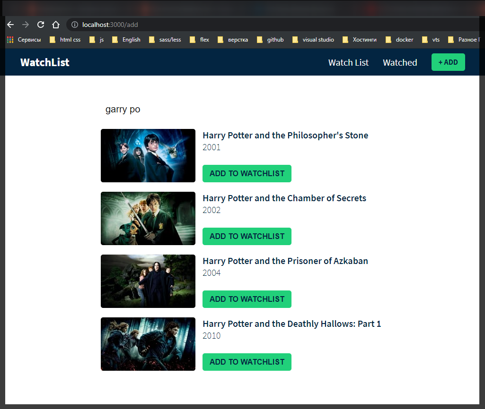
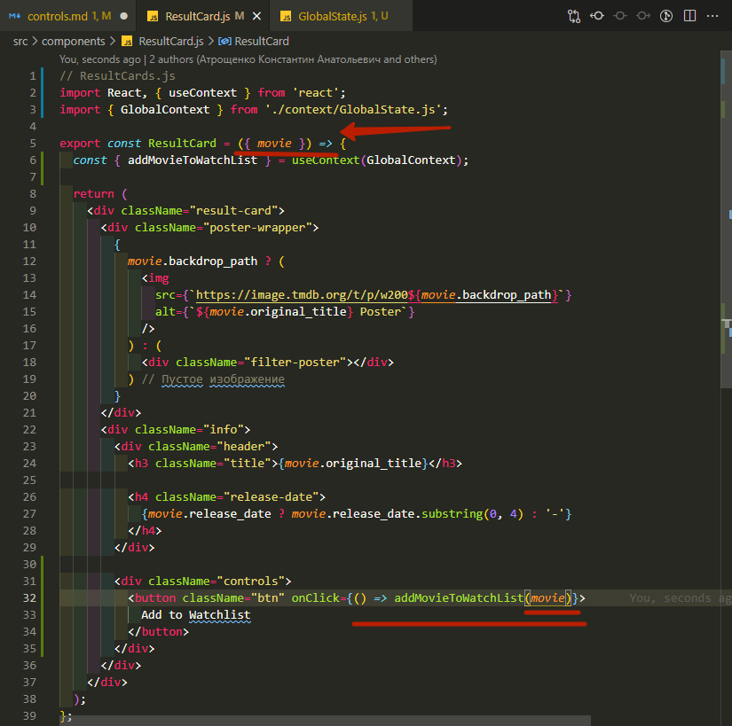
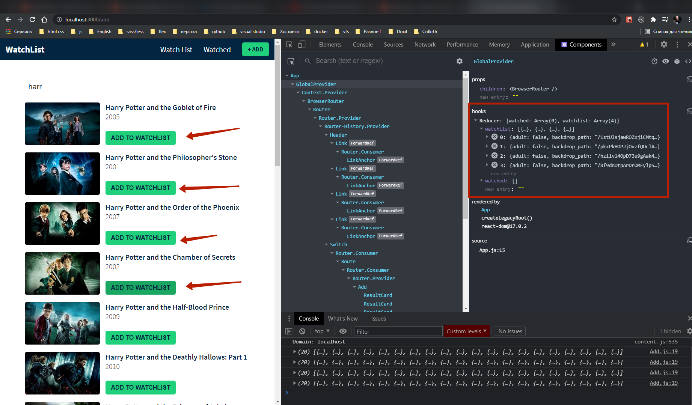
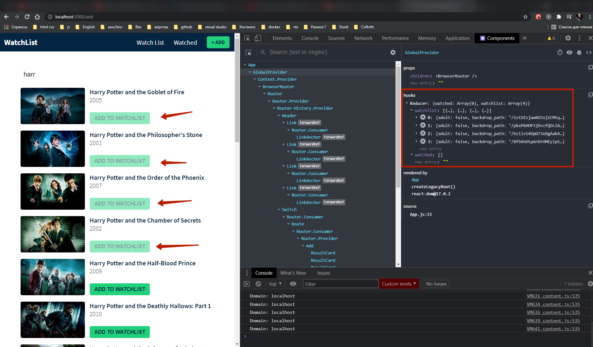

# Элементы управления

Под классом **header** создаю наши сложные элементы управления. Сосдаю класс **controls**

```jsx
import React from 'react';

export const ResultCard = ({ movie }) => {
  return (
    <div className="result-card">
      <div className="poster-wrapper">
        {
          movie.backdrop_path ? (
            
          ) : (
            <div className="filter-poster"></div>
          ) // Пустое изображение
        }
      </div>
      <div className="info">
        <div className="header">
          <h3 className="title">{movie.original_title}</h3>

          <h4 className="release-date">
            {movie.release_date ? movie.release_date.substring(0, 4) : '-'}
          </h4>
        </div>

        <div className="controls">
          <button className="btn">Add to Watchlist</button>
        </div>
      </div>
    </div>
  );
};
```



В аспекте контекстного **API** мы рассмотрели перехватчик реакции с точки зрения использования **React Hooks**. Но теперь мне нужно глобальное состояние. Для этого создаю новую папку и называю ее **context**. И в ней создаю файл **GlobalState.js**. Здесь я собираюсь создать контекст который позволит получить доступ к данным из либого компонента.

Импотртирую **createContext**, **useReducer**, **useEffect**.

```jsx
//GlobalState.js
import React, { createContext, useReducer, useEffect } from 'react';
```

Первое что вам нужно сделать, когда вы работаете над каким-то контекстом. Вам нужно сделать начальное состояние.

```jsx
//GlobalState.js
import React, { createContext, useReducer, useEffect } from 'react';

//initial state
const initialState = {};
```

И теперь перечисляю то что мне здесь понадобится.

```jsx
//GlobalState.js
import React, { createContext, useReducer, useEffect } from 'react';

//initial state
const initialState = {
  watchlist: [], // массив фильмов
  watched: [], // фильм
};
```

Теперь я создаю контекст и экспортирую его. При создании контекста в параметры **createContext** передаю начальное состояние т.е. **initialState**.

```jsx
//GlobalState.js
import React, { createContext, useReducer, useEffect } from 'react';

//initial state
const initialState = {
  watchlist: [], // массив фильмов
  watched: [], // фильм
};

//create context
export const GlobalContext = createContext(initialState);
```

Теперь у меня есть возможность передоставлять другим компонентам начальное значение. Теперь через **Provider** получаю доступ к этому глобальному контексту.

При создании **GlobalProvider** так же экспортирую его. В параметры передаю **props**. И далее в теле функции прописываю логигу которая позволяет ему быть поставщиком.

И так первым делом я хочу указать началоное состояние **state**, вторым параметром указываю функцию отправки **dispatch** и далее указываю что я буду работать с **useReducer**.

```jsx
//GlobalState.js
import React, { createContext, useReducer, useEffect } from 'react';

//initial state
const initialState = {
  watchlist: [], // массив фильмов
  watched: [], // фильм
};

//create context
export const GlobalContext = createContext(initialState);

// provider components
export const GlobalProvider = (props) => {
  const [state, dispatch] = useReducer();
};
```

Теперь мне нужно создать **reducer**.

В параметры **useReducer** я передаю **AppReducer** и **initialState**

```jsx
//GlobalState.js
import React, { createContext, useReducer, useEffect } from 'react';

//initial state
const initialState = {
  watchlist: [], // массив фильмов
  watched: [], // фильм
};

//create context
export const GlobalContext = createContext(initialState);

// provider components
export const GlobalProvider = (props) => {
  const [state, dispatch] = useReducer(AppReducer, initialState);
};
```

Теперь я создаю файл **AppReducer**. Этот редуктор создает функцию которая возвращает некоторые данные состояния, поэтому они в основном описывают, как ваше состояние передается в следующее состояние.

```jsx
export default (state, action) => {
  switch (action.type) {
    default:
      return state;
  }
};
```

и импортирую. Кстати странно что ни каких ошибок.

```jsx
//GlobalState.js
import React, { createContext, useReducer, useEffect } from 'react';
import AppReducer from './AppReducer.js';

//initial state
const initialState = {
  watchlist: [], // массив фильмов
  watched: [], // фильм
};

//create context
export const GlobalContext = createContext(initialState);

// provider components
export const GlobalProvider = (props) => {
  const [state, dispatch] = useReducer(AppReducer, initialState);
};
```

Далее в **GlobalState.js** возвращаю **GlobalContext.Provider**.

```jsx
//GlobalState.js
import React, { createContext, useReducer, useEffect } from 'react';
import AppReducer from './AppReducer.js';

//initial state
const initialState = {
  watchlist: [], // массив фильмов
  watched: [], // фильм
};

//create context
export const GlobalContext = createContext(initialState);

// provider components
export const GlobalProvider = (props) => {
  const [state, dispatch] = useReducer(AppReducer, initialState);

  return <GlobalContext.Provider></GlobalContext.Provider>;
};
```

В **GlobalContext.Provider** я указываю фигурные скобки и просто возвращаю реквизиты детей т.е. **props.children**.

```jsx
//GlobalState.js
import React, { createContext, useReducer, useEffect } from 'react';
import AppReducer from './AppReducer.js';

//initial state
const initialState = {
  watchlist: [], // массив фильмов
  watched: [], // фильм
};

//create context
export const GlobalContext = createContext(initialState);

// provider components
export const GlobalProvider = (props) => {
  const [state, dispatch] = useReducer(AppReducer, initialState);

  return <GlobalContext.Provider>{props.children}</GlobalContext.Provider>;
};
```

И теперь что бы компоненты могли получить доступ к глобальному контексту мне нужно в **Provider** передать полученные значения.

```jsx
//GlobalState.js
import React, { createContext, useReducer, useEffect } from 'react';
import AppReducer from './AppReducer.js';

//initial state
const initialState = {
  watchlist: [], // массив фильмов
  watched: [], // фильм
};

//create context
export const GlobalContext = createContext(initialState);

// provider components
export const GlobalProvider = (props) => {
  const [state, dispatch] = useReducer(AppReducer, initialState);

  return (
    <GlobalContext.Provider
      value={{ watchlist: state.watchlist, watched: state.watched }}
    >
      {props.children}
    </GlobalContext.Provider>
  );
};
```

И так теперь мне нужны действия **actions**. Клгда я нажимаю на кнопку добавить мне нужно я сообщаю поставщику что я делаю действие т.е что делать после того как я нажал на кнопку.

И так мне нужна функция предоставляющая данные о фильме и ею будет **addMovieToWatchList** в параметры которая принимает фильм т.е. **movie**.

```jsx
//GlobalState.js
import React, { createContext, useReducer, useEffect } from 'react';
import AppReducer from './AppReducer.js';

//initial state
const initialState = {
  watchlist: [], // массив фильмов
  watched: [], // фильм
};

//create context
export const GlobalContext = createContext(initialState);

// provider components
export const GlobalProvider = (props) => {
  const [state, dispatch] = useReducer(AppReducer, initialState);

  // actions

  const addMovieToWatchList = (movie) => {};

  return (
    <GlobalContext.Provider
      value={{ watchlist: state.watchlist, watched: state.watched }}
    >
      {props.children}
    </GlobalContext.Provider>
  );
};
```

Далее прописываю функцию **dispatch** в которой указываю тип действия. И в **payload** передаю данные фильма т.е. **movie**.

```jsx
//GlobalState.js
import React, { createContext, useReducer, useEffect } from 'react';
import AppReducer from './AppReducer.js';

//initial state
const initialState = {
  watchlist: [], // массив фильмов
  watched: [], // фильм
};

//create context
export const GlobalContext = createContext(initialState);

// provider components
export const GlobalProvider = (props) => {
  const [state, dispatch] = useReducer(AppReducer, initialState);

  // actions

  const addMovieToWatchList = (movie) => {
    dispatch({ type: 'ADD_MOVIE_TO_WATHLIST', payload: movie });
  };

  return (
    <GlobalContext.Provider
      value={{ watchlist: state.watchlist, watched: state.watched }}
    >
      {props.children}
    </GlobalContext.Provider>
  );
};
```

Теперь я перехожу к **AppReducer** и сообщаю как хранить эти данные внутри нашего магазина. Поэтому я создаю **case**. Указываю тип. В Возвращаемом объекте указываю что я возвращаю старый **state** который деструктурирую и далее указываю какие изменения должны произойти. Получаю массив списка наблюдения т.е. новый массив в который передаю полезную нагрузку **action.paylod** т.е. данные фильма и есть полезная нагрузка которую мы только что передали. И вторым параметром в массиве деструктурирую исходное состояние состояние **state** и обращаюсь к его ключу **watchlist**. т.е. если мне память не изменяет то в квадратных скобрах просходит слияние старого скопированного массива состояния с новым значением состояния.

```jsx
export default (state, action) => {
  switch (action.type) {
    case 'ADD_MOVIE_TO_WATHLIST':
      return {
        ...state,
        watchlist: [action.payload, ...state.watchlist],
      };
    default:
      return state;
  }
};
```

Теперь в **GlobalState.js** передаю функцию **addMovieToWatchList** в **Provider** т.е. точно так же как **ключ : значение**.

```jsx
//GlobalState.js
import React, { createContext, useReducer, useEffect } from 'react';
import AppReducer from './AppReducer.js';

//initial state
const initialState = {
  watchlist: [], // массив фильмов
  watched: [], // фильм
};

//create context
export const GlobalContext = createContext(initialState);

// provider components
export const GlobalProvider = (props) => {
  const [state, dispatch] = useReducer(AppReducer, initialState);

  // actions

  const addMovieToWatchList = (movie) => {
    dispatch({ type: 'ADD_MOVIE_TO_WATHLIST', payload: movie });
  };

  return (
    <GlobalContext.Provider
      value={{
        watchlist: state.watchlist,
        watched: state.watched,
        addMovieToWatchList: addMovieToWatchList,
      }}
    >
      {props.children}
    </GlobalContext.Provider>
  );
};
```

Но поскольку у них ключ и значение совпадает я могу передать

```jsx
//GlobalState.js
import React, { createContext, useReducer, useEffect } from 'react';
import AppReducer from './AppReducer.js';

//initial state
const initialState = {
  watchlist: [], // массив фильмов
  watched: [], // фильм
};

//create context
export const GlobalContext = createContext(initialState);

// provider components
export const GlobalProvider = (props) => {
  const [state, dispatch] = useReducer(AppReducer, initialState);

  // actions

  const addMovieToWatchList = (movie) => {
    dispatch({ type: 'ADD_MOVIE_TO_WATHLIST', payload: movie });
  };

  return (
    <GlobalContext.Provider
      value={{
        watchlist: state.watchlist,
        watched: state.watched,
        addMovieToWatchList,
      }}
    >
      {props.children}
    </GlobalContext.Provider>
  );
};
```

Теперь мне нужно все компоненты обернуть в **Provider**.

```jsx
//App
import React from 'react';
import { BrowserRouter as Router, Switch, Route } from 'react-router-dom';
import { Add } from './components/Add.js';
import { Header } from './components/Header.js';
import { Watched } from './components/Watched.js';
import { Watchlist } from './components/Watchlist.js';
import './App.css';
import './lib/font-awesome/css/all.min.css';

import { GlobalProvider } from './components/context/GlobalState.js';

function App() {
  return (
    <GlobalProvider>
      <Router>
        <Header />

        <Switch>
          <Route exact path="/">
            <Watchlist />
          </Route>
          <Route path="/watched">
            <Watched />
          </Route>
          <Route path="/add">
            <Add />
          </Route>
        </Switch>
      </Router>
    </GlobalProvider>
  );
}

export default App;
```

Теперь в компоненте **ResultCards.js** импортирую **useContext** и так же импортирую наш глобальный **GlobalContext**.

```jsx
// ResultCards.js
import React, { useContext } from 'react';
import { GlobalContext } from './context/GlobalState.js';

export const ResultCard = ({ movie }) => {
  return (
    <div className="result-card">
      <div className="poster-wrapper">
        {
          movie.backdrop_path ? (
            
          ) : (
            <div className="filter-poster"></div>
          ) // Пустое изображение
        }
      </div>
      <div className="info">
        <div className="header">
          <h3 className="title">{movie.original_title}</h3>

          <h4 className="release-date">
            {movie.release_date ? movie.release_date.substring(0, 4) : '-'}
          </h4>
        </div>

        <div className="controls">
          <button className="btn">Add to Watchlist</button>
        </div>
      </div>
    </div>
  );
};
```

Теперь я могу из глобального контекста всять **action**. Т.е. диструктурирую функцию **addMovieToWatchList** из **GlobalContext** который передаю как параметр в **useContext**.

```jsx
// ResultCards.js
import React, { useContext } from 'react';
import { GlobalContext } from './context/GlobalState.js';

export const ResultCard = ({ movie }) => {
  const { addMovieToWatchList } = useContext(GlobalContext);

  return (
    <div className="result-card">
      <div className="poster-wrapper">
        {
          movie.backdrop_path ? (
            
          ) : (
            <div className="filter-poster"></div>
          ) // Пустое изображение
        }
      </div>
      <div className="info">
        <div className="header">
          <h3 className="title">{movie.original_title}</h3>

          <h4 className="release-date">
            {movie.release_date ? movie.release_date.substring(0, 4) : '-'}
          </h4>
        </div>

        <div className="controls">
          <button className="btn">Add to Watchlist</button>
        </div>
      </div>
    </div>
  );
};
```

Теперь на кнопку вешаю **onClick** возвращаю **addMovieToWatchList** в параметры который принимает **movie** Который я деструктурирую в параметрах функции **ResuldCard**.

```jsx
// ResultCards.js
import React, { useContext } from 'react';
import { GlobalContext } from './context/GlobalState.js';

export const ResultCard = ({ movie }) => {
  const { addMovieToWatchList } = useContext(GlobalContext);

  return (
    <div className="result-card">
      <div className="poster-wrapper">
        {
          movie.backdrop_path ? (
            
          ) : (
            <div className="filter-poster"></div>
          ) // Пустое изображение
        }
      </div>
      <div className="info">
        <div className="header">
          <h3 className="title">{movie.original_title}</h3>

          <h4 className="release-date">
            {movie.release_date ? movie.release_date.substring(0, 4) : '-'}
          </h4>
        </div>

        <div className="controls">
          <button className="btn" onClick={() => addMovieToWatchList(movie)}>
            Add to Watchlist
          </button>
        </div>
      </div>
    </div>
  );
};
```





Как видим я обновил редуктор и фильм теперь добавлен в список просмотра. Но проблема в том что кнопка не отображается серым цветом. И так же я пока что могу добавлять один и тот же фильм несколько раз.

Добавляю функциональность для предотвращения множественного добавления фильма.

Создаю переменную **let storedMovie**. И теперь я хочу получить доступ к списку наблюдения. Поэтому я из контекста импортирую **watchlist** для того что бы получить доступ к списку наблюдения. Далюше в переменную **storedMovie** я хочу занести логику которая будет искать т.е. **watchlist.find()**. Прописываю стрелочную функцию которая принимает в параметры o т.е. **object**. Которая будет сравнивать **id** текущего объекта с **id** лежащим в БД.

```jsx
// ResultCards.js
import React, { useContext } from 'react';
import { GlobalContext } from './context/GlobalState.js';

export const ResultCard = ({ movie }) => {
  const { addMovieToWatchList, watchlist } = useContext(GlobalContext);

  let storedMovie = watchlist.find((o) => o.id === movie.id);

  return (
    <div className="result-card">
      <div className="poster-wrapper">
        {
          movie.backdrop_path ? (
            
          ) : (
            <div className="filter-poster"></div>
          ) // Пустое изображение
        }
      </div>
      <div className="info">
        <div className="header">
          <h3 className="title">{movie.original_title}</h3>

          <h4 className="release-date">
            {movie.release_date ? movie.release_date.substring(0, 4) : '-'}
          </h4>
        </div>

        <div className="controls">
          <button className="btn" onClick={() => addMovieToWatchList(movie)}>
            Add to Watchlist
          </button>
        </div>
      </div>
    </div>
  );
};
```

Теперь создаю переменную **const watchlistDisabled =** которая будет переключатся с **true** на **false** в зависимости если есть сохраненный фильм. **const watchlistDisabled = storedMovie ? true : false;** И теперь в кнопку прописываю атрибут **disabled** куда передаю **watchlistDisabled**.

```jsx
// ResultCards.js
import React, { useContext } from 'react';
import { GlobalContext } from './context/GlobalState.js';

export const ResultCard = ({ movie }) => {
  const { addMovieToWatchList, watchlist } = useContext(GlobalContext);

  let storedMovie = watchlist.find((o) => o.id === movie.id);

  const watchlistDisabled = storedMovie ? true : false;

  return (
    <div className="result-card">
      <div className="poster-wrapper">
        {
          movie.backdrop_path ? (
            
          ) : (
            <div className="filter-poster"></div>
          ) // Пустое изображение
        }
      </div>
      <div className="info">
        <div className="header">
          <h3 className="title">{movie.original_title}</h3>

          <h4 className="release-date">
            {movie.release_date ? movie.release_date.substring(0, 4) : '-'}
          </h4>
        </div>

        <div className="controls">
          <button
            disabled={watchlistDisabled}
            className="btn"
            onClick={() => addMovieToWatchList(movie)}
          >
            Add to Watchlist
          </button>
        </div>
      </div>
    </div>
  );
};
```


