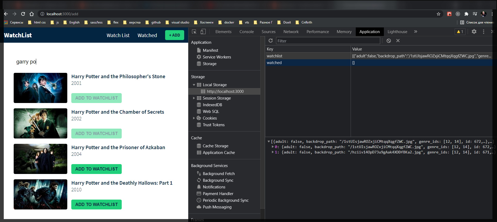

#

Следующая проблема заключается в том что наши данные не сохраняются т.е. если я обновлю страницу я теряю этот список наблюдения. Я бы мог хранить это все в БД но не могу.

Для этого я буду использовать **localStorage**.

И так я возвращаюсь к глобальному хранилищу. Здесь я импортировал **useEffect** который я и собираюсь использовать. По этому внутри нашего **Provider** я собираюсь использовать т.е. после инициализации **useReducer**.

```jsx
//GlobalState.js
import React, { createContext, useReducer, useEffect } from 'react';
import AppReducer from './AppReducer.js';

//initial state
const initialState = {
  watchlist: [], // массив фильмов
  watched: [], // фильм
};

//create context
export const GlobalContext = createContext(initialState);

// provider components
export const GlobalProvider = (props) => {
  const [state, dispatch] = useReducer(AppReducer, initialState);

  useEffect(() => {});

  // actions
  const addMovieToWatchList = (movie) => {
    dispatch({ type: 'ADD_MOVIE_TO_WATHLIST', payload: movie });
  };

  return (
    <GlobalContext.Provider
      value={{
        watchlist: state.watchlist,
        watched: state.watched,
        addMovieToWatchList,
      }}
    >
      {props.children}
    </GlobalContext.Provider>
  );
};
```

Теперь я обращаюсь к **localStorage.setItem** и прописываю следующее

```jsx
useEffect(() => {
  localStorage.setItem('watchlist', JSON.stringify(state.watchlist));
}, [state]);
```

```jsx
//GlobalState.js
import React, { createContext, useReducer, useEffect } from 'react';
import AppReducer from './AppReducer.js';

//initial state
const initialState = {
  watchlist: [], // массив фильмов
  watched: [], // фильм
};

//create context
export const GlobalContext = createContext(initialState);

// provider components
export const GlobalProvider = (props) => {
  const [state, dispatch] = useReducer(AppReducer, initialState);

  useEffect(() => {
    localStorage.setItem('watchlist', JSON.stringify(state.watchlist));
  }, [state]);

  // actions
  const addMovieToWatchList = (movie) => {
    dispatch({ type: 'ADD_MOVIE_TO_WATHLIST', payload: movie });
  };

  return (
    <GlobalContext.Provider
      value={{
        watchlist: state.watchlist,
        watched: state.watched,
        addMovieToWatchList,
      }}
    >
      {props.children}
    </GlobalContext.Provider>
  );
};
```

И вот все сохранянется в **localStorage**. Однако при обновлении страницы **localStorage** тоже очищается.

Теперь для того что бы получить то что хранится в **localStorage** мне нужно изменить начальное состояние в **watchlist** в **initialState**.

Для этого я пишу **watchlist: localStorage.getItem('watchlist')** т.е. если такой ключ есть то я возвращаю **JSON.parse(localStorage.getItem('watchlist))** иначе возвращаю пустой массив.

И для **watched** делаем тоже самое.

И дальше в **useEffect** сохраняю **watched** в **localStorage**.

```js
//GlobalState.js
import React, { createContext, useReducer, useEffect } from 'react';
import AppReducer from './AppReducer.js';

//initial state
const initialState = {
  watchlist: localStorage.getItem('watchlist')
    ? JSON.parse(localStorage.getItem('watchlist'))
    : [], // массив фильмов
  watched: localStorage.getItem('watched')
    ? JSON.parse(localStorage.getItem('watched'))
    : [], // фильм
};

//create context
export const GlobalContext = createContext(initialState);

// provider components
export const GlobalProvider = (props) => {
  const [state, dispatch] = useReducer(AppReducer, initialState);

  useEffect(() => {
    localStorage.setItem('watchlist', JSON.stringify(state.watchlist));
    localStorage.setItem('watched', JSON.stringify(state.watched));
  }, [state]);

  // actions
  const addMovieToWatchList = (movie) => {
    dispatch({ type: 'ADD_MOVIE_TO_WATHLIST', payload: movie });
  };

  return (
    <GlobalContext.Provider
      value={{
        watchlist: state.watchlist,
        watched: state.watched,
        addMovieToWatchList,
      }}
    >
      {props.children}
    </GlobalContext.Provider>
  );
};
```



И вот теперь я вывожу сохраненное состояние в **localstorage** на страницу.
В качестве начального состояния в нашем списке наблюдения
