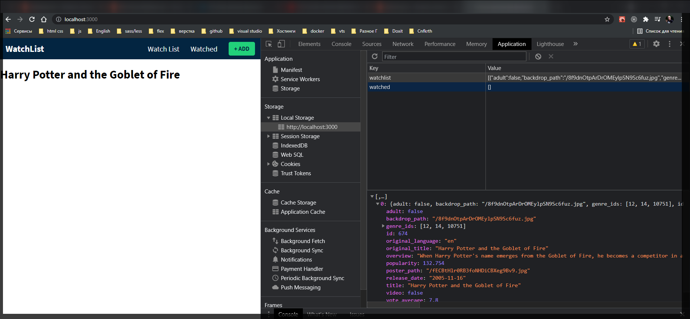
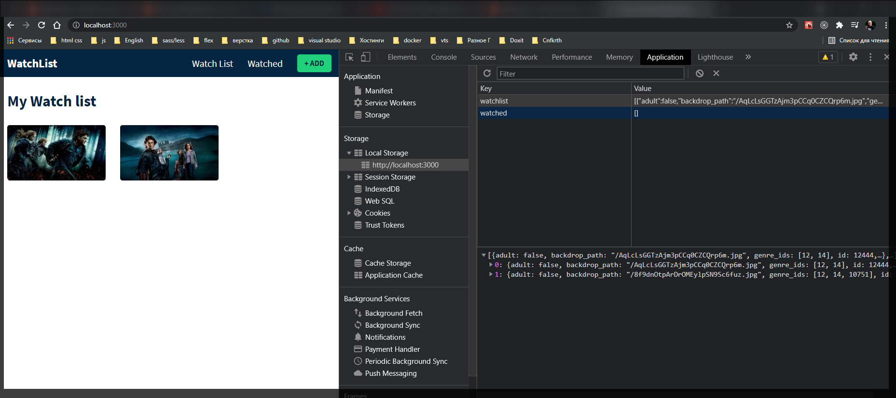
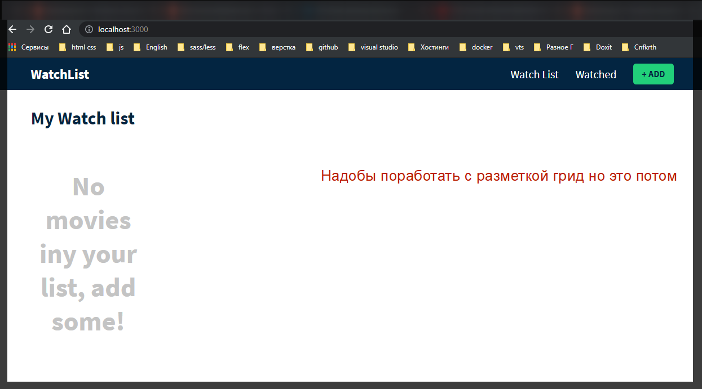

И так теперь я собираюсь внести некоторые изменения в наш компонент списка наблюдения **Watchlist.js**

```jsx
//Watchlist
import React from 'react';

export const Watchlist = () => {
  return (
    <div>
      <h1>Watchlist page</h1>
    </div>
  );
};
```

Допустим к нашим фильмам которые мы сохранили в контексте отобразим их в красивой сетке. Для этого я импортирую useContext и импортирую **GlobalContext**.

```jsx
//Watchlist
import React, { useContext } from 'react';
import {} from './context/GlobalState.js';

export const Watchlist = () => {
  return (
    <div>
      <h1>Watchlist page</h1>
    </div>
  );
};
```

И затем внутри нашего компонента деструктурирую **watchlist** из **GlobalContext** который принимаю как параметр в **useContext**. Это доступ к частям нашего массива.

```jsx
//Watchlist
import React, { useContext } from 'react';
import { GlobalContext } from './context/GlobalState.js';

export const Watchlist = () => {
  const { watchlist } = useContext(GlobalContext);

  return (
    <div>
      <h1>Watchlist page</h1>
    </div>
  );
};
```

И теперь итерирую массив.

```js
//Watchlist
import React, { useContext } from 'react';
import { GlobalContext } from './context/GlobalState.js';

export const Watchlist = () => {
  const { watchlist } = useContext(GlobalContext);

  return (
    <div>
      {watchlist.map((movie) => (
        <h1 key={movie.id}>{movie.original_title}</h1>
      ))}
    </div>
  );
};
```

И вот у меня выводится то что сохранено в **localStorate** на странице **Watch list**.



И теперь создам правильную разметку.

```jsx
//Watchlist
import React, { useContext } from 'react';
import { GlobalContext } from './context/GlobalState.js';

export const Watchlist = () => {
  const { watchlist } = useContext(GlobalContext);

  return (
    <div>
      <div className="movie-page">
        <div className="container">
          <div className="header">
            <h1 className="heading">My Watch list</h1>
          </div>
          {watchlist.length}
        </div>
      </div>
    </div>
  );
};
```

Теперь для удобства возвращения фильмов, создаю новый компонент

```jsx
import React from 'react';

export const MovieCard = ({ movie, type }) => {
  return (
    <div className="movie-card">
      <div className="overlay"></div>
      {
        movie.backdrop_path ? (
          
        ) : (
          <div className="filter-poster"></div>
        ) // Пустое изображение
      }
    </div>
  );
};
```

В Аргументы **MovieCard** так же добавляю **type** который будет равен просмотренному фильму

Возвращаюсь к **Watchlist** и добавляю разметку.

```jsx
//Watchlist
import React, { useContext } from 'react';
import { GlobalContext } from './context/GlobalState.js';
import { MovieCard } from './MovieCard.js';

export const Watchlist = () => {
  const { watchlist } = useContext(GlobalContext);

  return (
    <div>
      <div className="movie-page">
        <div className="container">
          <div className="header">
            <h1 className="heading">My Watch list</h1>
          </div>

          <div className="movie-grid">
            {watchlist.map((movie) => (
              <MovieCard key={movie.id} movie={movie} type="watchlist" />
            ))}
          </div>
        </div>
      </div>
    </div>
  );
};
```



Однако нужно прописать условие так как фильмов может и не быть.

```jsx
//Watchlist
import React, { useContext } from 'react';
import { GlobalContext } from './context/GlobalState.js';
import { MovieCard } from './MovieCard.js';

export const Watchlist = () => {
  const { watchlist } = useContext(GlobalContext);

  return (
    <div>
      <div className="movie-page">
        <div className="container">
          <div className="header">
            <h1 className="heading">My Watch list</h1>
          </div>

          <div className="movie-grid">
            {watchlist.length > 0 ? (
              watchlist.map((movie) => (
                <MovieCard key={movie.id} movie={movie} type="watchlist" />
              ))
            ) : (
              <h2 className="no-movies">No movies iny your list, add some!</h2>
            )}
          </div>
        </div>
      </div>
    </div>
  );
};
```


