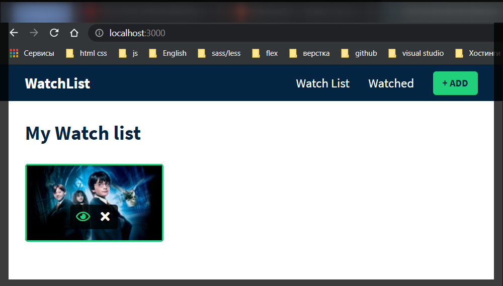

# Удаление фильма

Рассмотрим элемент управления удаления. Он будет выглядеть как маленький крестик. Он будет выполнять функцию удаления из нашего списка. И еще реализую значок добавления т.е. будет добавляться в список тех фильмов которые я хочу посмотреть т.е. при клике перенесу его в список просмотра.

Создаю новый компонент **MovieControls.js**

```jsx
//MovieControls.js
import React from 'react';

export const MovieControls = () => {
  return <div></div>;
};
```

Для того что бы у меня был доступ управления я кое что сделаю. Т.е. сам фильм управляется данным функциональным компонентом. Для этого в параметры данного компонента деструктурирую **props** т.е. сам фильм **movie** и **type**.

Создаю базовую разметку.

```jsx
//MovieControls.js
import React from 'react';

export const MovieControls = () => {
  return <div className="inner-card-controls"></div>;
};
```

Здесь будут находиться элементы управления карточкой. Данные элементы будут накладываться на карту. Я хочу создать несколько кнопок. Для этого я должен написать условие и проверить находятся ли они в списке наблюдения.

И так проверяю если **type** равен списку наблюдения и , далее прописываю **ReactFragment** и внутри нет элемента я возвращаю кнопку со значком глаза.

```jsx
//MovieControls.js
import React from 'react';

export const MovieControls = ({ movie, type }) => {
  return (
    <div className="inner-card-controls">
      {type === 'watchlist' && (
        <>
          <button className="ctrl-btn">
            <i className="fa-fw far fa-eye"></i>
          </button>
        </>
      )}
    </div>
  );
};
```

Далее копирую кнопку и делаю еще один крос элемент удаления.

```jsx
//MovieControls.js
import React from 'react';

export const MovieControls = ({ movie, type }) => {
  return (
    <div className="inner-card-controls">
      {type === 'watchlist' && (
        <>
          <button className="ctrl-btn">
            <i className="fa-fw far fa-eye"></i>
          </button>
          <button className="ctrl-btn">
            <i className="fa-fw fa fa-times"></i>
          </button>
        </>
      )}
    </div>
  );
};
```

Далее перехожу к нашей карточке фильма т.е. **MovieCard** в который мне нужно импортировать **MovieControls**.

```jsx
// MovieCard.js
import React from 'react';
import { MovieControls } from './MovieControls.js';

export const MovieCard = ({ movie, type }) => {
  return (
    <div className="movie-card">
      <div className="overlay"></div>
      {
        movie.backdrop_path ? (
          
        ) : (
          <div className="filter-poster"></div>
        ) // Пустое изображение
      }
    </div>
  );
};
```

А затем под наш плакат я возвращаю элементы управления фильмом. И передаю ему тип управления фильмом т.е. в пропсы передаю **type={type}**. Он будет определять в какой стадии находится фильм т.е. в списке просмотра или в списке просмотренный. А так же передаю **movie={movie}**

```jsx
// MovieCard.js
import React from 'react';
import { MovieControls } from './MovieControls.js';

export const MovieCard = ({ movie, type }) => {
  return (
    <div className="movie-card">
      <div className="overlay"></div>
      {
        movie.backdrop_path ? (
          
        ) : (
          <div className="filter-poster"></div>
        ) // Пустое изображение
      }
      <MovieControls type={type} movie={movie} />
    </div>
  );
};
```



И так теперь поработаю над элементом управления удаления.

И так я иду в глобальный **GlobalState**. И здесь я собираюсь совершить новое действие т.е. удаление из списка просмотра. Создаю константу **removeMovieFromWatchList**. Для удаления я передаю в параметры функции **id** для того что бы решить какой фильм удалять. В теле функции пишу **dispatch({type: "REMOVE_MOVIE_FROM_WATCHLIST"})** и так же у него будет полезная нагрузка **payload:id**. В **payload** я указываю по какому параметру я буду производить данное действие.

```jsx
//GlobalState.js
import React, { createContext, useReducer, useEffect } from 'react';
import { AppReducer } from './AppReducer.js';

//initial state
const initialState = {
  watchlist: localStorage.getItem('watchlist')
    ? JSON.parse(localStorage.getItem('watchlist'))
    : [], // массив фильмов
  watched: localStorage.getItem('watched')
    ? JSON.parse(localStorage.getItem('watched'))
    : [], // фильм
};

//create context
export const GlobalContext = createContext(initialState);

// provider components
export const GlobalProvider = (props) => {
  const [state, dispatch] = useReducer(AppReducer, initialState);

  useEffect(() => {
    localStorage.setItem('watchlist', JSON.stringify(state.watchlist));
    localStorage.setItem('watched', JSON.stringify(state.watched));
  }, [state]);

  // actions
  const addMovieToWatchList = (movie) => {
    dispatch({ type: 'ADD_MOVIE_TO_WATHLIST', payload: movie });
  };

  const removeMovieFromWatchlist = (id) => {
    dispatch({ type: 'REMOVE_MOVIE_FROM_WATCHLIST', payload: id });
  };

  return (
    <GlobalContext.Provider
      value={{
        watchlist: state.watchlist,
        watched: state.watched,
        addMovieToWatchList,
      }}
    >
      {props.children}
    </GlobalContext.Provider>
  );
};
```

Далее данное действие мне необходимо передать в значение **provider** т.е. просто передаю функцию **removeMovieFromWatchlist**. Т.е. передаю поставщику нашего глобального контекста.

```jsx
//GlobalState.js
import React, { createContext, useReducer, useEffect } from 'react';
import { AppReducer } from './AppReducer.js';

//initial state
const initialState = {
  watchlist: localStorage.getItem('watchlist')
    ? JSON.parse(localStorage.getItem('watchlist'))
    : [], // массив фильмов
  watched: localStorage.getItem('watched')
    ? JSON.parse(localStorage.getItem('watched'))
    : [], // фильм
};

//create context
export const GlobalContext = createContext(initialState);

// provider components
export const GlobalProvider = (props) => {
  const [state, dispatch] = useReducer(AppReducer, initialState);

  useEffect(() => {
    localStorage.setItem('watchlist', JSON.stringify(state.watchlist));
    localStorage.setItem('watched', JSON.stringify(state.watched));
  }, [state]);

  // actions
  const addMovieToWatchList = (movie) => {
    dispatch({ type: 'ADD_MOVIE_TO_WATHLIST', payload: movie });
  };

  const removeMovieFromWatchlist = (id) => {
    dispatch({ type: 'REMOVE_MOVIE_FROM_WATCHLIST', payload: id });
  };

  return (
    <GlobalContext.Provider
      value={{
        watchlist: state.watchlist,
        watched: state.watched,
        addMovieToWatchList,
        removeMovieFromWatchlist,
      }}
    >
      {props.children}
    </GlobalContext.Provider>
  );
};
```

Теперь я могу получить доступ к даннойфункции из другого компонента.

Теперь внутри **AppReducer** мне нужно сказать что далеть когда данное действие происходит.

Создаю новый case который удалит фильм из списка просмотра. **case "REMOVE_MOVIE_FROM_WATCHLIST": return {...state,}** так же копирую старое состояние. Но затем я хочу изменить список наблюдения **watchlist:** который я хочу отфильтровать **state.watchlist.filter()** внутри прописываю стрелочную функцию которая в параметры принимает **movie**. Далее в теле цикла обращаюсь к **movie.id** и говорю что он не должен равняться **action.paylod**. Таким образом он отфильтрует нужный нам **id**.

Т.е. если я привильно понял то в **GGlobalState.js** в функции **removeMovieFromWatchlist** в функции **dispatch** т.е. функции отправки я указываю что **payload:id**. Далее в **AppReducer** при фильтровании **state.watchlist** я указываю что **id** фильма не должен совпадать с **id** указанным в **payload**. При итерировании массива он его естественно находит и удаляет данный индекс массива, пересобирает массив и возвращает новый массив, но уже в том индентификаторе в котором он нашел нужное нам значение лежит новое значение которое сместилось скажем так с конца в начало на 1 индекс массива.

```jsx
export const AppReducer = (state, action) => {
  switch (action.type) {
    case 'ADD_MOVIE_TO_WATHLIST':
      return {
        ...state,
        watchlist: [action.payload, ...state.watchlist],
      };
    case 'REMOVE_MOVIE_FROM_WATCHLIST':
      return {
        ...state,
        watchlist: state.watchlist.filter(
          (movie) => movie.id !== action.payload
        ),
      };
    default:
      return state;
  }
};
```

Теперь перехожу в элемент управления фильмом. В **MovieControls.js**. В него импортирую **useContext** и так же импортирую глобальный контекст

```jsx
//MovieControls.js
import React, { useContext } from 'react';
import { GlobalContext } from './context/GlobalState.js';

export const MovieControls = ({ movie, type }) => {
  return (
    <div className="inner-card-controls">
      {type === 'watchlist' && (
        <>
          <button className="ctrl-btn">
            <i className="fa-fw far fa-eye"></i>
          </button>
          <button className="ctrl-btn">
            <i className="fa-fw fa fa-times"></i>
          </button>
        </>
      )}
    </div>
  );
};
```

Теперь деструктурирую функцию удаления **removeMovieFromWatchlist** из **GlobalContext** который передаю в параметр **useContext**. И далее в кнопке в **onClick** с помощью **callback** вернуть вызов данной функции, в параметры данной функции я передаю **id** фильма т.е. **movie.id**

```jsx
//MovieControls.js
import React, { useContext } from 'react';
import { GlobalContext } from './context/GlobalState.js';

export const MovieControls = ({ movie, type }) => {
  const { removeMovieFromWatchlist } = useContext(GlobalContext);
  return (
    <div className="inner-card-controls">
      {type === 'watchlist' && (
        <>
          <button className="ctrl-btn">
            <i className="fa-fw far fa-eye"></i>
          </button>
          <button
            onClick={() => removeMovieFromWatchlist(movie.id)}
            className="ctrl-btn"
          >
            <i className="fa-fw fa fa-times"></i>
          </button>
        </>
      )}
    </div>
  );
};
```
