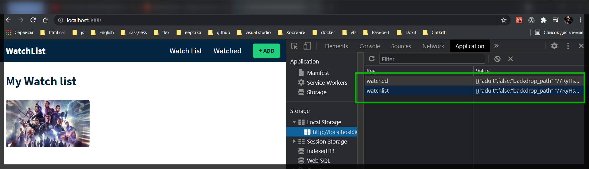

# Добавление в список просмотренных и обратно в список добавленных фильмов, кнопка удаления, добавление в список просмотренных прямо из поиска, и добавление функционала отключения кнопок.

Теперь я хочу добавить фильм в список просмотра. Я хочу иметь возможность перемещать фильмы на страниу просмотра, что бы увидеть, какие фильмы я смотрел.
Иду в компонент **Watched** и добавляю **useContext** и **GlobalContext**. Так же импортирую карточку фильма **MovieCard**.

```jsx
//Watched
import React, { useContext } from 'react';
import { GlobalContext } from './context/GlobalState.js';
import { MovieCard } from './MovieCard.js';

export const Watched = () => {
  return (
    <div>
      <h1>Watched page</h1>
    </div>
  );
};
```

И так как это будет похожей страницей копирую возвращаемую разметку из **Watchlist.js**.

```jsx
//Watched
import React, { useContext } from 'react';
import { GlobalContext } from './context/GlobalState.js';
import { MovieCard } from './MovieCard.js';

export const Watched = () => {
  return (
    <div>
      <div className="movie-page">
        <div className="container">
          <div className="header">
            <h1 className="heading">Watched Movies</h1>
          </div>

          <div className="movie-grid">
            {watchlist.length > 0 ? (
              watchlist.map((movie) => (
                <MovieCard key={movie.id} movie={movie} type="watchlist" />
              ))
            ) : (
              <h2 className="no-movies">No movies iny your list, add some!</h2>
            )}
          </div>
        </div>
      </div>
    </div>
  );
};
```

И вместо **watchlist** я деструктурирую **watched** из **GlobalContext**.

```jsx
//Watched
import React, { useContext } from 'react';
import { GlobalContext } from './context/GlobalState.js';
import { MovieCard } from './MovieCard.js';

export const Watched = () => {
  const { watched } = useContext(GlobalContext);
  return (
    <div>
      <div className="movie-page">
        <div className="container">
          <div className="header">
            <h1 className="heading">Watched Movies</h1>
          </div>

          <div className="movie-grid">
            {watched.length > 0 ? (
              watched.map((movie) => (
                <MovieCard key={movie.id} movie={movie} type="watched" />
              ))
            ) : (
              <h2 className="no-movies">No movies iny your list, add some!</h2>
            )}
          </div>
        </div>
      </div>
    </div>
  );
};
```


Теперь я возвращаюсь к нашему глобальному состоянию которое мне нужно что бы отправить действие, которое будет перемещать фильм из нашего списка просмотра.

Поэтому внутри нашего глобального состояния реализую функцию добавления **addMovieToWatched**. Данная функция в параметр принимает **movie**. В теле функции прописываю функцию **dispatch({type:"ADD_MOVIE_TO_WATCHED", payload: movie})**. И Затем нам нужно не забыть передать эту функцию в глобальный значение контекста для того что бы она была доступна другим комопнентам.

```jsx
//GlobalState.js
import React, { createContext, useReducer, useEffect } from 'react';
import { AppReducer } from './AppReducer.js';

//initial state
const initialState = {
  watchlist: localStorage.getItem('watchlist')
    ? JSON.parse(localStorage.getItem('watchlist'))
    : [], // массив фильмов
  watched: localStorage.getItem('watched')
    ? JSON.parse(localStorage.getItem('watched'))
    : [], // фильм
};

//create context
export const GlobalContext = createContext(initialState);

// provider components
export const GlobalProvider = (props) => {
  const [state, dispatch] = useReducer(AppReducer, initialState);

  useEffect(() => {
    localStorage.setItem('watchlist', JSON.stringify(state.watchlist));
    localStorage.setItem('watched', JSON.stringify(state.watched));
  }, [state]);

  // actions
  const addMovieToWatchList = (movie) => {
    dispatch({ type: 'ADD_MOVIE_TO_WATHLIST', payload: movie });
  };

  const removeMovieFromWatchlist = (id) => {
    dispatch({ type: 'REMOVE_MOVIE_FROM_WATCHLIST', payload: id });
  };

  const addMovieToWatched = (movie) => {
    dispatch({ type: 'ADD_MOVIE_TO_WATCHED', payload: movie });
  };

  return (
    <GlobalContext.Provider
      value={{
        watchlist: state.watchlist,
        watched: state.watched,
        addMovieToWatchList,
        removeMovieFromWatchlist,
        addMovieToWatched,
      }}
    >
      {props.children}
    </GlobalContext.Provider>
  );
};
```

Теперь внутри AppReducer мне нужно добавить еще один case. **case 'ADD_MOVIE_TO_WATCHED': return{...state,}**. А теперь подумаем что мне здесь нужно сделать дальше? На этот раз я не передаю **id** и так же здесь выполнить действие **action.paylod** не достатьчно. Здесь мне нужно выполнить действие **action.paylod.id** вроде бы.

```jsx
export const AppReducer = (state, action) => {
  switch (action.type) {
    case 'ADD_MOVIE_TO_WATHLIST':
      return {
        ...state,
        watchlist: [action.payload, ...state.watchlist],
      };
    case 'REMOVE_MOVIE_FROM_WATCHLIST':
      return {
        ...state,
        watchlist: state.watchlist.filter(
          (movie) => movie.id !== action.payload
        ),
      };
    case 'ADD_MOVIE_TO_WATCHED':
      return {
        ...state,
        watchlist: state.watchlist.filter(
          (movie) => movie.id !== action.payload.id
        ),
      };
    default:
      return state;
  }
};
```

Теперь он вернет фильмы которые не равны новым которые мы добавляем, поэтому он удаляет их из списка просмотра с помощью этого фильтра.

А затем я хочу его добавить в **watched** что бы действие заносилось в загрузку. **watched:[action.paylod,]** и далее деструктурирую **state**.
**watched**. т.е. произойдет слияние того что находиться в **action.paylod** ,а здесь находится тот фильм по которому кликнули , и **state.watched** , предыдущее состояние, Т.е. фильмы на которые мы кликнули попадут в новый **state.watched**.

```jsx
export const AppReducer = (state, action) => {
  switch (action.type) {
    case 'ADD_MOVIE_TO_WATHLIST':
      return {
        ...state,
        watchlist: [action.payload, ...state.watchlist],
      };
    case 'REMOVE_MOVIE_FROM_WATCHLIST':
      return {
        ...state,
        watchlist: state.watchlist.filter(
          (movie) => movie.id !== action.payload
        ),
      };
    case 'ADD_MOVIE_TO_WATCHED':
      return {
        ...state,
        watchlist: state.watchlist.filter(
          (movie) => movie.id !== action.payload.id
        ),
        watched: [action.payload, ...state.watched],
      };
    default:
      return state;
  }
};
```

Теперь я возвращаюсь к элементам управлени фильмом **MovieControls.js**. Деструктурирую функцию добавления

```jsx
//MovieControls.js
import React, { useContext } from 'react';
import { GlobalContext } from './context/GlobalState.js';

export const MovieControls = ({ movie, type }) => {
  const { removeMovieFromWatchlist, addMovieToWatched } =
    useContext(GlobalContext);
  return (
    <div className="inner-card-controls">
      {type === 'watchlist' && (
        <>
          <button className="ctrl-btn">
            <i className="fa-fw far fa-eye"></i>
          </button>
          <button
            onClick={() => removeMovieFromWatchlist(movie.id)}
            className="ctrl-btn"
          >
            <i className="fa-fw fa fa-times"></i>
          </button>
        </>
      )}
    </div>
  );
};
```

Далее в кнопке прописываю **onClick** в которй с помощью **callback** возвращаю вызов данной функции в параметры которй помещаю **movie**

```jsx
//MovieControls.js
import React, { useContext } from 'react';
import { GlobalContext } from './context/GlobalState.js';

export const MovieControls = ({ movie, type }) => {
  const { removeMovieFromWatchlist, addMovieToWatched } =
    useContext(GlobalContext);
  return (
    <div className="inner-card-controls">
      {type === 'watchlist' && (
        <>
          <button onClick={() => addMovieToWatched(movie)} className="ctrl-btn">
            <i className="fa-fw far fa-eye"></i>
          </button>
          <button
            onClick={() => removeMovieFromWatchlist(movie.id)}
            className="ctrl-btn"
          >
            <i className="fa-fw fa fa-times"></i>
          </button>
        </>
      )}
    </div>
  );
};
```


А теперь я хочу иметь возможность переместить данный фильм обратно.
Сейчас данный фильм наблюдаемый т.е. **watched**. Создам этот **type. {type === 'watched'}** а затем когда **type** будет равен этому мы вернем кнопку

```jsx
//MovieControls.js
import React, { useContext } from 'react';
import { GlobalContext } from './context/GlobalState.js';

export const MovieControls = ({ movie, type }) => {
  const { removeMovieFromWatchlist, addMovieToWatched } =
    useContext(GlobalContext);
  return (
    <div className="inner-card-controls">
      {type === 'watchlist' && (
        <>
          <button onClick={() => addMovieToWatched(movie)} className="ctrl-btn">
            <i className="fa-fw far fa-eye"></i>
          </button>
          <button
            onClick={() => removeMovieFromWatchlist(movie.id)}
            className="ctrl-btn"
          >
            <i className="fa-fw fa fa-times"></i>
          </button>
        </>
      )}

      {type === 'watched' && (
        <>
          <button className="ctrl-btn">
            <i className="fa-fn far fa-eye-slash"></i>
          </button>
        </>
      )}
    </div>
  );
};
```


И так же мне нужна кнопка удаления.

```jsx
//MovieControls.js
import React, { useContext } from 'react';
import { GlobalContext } from './context/GlobalState.js';

export const MovieControls = ({ movie, type }) => {
  const { removeMovieFromWatchlist, addMovieToWatched } =
    useContext(GlobalContext);
  return (
    <div className="inner-card-controls">
      {type === 'watchlist' && (
        <>
          <button onClick={() => addMovieToWatched(movie)} className="ctrl-btn">
            <i className="fa-fw far fa-eye"></i>
          </button>
          <button
            onClick={() => removeMovieFromWatchlist(movie.id)}
            className="ctrl-btn"
          >
            <i className="fa-fw fa fa-times"></i>
          </button>
        </>
      )}

      {type === 'watched' && (
        <>
          <button className="ctrl-btn">
            <i className="fa-fn far fa-eye-slash"></i>
          </button>

          <button
            onClick={() => removeMovieFromWatchlist(movie.id)}
            className="ctrl-btn"
          >
            <i className="fa-fw fa fa-times"></i>
          </button>
        </>
      )}
    </div>
  );
};
```


И теперь мне нужно поработать над действиями этих кнопок. Я собираюсь поработать над двумя новыми действиями. Возвращаюсь в **GlobalContext**. Смотри на коментарии

```jsx
//GlobalState.js
import React, { createContext, useReducer, useEffect } from 'react';
import { AppReducer } from './AppReducer.js';

//initial state
const initialState = {
  watchlist: localStorage.getItem('watchlist')
    ? JSON.parse(localStorage.getItem('watchlist'))
    : [], // массив фильмов
  watched: localStorage.getItem('watched')
    ? JSON.parse(localStorage.getItem('watched'))
    : [], // фильм
};

//create context
export const GlobalContext = createContext(initialState);

// provider components
export const GlobalProvider = (props) => {
  const [state, dispatch] = useReducer(AppReducer, initialState);

  useEffect(() => {
    localStorage.setItem('watchlist', JSON.stringify(state.watchlist));
    localStorage.setItem('watched', JSON.stringify(state.watched));
  }, [state]);

  // actions
  const addMovieToWatchList = (movie) => {
    dispatch({ type: 'ADD_MOVIE_TO_WATHLIST', payload: movie });
  };

  const removeMovieFromWatchlist = (id) => {
    dispatch({ type: 'REMOVE_MOVIE_FROM_WATCHLIST', payload: id });
  };

  const addMovieToWatched = (movie) => {
    dispatch({ type: 'ADD_MOVIE_TO_WATCHED', payload: movie });
  };

  // Возвращаю move to watchlist

  // remove from watched

  return (
    <GlobalContext.Provider
      value={{
        watchlist: state.watchlist,
        watched: state.watched,
        addMovieToWatchList,
        removeMovieFromWatchlist,
        addMovieToWatched,
      }}
    >
      {props.children}
    </GlobalContext.Provider>
  );
};
```

Создаю константу для перемещения **moveToWatchList** которая в себя принимает **movie**. В теле функции прописываю **dispatch({type:'MOVE_TO_WATCHLIST', payload: movie})**. В полезной нагрузке будет снова фильм. Для того что бы это работаль мне нужно это передать в глобальный контекст.

```jsx
//GlobalState.js
import React, { createContext, useReducer, useEffect } from 'react';
import { AppReducer } from './AppReducer.js';

//initial state
const initialState = {
  watchlist: localStorage.getItem('watchlist')
    ? JSON.parse(localStorage.getItem('watchlist'))
    : [], // массив фильмов
  watched: localStorage.getItem('watched')
    ? JSON.parse(localStorage.getItem('watched'))
    : [], // фильм
};

//create context
export const GlobalContext = createContext(initialState);

// provider components
export const GlobalProvider = (props) => {
  const [state, dispatch] = useReducer(AppReducer, initialState);

  useEffect(() => {
    localStorage.setItem('watchlist', JSON.stringify(state.watchlist));
    localStorage.setItem('watched', JSON.stringify(state.watched));
  }, [state]);

  // actions
  const addMovieToWatchList = (movie) => {
    dispatch({ type: 'ADD_MOVIE_TO_WATHLIST', payload: movie });
  };

  const removeMovieFromWatchlist = (id) => {
    dispatch({ type: 'REMOVE_MOVIE_FROM_WATCHLIST', payload: id });
  };

  const addMovieToWatched = (movie) => {
    dispatch({ type: 'ADD_MOVIE_TO_WATCHED', payload: movie });
  };

  // Возвращаю move to watchlist

  const moveToWatchlist = (movie) => {
    dispatch({ type: 'MOVIE_TO_WATCHLIST', payload: movie });
  };

  // remove from watched

  return (
    <GlobalContext.Provider
      value={{
        watchlist: state.watchlist,
        watched: state.watched,
        addMovieToWatchList,
        removeMovieFromWatchlist,
        addMovieToWatched,
        moveToWatchlist,
      }}
    >
      {props.children}
    </GlobalContext.Provider>
  );
};
```

И сразу реализую удаление. Создаю константу **removeFromWatched** в параметр данная функция принимает **id**. В теле функции прописываю **dispatch({type:"REMOVE_FROM_WATCHED", payload: id})**

```jsx
//GlobalState.js
import React, { createContext, useReducer, useEffect } from 'react';
import { AppReducer } from './AppReducer.js';

//initial state
const initialState = {
  watchlist: localStorage.getItem('watchlist')
    ? JSON.parse(localStorage.getItem('watchlist'))
    : [], // массив фильмов
  watched: localStorage.getItem('watched')
    ? JSON.parse(localStorage.getItem('watched'))
    : [], // фильм
};

//create context
export const GlobalContext = createContext(initialState);

// provider components
export const GlobalProvider = (props) => {
  const [state, dispatch] = useReducer(AppReducer, initialState);

  useEffect(() => {
    localStorage.setItem('watchlist', JSON.stringify(state.watchlist));
    localStorage.setItem('watched', JSON.stringify(state.watched));
  }, [state]);

  // actions
  const addMovieToWatchList = (movie) => {
    dispatch({ type: 'ADD_MOVIE_TO_WATHLIST', payload: movie });
  };

  const removeMovieFromWatchlist = (id) => {
    dispatch({ type: 'REMOVE_MOVIE_FROM_WATCHLIST', payload: id });
  };

  const addMovieToWatched = (movie) => {
    dispatch({ type: 'ADD_MOVIE_TO_WATCHED', payload: movie });
  };

  // Возвращаю move to watchlist

  const moveToWatchlist = (movie) => {
    dispatch({ type: 'MOVIE_TO_WATCHLIST', payload: movie });
  };

  // remove from watched

  const removeFromWatched = (id) => {
    dispatch({ type: 'REMOVE_FROM_WATCHED', payload: id });
  };

  return (
    <GlobalContext.Provider
      value={{
        watchlist: state.watchlist,
        watched: state.watched,
        addMovieToWatchList,
        removeMovieFromWatchlist,
        addMovieToWatched,
        moveToWatchlist,
        removeFromWatched,
      }}
    >
      {props.children}
    </GlobalContext.Provider>
  );
};
```

Перехожу в **AppReducer**. Создаю новый **case "MOVIE_TO_WATCHLIST": return {...state,}**. И здесь делаю наоборот **watched: state.watched.filter()**. Принимет **callback** который в свою очередь принимает параметр **movie** и далее пишу что если **movie.id !== action.payload.id** т.е. если **id** фильма не равно **id** полезной нагрузки т.е. тому **id** по которому мы кликнули, то мы просто меняем их местами. И далее в **watchlist** сливаем **id** который есть в **ation.paylod** со старым состоянием **state.watchlist**

```jsx
export const AppReducer = (state, action) => {
  switch (action.type) {
    case 'ADD_MOVIE_TO_WATHLIST':
      return {
        ...state,
        watchlist: [action.payload, ...state.watchlist],
      };
    case 'REMOVE_MOVIE_FROM_WATCHLIST':
      return {
        ...state,
        watchlist: state.watchlist.filter(
          (movie) => movie.id !== action.payload
        ),
      };
    case 'ADD_MOVIE_TO_WATCHED':
      return {
        ...state,
        watchlist: state.watchlist.filter(
          (movie) => movie.id !== action.payload.id
        ),
        watched: [action.payload, ...state.watched],
      };
    case 'MOVIE_TO_WATCHLIST':
      return {
        ...state,
        watched: state.watched.filter(
          (movie) => movie.id !== action.payload.id
        ),
        watchlist: [action.payload, ...state.watchlist],
      };
    default:
      return state;
  }
};
```

Теперь делаю **case** удаления.

```jsx
export const AppReducer = (state, action) => {
  switch (action.type) {
    case 'ADD_MOVIE_TO_WATHLIST':
      return {
        ...state,
        watchlist: [action.payload, ...state.watchlist],
      };
    case 'REMOVE_MOVIE_FROM_WATCHLIST':
      return {
        ...state,
        watchlist: state.watchlist.filter(
          (movie) => movie.id !== action.payload
        ),
      };
    case 'ADD_MOVIE_TO_WATCHED':
      return {
        ...state,
        watchlist: state.watchlist.filter(
          (movie) => movie.id !== action.payload.id
        ),
        watched: [action.payload, ...state.watched],
      };
    case 'MOVIE_TO_WATCHLIST':
      return {
        ...state,
        watched: state.watched.filter(
          (movie) => movie.id !== action.payload.id
        ),
        watchlist: [action.payload, ...state.watchlist],
      };
    case 'REMOVE_FROM_WATCHED':
      return {
        ...state,
        watched: state.watched.filter((movie) => movie.id !== action.payload),
      };
    default:
      return state;
  }
};
```

Теперь перехожу к элементам управления **MovieControls.js** и импортирую **moveToWatchlist**, **removeFromWatched**. И добавляю их в кнопки.

```jsx
//MovieControls.js
import React, { useContext } from 'react';
import { GlobalContext } from './context/GlobalState.js';

export const MovieControls = ({ movie, type }) => {
  const {
    removeMovieFromWatchlist,
    addMovieToWatched,
    moveToWatchlist,
    removeFromWatched,
  } = useContext(GlobalContext);
  return (
    <div className="inner-card-controls">
      {type === 'watchlist' && (
        <>
          <button onClick={() => addMovieToWatched(movie)} className="ctrl-btn">
            <i className="fa-fw far fa-eye"></i>
          </button>
          <button
            onClick={() => removeMovieFromWatchlist(movie.id)}
            className="ctrl-btn"
          >
            <i className="fa-fw fa fa-times"></i>
          </button>
        </>
      )}

      {type === 'watched' && (
        <>
          <button onClick={() => moveToWatchlist(movie)} className="ctrl-btn">
            <i className="fa-fn far fa-eye-slash"></i>
          </button>

          <button
            onClick={() => removeFromWatched(movie.id)}
            className="ctrl-btn"
          >
            <i className="fa-fw fa fa-times"></i>
          </button>
        </>
      )}
    </div>
  );
};
```

И все замечательно работате. И перемещается назад в **Watchlist** и удаляется из **watched**.

Однако есть еще одна проблема. Если я добавлю фильм в просмотренные и попробую заново его добавить в свой список фильмов, мало того что он будет его разрешать добавить, он его добавит. Чего по идее не должно быть




Для того что бы это исправить мне нужно в **ResulCard** проверять карту результатов. Раньше я отключал кнопку после того как добавил фильм.

Я создаю еще одну переменную **let storedMovieWatched** т.е. хранилище просмотренных фильмов. И теперь я буду искать в массиве просмотренных фильмов **watched.find(o => o.id === movie.id)**. И да кстати не забывам импортировать сам массив **watched**.

```jsx
// ResultCards.js
import React, { useContext } from 'react';
import { GlobalContext } from './context/GlobalState.js';

export const ResultCard = ({ movie }) => {
  const { addMovieToWatchList, watchlist, watched } = useContext(GlobalContext);

  let storedMovie = watchlist.find((o) => o.id === movie.id);
  let storedMoviedWatched = watched.find((o) => o.id === movie.id);

  const watchlistDisabled = storedMovie ? true : false;

  return (
    <div className="result-card">
      <div className="poster-wrapper">
        {
          movie.backdrop_path ? (
            
          ) : (
            <div className="filter-poster"></div>
          ) // Пустое изображение
        }
      </div>
      <div className="info">
        <div className="header">
          <h3 className="title">{movie.original_title}</h3>

          <h4 className="release-date">
            {movie.release_date ? movie.release_date.substring(0, 4) : '-'}
          </h4>
        </div>

        <div className="controls">
          <button
            disabled={watchlistDisabled}
            className="btn"
            onClick={() => addMovieToWatchList(movie)}
          >
            Add to Watchlist
          </button>
        </div>
      </div>
    </div>
  );
};
```

И теперь в переменной **watchlistDisabled** в место **false** добавляю проверку.

```jsx
// ResultCards.js
import React, { useContext } from 'react';
import { GlobalContext } from './context/GlobalState.js';

export const ResultCard = ({ movie }) => {
  const { addMovieToWatchList, watchlist, watched } = useContext(GlobalContext);

  let storedMovie = watchlist.find((o) => o.id === movie.id);
  let storedMoviedWatched = watched.find((o) => o.id === movie.id);

  const watchlistDisabled = storedMovie
    ? true
    : storedMoviedWatched
    ? true
    : false;

  return (
    <div className="result-card">
      <div className="poster-wrapper">
        {
          movie.backdrop_path ? (
            
          ) : (
            <div className="filter-poster"></div>
          ) // Пустое изображение
        }
      </div>
      <div className="info">
        <div className="header">
          <h3 className="title">{movie.original_title}</h3>

          <h4 className="release-date">
            {movie.release_date ? movie.release_date.substring(0, 4) : '-'}
          </h4>
        </div>

        <div className="controls">
          <button
            disabled={watchlistDisabled}
            className="btn"
            onClick={() => addMovieToWatchList(movie)}
          >
            Add to Watchlist
          </button>
        </div>
      </div>
    </div>
  );
};
```

и теперь в поиске я не могу повторно добавить просмотренный фильм.


И теперь добавлю функциональность добавлять фильмы в просмотренные прямо из поиска.

В **ResultCard** создаю еще одну кнопку. Диструктурирую **addMovieToWatched** и добавляю в кнопку.

```jsx
// ResultCards.js
import React, { useContext } from 'react';
import { GlobalContext } from './context/GlobalState.js';

export const ResultCard = ({ movie }) => {
  const { addMovieToWatchList, addMovieToWatched, watchlist, watched } =
    useContext(GlobalContext);

  let storedMovie = watchlist.find((o) => o.id === movie.id);
  let storedMoviedWatched = watched.find((o) => o.id === movie.id);

  const watchlistDisabled = storedMovie
    ? true
    : storedMoviedWatched
    ? true
    : false;

  return (
    <div className="result-card">
      <div className="poster-wrapper">
        {
          movie.backdrop_path ? (
            
          ) : (
            <div className="filter-poster"></div>
          ) // Пустое изображение
        }
      </div>
      <div className="info">
        <div className="header">
          <h3 className="title">{movie.original_title}</h3>

          <h4 className="release-date">
            {movie.release_date ? movie.release_date.substring(0, 4) : '-'}
          </h4>
        </div>

        <div className="controls">
          <button
            disabled={watchlistDisabled}
            className="btn"
            onClick={() => addMovieToWatchList(movie)}
          >
            Add to Watchlist
          </button>
          <button
            disabled={watchlistDisabled}
            className="btn"
            onClick={() => addMovieToWatched(movie)}
          >
            Add to Watched
          </button>
        </div>
      </div>
    </div>
  );
};
```

Теперь мне нужно сделать еще одну переменную которая будет отключать кнопку. **const watchedDisabled** .

```jsx
// ResultCards.js
import React, { useContext } from 'react';
import { GlobalContext } from './context/GlobalState.js';

export const ResultCard = ({ movie }) => {
  const { addMovieToWatchList, addMovieToWatched, watchlist, watched } =
    useContext(GlobalContext);

  let storedMovie = watchlist.find((o) => o.id === movie.id);
  let storedMovieWatched = watched.find((o) => o.id === movie.id);

  const watchlistDisabled = storedMovie
    ? true
    : storedMovieWatched
    ? true
    : false;

  const watchedDisabled = storedMovieWatched ? true : false;

  return (
    <div className="result-card">
      <div className="poster-wrapper">
        {
          movie.backdrop_path ? (
            
          ) : (
            <div className="filter-poster"></div>
          ) // Пустое изображение
        }
      </div>
      <div className="info">
        <div className="header">
          <h3 className="title">{movie.original_title}</h3>

          <h4 className="release-date">
            {movie.release_date ? movie.release_date.substring(0, 4) : '-'}
          </h4>
        </div>

        <div className="controls">
          <button
            disabled={watchlistDisabled}
            className="btn"
            onClick={() => addMovieToWatchList(movie)}
          >
            Add to Watchlist
          </button>
          <button
            disabled={watchedDisabled}
            className="btn"
            onClick={() => addMovieToWatched(movie)}
          >
            Add to Watched
          </button>
        </div>
      </div>
    </div>
  );
};
```


