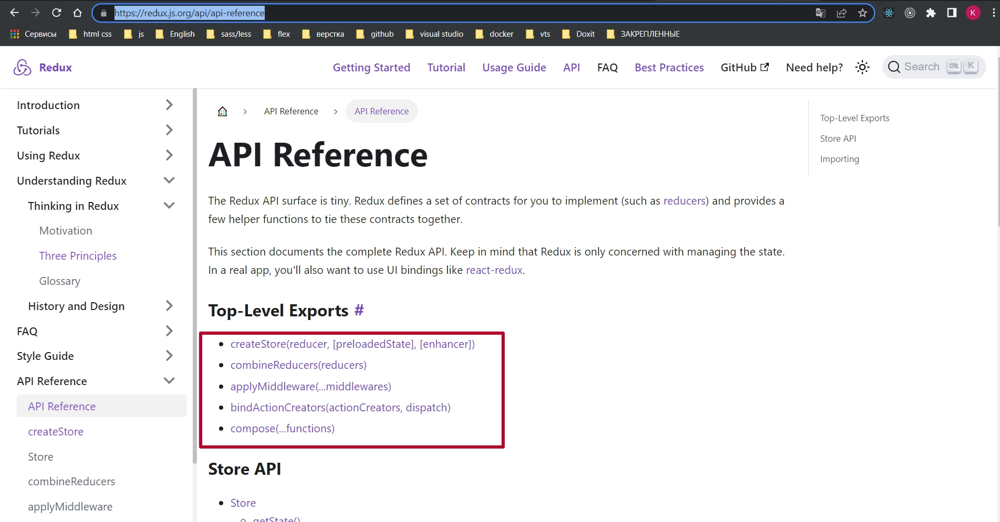
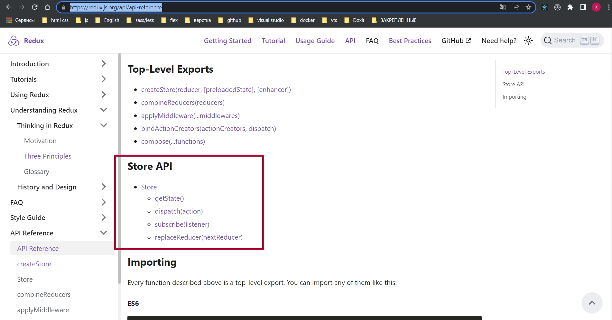

# 002_Базовое_API_Redux

<https://redux.js.org/api/api-reference>

В Официальной документации говорится что у нас есть всего лишь пять методов с которыми мы можем работать.

И дополнительно у нашего store есть еще четыре встроенных метода.

Т.е. пять методов на верхнем уровне. И еще четыре дополнительных. Из пяти на старте мы будем использовать только createStore, combineReducers, applyMiddleware.

У store будем использовать getState и dispatch.

Далее в нескольких видео показывает счетчик.

