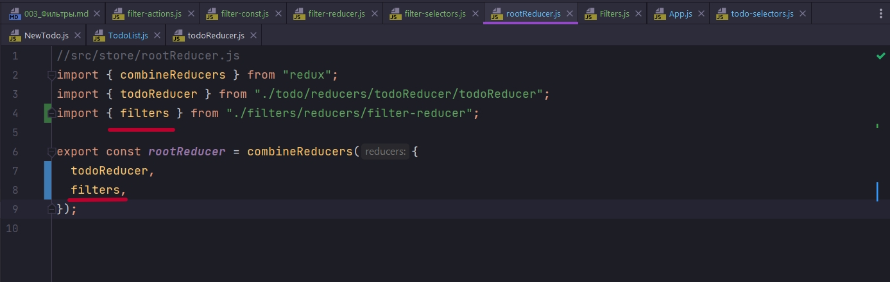
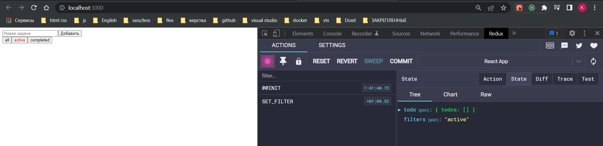
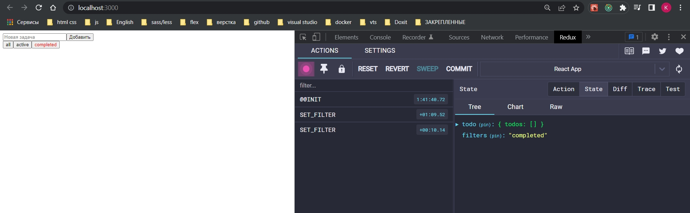

# 003_Фильтры

В store добавляю папку filters. А в ней создаю папку actions в которой создаю filter-actions.js. После создаю папку const в которой filter-const.js. Папку reducers в которой filter-reducer.js. Ну и selectors и filter-selectors.js.

Начну с констант.

```js
export const SET_FILTER = "SET_FILTER";

```

Нам нужна одна единственная история SET_FILTER. Эту константу мы будем импортировать соответственно в reducer и action.

```js
//src/filters/actions/filter-actions.js
import { SET_FILTER } from "../const/filter-const";

export const setFilter = (filter) => ({
    type: SET_FILTER,
    filter,
});


```

```js
//src/filters/reducers/filter-reducer.js
import { SET_FILTER } from "../const/filter-const";

export const filters = (state = "all", action) => {
    switch (action.type) {
        case SET_FILTER: {
            return action.filter;
        }
        default: {
            return state;
        }
    }
};


```

```js
//src/filters/selectors/filter-selectors.js
export const selectActiveFilter = (state) => state.filters;


```

```js
//src/store/rootReducer.js
import { combineReducers } from "redux";
import { todoReducer } from "./todo/reducers/todoReducer/todoReducer";
import { filters } from "./filters/reducers/filter-reducer";

export const rootReducer = combineReducers({
    todoReducer,
    filters,
});

```

У нас с точки зрения reducer, по этому когда мы в rootReducer задаем ключ filters и говорим что он равен нашему reducer filters, то у нас эта строка и будет доступна.



Соответственно state.filters будет нам сразу давать нужную нам строку.


Здесь по неймингу мы используем selectActiveFilter т.е. select, на самом деле это рекомендованная практика.

И так создаем новый компонент Filters.js

```js
import React from "react";
import { useSelector, useDispatch } from "react-redux";
import { selectActiveFilter } from "../store/filters/selectors/filter-selectors";
import { setFilter } from "../store/filters/actions/filter-actions";

const Filters = () => {
  const dispatch = useDispatch();
  const activeFilter = useSelector(selectActiveFilter);
  return (
    <div>
      <button
        onClick={() => dispatch(setFilter("all"))}
        style={{ color: activeFilter === "all" ? "red" : "black" }}
      >
        all
      </button>
      <button
        onClick={() => dispatch(setFilter("active"))}
        style={{ color: activeFilter === "active" ? "red" : "black" }}
      >
        active
      </button>
      <button
        onClick={() => dispatch(setFilter("completed"))}
        style={{ color: activeFilter === "completed" ? "red" : "black" }}
      >
        completed
      </button>
    </div>
  );
};

export default Filters;

```

```js
import React from "react";
import NewTodo from "./components/Todo/NewTodo";
import TodoList from "./components/Todo/TodoList";
import Filters from "./components/Filters";

function App() {
  return (
    <>
      <NewTodo />
        <Filters />
        <TodoList />
    </>
  );
}

export default App;

```






По ка что у нас фильтры у нас переключаются и по redux мы определяем состояние. Пока что у нас какой то специальной выборки не происходит. Наша задача ее будет так же сделать.

Выборка у нас будет зависить у же от самого TodoList. Он сейчас просто выбирает все todo. В todo-selectors.js нам нужен новый селектор. И назову его selectVisibleTodos


Соответственно selectVisibleTodos точно так же принимает state. Но нам нужно видимые todo определять по фильтру в том числе. В зависимости от того выбрано сейчас all, active или completed. И мы здесь можем поступать разными способами. Мы можем так же из state достать по ключу filter текущее значение. Но в будущем если вдруг произойдет переименование этого ключа, то нам придется об этом вспомнить. Либо вдруг мы откажемся от фильтров как кнопок. Мы моэем захотеть это сделать разными ссылками и хранить это в строке браузера. И тогда у нас возникнет конфликт.

По этому мы можем захотеть положить в selectVisibleTodos второй параметр.


И станет вопрос откуда мы его возьмем? Чуть позже возьмем.

Наша задача проверять какой сейчас filter и в завсимости от вариантов возвращать разное значение.

```js
export const allTodos = (state) => state.todos;

export const selectVisibleTodos = (state, filter) => {
  switch (filter) {
    case "all": {
      console.log(state.todoReducer.todos);
      return state.todoReducer.todos;
    }
    case "active": {
      console.log(state.todoReducer.todos);

      return state.todoReducer.todos.filter((todo) => !todo.completed);
    }
    case "completed": {
      console.log(state.todoReducer.todos);

      return state.todoReducer.todos.filter((todo) => todo.completed);
    }
    default: {
      return state.todoReducer.todos;
    }
  }
};

```

В default варианте мы просто скажем верни все todo и тоже самое в случае case который называется all. 

Но в других сценариях, в active если todo.completed равен false т.е. !todo.completed. А в completed если todo.completed есть т.е. равен true todo.completed. По этим условиям отфильтруй и верни.

На уровне приложения у нас будет нмного другая техника.

```js
import React from "react";
import { useSelector, useDispatch } from "react-redux";
import {
    toggleTodo,
    removeTodo,
} from "../../store/todo/todo-actions/todo-actions";
import { selectVisibleTodos } from "../../store/todo/selectors/todo-selectors";
import { selectActiveFilter } from "../../store/filters/selectors/filter-selectors";

const TodoList = () => {
    //Получаю активный фильтр
    const activeFilter = useSelector(selectActiveFilter);
    //Передаю state и активный фильтр
    const entities = useSelector((state) => selectVisibleTodos(state, activeFilter));
    console.log(entities);
    const dispatch = useDispatch();
    return (
        <ul>
            {entities === undefined
                ? null
                : entities.map((todo) => (
                    <li key={todo.id}>
                        <input
                            type="checkbox"
                            checked={todo.completed}
                            onChange={() => dispatch(toggleTodo(todo.id))}
                        />
                        {todo.title}
                        <button onClick={() => dispatch(removeTodo(todo.id))}>
                            удалить
                        </button>
                    </li>
                ))}
        </ul>
    );
};

export default TodoList;

```

Если мы захотим просто вызвать selectVisibleTodos, просто передать как функцию, то она получит только один параметр state. 

Соответственно в useSelector передаю функцию, в параметрах state, а в теле вызываю selectVisibleTodos и первым параметром передаю state.

Но у нас нет пока что filter который мы хотим передать. filter мы тоже можем получить selectActiveFilter который присваиваю activeFilter. И эту переменную activeFilter передаю вторым параметром в selectVisibleTodos. И далее уже отрабатает наша логика фильтрации.


Почему еще раз мы вынесли фильтер в 

```js
export const allTodos = (state) => state.todos;

export const selectVisibleTodos = (state, filter) => {
  switch (filter) {
    case "all": {
      console.log(state.todoReducer.todos);
      return state.todoReducer.todos;
    }
    case "active": {
      console.log(state.todoReducer.todos);

      return state.todoReducer.todos.filter((todo) => !todo.completed);
    }
    case "completed": {
      console.log(state.todoReducer.todos);

      return state.todoReducer.todos.filter((todo) => todo.completed);
    }
    default: {
      return state.todoReducer.todos;
    }
  }
};

```

Потому что этот фильтр selectVisibleTodos может исчезнуть из нашего store, а во вторых может переименоватся  и т.д. Писать здесь state.filters т.е. вот эту логику

```js
//src/filters/selectors/filter-selectors.js
export const selectActiveFilter = (state) => state.filters;

```
не всегда бывает правильно.


