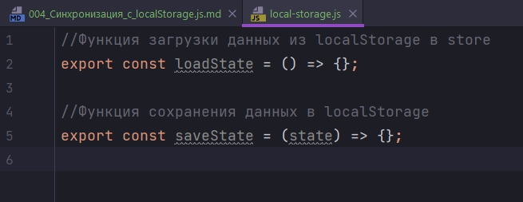
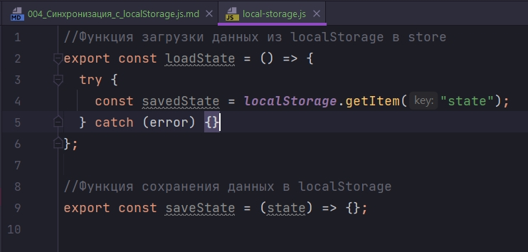
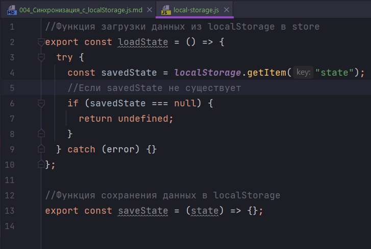
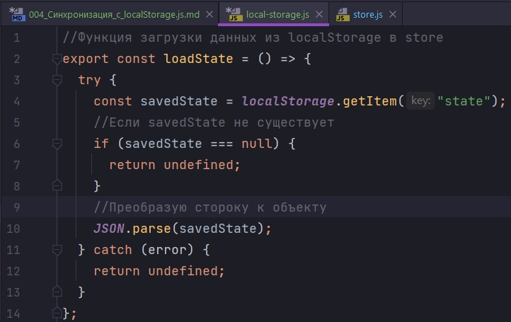
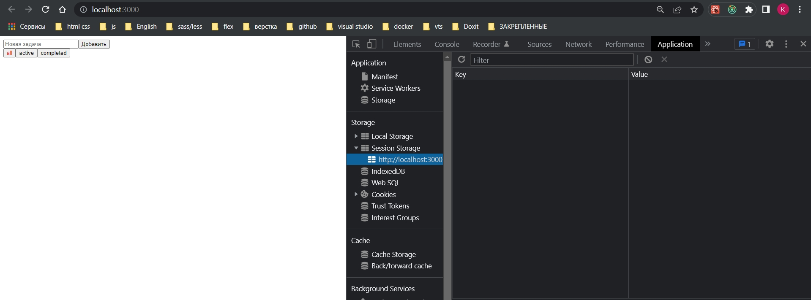
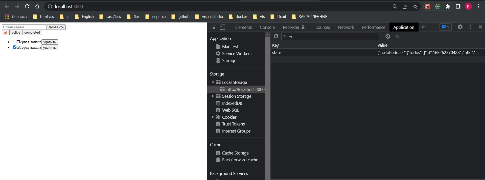
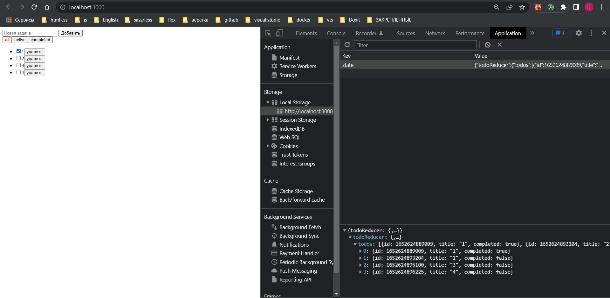

# 004_Синхронизация_с_localStorage.js

Мы можем захотеть сделать историю синхронизации с localStorage. 

Во-первых мы создадим некий helper и назову его local-storage.js. И здесь у меня будет два функции которые помогут мне работать с localStorage. 

Одна из них будет называться loadState и она будет отвечать за загрузку данных в наш state из localStorage.

А вторая функция будет сохранять наше состояние в localStorage. И назову ее saveState. Она конечно будет принимать наш текущий state.



Оба этих варианта у нас будут описаны с использованием try catch, потому что у некоторых пользователей сожет быть отключен доступ на запись в их хранилище. И тогда попытки обратится к localStorage у нас будет вызывать ошибки. По этому что бы их избежать мы будем использовать данную конструкцию.

Конечно в loadState ы будем обращаться к localStorage и ее функции getItem() в которой нам нужно будет придумать какой-то ключ для хранения своего state. Ключ может быть константой, в зависимости от проекта.



Полученную переменную savedState мы будем проверять на null потому что если у нас такой переменной еще нет, то соответственно у нас результат доступа будет null, и если это null то мы захотим просто вернуть undefined.



Если наше приложение получает undefined то оно не будет использовать предзагруженные данные. Соответственно у нас отработают все default которые есть в reducers. Потому что если мы передаем не undefined у нас эти default в редюссерах не будут отрабатывать.

Если же мы получили переменную savedState то мы зохотим сделать простую оперрацию JSON.parse(savedState) преобразую строку к объекту. У нас в localStorage могут храниться так называемые сериализованные данные, соответственно то что можно привести к строке.

Если у нас случится ошибка, что бы наше приложение продолжало работать, мы должны вернуть просто undefined.



Сточки зрения использования в нашем store мы будем подключать наш хелпер.

В момент создания нашего store мы хотим получить наши. вызываю нашу функцию loadState и присваиваю переменной persistedState. И наш предзагруженный state мы будем передавать в качестве второго парамента, куда по документации я и передаю персистеры.

```js
//src/store/store.js
import { createStore } from "redux";
import { rootReducer } from "./rootReducer";
import { composeWithDevTools } from "redux-devtools-extension";
import { loadState } from "../local-storage";

//npm install --save redux-devtools-extension

export const configureStore = () => {
  //загружаю данные из localStorage
  const persistedState = loadState();
  const store = createStore(rootReducer, persistedState, composeWithDevTools());
  return store;
};

```

Теперь встает вопрос как мы будет синхронизировать данные. И как раз для этого мы напишем вторую функцию saveState. Создаю константу stateToBeSaved в которой преобразую наш state в строку.

```js
//Функция загрузки данных из localStorage в store
export const loadState = () => {
    try {
        const savedState = localStorage.getItem("state");
        //Если savedState не существует
        if (savedState === null) {
            return undefined;
        }
        //Преобразую стороку к объекту
        return JSON.parse(savedState);
    } catch (error) {
        return undefined;
    }
};

//Функция сохранения данных в localStorage
export const saveState = (state) => {
    try {
        const stateToBeSaved = JSON.stringify(state);
        localStorage.setItem("state", stateToBeSaved);
    } catch (error) {
        console.error(error);
    }
};


```

При обработке ошибок может быть более сложный вариант с логированием ошибок на сервер.

Теперь в store нам нужно так же достать второй хелпер. И его мы будем использовать для нашего store по мотоду subscribe котрый принимает callback. И вызывается этот callback каждый раз когда store изменился. Напомню subscribe это слушатель. В теле callback вызываю saveState в который передаю актуальное состояние store.getState()

```js
//src/store/store.js
import { createStore } from "redux";
import { rootReducer } from "./rootReducer";
import { composeWithDevTools } from "redux-devtools-extension";
import { loadState, saveState } from "../local-storage";

//npm install --save redux-devtools-extension

export const configureStore = () => {
  //загружаю данные из localStorage
  const persistedState = loadState();
  const store = createStore(rootReducer, persistedState, composeWithDevTools());

  store.subscribe(() => saveState(store.getState()));

  return store;
};

```




Здесь все бы ничего. Но у нас если мы отфильтруем список, то мы при перезагрузке так и остаемся на этих страницах. Если мы хотим что бы пользователь все время попадал на главную то мы должны эту информацию уточнять. 

В данном варианте мы не обязаны всегда сохранять весь store. Мы можем точечно определить что именно мы хотим хранить в localStorage.

```js
//src/store/store.js
import { createStore } from "redux";
import { rootReducer } from "./rootReducer";
import { composeWithDevTools } from "redux-devtools-extension";
import { loadState, saveState } from "../local-storage";

//npm install --save redux-devtools-extension

export const configureStore = () => {
    //загружаю данные из localStorage
    const persistedState = loadState();
    const store = createStore(rootReducer, persistedState, composeWithDevTools());

    store.subscribe(() => {
        saveState({ todoReducer: store.getState().todoReducer });
    });

    return store;
};

```

Вот почему наглядно нужно задавать ключи редюсерам в RootReducer.




Теперь при перезагрузке я всегда нахожусь на all.

<br/>
<br/>
<br/>
<br/>

И у нас еще одна проблема остается. С у четом того что пользователь у нас может делать много действий в приложении. У нас может часто вызываться наш хелпер saveState. И в самой этой функции у нас достаточно дорогостоящая операция JSON.stringify().

По этому мне нужно всю эту историю немного затормозить что бы она не выполнялась чаще какого-то определенного времени.

```shell
npm install lodash
```

В lodash нам может потребоваться хелпер 

```js
//src/store/store.js
import { createStore } from "redux";
import { rootReducer } from "./rootReducer";
import { composeWithDevTools } from "redux-devtools-extension";
import { loadState, saveState } from "../local-storage";
import { throttle } from "lodash";

//npm install --save redux-devtools-extension

export const configureStore = () => {
  //загружаю данные из localStorage
  const persistedState = loadState();
  const store = createStore(rootReducer, persistedState, composeWithDevTools());

  store.subscribe(
    throttle(() => {
      saveState({ todoReducer: store.getState().todoReducer });
    }, 1000)
  );

  return store;
};

```


