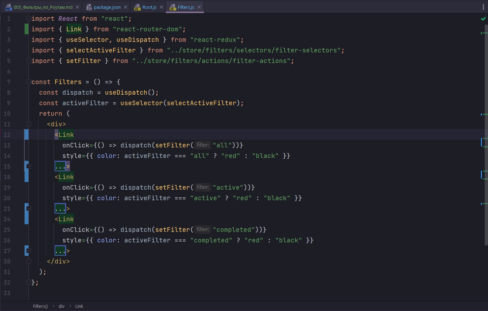
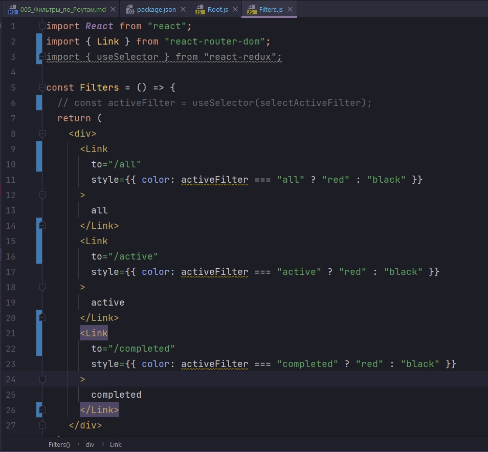
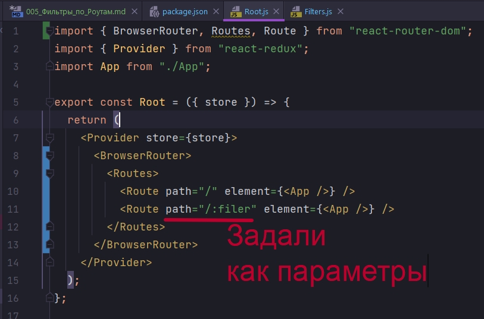
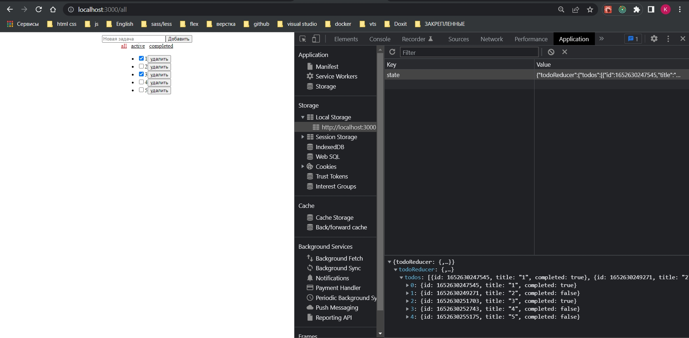
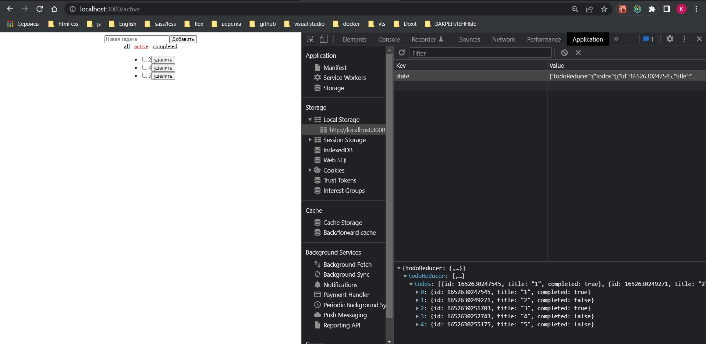
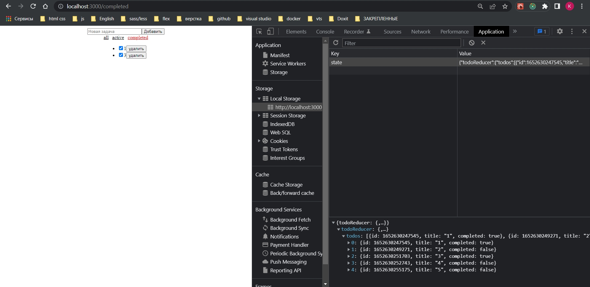
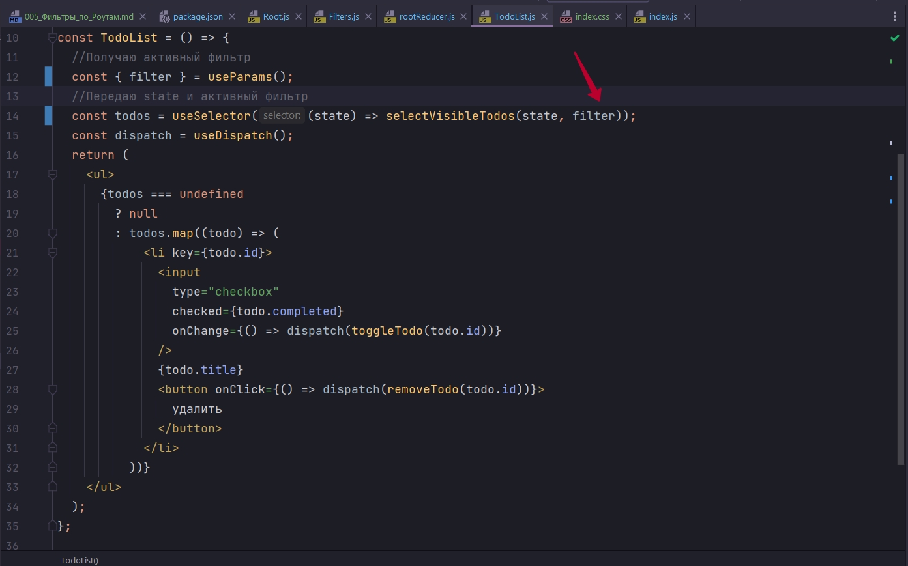

# 005_Фильтры_по_Роутам

```shell
npm install react-router-dom
```

Во-первых мы подключим сам по себе роутинг. Для этого мы будем использовать наш Root.js.

```js
import { BrowserRouter, Routes, Route } from "react-router-dom";
import { Provider } from "react-redux";
import App from "./App";

export const Root = ({ store }) => {
  return (
    <Provider store={store}>
      <BrowserRouter>
        <Routes>
          <Route path="/" element={<App />} />
          <Route path="/:filer" element={<App />} />
        </Routes>
      </BrowserRouter>
    </Provider>
  );
};

```

Мы хотим что бы у нас в приложении работали истории так же связанные с  параметрами. Добавляю дополнительный path="/:filer" связанный с параметрами filter.

Но теперь из кнопок мне нужно сделать ссылки. В Filters.js заменяю button на Link. 



Так как у меня фильтер переезжает в роутинг, мне становится не актуальным хранить информацию о фильтрах непосредственно в моем store. Мне не нужен ни dispatch, ни activeFilter.  activeFilter я буду узнавать немножко иначе. Так же мне не нужны ни одни onClick. В место этого прописываю параметр to в котором указываю необходимые пути.



Эти ссылки используются как параметры. Потому что мы здесь задали их как параметры 



Для того что бы использовать параметры использую хук useParams

```js
import React from "react";
import { Link, useParams } from "react-router-dom";

const Filters = () => {
  const { filter: activeFilter ="all" } = useParams();
  return (
    <div style={{ display: "flex", justifyContent: "center", gap: "0.75rem" }}>
      <Link
        to="/all"
        style={{ color: activeFilter === "all" ? "red" : "black" }}
      >
        all
      </Link>
      <Link
        to="/active"
        style={{ color: activeFilter === "active" ? "red" : "black" }}
      >
        active
      </Link>
      <Link
        to="/completed"
        style={{ color: activeFilter === "completed" ? "red" : "black" }}
      >
        completed
      </Link>
    </div>
  );
};

export default Filters;

```

И с точки зрения самого TodoList мне не нужен useSelector для фильтров. Иду в наш rootReducer и говорю что ни каких фильтров нам не нужно. Мы не храним больше наши фильтры в Redux store.

```js
//src/store/rootReducer.js
import { combineReducers } from "redux";
import { todoReducer } from "./todo/reducers/todoReducer/todoReducer";

export const rootReducer = combineReducers({
  todoReducer,
});

```

Как мы в TodoList получим информацию о фильтрах? А ровно точно так же как мы получаем в компоненте Filters.js.

Импортирую хук useParams. Вызываю его и получаю оттуда значение.

```js
import React from "react";
import { useParams } from "react-router-dom";
import { useSelector, useDispatch } from "react-redux";
import {
  toggleTodo,
  removeTodo,
} from "../../store/todo/todo-actions/todo-actions";
import { selectVisibleTodos } from "../../store/todo/selectors/todo-selectors";

const TodoList = () => {
  //Получаю активный фильтр
  const { filter } = useParams();
  //Передаю state и активный фильтр
  const entities = useSelector((state) => selectVisibleTodos(state, filter));
  const dispatch = useDispatch();
  return (
    <ul>
      {entities === undefined
        ? null
        : entities.map((todo) => (
            <li key={todo.id}>
              <input
                type="checkbox"
                checked={todo.completed}
                onChange={() => dispatch(toggleTodo(todo.id))}
              />
              {todo.title}
              <button onClick={() => dispatch(removeTodo(todo.id))}>
                удалить
              </button>
            </li>
          ))}
    </ul>
  );
};

export default TodoList;

```







Еще раз обратим внимание на то что теперь когда у нас информация о фильтрах переехала в роутинг. Нам эта информация слала не нужна в нашем store. Потому что у нас должен быть единый источник истины. В данном случае им является роутинг. Именно оттуда мы берем конкретные значения для того что бы определять активную кнопку на ссылках, так и саму логику которую мы используем на самих кнопках. И точно так же параметром filter мы отправляем в selectVisibleTodos



filter параметр из роутинга а не из store.

