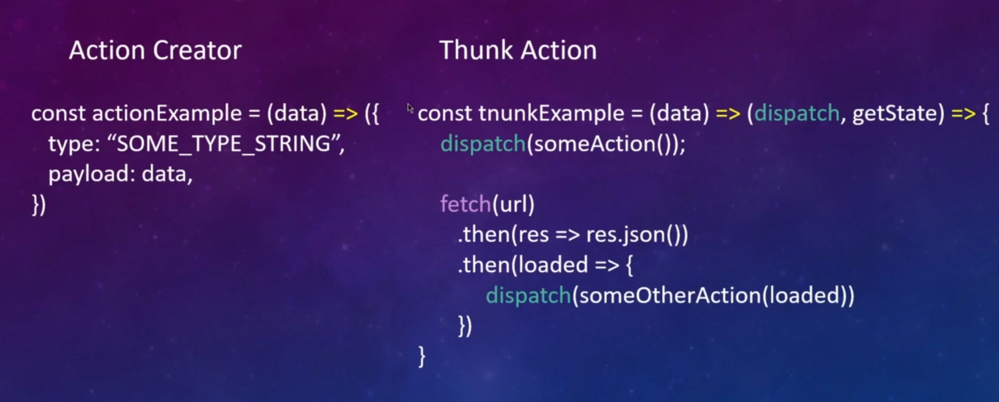

# 001_Проблемы_асинхронности

Если у нас возникает потребность в асинхронных запросах, то на этапе middleware мы можем реализовать какие-либо запросы. Есть к примеру некий API c которым мы хотим общаться. И для общения нам нужно отправить запрос, получить ответ и уже после этого инициализировать какую-то логику, при этом не тормозив всю работу приложения.

Есть специальный подход который позволяет нам всю эту историю организовать. Подход подразумевает что на этапе middleware мы отправляем запрос асинхронно, после этого выполняется любая огика reducer, а сам middleware асинхронно, по запросу от сервера вызывает еще какой-то action, дополнительный когда уже пришел ответ.

При этом в рамках этого middleware может не один action случится. У нас к примеру может быть статус Загрузки. Что сейчас идет загрузка. Мы вызываем action.

Когда полуил данные инициализировал второй action что данные получены.

А если вдруг данные не получены и случилась ошибка то мы должны соответствующий action тоже вызвать. Что бы у нас на уровне приложения в store была информация об ошибках и мы могли ее пользователю в UI отрисовать.

В дело здесь вступает некая штука которая называтеся Thunk Action. Мы будем ее использовать через внешнюю библиотеку.

Посмотрим на базовые отличия Action Creator и Thank Action. Thank Action становятся возможными благодаря специальному middleware.

Action Creator

* Функция - которая возвращает объект события( Обычный объект с полем type и какой-то вспомогательной информацией)
* Не вызывает внутри себя другие события
* Не имеет доступ к внешним redux методам(ни к dispatch и т.д.)
* Только синхронная работа

Thunk Action

* Функция - которая НЕ возвращает объект события
* Вызывает внутри себя другие события
* Имеет доступ к dispatch и getState (они есть из коробки)
* Предназначены для асинхронной логики

Action Creator какая-то функция кторая может принимать какие-то данные data, и возвращает объект с каким-то строковым типом type и с какими нибудь данными payload.

 
 
 

В случае с Thunk Action

Вся история будет несколько отличатся. У нас будет создаваться некая функция. В кторой мы можем точно так же, если нам нужно, с UI передать какие-то данные data в параметрах функции, можем не передавать.

Но здесь дополнительно, вспоминаем как пишутся middleware, но это не совсем middleware. Это некая опция которая дается нам из коробки dispatch, getState. В Thunk Action функция возвращает функцию. И на базе того что функция возвращает другую функцию, redux понимает что речь идет не о обычном action а о Thunk Action. А значет ему нужно предоставить два метода  dispatch и getState которые в теле мы можем испольовать.

Соответственно если нам нужно делать асинхронный запрос, возможно мы захотим сделать какой-нибудь прелоудер. И мы до запроса можем вызвать соответствующий action и сказать что бы у пользователя лоудер начал крутится. И после этого синхронно мы придем к fetch оторый в свою очередь начнет делать асинхронную логику. Асинхронная работа выполнится, будут получены данные. И на базе полученных данных мы синхронно выполним еще один dispatch.

