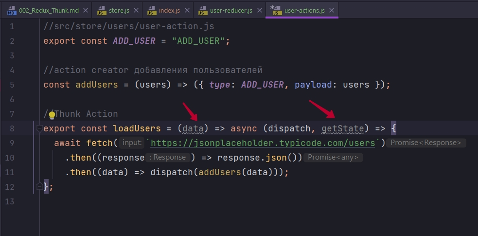
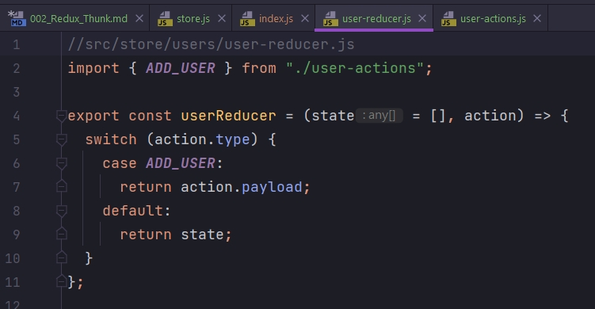
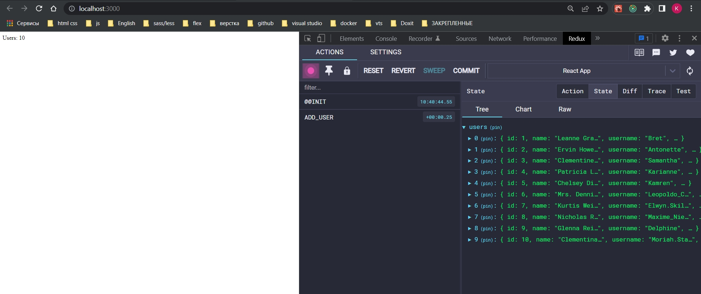

# 002_Redux_Thunk

Создал новый проект. Уже создал хранилище.

```js
import { createStore, applyMiddleware } from "redux";
import { composeWithDevTools } from "redux-devtools-extension";
import thunk from "redux-thunk";
import { rootReducer } from "./rootReducer";

export const store = createStore(
  rootReducer,
  composeWithDevTools(applyMiddleware(thunk))
);

```

В store мы используем applyMiddleware в нее передал библиотеку thunk. И вместе с composeWithDevTools сделал композицию middleware передав туда thunk.

Наличие thunk дает нам возможность использовать Thunk Actions.

Мы будем рпботать с JSON placeholder. Поработаем на примере user и todo. 

В store создаю папку users и entities.

Начнем с users. user-reducer.js и user-actions.js. Я хочу получать пользователей с удаленного сервера user-actions.js. И добавлять в хранилище.

Начнем с reducer

```js
//src/store/users/user-reducer.js
import { ADD_USER } from "./user-actions";

export const userReducer = (state = [], action) => {
    switch (action.type) {
        case ADD_USER:
            return action.payload;
        default:
            return state;
    }
};

```

```js
//src/store/users/user-action.js
export const ADD_USER = "ADD_USER";

//action creator добавления пользователей
const addUsers = (users) => ({ type: ADD_USER, payload: users });

//Thunk Action
export const loadUsers = () => async (dispatch) => {
  await fetch(`https://jsonplaceholder.typicode.com/users`)
    .then((response) => response.json())
    .then((data) => dispatch(addUsers(data)));
};

```

В первой функции у нас как могут быть какие-то данные data, так могут и не быть



Нам важно чо у нас в возвращаемой функции всегда есть dispatch. getState нам тоже не так уж важен.

В fetch запросе что бы отправить полученный json нам нужно отправить в action addUsers. И что бы вызвать другой action мы используем dispatch. В dispatch передаю другой action амый обычный синхронный addUsers в который передаем загруженные с сервера данные. 

Случится это событие, оно попадет в reducer и обработается.

ПРИ ЭТОМ ФУНКЦИЯ loadUsers КОТОРАЯ У НАС ЯВЛЯЕТСЯ Thunk Action ОНА У НАС НА УРОВНЕ reducer 



НИ КАК НЕ ОБРАБАТЫВАЕТСЯ!!!!


Мы эту функцию loadUsers экспортируем, вызываем на уровне приложения и она уже всю свою логику делает.

Определяю все это дело в rootReducer

```js
import { combineReducers } from "redux";
import { userReducer } from "./users/user-reducer";

export const rootReducer = combineReducers({
  users: userReducer,
});

```

Далее 

```js
import React, { useEffect } from "react";
import UserList from "./components/UserList";
import TodoList from "./components/TodoList";
import { loadUsers } from "./store/users/user-actions";
import { useDispatch } from "react-redux";

function App() {
  const dispatch = useDispatch();
  useEffect(() => {
    dispatch(loadUsers());
  }, []);
  return (
    <div>
      <UserList />
      <TodoList />
    </div>
  );
}

export default App;

```

```js
import React from "react";
import { useSelector } from "react-redux";

const UserList = () => {
  const users = useSelector((state) => state.users);
  return <div>Users: {users.length}</div>;
};

export default UserList;

```




