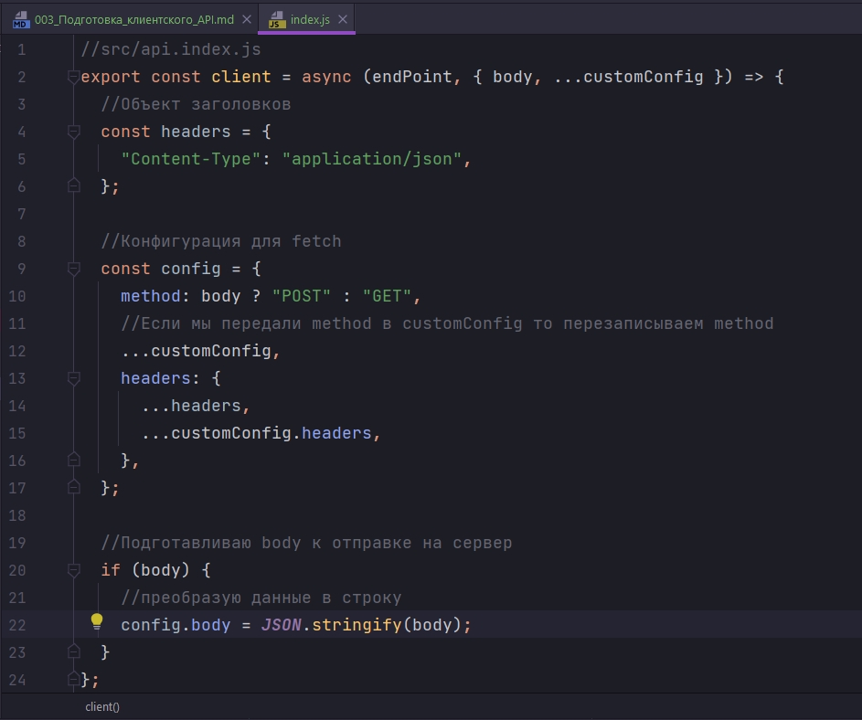
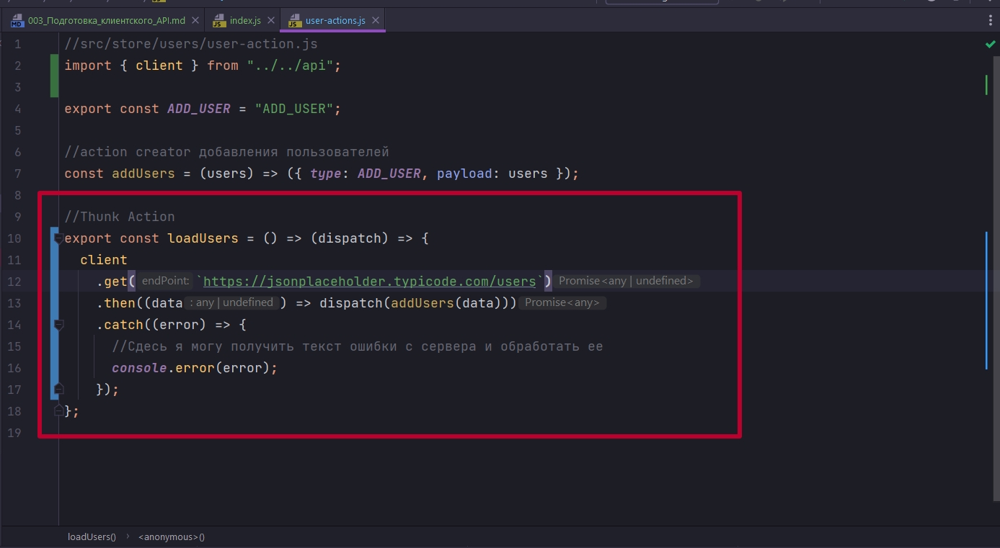
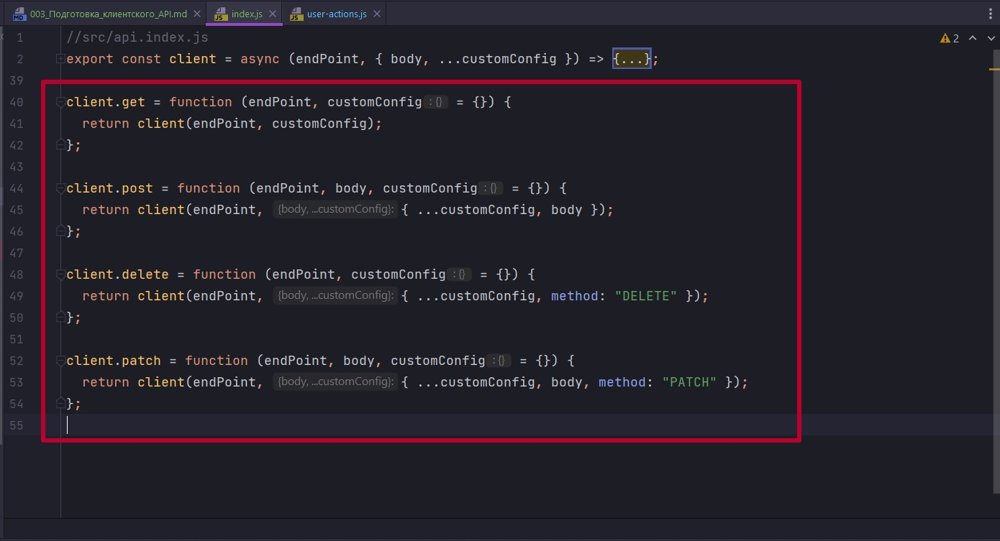

# 003_Подготовка_клиентского_API

При асинхронной работе может происходить дублирование того что мы делаем. Мы делаем fetch получаем какую то ссылку, получаем результат, разбираем его.

Рано или поздно мы можем прийти к тому что нам нужна какая-то абстракция.

Чаще всего делают какой-то дополнительный клиент.

В src создаем папку api а в ней index.js. Из этого файла я буду экспортировать константу которую я буду например называть client. Это будет асинхронной функцией которая будет выполнять определенный набор операций.

В функции client мы хотим получать от пользователя точку входа endPoint и вероятно какие-то настройки. С точки зрения настроек у нас скорее всего это будет какой-о объект


Мы можем этот объект поместить как отдельную переменную. Здесь я сразу делаю деструктуризацию этого объекта и говорю что если там есть body, то я его достану как body, если там еще что то есть в этом объекте то я это достану как customConfig.


Обычно когда мы работаем с асинхронными запросами у нас есть отдельный объект headers которые мы хотим передавать.


В headers могут быть истории связанные с авторизацией. В базовом варианте сдесь обычно живет Content-Type и так как мы работаем с json мы в значении пишем application/json


Мы хотим добавлять этот headers во все запросы.

А в остальные какие-то, если нам допустим с уровня fetch захотим передать еще что-то мы получим это в customConfig.

Для fetch мы подготовим некий config и этот config мы будем руками собирать. 

Во-первых мы будем определять method. В значении мы будем смотреть есть ли у нас body, если он есть то это POST, потому что на get запросах body у нас никакого нет. 


При чем запросов у нас может быть и больше. Это мы смотрим базовую историю которая может быть переопределена в customConfig. Если в customConfig мы передаем method то мы его перезапиываем в config.


Далее в config нам нужно определить headers. В первую очередь я всегда хочу использовать все те headers которые мы установили в одноименной переменной. По этому путем спреда копирую эти заголовки.


Если мы передали в customConfig какие-то headers то мы их тоже сюда определим.


Ну и дополнительно если нам body все таки передан, то нам нужно подготовить этот body к отправке на сервер. У нас на сервер могут уходить данные только в формате json. Для того что бы данные отправить преобразую их в строку.



А далее я делаю наш try catch с попыткой сделать ту самую асинхронную операцию.

Я создаю переменную response в которой будет ответ от сервера. В fetch передаю тот endPoint в котором содержится адрес и вторым параметром указываю тот config который мы создаем.

Но response у нас может быть не самый хороший. У нас в response есть ключ ok, когда мы работаем с fetch, и у нас может быть false.


Если загрузка прошла успешно. То полученные данные преобразую в json и возвращаю во внешний мир.


Если же у нас произошла ошибка то мы возвращаем не конкретные данные а Promise.reject() у нас случилось так что сервер ответил нам ошибкой. И мы передаем эту ошибку во внешний код, а именно в Thunk Action что бы там в catch я  мог ее отловить и задействовать в своем приложении.


Это Базовый вариант.

```js
//src/api.index.js
export const client = async (endPoint, { body, ...customConfig }) => {
  //Объект заголовков
  const headers = {
    "Content-Type": "application/json",
  };

  //Конфигурация для fetch
  const config = {
    method: body ? "POST" : "GET",
    //Если мы передали method в customConfig то перезаписываем method
    ...customConfig,
    headers: {
      ...headers,
      ...customConfig.headers,
    },
  };

  //Подготавливаю body к отправке на сервер
  if (body) {
    //преобразую данные в строку
    config.body = JSON.stringify(body);
  }

  try {
    const response = await fetch(endPoint, config);
    //Если запрос не был успешным
    if (response.ok) {
      throw new Error(`failed to fetch`);
    }

    //Если загрузка прошла успешно
    const data = await response.json();
    return data;
  } catch (error) {
    return Promise.reject(error.message);
  }
};

```

Теперь в своем коде я могу сделать так. Вместо всего этого


Тепер вот так


Теперь я могу вторым параметром указать объект конфигурации body, headers и т.д. И плюс обработать ошибку с сервера.

```js
//src/store/users/user-action.js
import { client } from "../../api";

export const ADD_USER = "ADD_USER";

//action creator добавления пользователей
const addUsers = (users) => ({ type: ADD_USER, payload: users });

//Thunk Action
export const loadUsers = () => (dispatch) => {
  client(`https://jsonplaceholder.typicode.com/users`, { method: "GET" })
    .then((data) => dispatch(addUsers(data)))
    .catch((error) => {
      //Сдесь я могу получить текст ошибки с сервера и обработать ее
      console.error(error);
    });
};

```


Что бы не передавать в параметры method. Я могу создать дополнительные функции. Создаю дополнительный слой абстракции и говорю что мой client будет иметь методы get, post, delete и patch. И все это у нас будут вложенные функции которые точно так же будут принимать endPoint, кастомные конфиги. 




Теперь я говорю что я явно хочу get.



В принципе по методам get, post, delete , и patch нет ничего сложноего. В двух словах.

В методе get customConfig присваиваю значение по умолчанию пустой объект. Если этого не сделать то body в client будет undefined и приложение выдаст ошибку.

В post деструктурирую все что находится в customConfig и передаю, т.е. таким образом добавляю body. method не указываю так как в client прописано условие что если body есть то это POST запрос. 

В методе delete так же деструктурирую кастомный конфиг и передаю метод. 

При обновлении все понятно....

Соответственно если мне нужно сделать post, delete или patch вторым параметром я передаю данные


```js
//src/api.index.js
export const client = async (endPoint, { body, ...customConfig }) => {
  //Объект заголовков
  const headers = {
    "Content-Type": "application/json",
  };

  //Конфигурация для fetch
  const config = {
    method: body ? "POST" : "GET",
    //Если мы передали method в customConfig то перезаписываем method
    ...customConfig,
    headers: {
      ...headers,
      ...customConfig.headers,
    },
  };

  //Подготавливаю body к отправке на сервер
  if (body) {
    //преобразую данные в строку
    config.body = JSON.stringify(body);
  }

  try {
    const response = await fetch(endPoint, config);
    //Если запрос не был успешным
    if (!response.ok) {
      throw new Error(`failed to fetch`);
    }

    //Если загрузка прошла успешно
    const data = await response.json();
    return data;
  } catch (error) {
    return Promise.reject(error.message);
  }
};

client.get = function (endPoint, customConfig = {}) {
  return client(endPoint, customConfig);
};

client.post = function (endPoint, body, customConfig = {}) {
  return client(endPoint, { ...customConfig, body });
};

client.delete = function (endPoint, customConfig = {}) {
  return client(endPoint, { ...customConfig, method: "DELETE" });
};

client.patch = function (endPoint, body, customConfig = {}) {
  return client(endPoint, { ...customConfig, body, method: "PATCH" });
};

```

```js
//src/store/users/user-action.js
import { client } from "../../api";

export const ADD_USER = "ADD_USER";

//action creator добавления пользователей
const addUsers = (users) => ({ type: ADD_USER, payload: users });

//Thunk Action
export const loadUsers = () => (dispatch) => {
  client
    .get(`https://jsonplaceholder.typicode.com/users`)
    .then((data) => dispatch(addUsers(data)))
    .catch((error) => {
      //Сдесь я могу получить текст ошибки с сервера и обработать ее
      console.error(error);
    });
};

```


