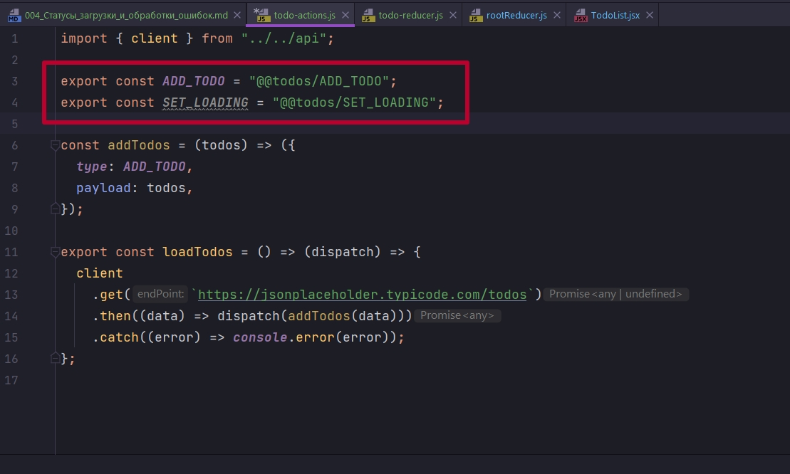

# 004_Статусы_загрузки_и_обработки_ошибок

Создал еще загрузку Todos.

И так в нашем варианте наше приложение ничего не знает про загрузку. Ничего не знает про ошибки. При чем у нас как загрузки так и ошибки могут быть и на уровне пользователей и на уровне entities. И вероятно в разных частях приложения мы зохотим это как-то анимировать.

По этому очень часто мы можем встретить что по структуре reducer состоит не только из одного массива.

Создаю initialState и описываю его как объект в котором у нас будет status: который может быть idle(пустой), loading и fulfilled. Либо это может быть ключ loading о значением false и true. Здесь опять же разные подходы могут быть.

Далее будет наш список с тудушками list:[].

И будет набор ошибок error: null.


Ну и должны учесть это на уровне приложения.


Добавим actions.

На самом деле у нас приложение постепенно разрастается и имеет смысл ввести в константы, в наши строки еще одну сущность.



Так как мы сдесь работаем с todo то мы можем написать префикс. Потому что у нас какие-то типовые операции могут происходить на уровне разных редюссеров. Например SET_LOADING мы можем захотеть делать и на уровне users и и на уровне todo. Что бы их не перепутать мы можем добавлять префикс. Это распостраненная практика. Иногда добавляют две собачки вначале.


При этом если у нас случится ошибка мы захотим ее точно так же обработать.


```js
//src/store/entities/todo-actions.js
import { client } from "../../api";

export const ADD_TODO = "@@entities/ADD_TODO";
export const SET_LOADING = "@@entities/SET_LOADING";
export const SET_ERROR = "@@entities/SET_ERROR";

const addTodos = (entities) => ({
  type: ADD_TODO,
  payload: entities,
});

const setLoading = () => ({
  type: SET_LOADING,
});

const setError = (error) => ({
  type: SET_ERROR,
  payload: error,
});

export const loadTodos = () => (dispatch) => {
  dispatch(setLoading());
  client
    .get(`https://jsonplaceholder.typicode.com/entities`)
    .then((data) => dispatch(addTodos(data)))
    .catch((error) => dispatch(setError(error)));
};

```

```js
//src/store/entities/todo-reducers.js
import { ADD_TODO, SET_ERROR, SET_LOADING } from "./todo-actions";

const initialState = {
  status: "idle",
  list: [],
  error: null,
};

export const todoReducer = (state = initialState, action) => {
  switch (action.type) {
    case ADD_TODO:
      return { ...state, list: action.type, status: "fulfilled" };
    case SET_LOADING:
      return { ...state, status: "loading", error: null };
    case SET_ERROR:
      return { ...state, status: "rejected", error: action.payload };
    default:
      return state;
  }
};

```

Ну уровне TodoList.


```js
import React from "react";
import { useSelector } from "react-redux";

const TodoList = () => {
  const { list: entities, status, error } = useSelector((state) => state.todos);
  return (
    <div>
      <div>
        Todos: {entities.length}. Status: {status}
        {error && <h4>{error}</h4>}
      </div>
    </div>
  );
};

export default TodoList;

```


