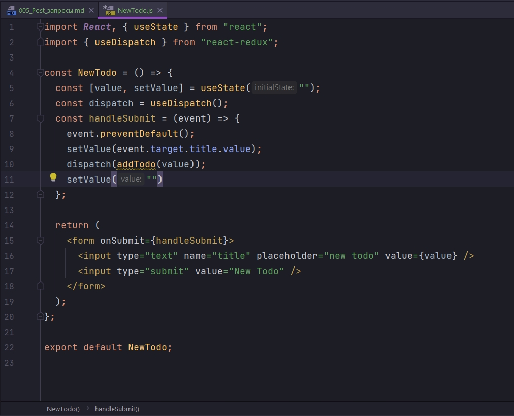
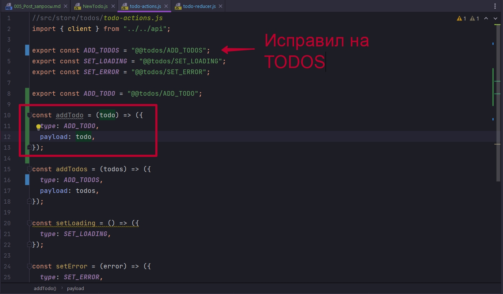
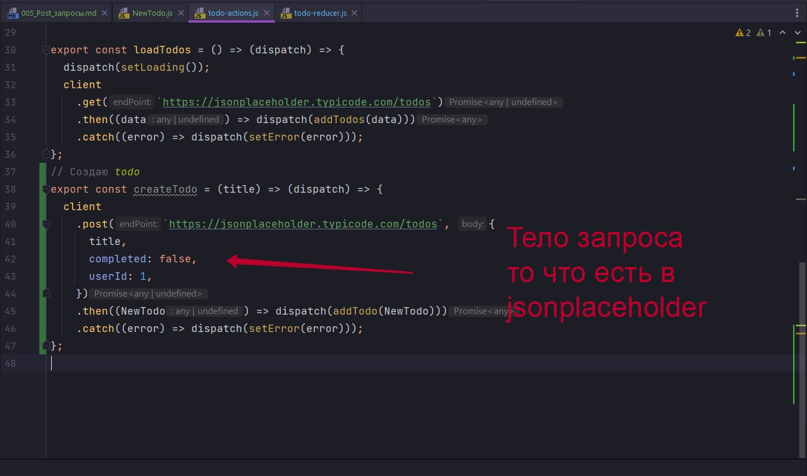
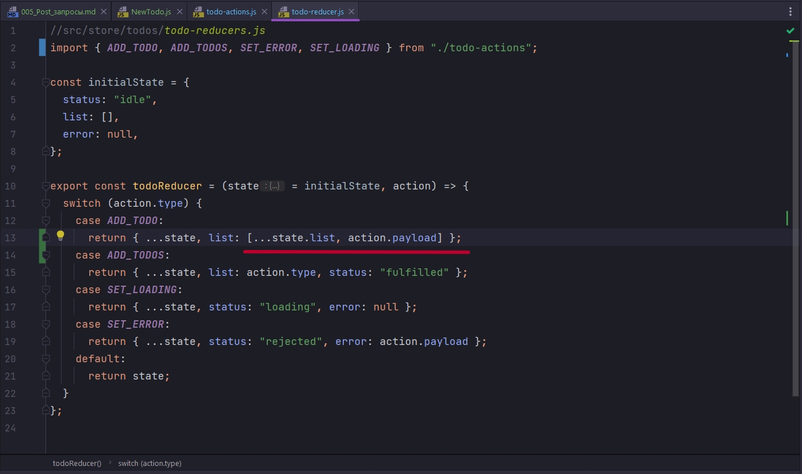
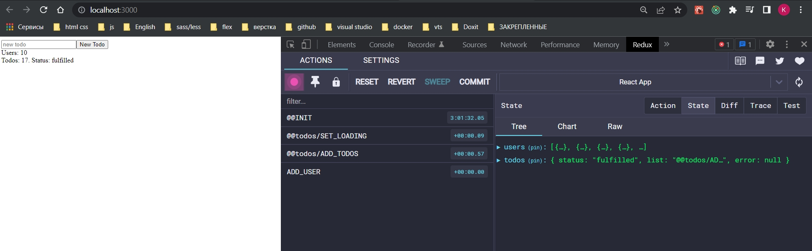
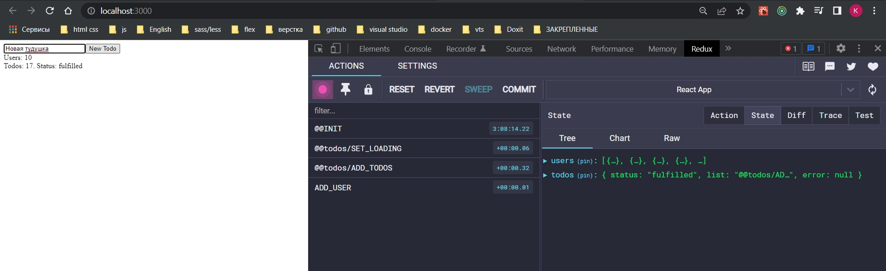
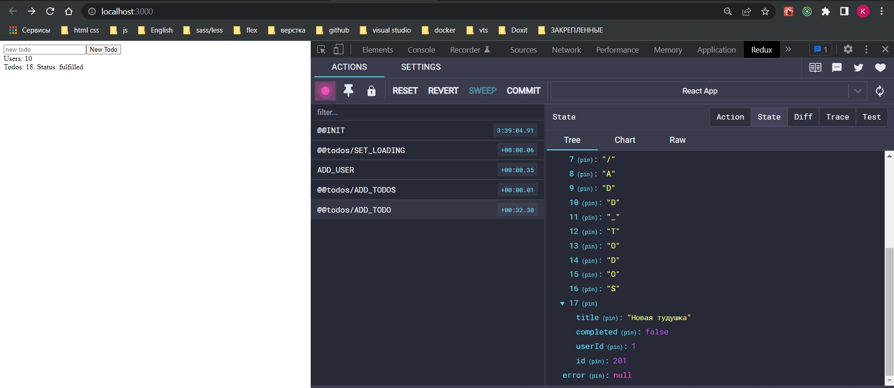

# 005_Post_запросы

Создаю компоненте NewTodo.



У меня пока нет соответствующего actions addTodo. 



Теперь для работы во внешнем коде я создат Thunk.



```js
//src/store/entities/todo-reducers.js
import { ADD_TODOS, SET_ERROR, SET_LOADING } from "./todo-actions";

const initialState = {
  status: "idle",
  list: [],
  error: null,
};

export const todoReducer = (state = initialState, action) => {
  switch (action.type) {
    case ADD_TODOS:
      return { ...state, list: action.type, status: "fulfilled" };
    case SET_LOADING:
      return { ...state, status: "loading", error: null };
    case SET_ERROR:
      return { ...state, status: "rejected", error: action.payload };
    default:
      return state;
  }
};

```

Редюсер пока что не обрабатывает.



Как видим копирую весь state. После создаю новый массив на основе старого и добавляю элемент.

```js
//src/store/entities/todo-reducers.js
import { ADD_TODO, ADD_TODOS, SET_ERROR, SET_LOADING } from "./todo-actions";

const initialState = {
  status: "idle",
  list: [],
  error: null,
};

export const todoReducer = (state = initialState, action) => {
  switch (action.type) {
    case ADD_TODO:
      return { ...state, list: [...state.list, action.payload] };
    case ADD_TODOS:
      return { ...state, list: action.type, status: "fulfilled" };
    case SET_LOADING:
      return { ...state, status: "loading", error: null };
    case SET_ERROR:
      return { ...state, status: "rejected", error: action.payload };
    default:
      return state;
  }
};

```

Компонент 

```js
import React, { useState } from "react";
import { useDispatch } from "react-redux";
import { createTodo } from "../store/entities/todo-actions";

const NewTodo = () => {
  const [value, setValue] = useState("");
  const dispatch = useDispatch();
  const handleSubmit = (event) => {
    event.preventDefault();
    setValue(event.target.title.value);
    dispatch(createTodo(value));
    setValue("");
  };

  return (
    <form onSubmit={handleSubmit}>
      <input type="text" name="title" placeholder="new todo" value={value} />
      <input type="submit" value="New Todo" />
    </form>
  );
};

export default NewTodo;

```

```js
import React, { useEffect } from "react";
import UserList from "./components/UserList";
import TodoList from "./components/TodoList";
import { loadUsers } from "./store/users/user-actions";
import { useDispatch } from "react-redux";
import { loadTodos } from "./store/entities/todo-actions";
import NewTodo from "./components/NewTodo";

function App() {
  const dispatch = useDispatch();
  useEffect(() => {
    dispatch(loadUsers());
    dispatch(loadTodos());
  }, []);
  return (
    <div>
      <NewTodo />
      <UserList />
      <TodoList />
    </div>
  );
}

export default App;

```


Не было onChange

```js
import React, { useState } from "react";
import { useDispatch } from "react-redux";
import { createTodo } from "../store/entities/todo-actions";

const NewTodo = () => {
    const [value, setValue] = useState("");
    const dispatch = useDispatch();

    const handleSubmit = (event) => {
        event.preventDefault();
        dispatch(createTodo(value));
        setValue("");
    };

    return (
        <form onSubmit={handleSubmit}>
            <input
                type="text"
                name="title"
                placeholder="new todo"
                value={value}
                onChange={(event) => setValue(event.target.value)}
            />
            <input type="submit" value="New Todo" />
        </form>
    );
};

export default NewTodo;

```

До добавления







Аналогичным образом мы могли бы сделать более сложную историю. С изменением состояния, удаления наших тудушек. Для этого у нас уже есть соответствующие абстракции на уровне клиента

```js
//src/api.index.js
export const client = async (endPoint, { body, ...customConfig }) => {
  //Объект заголовков
  const headers = {
    "Content-Type": "application/json",
  };

  //Конфигурация для fetch
  const config = {
    method: body ? "POST" : "GET",
    //Если мы передали method в customConfig то перезаписываем method
    ...customConfig,
    headers: {
      ...headers,
      ...customConfig.headers,
    },
  };

  //Подготавливаю body к отправке на сервер
  if (body) {
    //преобразую данные в строку
    config.body = JSON.stringify(body);
  }

  try {
    const response = await fetch(endPoint, config);
    //Если запрос не был успешным
    if (!response.ok) {
      throw new Error(`failed to fetch`);
    }

    //Если загрузка прошла успешно
    const data = await response.json();
    return data;
  } catch (error) {
    return Promise.reject(error.message);
  }
};

client.get = function (endPoint, customConfig = {}) {
  return client(endPoint, customConfig);
};

client.post = function (endPoint, body, customConfig = {}) {
  return client(endPoint, { ...customConfig, body });
};

client.delete = function (endPoint, customConfig = {}) {
  return client(endPoint, { ...customConfig, method: "DELETE" });
};

client.patch = function (endPoint, body, customConfig = {}) {
  return client(endPoint, { ...customConfig, body, method: "PATCH" });
};

```

Мы можем сделать client.delete(id) и по id удалить. Сделать client.patch изменить по полю completed изменить. Здесь станет вопрос синхронизации на сервере в нашем приложении. Подобная история на данном этапе будет выглядеть несколько заморочено. Можно реализовать при желании. Но когда у нас есть сложная логика которую нужно синхронизировать между фронтом и бекендом, часто логики thunk может не хватать.

И здесь нам на выручку может прийти Redux Toolkit, либо Redux Sage и т.д.

Прежде чем использовать дополнительные инструменты нужно осознать необходимость в них.