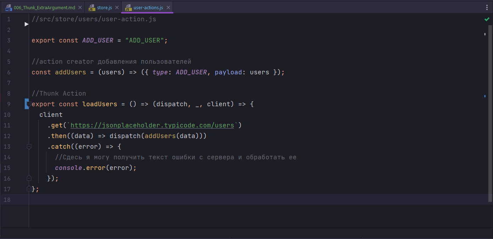

# 006_Thunk_ExtraArgument

В завершении разговора о библиотере redux thunk. Мы ее подключили просто как middleware. 

Нужно сказать еще об одной вещи. Когда у нас приложение разрастается, то мы будем делать однотипные import в разных файлах.

Мы можем захотеть эту абстракцию как то вынести. и такая возможность у нас есть. Потому что thunk может передаваться не только в чистом виде как мы передаем, а может передаваться с дополнительной настройкой withExtraArgument. И в withExtraArgument мы можем передать наш api. Т.е. мы можем импортировать его в одном единственном месте

```js
import { createStore, applyMiddleware } from "redux";
import { composeWithDevTools } from "redux-devtools-extension";
import thunk from "redux-thunk";
import { rootReducer } from "./rootReducer";
import { client } from "../api";

export const store = createStore(
  rootReducer,
  composeWithDevTools(applyMiddleware(thunk.withExtraArgument(client)))
);

```

Опять же здесь есть разный сценарии. И ногда передают объект в который мы можем передать разные сущности.

Что нам это дает?

Благодаря такому подходу, на уровне наших action. Там где мы передаем dispatch, третьим параметром я могу вызывать экстра параметр client



```js
//src/store/entities/todo-actions.js

export const ADD_TODOS = "@@entities/ADD_TODOS";
export const SET_LOADING = "@@entities/SET_LOADING";
export const SET_ERROR = "@@entities/SET_ERROR";

export const ADD_TODO = "@@entities/ADD_TODO";

const addTodo = (todo) => ({
  type: ADD_TODO,
  payload: todo,
});

const addTodos = (entities) => ({
  type: ADD_TODOS,
  payload: entities,
});

const setLoading = () => ({
  type: SET_LOADING,
});

const setError = (error) => ({
  type: SET_ERROR,
  payload: error,
});

export const loadTodos = () => (dispatch, _, client) => {
  dispatch(setLoading());
  client
    .get(`https://jsonplaceholder.typicode.com/entities`)
    .then((data) => dispatch(addTodos(data)))
    .catch((error) => dispatch(setError(error)));
};
// Создаю todo
export const createTodo = (title) => (dispatch, _,client) => {
  client
    .post(`https://jsonplaceholder.typicode.com/entities`, {
      title,
      completed: false,
      userId: 1,
    })
    .then((NewTodo) => dispatch(addTodo(NewTodo)))
    .catch((error) => dispatch(setError(error)));
};

```

Теперь всю абстракцию api мы достаем через параметр thunk, а не подключаем через import.