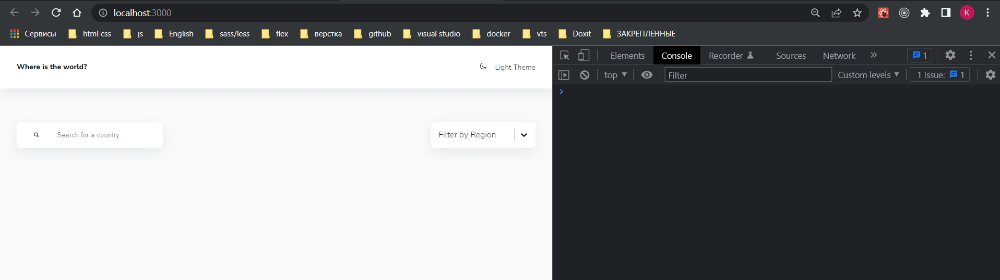

# 001_Структура_проекта

Начнем с того что составим список дел который нам предстоит выполнить.

[] Переключение светлой/темной темы
[] Получения списка стран и вывод в UI
[] Фильтрация стран по поиску
[] Фильтрация стран по региону
[] Получение расширенной информации о выбранной  стране
[] Получение списка соседей

Это все основное что нам нужно сделать с точки зрения Redux.

Список зависимостей в package.json которые я буду использовать.

```json
{
  "name": "countries_spa",
  "version": "0.1.0",
  "private": true,
  "dependencies": {
    "@testing-library/jest-dom": "^5.16.4",
    "@testing-library/react": "^13.2.0",
    "@testing-library/user-event": "^13.5.0",
    "axios": "^0.22.0",
    "lodash.throttle": "^4.1.1",
    "react": "^18.1.0",
    "react-dom": "^18.1.0",
    "react-icons": "^4.3.1",
    "react-redux": "^7.2.6",
    "react-router-dom": "^6.2.1",
    "react-scripts": "^5.0.0",
    "react-select": "^5.1.0",
    "redux": "^4.1.2",
    "redux-thunk": "^2.4.1",
    "styled-components": "^5.3.1",
    "web-vitals": "^2.1.4"
  },
  "scripts": {
    "start": "react-scripts start",
    "build": "react-scripts build",
    "test": "react-scripts test",
    "eject": "react-scripts eject"
  },
  "eslintConfig": {
    "extends": [
      "react-app",
      "react-app/jest"
    ]
  },
  "browserslist": {
    "production": [
      ">0.2%",
      "not dead",
      "not op_mini all"
    ],
    "development": [
      "last 1 chrome version",
      "last 1 firefox version",
      "last 1 safari version"
    ]
  }
}

```

И так что есть. Есть точка входа index.js где подключается React  и роутинг базовый.

```js
import React from "react";
import ReactDOM from "react-dom/client";
import { BrowserRouter } from "react-router-dom";
import "./index.css";
import App from "./App";

const root = ReactDOM.createRoot(document.getElementById("root"));

root.render(
  <BrowserRouter>
    <App />
  </BrowserRouter>
);

```

Сам App

```js
import { Routes, Route } from 'react-router-dom';

import { Header } from './components/Header';
import { Main } from './components/Main';

import { HomePage } from './pages/HomePage';
import { Details } from './pages/Details';
import { NotFound } from './pages/NotFound';

function App() {
  return (
    <>
      <Header />
      <Main>
        <Routes>
          <Route exact path="/" element={
            <HomePage />
          } />
          <Route path="/country/:name" element={<Details />} />
          <Route path="*" element={<NotFound />} />
        </Routes>
      </Main>
    </>
  );
}

export default App;

```

App состоит из некого Header и некого Main и роутинга Routes. Роутинг предполагает наличие трех страниц HomePage по path="/", страница конкретной страны Details с путем path="/country/:name". И страница NotFound.

Папка pages 

```jsx
import { useNavigate } from 'react-router-dom';

import { List } from '../components/List';
import { Card } from '../components/Card';
import { Controls } from '../components/Controls';

export const HomePage = () => {
  const navigate = useNavigate();

  const countries = [];

  return (
    <>
      <Controls />

      <List>
            {countries.map((c) => {
              const countryInfo = {
                img: c.flags.png,
                name: c.name,
                info: [
                  {
                    title: 'Population',
                    description: c.population.toLocaleString(),
                  },
                  {
                    title: 'Region',
                    description: c.region,
                  },
                  {
                    title: 'Capital',
                    description: c.capital,
                  },
                ],
              };

              return (
                <Card
                  key={c.name}
                  onClick={() => navigate(`/country/${c.name}`)}
                  {...countryInfo}
                />
              );
            })}
          </List>
    </>
  );
};


```

HomePage состоит из неких Controls. Из списка List который у нас пока что будет пустой. Здесь ни какой redux логики разумеется нет.


Компонент делалььной страницы

```js
import { useNavigate, useParams } from 'react-router-dom';
import { IoArrowBack } from 'react-icons/io5';

import { Button } from '../components/Button';
import { Info } from '../components/Info';


export const Details = () => {
  const { name } = useParams();
  const navigate = useNavigate();

  const currentCountry = null;

  return (
    <div>
      <Button onClick={() => navigate(-1)}>
        <IoArrowBack /> Back
      </Button>
      {currentCountry && <Info push={navigate} {...currentCountry} />}
    </div>
  );
};

```

Представляет собой одну кнопку и отдельный компонент с информацией.

В папке components в основном находяться стилизованные компоненты.

```jsx
import styled from 'styled-components';

export const Button = styled.button`
  padding: 0 1rem;
  background-color: var(--colors-ui-base);
  box-shadow: var(--shadow);
  line-height: 2.5;
  border-radius: var(--radii);

  border: none;
  display: flex;
  align-items: center;
  gap: 0.75rem;

  color: var(--color-text);
  cursor: pointer;
`;

```

```jsx
import styled from 'styled-components';

const Wrapper = styled.article`
  border-radius: var(--radii);
  background-color: car(--colors-ui-base);
  box-shadow: var(--shadow);
  cursor: pointer;
  overflow: hidden;
`;

const CardImage = styled.img`
  display: block;
  width: 100%;
  height: 150px;
  object-fit: cover;
  object-position: center;
  box-shadow: var(--shadow);
`;

const CardBody = styled.div`
  padding: 1rem 1.5rem 2rem;
`;

const CardTitle = styled.h3`
  margin: 0;
  font-size: var(--fs-md);
  font-weight: var(--fw-bold);
`;

const CardList = styled.ul`
  list-style: none;
  margin: 0;
  padding: 1rem 0 0;
`;

const CardListItem = styled.li`
  font-size: var(--fs-sm);
  line-height: 1.5;
  font-weight: var(--fw-light);

  & > b {
    font-weight: var(--fw-bold);
  }
`;

export const Card = ({ img, name, info = [], onClick }) => {
  return (
    <Wrapper onClick={onClick}>
      <CardImage src={img} alt={name} />
      <CardBody>
        <CardTitle>{name}</CardTitle>
        <CardList>
          {info.map((el) => (
            <CardListItem key={el.title}>
              <b>{el.title}:</b> {el.description}
            </CardListItem>
          ))}
        </CardList>
      </CardBody>
    </Wrapper>
  );
};

```

```jsx
import styled from 'styled-components';

export const Container = styled.div`
  width: 100%;
  max-width: 1240px;
  margin: 0 auto;
  padding: 0 2rem;
`;

```

```jsx
import styled from 'styled-components';

import { Search } from './Search';
import { CustomSelect } from './CustomSelect';

const optionsMap = {
  'Africa': { value: 'Africa', label: 'Africa' },
  'America': { value: 'America', label: 'America' },
  'Asia': { value: 'Asia', label: 'Asia' },
  'Europe': { value: 'Europe', label: 'Europe' },
  'Oceania': { value: 'Oceania', label: 'Oceania' },
}
const options = Object.values(optionsMap);

const Wrapper = styled.div`
  display: flex;
  flex-direction: column;
  align-items: flex-start;

  @media (min-width: 767px) {
    flex-direction: row;
    justify-content: space-between;
    align-items: center;
  }
`;

export const Controls = () => {
  return (
    <Wrapper>
      <Search />
      <CustomSelect
        options={options}
        placeholder="Filter by Region"
        isClearable
        isSearchable={false}
        value={''}
        onChange={() => {}}
      />
    </Wrapper>
  );
};

```

```jsx
import styled from 'styled-components';

import Select from 'react-select';

export const CustomSelect = styled(Select).attrs({
  styles: {
    control: (provided) => ({
      ...provided,
      backgroundColor: 'var(--colors-ui-base)',
      color: 'var(--colors-text)',
      borderRadius: 'var(--radii)',
      padding: '0.25rem',
      border: 'none',
      boxShadow: 'var(--shadow)',
      height: '50px',
    }),
    option: (provided, state) => ({
      ...provided,
      cursor: 'pointer',
      color: 'var(--colors-text)',
      backgroundColor: state.isSelected
        ? 'var(--colors-bg)'
        : 'var(--colors-ui-base)',
    }),
  },
})`
  width: 200px;
  border-radius: var(--radii);
  font-family: var(--family);
  border: none;

  & > * {
    box-shadow: var(--shadow);
  }

  & input {
    padding-left: 0.25rem;
  }

  & * {
    color: var(--colors-text) !important;
  }

  & > div[id] {
    background-color: var(--colors-ui-base);
  }
`;

```

```jsx
import styled from 'styled-components';
import {useEffect} from 'react';
import { Link } from 'react-router-dom';
import { IoMoon, IoMoonOutline } from 'react-icons/io5';

import { Container } from './Container';

const HeaderEl = styled.header`
  box-shadow: var(--shadow);
  background-color: var(--colors-ui-base);
`;

const Wrapper = styled.div`
  display: flex;
  justify-content: space-between;
  align-items: center;
  padding: 2rem 0;
`;

const Title = styled(Link).attrs({
  to: '/',
})`
  color: var(--colors-text);
  font-size: var(--fs-sm);
  text-decoration: none;
  font-weight: var(--fw-bold);
`;

const ModeSwitcher = styled.div`
  color: var(--colors-text);
  font-size: var(--fs-sm);
  cursor: pointer;
  // font-weight: var(--fw-bold);
  text-transform: capitalize;
`;

export const Header = () => {
  const theme = 'light';

  useEffect(() => {
    document.body.setAttribute('data-theme', theme);
  }, [theme]);

  return (
    <HeaderEl>
      <Container>
        <Wrapper>
          <Title>Where is the world?</Title>
          <ModeSwitcher>
            {theme === 'light' ? (
              <IoMoonOutline size="14px" />
            ) : (
              <IoMoon size="14px" />
            )}{' '}
            <span style={{ marginLeft: '0.75rem' }}>{theme} Theme</span>
          </ModeSwitcher>
        </Wrapper>
      </Container>
    </HeaderEl>
  );
};

```

```jsx
import styled from 'styled-components';

const Wrapper = styled.section`
  margin-top: 3rem;
  width: 100%;
  display: grid;
  grid-template-columns: 100%;
  gap: 2rem;

  @media (min-width: 767px) {
    grid-template-columns: minmax(100px, 400px) 1fr;
    align-items: center;
    gap: 5rem;
  }
  @media (min-width: 1024px) {
    grid-template-columns: minmax(400px, 600px) 1fr;
  }
`;

const InfoImage = styled.img`
  display: block;
  width: 100%;
  height: 100%;
  object-fit: contain;
`;

const InfoTitle = styled.h1`
  margin: 0;
  font-weight: var(--fw-normal);
`;

const ListGroup = styled.div`
  display: flex;
  flex-direction: column;

  gap: 2rem;

  @media (min-width: 1024px) {
    flex-direction: row;
    gap: 4rem;
  }
`;

const List = styled.ul`
  list-style: none;
  margin: 0;
  padding: 0;
`;

const ListItem = styled.li`
  line-height: 1.8;

  & > b {
    font-weight: var(--fw-bold);
  }
`;

const Meta = styled.div`
  margin-top: 3rem;
  display: flex;
  gap: 1.5rem;
  flex-direction: column;
  align-items: flex-start;

  & > b {
    font-weight: var(--fw-bold);
  }

  @media (min-width: 767px) {
    flex-direction: row;
    align-items: center;
  }
`;

const TagGroup = styled.div`
  display: flex;
  gap: 1rem;
  flex-wrap: wrap;
`;

const Tag = styled.span`
  padding: 0 1rem;
  background-color: var(--colors-ui-base);
  box-shadow: var(--shadow);
  line-height: 1.5;
  cursor: pointer;
`;

export const Info = (props) => {
  const {
    name,
    nativeName,
    flag,
    capital,
    population,
    region,
    subregion,
    topLevelDomain,
    currencies = [],
    languages = [],
    borders = [],
    push,
  } = props;

  return (
    <Wrapper>
      <InfoImage src={flag} alt={name} />

      <div>
        <InfoTitle>{name}</InfoTitle>
        <ListGroup>
          <List>
            <ListItem>
              <b>Native Name:</b> {nativeName}
            </ListItem>
            <ListItem>
              <b>Population</b> {population}
            </ListItem>
            <ListItem>
              <b>Region:</b> {region}
            </ListItem>
            <ListItem>
              <b>Sub Region:</b> {subregion}
            </ListItem>
            <ListItem>
              <b>Capital:</b> {capital}
            </ListItem>
          </List>
          <List>
            <ListItem>
              <b>Top Level Domain</b>{' '}
              {topLevelDomain.map((d) => (
                <span key={d}>{d}</span>
              ))}
            </ListItem>
            <ListItem>
              <b>Currency</b>{' '}
              {currencies.map((c) => (
                <span key={c.code}>{c.name} </span>
              ))}
            </ListItem>
            <ListItem>
              <b>Top Level Domain</b>{' '}
              {languages.map((l) => (
                <span key={l.name}>{l.name}</span>
              ))}
            </ListItem>
          </List>
        </ListGroup>
        <Meta>
          <b>Border Countries</b>
          {!borders.length ? (
            <span>There is no border countries</span>
          ) : (
            <TagGroup>
              {[].map((b) => (
                <Tag key={b} onClick={() => push(`/country/${b}`)}>
                  {b}
                </Tag>
              ))}
            </TagGroup>
          )}
        </Meta>
      </div>
    </Wrapper>
  );
};

```

```jsx
import styled from 'styled-components';

const Wrapper = styled.section`
  width: 100%;
  padding: 2rem 0;

  display: grid;
  grid-template-columns: repeat(1, 1fr);
  gap: 2rem;

  @media (min-width: 767px) {
    grid-template-columns: repeat(2, 1fr);
    gap: 3rem;

    padding: 2.5rem 0;
  }

  @media (min-width: 1024px) {
    grid-template-columns: repeat(4, 1fr);
    gap: 4rem;
  }
`;

export const List = ({ children }) => {
  return <Wrapper>{children}</Wrapper>;
};

```

```jsx
import styled from 'styled-components';
import { Container } from './Container';

const Wrapper = styled.main`
  padding: 2rem 0;

  @media (min-width: 767px) {
    padding: 4rem 0;
  }
`;

export const Main = ({ children }) => {
  return (
    <Wrapper>
      <Container>{children}</Container>
    </Wrapper>
  );
};

```

```jsx
import styled from 'styled-components';

import { IoSearch } from 'react-icons/io5';

const InputContainer = styled.label`
  background-color: var(--colors-ui-base);
  padding: 1rem 2rem;
  display: flex;
  align-items: center;

  border-radius: var(--radii);
  box-shadow: var(--shadow);
  width: 100%;
  margin-bottom: 1rem;

  @media (min-width: 767px) {
    margin-bottom: 0;
    width: 280px;
  }
`;

const Input = styled.input.attrs({
  type: 'search',
  placeholder: 'Search for a country...',
})`
  margin-left: 2rem;
  border: none;
  outline: none;
  color: var(--color-text);
  background-color: var(--colors-ui-base);
`;

export const Search = ({ search, setSearch }) => {
  return (
    <InputContainer>
      <IoSearch />
      <Input onChange={(e) => setSearch(e.target.value)} value={search}/>
    </InputContainer>
  );
};

```




