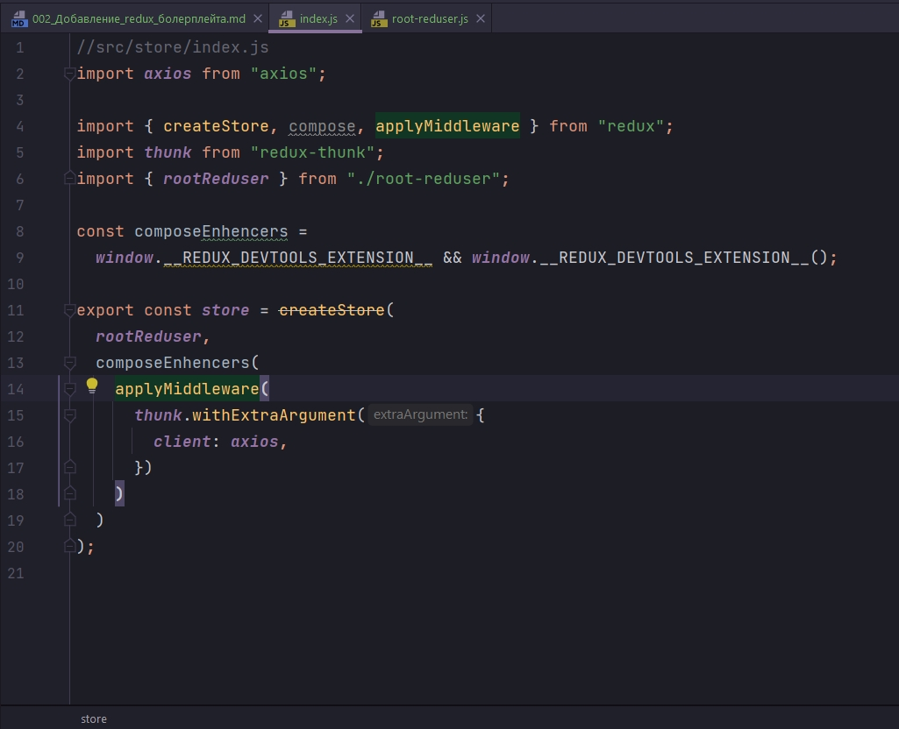
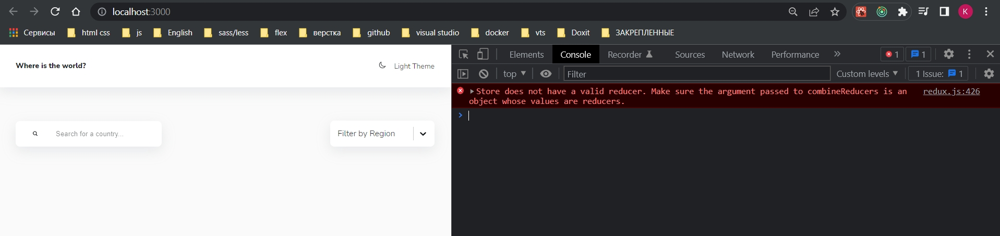

# 002_Добавление_redux_болерплейта

В src сосдаю папку store, в ей index.js и root-reducer.js

```js
//src/store/root-reducer.js
import { combineReducers } from "redux";

export const rootReducer = combineReducers({});

```



Напомню что с помощью withExtraArgument я могу передать любой параметр который я к примеру не хочу импортировать в каждом файле. В withExtraArgument как client я передаю axios.  После чего в наших Thunk action я могу получит его в третьем параметре возвращаемой функции. Первый параметр dispatch, второй getState, ну а третьим будет наш client который при необходимости я могу заменить на fetch ну или как пожелаю.

Ну и вторую штуку которую я хочу пробрасывать это мой config.js 

```js
//src.config.js
const BASE_URL = 'https://restcountries.com/v2/';

export const ALL_COUNTRIES = BASE_URL + 'all?fields=name,capital,flags,population,region';

export const searchByCountry = (name) => BASE_URL + 'name/' + name;

export const filterByCode = (codes) => BASE_URL + 'alpha?codes=' + codes.join(',');

```

Этот конфиг содержит базовый url.

Он позволяет получить все страны ALL_COUNTRIES при чем с query параметрами, get параметрами по конкретным полям. 

C помощью searchByCountry мы можем организовать поиск по конкретной стране.

И сделать фильтрацию по кодам с помощью filterByCode. 

Этот конфиг некая абстакция которую я не хочу импортировать в свои actions. Хочу один раз импортировать на уровне создания моего приложения и передавать в Thunk actions. ИМПОРТИРУЮ ЭТО ВСЕ В ОДИН ОБЪЕКТ api.

```js
//src/store/index.js
import axios from "axios";

import { createStore, compose, applyMiddleware } from "redux";
import thunk from "redux-thunk";
import { rootReducer } from "./root-reducer";
import * as api from "../config";

const composeEnhencers =
  window.__REDUX_DEVTOOLS_EXTENSION__ && window.__REDUX_DEVTOOLS_EXTENSION__();

export const store = createStore(
  rootReducer,
  composeEnhencers(
    applyMiddleware(
      thunk.withExtraArgument({
        client: axios,
        api,
      })
    )
  )
);

```

```js
//src/store/index.js
import axios from "axios";

import { createStore, compose, applyMiddleware } from "redux";
import thunk from "redux-thunk";
import { rootReducer } from "./root-reducer";
import * as api from "../config";

const composeEnhancers = window.__REDUX_DEVTOOLS_EXTENSION_COMPOSE__ || compose;

export const store = createStore(
    rootReducer,
    composeEnhancers(
        applyMiddleware(
            thunk.withExtraArgument({
                client: axios,
                api,
            })
        )
    )
);

```




